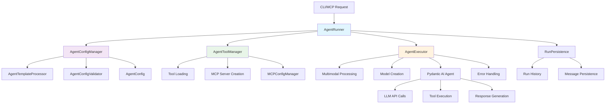
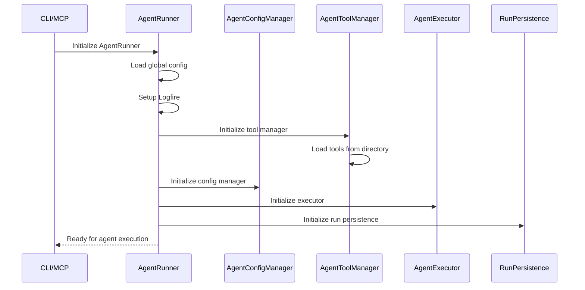
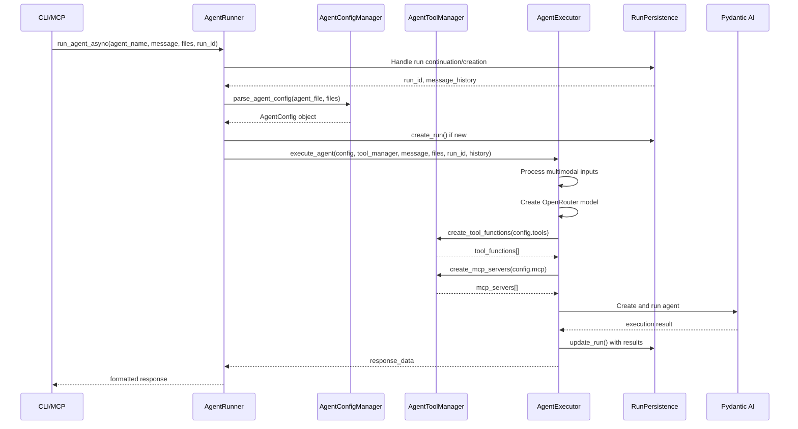
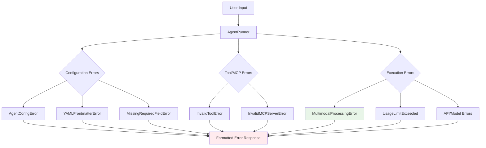

# How Agent Runner Works: Technical Deep Dive

This document provides a comprehensive technical analysis of the agent runner system, which serves as the core orchestrator for the Oneshot agent framework. The system is built with modular components that work together to provide robust agent execution capabilities.

## Overview

The agent runner system is fundamentally a sophisticated wrapper around the **Pydantic AI** library, organized into four specialized modules:

- **`agent_runner.py`** - Main orchestrator and public API
- **`agent_config.py`** - Configuration parsing and validation  
- **`agent_tools.py`** - Tool and MCP server management
- **`agent_executor.py`** - Core execution engine with multimodal support

## System Architecture

### Component Relationships



### Module Breakdown

#### `agent_config.py` - Configuration Management
**Classes:**
- `AgentConfig`: Data container for agent configuration parameters
- `AgentConfigManager`: Handles parsing, validation, and template processing

```python
class AgentConfig:
    def __init__(self, config_data: Dict[str, Any]):
        self.name = config_data['name']
        self.description = config_data['description']
        self.model = config_data['model']
        self.temperature = config_data.get('temperature', 0.7)
        self.max_tokens = config_data.get('max_tokens', 2048)
        self.tools = config_data.get('tools', [])
        self.mcp = config_data.get('mcp', [])
        self.system_prompt = config_data['system_prompt']
        self.request_limit = config_data.get('request_limit')
```

**Responsibilities:**
- YAML frontmatter parsing
- Template processing with Jinja2
- Configuration validation
- Default value application

#### `agent_tools.py` - Tool and MCP Management
**Classes:**
- `AgentToolManager`: Manages tool loading and MCP server creation

```python
class AgentToolManager:
    def __init__(self, tools_dir: Path, mcp_config_manager: MCPConfigManager, debug: bool = False):
        self.tools_dir = tools_dir
        self.mcp_config_manager = mcp_config_manager
        self.loaded_tools = {}
        self._load_tools()
```

**Responsibilities:**
- Dynamic tool discovery and loading
- Tool function creation for Pydantic AI
- MCP server instantiation and configuration
- Error handling with suggestions for typos

#### `agent_executor.py` - Execution Engine
**Classes:**
- `AgentExecutor`: Core execution logic with multimodal support

```python
class AgentExecutor:
    def __init__(self, config: Dict[str, Any], run_persistence: RunPersistence, debug: bool = False):
        self.config = config
        self.run_persistence = run_persistence
        self.debug = debug
```

**Responsibilities:**
- Multimodal input processing
- OpenRouter model creation and configuration
- Pydantic AI agent instantiation
- Agent execution with error handling
- Response formatting and persistence

#### `agent_runner.py` - Main Orchestrator
**Classes:**
- `AgentRunner`: Coordinates all components and provides public API

```python
class AgentRunner:
    def __init__(self, agents_dir: str = "agents", tools_dir: str = "tools", 
                 config_file: str = "config.yaml", debug: bool = False):
        # Initialize all component managers
        self.config_manager = AgentConfigManager(...)
        self.tool_manager = AgentToolManager(...)
        self.executor = AgentExecutor(...)
```

**Responsibilities:**
- Component initialization and coordination
- Public API methods (`run_agent`, `run_agent_clean`)
- CLI interface
- High-level error handling

## How Components Fit Together

The system follows a clean separation of concerns where each module has a specific responsibility:

### Initialization Flow



### 1. AgentRunner Initialization
```python
def __init__(self, agents_dir: str = "agents", tools_dir: str = "tools", 
             config_file: str = "config.yaml", debug: bool = False):
    # 1. Basic setup
    project_root = Path(__file__).parent.parent
    self.config = self._load_config()
    self._setup_logfire(debug=debug)
    
    # 2. Initialize component managers
    self.tool_manager = AgentToolManager(tools_dir, mcp_config_manager, debug)
    self.config_manager = AgentConfigManager(project_root, config, template_processor, validator, debug)
    self.executor = AgentExecutor(config, run_persistence, debug)
```

### 2. Component Dependencies
- **AgentToolManager** requires `MCPConfigManager` for MCP server creation
- **AgentConfigManager** requires `AgentTemplateProcessor` and `AgentConfigValidator`
- **AgentExecutor** requires global config and `RunPersistence`
- All components can operate in debug mode independently

### 3. Tool Loading Process (AgentToolManager)
```python
def _load_tools(self):
    """Load all tools from the tools directory"""
    for tool_file in self.tools_dir.glob("*.py"):
        # Dynamic import and validation
        if hasattr(module, 'TOOL_METADATA'):
            self.loaded_tools[tool_name] = {
                'module': module,
                'metadata': module.TOOL_METADATA,
                'function': getattr(module, function_name, None)
            }
```

**Tool Structure Expected**:
```python
# In each tool file
TOOL_METADATA = {
    "name": "tool_name",
    "description": "Tool description"
}

def tool_name(param1: str) -> str:
    # Tool implementation
    pass
```

## Agent Execution Flow

The execution flow is streamlined through component delegation:

### Execution Sequence



### Streamlined Entry Point: `run_agent_async()`

```python
async def run_agent_async(self, agent_name: str, message: str, 
                         files: List[str] = None, urls: List[str] = None, 
                         run_id: Optional[str] = None):
    # 1. Handle run continuation or creation
    message_history = []
    is_new_run = run_id is None
    if run_id is None:
        run_id = self.run_persistence.generate_run_id()
    else:
        if self.run_persistence.run_exists(run_id):
            message_history = self.run_persistence.get_message_history(run_id)
    
    # 2. Parse agent configuration (delegated to AgentConfigManager)
    agent_file = self.agents_dir / f"{agent_name}.md"
    config = await self.config_manager.parse_agent_config(agent_file, files)
    
    # 3. Create run if new
    if is_new_run:
        self.run_persistence.create_run(run_id, agent_name, message)
    
    # 4. Execute agent (delegated to AgentExecutor)
    return await self.executor.execute_agent(
        config=config,
        tool_manager=self.tool_manager,
        message=message,
        files=files,
        urls=urls,
        run_id=run_id,
        message_history=message_history,
        is_new_run=is_new_run
    )
```

### Component Responsibilities in Execution

#### AgentConfigManager - Configuration Processing
```python
async def parse_agent_config(self, agent_file: Path, files: List[str] = None) -> AgentConfig:
    # 1. Template processing with file injection
    template_result = await self.template_processor.process_agent_template(
        agent_file=agent_file, files=files, additional_context={}
    )
    
    # 2. Validation of tools, MCP servers, model names, numeric ranges
    # 3. Default application from global config
    # 4. Return validated AgentConfig object
```

#### AgentToolManager - Tool and MCP Management
```python
def create_tool_functions(self, tool_names: List[str]) -> List[Any]:
    # 1. Look up tools in loaded_tools dictionary
    # 2. Provide helpful error messages with typo suggestions
    # 3. Return callable functions for Pydantic AI

async def create_mcp_servers(self, mcp_configs: List[Union[str, MCPServerConfig]]) -> List[Any]:
    # 1. Process MCP configuration
    # 2. Create MCP server instances using MCPConfigManager
    # 3. Handle connection and authentication errors
```

#### AgentExecutor - Core Execution
```python
async def execute_agent(self, config: AgentConfig, tool_manager: AgentToolManager, 
                       message: str, files: List[str] = None, urls: List[str] = None, 
                       run_id: Optional[str] = None, message_history: List = None,
                       is_new_run: bool = True) -> Dict[str, Any]:
    # 1. Process multimodal inputs (images, documents, audio, video)
    # 2. Create OpenRouter model with validation
    # 3. Configure model settings and usage limits
    # 4. Get tools and MCP servers from tool_manager
    # 5. Create and execute Pydantic AI agent
    # 6. Format response and update persistence
```

### Multimodal Processing

The system includes comprehensive multimodal support:

```python
# In AgentExecutor
def _process_multimodal_inputs(self, files: List[str] = None, urls: List[str] = None) -> Tuple[bool, Any]:
    # 1. Check if multimodal processing is needed
    # 2. Handle capability errors gracefully (fall back to text)
    # 3. Process files and URLs with proper error handling
    # 4. Return multimodal result or None
```

**Supported Media Types:**
- **Images**: jpg, png, gif, webp
- **Documents**: pdf
- **Audio**: mp3, wav, m4a  
- **Video**: mp4, mov, avi
- **URLs**: Any of the above formats via HTTP/HTTPS

## Configuration Hierarchy System

The agent runner implements a sophisticated configuration hierarchy that allows for flexible parameter management:

### 1. Agent-Specific Configuration (Highest Priority)
From the agent's `.md` file YAML frontmatter:
```yaml
---
name: research_agent
model: "openai/gpt-4o-mini"
temperature: 0.3
max_tokens: 4096
tools:
  - web_search
  - web_read_page
---
```

### 2. Global Defaults (Fallback)
From `config.yaml`:
```yaml
model_settings:
  model: "openai/gpt-4o-mini"
  temperature: 0.7
  max_tokens: 2048
  timeout: 30.0
```

### 3. Pydantic AI Defaults (Lowest Priority)
Built-in defaults from the Pydantic AI library.

## Error Handling Strategy

The system implements layered error handling across components:

### Error Handling Architecture



### Multimodal Error Handling
```python
# In AgentExecutor._handle_execution_error()
if isinstance(e, MultimodalProcessingError):
    return {
        "output": "",
        "success": False,
        "run_id": run_id,
        "error": f"Multimodal Processing Error: {e.get_formatted_message()}",
        "error_type": "multimodal_error",
        "multimodal_error_type": type(e).__name__
    }
```

**Handles**:
- **File errors**: Not found, too large, unsupported format, read permissions
- **URL errors**: Invalid format, network issues, unsupported media types
- **Capability errors**: Missing PydanticAI support, model incompatibility

### Configuration Error Handling (AgentConfigManager)
```python
except AgentConfigError as e:
    return {
        "error": f"Agent Configuration Error: {e.get_formatted_message()}",
        "error_type": "configuration",
        "agent_file": str(agent_file)
    }
```

**Error Types**:
- `YAMLFrontmatterError`: YAML parsing issues with line numbers
- `MissingRequiredFieldError`: Missing name, description, model fields
- `InvalidModelError`: Model name validation with suggestions
- `InvalidToolError`: Tool name validation with fuzzy matching
- `InvalidMCPServerError`: MCP server configuration issues

### Tool and MCP Error Handling (AgentToolManager)
- **Graceful degradation**: Continue with available tools if some fail
- **Helpful suggestions**: Fuzzy matching for typos in tool/server names
- **Detailed logging**: Debug output for troubleshooting

### Execution Error Handling (AgentExecutor)
- **Usage limits**: Prevents runaway costs with clear messaging
- **API errors**: Specific handling for 401, 404, network issues
- **MCP server errors**: Authentication and connection troubleshooting

## CLI Interface

The module provides a command-line interface through the `main()` function:

```bash
python3 agent_runner.py <agent_name> <message> [--files <file1|file2|...>] [--run-id <run_id>] [--json] [--debug]
```

**Arguments**:
- `agent_name`: Name of the agent to execute
- `message`: User message to send to the agent
- `--files`: Pipe-separated list of file paths to provide as context
- `--run-id`: Continue an existing conversation
- `--json`: Output raw JSON response
- `--debug`: Enable verbose debug output

## Integration Points

### With MCP Server (`oneshot_mcp.py`)
The agent runner is called by the MCP server through the `call_agent` endpoint, which essentially wraps the CLI interface.

### With Run Persistence (`run_persistence.py`)
Manages conversation state across multiple interactions:
- Creates new runs with unique IDs
- Loads existing conversation history
- Updates runs with new messages and metadata

### With Template Processor (`agent_template_processor.py`)
Handles dynamic content injection:
- Processes Jinja2 templates in agent files
- Injects file contents when `--files` is used
- Manages template snippets and includes

### With Tool Services (`tool_services.py`)
Provides helper functions for tools:
- Sets run ID context for file organization
- Provides common utilities for tool implementations

## Performance and Observability

### Logfire Integration
Automatic instrumentation provides:
- Complete traces of agent execution
- LLM API call details
- Tool execution traces
- Performance metrics
- Error tracking

### Usage Tracking
Built-in usage limits and tracking:
```python
usage_limits = UsageLimits(
    request_limit=50,
    request_tokens_limit=None,
    response_tokens_limit=None,
    total_tokens_limit=None
)
```

### Debug Mode
Comprehensive debug output when enabled:
- Tool loading details
- MCP server initialization
- Configuration merging
- Error details and stack traces

## Architecture Benefits

### 1. Separation of Concerns
- **Configuration**: Isolated in `agent_config.py` for easier testing and modification
- **Tool Management**: Centralized in `agent_tools.py` for consistent behavior
- **Execution Logic**: Contained in `agent_executor.py` with multimodal support
- **Orchestration**: Simplified in `agent_runner.py` as a clean coordinator

### 2. Enhanced Maintainability
- **Smaller modules**: Each file has focused responsibilities (~80-250 lines each)
- **Isolated changes**: Modifications to one aspect don't affect others
- **Independent testing**: Components can be unit tested separately
- **Clear interfaces**: Well-defined boundaries between modules

### 3. Comprehensive Error Handling
- **Multimodal errors**: Complete handling for file/URL processing issues
- **Layered validation**: Configuration, tool, and execution errors handled separately
- **User-friendly messages**: Specific error messages with actionable suggestions

### 4. Extensibility
- **New media types**: Easy to add support in `multimodal_processor.py`
- **Additional tools**: Simple addition without touching core logic
- **Custom validators**: Can extend `AgentConfigValidator` independently

## Best Practices for Modifications

### 1. Respect Module Boundaries
- Configuration changes → `agent_config.py`
- Tool-related changes → `agent_tools.py`  
- Execution logic changes → `agent_executor.py`
- API changes → `agent_runner.py`

### 2. Maintain Error Handling Patterns
- Use specific error classes from `agent_errors.py`
- Provide helpful suggestions in error messages
- Handle capability errors gracefully (fall back, don't fail)

### 3. Test Across Components
- Unit test individual modules
- Integration test the full flow
- Test error scenarios thoroughly
- Verify debug output is helpful

### 4. Update Documentation
- Changes to any module should update this document
- Update `how_oneshot_works.md` for system-level changes
- Keep error handling examples current

## Common Troubleshooting Scenarios

### Agent Not Found
- Check agent file exists in `/agents/{agent_name}.md`
- Verify file permissions and readability

### Tool Loading Failures
- Verify tool files have `TOOL_METADATA`
- Check for syntax errors in tool files
- Ensure tool function names match file names

### MCP Server Issues
- Verify MCP server configuration in `.cursor/mcp.json`
- Check authentication credentials
- Test server connectivity independently

### Model API Errors
- Validate `OPENROUTER_API_KEY` environment variable
- Check model name against OpenRouter's available models
- Verify account credits and rate limits

### Run Persistence Problems
- Check `/runs` directory permissions
- Verify run ID format (8 alphanumeric characters)
- Look for corrupted `run.json` files

## Summary

The agent runner system provides a robust, modular, and extensible foundation for the Oneshot agent framework. Key features include:

- **Modular Design**: Four focused modules with clear responsibilities
- **Comprehensive Error Handling**: Complete multimodal and configuration error support  
- **High Maintainability**: Smaller, testable components with defined interfaces
- **Multimodal Support**: Full support for images, documents, audio, and video processing
- **Clean APIs**: Well-designed interfaces for CLI, MCP, and programmatic access

This architecture provides a solid foundation for reliable agent execution and future development. 