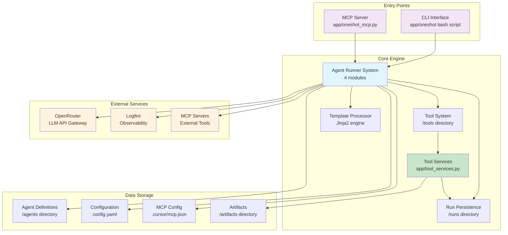
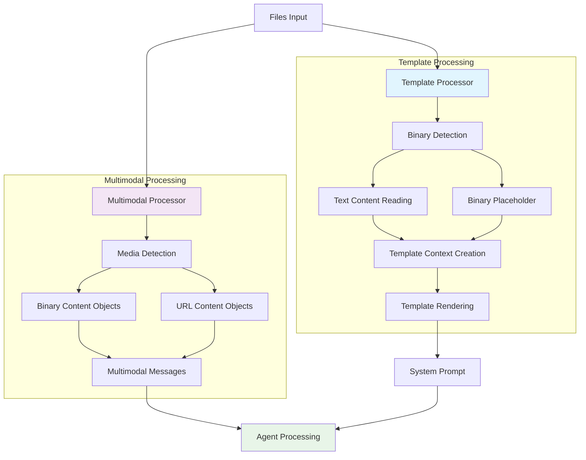
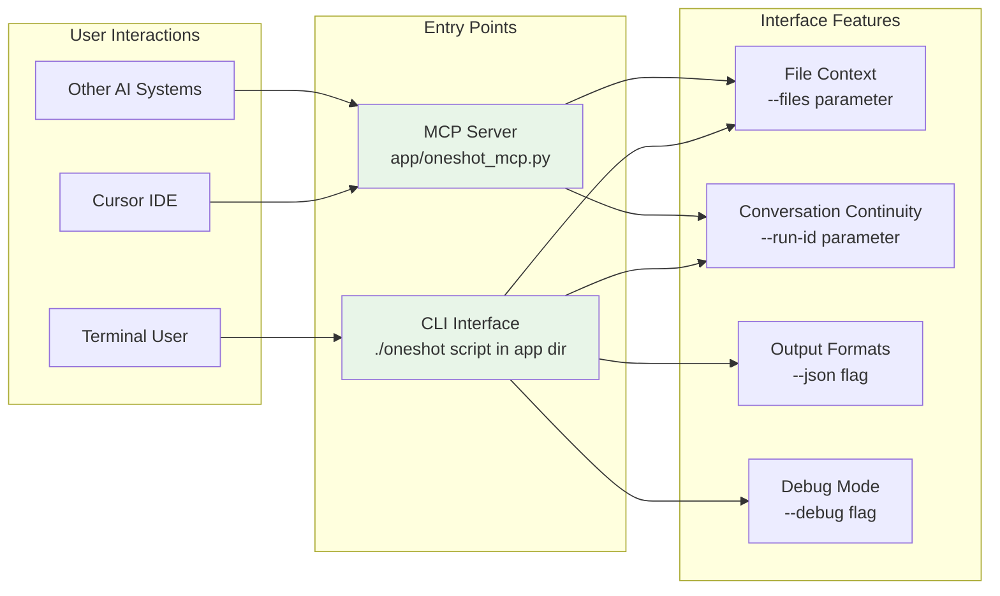
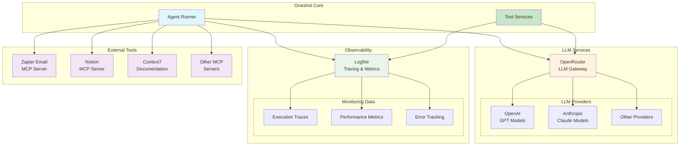

# How the Oneshot System Works: A Technical Guide for AI Coding Agents

This document provides a holistic technical overview of the Oneshot system architecture, intended for an AI coding agent that is responsible for its maintenance, extension, and troubleshooting. For detailed information about the core agent execution engine, refer to `how_agent_runner_works.md`.

## System Philosophy

Oneshot is designed as a **specialist agent orchestration framework** that enables the creation and execution of purpose-built AI agents. The core philosophy centers on:

1. **Pydantic AI Foundation**: The system is fundamentally a sophisticated wrapper around the Pydantic AI library, which handles LLM interactions, tool orchestration, and message management.

2. **Agent Specialization**: Rather than one general-purpose agent, the system enables creating many specialized agents, each optimized for specific tasks with their own tools, prompts, and configurations.

3. **Modular Architecture**: Clean separation of concerns across configuration, tool management, execution, and persistence layers.

4. **Conversation Continuity**: Stateless LLM interactions are made stateful through persistent run management.

## System Architecture Overview



## Core Components

### 1. Agent Definitions (`/agents` directory)
- **Format**: Markdown files with YAML frontmatter
- **Purpose**: Define agent behavior, model parameters, available tools, and system prompts
- **Template System**: Jinja2 templating for dynamic content injection
- **Configuration Hierarchy**: Agent-specific settings override global defaults

### 2. Agent Runner System (`app/agent_runner.py` + 3 modules)
The heart of the system, responsible for agent execution. This is implemented as a modular system with four components:

- **`agent_runner.py`**: Main orchestrator and public API
- **`agent_config.py`**: Configuration parsing and validation
- **`agent_tools.py`**: Tool and MCP server management  
- **`agent_executor.py`**: Core execution engine with multimodal support

**📖 For detailed technical information about the agent runner system, see `how_agent_runner_works.md`.**

### 3. Tool System (`/tools` directory)
- **Dynamic Loading**: Tools are automatically discovered and loaded from Python files
- **Metadata-Driven**: Each tool defines `TOOL_METADATA` for discovery
- **Pydantic AI Integration**: Tools are bound to agents as callable functions
- **Error Handling**: Graceful degradation when tools are unavailable
- **Tool Services Integration**: Tools leverage the centralized `tool_services.py` module

### 4. Tool Services System (`app/tool_services.py`)
A critical infrastructure component that eliminates boilerplate code in tools:

- **LLM Integration**: Pre-configured Pydantic AI clients with automatic retry logic
- **File Operations**: Smart file handling with run-aware organization and metadata
- **API Integration**: HTTP requests with automatic authentication
- **Template Engine**: Jinja2 templating with built-in variables
- **Context Management**: Automatic run ID tracking for artifact organization

**Key Features of Tool Services:**
```python
# Single import provides everything
from app.tool_services import *

# Available functions:
- llm()              # Basic LLM calls
- llm_json()         # JSON-returning LLM calls
- llm_structured()   # Pydantic model validation
- chain_prompts()    # Multi-step conversations
- save()             # Smart file saving with metadata
- save_json()        # JSON with metadata wrapper
- read()             # File reading
- api()              # HTTP requests with auth
- template()         # Jinja2 templating
```

**📖 For complete documentation, see "How to Use Tool Services" and "How to Create Tools" guides.**

### 5. Run Persistence (`app/run_persistence.py`)
- **Conversation Continuity**: Maintains stateful conversations across stateless LLM calls
- **Storage**: JSON-based storage in `/runs/{run_id}/` directories
- **Message History**: Complete Pydantic AI message chains for context preservation
- **Metadata Tracking**: Usage statistics, timestamps, and execution details
- **Artifact Correlation**: Links with `/artifacts/{run_id}/` for generated files

### 6. Template Processing (`app/agent_template_processor.py`)
- **Dynamic Content**: Jinja2 templating for agent prompts
- **File Injection**: `--files` content is injected into agent context
- **Snippet System**: Reusable template components in `/snippets`
- **Context Variables**: Rich template context for dynamic prompt generation
- **Tool Services Integration**: Built-in variables available in all LLM calls

## File Handling Architecture

The oneshot system provides sophisticated file handling capabilities that integrate seamlessly with the template system and multimodal processing. Understanding this architecture is crucial for debugging, extending, and troubleshooting file-related issues.

### File Processing Pipeline



### Template Context Variables

The `AgentTemplateProcessor._process_files_context()` method creates three distinct template variables from file inputs:

#### 1. `provided_files` (Dict[str, str])
- **Purpose**: Full file contents for template injection
- **Structure**: `{filepath: content}`
- **Usage**: When agents need complete file contents in system prompt
- **Memory Impact**: High - stores full content of all files
- **Binary Handling**: Binary files get placeholder text: `"[Binary file: {EXT} image/media content]"`

```python
# Example content:
{
    "/path/to/report.md": "# Analysis Report\nDetailed content...",
    "/path/to/image.jpg": "[Binary file: JPG image/media content]"
}
```

#### 2. `provided_filepaths` (List[str])
- **Purpose**: File path references for lightweight context
- **Structure**: `[filepath1, filepath2, ...]`
- **Usage**: When agents need file awareness without content bloat
- **Memory Impact**: Minimal - only stores paths
- **Use Case**: Agents that will read files selectively using tools

```python
# Example content:
["/path/to/report.md", "/path/to/data.json", "/path/to/image.jpg"]
```

#### 3. `provided_files_summary` (str)
- **Purpose**: AI-generated summary of provided files
- **Structure**: Simple string description
- **Usage**: Balanced approach between awareness and performance
- **Generation**: Concatenates readable files for summary creation
- **Fallback**: "No readable files provided" if no text files found

### Template Strategy Detection

The system automatically detects which file handling strategy to use based on template content:

```python
def _detect_template_strategy(self, system_prompt: str) -> str:
    if '<$provided_files$>' in system_prompt:
        return 'full_content'           # Legacy tag support
    elif '<$provided_filepaths$>' in system_prompt:
        return 'file_paths_only'        # Legacy tag support
    elif '<$provided_files_summary$>' in system_prompt:
        return 'summary_only'           # Legacy tag support
    elif 'provided_files' in system_prompt or 'provided_filepaths' in system_prompt:
        return 'template_variables'     # Modern Jinja2 templates
    else:
        return 'message_append'         # Fallback: append to message
```

### Message Append Fallback Strategy

When an agent has **no file handling template variables** but receives files via the `--files` parameter, the system automatically falls back to the `message_append` strategy:

#### Implementation
```python
def _append_files_to_message(self, message: str, files: List[str] = None, urls: List[str] = None) -> str:
    """Append file information to message when agent has no template-based file handling"""
    if not files and not urls:
        return message
    
    # Build combined file list
    file_list = []
    if files:
        file_list.extend(files)
    if urls:
        file_list.extend(urls)
    
    # Append file information to the message
    appended_message = message + "\n\nProvided files:\n"
    for filepath in file_list:
        appended_message += f"- {filepath}\n"
    
    return appended_message
```

#### Message Format
The agent receives the original message with file paths appended:

```
[Original user message]

Provided files:
- /path/to/file1.txt
- /path/to/file2.md
- https://example.com/document.pdf
```

#### Key Characteristics
- **Automatic**: No agent configuration changes needed
- **Lightweight**: Only file paths, not content
- **Tool-dependent**: Agent must have file reading tools to access content
- **Universal**: Works with any agent regardless of template design
- **Multimodal-compatible**: Handles both files and URLs

**Original message:**
```
"Analyze this data for trends"
```

**Enhanced message (with files):**
```
"Analyze this data for trends

Provided files:
- /path/to/data.csv
- /path/to/report.pdf
- https://example.com/chart.png
"
```

This ensures that agents without explicit file handling templates still receive awareness of provided files, maintaining backward compatibility while encouraging users to pass relevant files.

### Binary File Detection

The `_is_binary_file()` method identifies binary files by extension:

```python
binary_extensions = {
    # Images: .png, .jpg, .jpeg, .gif, .bmp, .tiff, .webp, .svg, .ico
    # Video: .mp4, .avi, .mov, .wmv, .flv, .webm, .mkv, .m4v
    # Audio: .mp3, .wav, .flac, .aac, .ogg, .wma, .m4a
    # Documents: .pdf, .doc, .docx, .xls, .xlsx, .ppt, .pptx
    # Archives: .zip, .rar, .7z, .tar, .gz, .bz2
    # Executables: .exe, .dll, .so, .dylib, .app
    # Other: .bin, .dat, .db, .sqlite
}
```

### Multimodal Integration

The system provides dual-track processing for binary files:

#### Track 1: Template Context (Text Representation)
- Binary files get placeholder text in `provided_files`
- Enables template-based awareness of media files
- Allows agents to reference files in system prompts

#### Track 2: Multimodal Content (Binary Processing)
- `MultimodalProcessor` creates appropriate content objects:
  - `BinaryContent` for local files
  - `ImageUrl`, `DocumentUrl`, `AudioUrl`, `VideoUrl` for URLs
- Passed as separate message parts to the agent
- Enables actual processing of binary content

### Error Handling Patterns

#### File Read Errors
```python
try:
    content = self.tool_services.read(filepath)
    file_contents[filepath] = content
except Exception as e:
    file_contents[filepath] = f"[ERROR READING FILE: {e}]"
    # Continue processing other files
```

#### Template Rendering Errors
- `TemplateNotFound`: Missing snippet includes
- `TemplateSyntaxError`: Invalid Jinja2 syntax
- `TemplateProcessingError`: General rendering failures

#### Multimodal Processing Errors
- `MultimodalFileError`: File access, size, or format issues
- `MultimodalURLError`: URL validation or network issues
- `MultimodalCapabilityError`: Missing PydanticAI multimodal support

### Performance Considerations

#### Memory Usage by Strategy
- **`provided_files`**: O(total_file_size) - Can be very large
- **`provided_filepaths`**: O(number_of_files) - Minimal memory
- **`provided_files_summary`**: O(summary_length) - Small, fixed size

#### Processing Time
- **Binary Detection**: O(1) per file - Fast extension lookup
- **Text File Reading**: O(file_size) - Linear with content size
- **Template Rendering**: O(template_complexity) - Depends on Jinja2 operations

#### Best Practices for Performance
1. Use `provided_filepaths` for large files when full content isn't needed
2. Implement file size limits in agent configurations
3. Consider lazy loading patterns for optional file content
4. Use binary detection to avoid reading large media files as text

### Integration Points

#### With Agent Executor
- `AgentExecutor._process_multimodal_inputs()` coordinates with template processing
- System prompt gets modified with template context before agent creation
- Multimodal content objects are passed separately to agent

#### With Tool Services
- `tool_services.read()` used for file content retrieval
- Run ID integration ensures proper artifact organization
- Built-in template variables available in all contexts

### Troubleshooting Common Issues

#### Files Not Appearing in Agent Context
1. **Check template variables**: Agent must use `` or similar
2. **Verify file paths**: Ensure files exist and are readable
3. **Check binary detection**: Binary files only show placeholders in templates

#### Template Rendering Failures
1. **Validate Jinja2 syntax**: Check for unclosed tags or invalid expressions
2. **Verify snippet includes**: Ensure referenced snippets exist in `/snippets`
3. **Check context variables**: Verify all referenced variables are available

#### Multimodal Processing Issues
1. **PydanticAI version**: Ensure multimodal classes are available
2. **File format support**: Check against supported extensions list
3. **File size limits**: Verify files are within configured size limits

This architecture provides a robust foundation for flexible file handling while maintaining clear separation between text processing and multimodal capabilities.

## Entry Points and Interfaces



### Command Line Interface
```bash
./oneshot <agent_name> "<message>" [--files file1|file2] [--run-id <id>] [--json] [--debug]
```
- **Primary Interface**: Direct agent execution from terminal
- **File Context**: Pass files as context via `--files` parameter
- **Conversation Continuity**: Use `--run-id` to continue existing conversations
- **Output Formats**: Human-readable or JSON for programmatic use

### MCP Server (`oneshot_mcp.py`)
- **Protocol**: Model Context Protocol for AI agent integration
- **Endpoints**: `call_agent`, `list_agents`, `list_tools`, etc.
- **Integration**: Allows other AI systems to use Oneshot agents
- **Cursor/CLI Integration**: Exposed as MCP server for Cursor IDE, or Claude Code CLI integration

## Configuration System

### Global Configuration (`config.yaml`)
- **Model Defaults**: Default LLM parameters for all agents
- **Usage Limits**: Request and token limits for cost control
- **Logfire Settings**: Observability and instrumentation configuration
- **Template Engine**: Jinja2 template processing settings

### Agent Configuration (YAML Frontmatter)
- **Model Override**: Agent-specific model and parameters
- **Tool Assignment**: Which tools the agent can access
- **MCP Servers**: External service integrations
- **Behavioral Settings**: Temperature, token limits, timeouts

### MCP Configuration (`.cursor/mcp.json`)
- **Server Definitions**: External MCP server configurations
- **Authentication**: API keys and connection settings
- **Tool Prefixes**: Namespace management for external tools

## Data Flow Architecture

### 1. Request Processing Flow


### 2. File Context Flow


### 3. Conversation Flow


### 4. Tool Services Flow
```mermaid
flowchart LR
    T[Tool Function] --> TS[Tool Services]
    TS --> LLM[LLM Operations]
    TS --> FO[File Operations]
    TS --> API[API Calls]
    FO --> AF[/artifacts/{run_id}/]
    LLM --> OR[OpenRouter]
    API --> ES[External Services]
    
    style T fill:#f3e5f5
    style TS fill:#c8e6c9
    style AF fill:#e8f5e8
```

## External Service Integration



### OpenRouter (LLM Gateway)
- **Purpose**: Unified API for multiple LLM providers
- **Authentication**: `OPENROUTER_API_KEY` environment variable
- **Model Selection**: Agent-specific model configuration
- **Error Handling**: Comprehensive API error management
- **Tool Services Integration**: Automatic retry logic and error handling

### Logfire (Observability)
- **Instrumentation**: Automatic Pydantic AI call tracing
- **Metrics**: Performance, usage, and error tracking
- **Debugging**: Detailed execution traces for troubleshooting
- **Configuration**: Optional service with graceful degradation
- **Tool Services Integration**: All tool operations are automatically instrumented

### MCP Servers (External Tools)
- **Integration**: External service access via Model Context Protocol
- **Examples**: Email (Zapier), Notion, Context7 documentation
- **Management**: Dynamic loading and error handling
- **Authentication**: Per-server credential management

## Artifact Organization

The system maintains a clear separation between conversation history and generated artifacts:

### Directory Structure
```
/runs/{run_id}/              # Conversation history
├── run.json                 # Complete conversation data
├── messages.json            # Message history
└── metadata.json            # Run summary

/artifacts/{run_id}/         # Files generated during conversation
├── analysis_report.md       # Tool-generated content
├── summary.txt              # With YAML frontmatter
└── data_results.json        # With metadata wrapper
```

### Artifact Features
- **Run-Aware Organization**: Files automatically organized by conversation
- **Metadata Rich**: All files include creation time, tokens, description
- **Frontmatter System**: YAML metadata for markdown/text files
- **JSON Wrapper**: Metadata structure for JSON files
- **Educational Value**: Clear correlation between conversations and outputs

## Multimodal Capabilities

The system supports comprehensive multimodal input processing:

### Supported Media Types
- **Images**: JPG, PNG, GIF, WebP
- **Documents**: PDF
- **Audio**: MP3, WAV, M4A
- **Video**: MP4, MOV, AVI
- **URLs**: Any supported format via HTTP/HTTPS

### Processing Pipeline
- **Detection**: Automatic media type identification
- **Validation**: File size and format verification
- **Integration**: Seamless combination with text context
- **Error Handling**: Graceful fallback to text processing

## Error Handling Philosophy

### Layered Error Management
- **Configuration Errors**: YAML, model, and tool validation with suggestions
- **Execution Errors**: Runtime failures with context-specific guidance
- **External Service Errors**: API and network issues with troubleshooting steps
- **Multimodal Errors**: File and URL processing with actionable feedback
- **Tool Services Errors**: Comprehensive error handling in all helper functions

### User Experience Focus
- **Specific Messages**: Clear identification of the problem
- **Actionable Suggestions**: Concrete steps to resolve issues
- **Graceful Degradation**: Continue operation when possible
- **Debug Support**: Comprehensive logging in debug mode

## Development and Extension

### Adding New Agents
1. Create `.md` file in `/agents` with YAML frontmatter
2. Define system prompt using Jinja2 templating
3. Specify required tools and model parameters
4. Test with various input scenarios

### Creating New Tools
1. Create Python file in `/tools` directory
2. Define `TOOL_METADATA` dictionary
3. Implement main function matching filename
4. **Use `tool_services.py` functions** instead of implementing from scratch
5. Handle errors gracefully with helpful messages

**Tool Creation Best Practice:**
```python
from app.tool_services import *
import json

def my_tool(param: str) -> str:
    # Use tool_services functions
    result = llm(f"Process: {param}")
    saved = save(result, "Processing results")
    return json.dumps({"filepath": saved["filepath"]})
```

### Extending Error Handling
- Add new error classes to `app/agent_errors.py`
- Update component error handling to use specific classes
- Provide helpful suggestions and troubleshooting steps
- Tool services provides automatic error handling for common operations

## Troubleshooting Guide

### Common Issues and Solutions

**Agent Not Found**: Check agent file exists in `/agents/{name}.md` with correct YAML frontmatter

**Tool Loading Failures**: Verify `TOOL_METADATA` exists and tool function is properly defined

**Conversation History Issues**: Check `/runs/{run_id}/run.json` exists and is valid JSON

**MCP Server Problems**: Verify `.cursor/mcp.json` configuration and server availability

**Model API Errors**: Validate `OPENROUTER_API_KEY` and model name against OpenRouter catalog

**File Context Not Working**: Ensure agent template includes ``

**Tool Services Issues**: Check that tools use `from app.tool_services import *` and follow patterns

**Artifact Organization**: Verify run ID is set correctly for proper file organization

### Debug Mode
Enable comprehensive debugging with `--debug` flag for detailed execution traces, configuration loading, and error context.

### Logfire Integration
Use Logfire traces for deep debugging of agent execution, tool calls, and LLM interactions when `LOGFIRE_WRITE_TOKEN` is configured. Tool services operations are automatically instrumented.

## System Maintenance

### Regular Tasks
- Monitor `/runs` directory size and clean old conversations
- Monitor `/artifacts` directory and archive old generated files
- Update model configurations as new models become available
- Review Logfire traces for performance optimization opportunities
- Test agent configurations after system updates
- Verify tool services functions are used consistently across tools

### Performance Considerations
- **Token Usage**: Monitor and optimize prompt lengths
- **Tool Selection**: Minimize unnecessary tool loading
- **Conversation Length**: Implement conversation pruning for long runs
- **File Processing**: Optimize multimodal content handling
- **Tool Services**: Leverage caching and efficient file operations

### Tool Services Benefits
- **Reduced Boilerplate**: 80% less code in typical tools
- **Consistent Error Handling**: Automatic retry logic and graceful failures
- **Performance Optimization**: Built-in caching and efficient operations
- **Automatic Instrumentation**: All operations logged to Logfire
- **Run-Aware Organization**: Files automatically organized by conversation

This architecture provides a robust foundation for specialized AI agent orchestration while maintaining flexibility for extension and customization. The tool services system ensures consistent, efficient tool implementation across the entire framework.