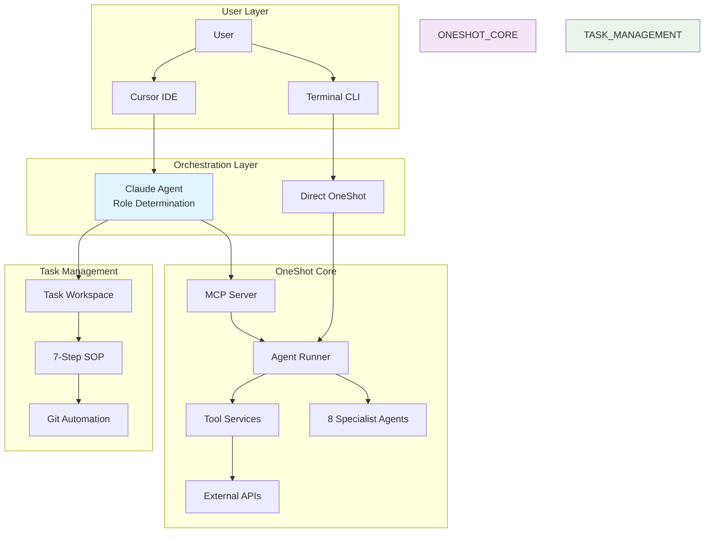

# System Overview

- **Context**: Oneshot is a specialist AI agent orchestration framework built on PydanticAI, designed for knowledge work automation through artifact-first design patterns. The system enables specialist agent orchestration for complex knowledge work tasks.
- **Diagram**: See MASTER_Architecture_UMLs in current analysis task for comprehensive visual architecture

# Boundaries & Ownership

- **Core System** (`/app`): Owns agent execution, tool services, MCP server. Path: app/. Owner: oneshot-core
- **Agent Definitions** (`/agents`): Owns specialist agent configurations and prompts. Path: agents/. Owner: agent-creators  
- **Tool Ecosystem** (`/tools`): Owns tool implementations and metadata. Path: tools/. Owner: tool-developers
- **Task Management** (`/tasks`, `.cursor/rules`): Owns development workflow and global rules. Path: tasks/, .cursor/rules/. Owner: workflow-system
- **Global Documentation** (`/global`): Owns system-wide specifications and architecture. Path: global/. Owner: documentation-system

# Data Flow (happy path)

1) **User Request** → Claude Agent analyzes intent and determines role (Orchestrator/Designer/Developer)
2) **Role Routing** → Orchestrator uses MCP to call specialist agents, Developer creates task workspace  
3) **Agent Execution** → AgentRunner loads configuration, executes agent with tools via PydanticAI
4) **Tool Services** → Tools use shared infrastructure for LLM calls, file ops, API integration
5) **Artifact Generation** → Results saved to `/artifacts/{run_id}/` with metadata and organization
6) **Response Delivery** → Formatted results returned to user with context preservation

# Critical Invariants (do not break)

- **Agent Specialization**: Each agent MUST have focused expertise - no general-purpose agents
- **Tool Services Dependency**: All tools MUST use `from app.tool_services import *` - no direct implementations
- **Run ID Persistence**: All operations MUST maintain run_id for conversation continuity and artifact organization
- **Artifact-First Design**: Agents MUST produce files, not just text responses, for workflow chaining
- **Cross-Platform Compatibility**: All code MUST work on Windows, Mac, and Linux without modification
- **Testing Requirements**: All task completions MUST pass automated tests with exit code 0
- **Git Workflow Automation**: All task completions MUST execute automated git commit/push
- **Configuration Hierarchy**: Agent configs override global defaults; local MCP config overrides global

# Failure & Recovery

- **Agent Execution Failures**: Automatic retry with exponential backoff, fallback to error message with diagnostic info
- **Tool Loading Failures**: Graceful degradation - agents continue with available tools, log missing dependencies  
- **MCP Communication Failures**: stdio transport with timeout protection, automatic buffer resets for stall prevention
- **External API Failures**: Circuit breaker pattern with fallback responses, usage limit enforcement

# Performance Targets (SLOs)

- **Agent Execution**: p95 < 30s for standard agent calls; p95 < 90s for complex research workflows
- **Tool Services**: p95 < 5s for file operations; p95 < 15s for LLM calls with retry logic
- **MCP Throughput**: Handle 10+ concurrent agent requests without degradation
- **Memory Usage**: < 500MB baseline, < 2GB during heavy multi-agent workflows

# Security

- **AuthN/AuthZ model**: Environment variable based API keys (OPENROUTER_API_KEY, LOGFIRE_TOKEN, BRAVE_SEARCH_API_KEY)
- **PII locations**: No PII stored in system - all user data in artifacts/ and runs/ directories only
- **File Access**: Sandboxed to project directory and user-specified file paths only
- **Network Access**: Controlled through approved external APIs (OpenRouter, Logfire, Brave Search)
- **Code Execution**: Tools execute in controlled Python environment, no arbitrary code execution
