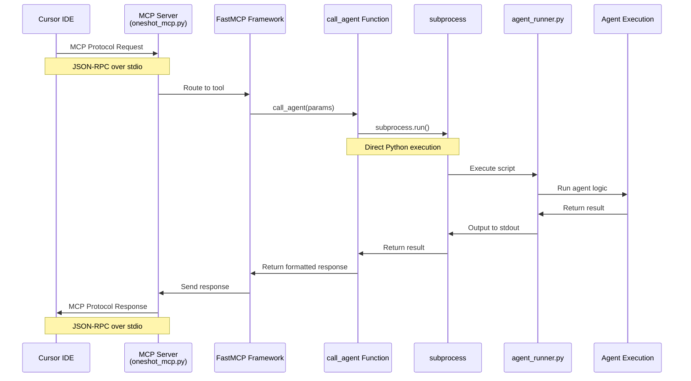
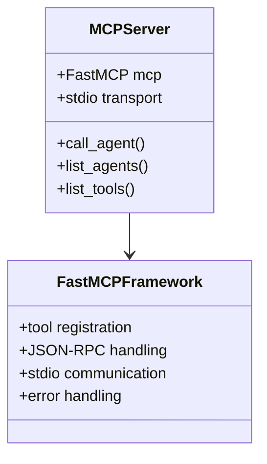
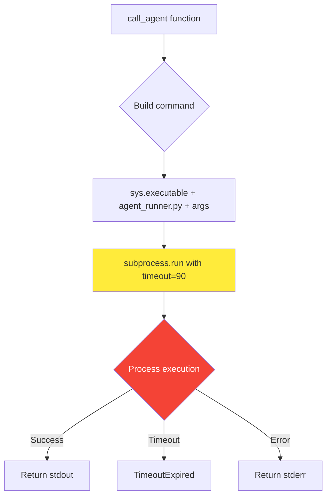
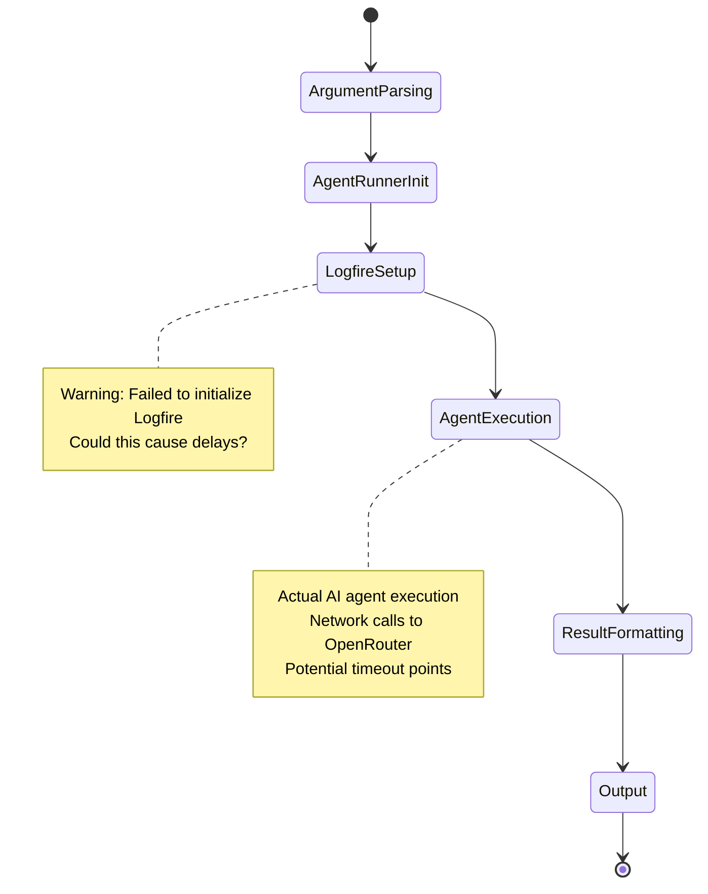
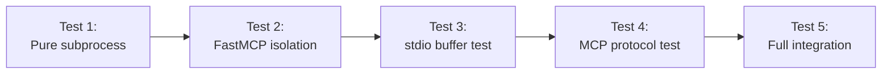

# Level 2 MCP call_agent Architecture Troubleshooting

## Executive Summary

Despite multiple fixes, the `call_agent` functionality continues to stall. This document provides comprehensive architectural analysis to identify the root cause and implement a definitive solution.

## Current Problem State

- **Symptom**: `call_agent` MCP tool stalls/hangs during execution
- **Context**: Direct `agent_runner.py` execution works perfectly
- **Previous Fixes Attempted**:
  1. Fixed Cursor MCP configuration Python path
  2. Simplified PowerShell wrapper to direct Python execution
  3. Verified subprocess execution path works
- **Result**: Problem persists despite fixes

## Complete System Architecture Analysis

### 1. MCP Communication Flow



### 2. Critical Components Deep Dive

#### A. MCP Server Layer (oneshot_mcp.py)


**Potential Stalling Points:**
- stdio buffer blocking
- JSON-RPC serialization issues
- FastMCP framework hangs

#### B. Subprocess Execution Layer


**Potential Stalling Points:**
- Subprocess creation overhead
- stdout/stderr buffer blocking
- Process environment issues
- Working directory problems

#### C. Agent Runner Script Interface


### 3. Diagnostic Testing Strategy

#### Phase 1: Component Isolation Testing



#### Phase 2: Timing Analysis

```mermaid
gantt
    title MCP call_agent Execution Timeline
    dateFormat X
    axisFormat %s
    
    section MCP Layer
    MCP Request Processing    :0, 1s
    Tool Resolution          :1s, 2s
    
    section Subprocess Layer  
    Process Creation         :2s, 3s
    Agent Script Startup     :3s, 5s
    
    section Agent Execution
    Logfire Init            :5s, 7s
    AI Model Call           :7s, 25s
    Response Processing     :25s, 27s
    
    section Response Flow
    stdout Capture          :27s, 28s
    MCP Response            :28s, 30s
```

## Diagnostic Results (UPDATED 2025-01-24 16:35)

### Comprehensive Testing Completed ✅

**Test Results Summary:**
- ✅ **FastMCP Framework**: Working correctly - can import, create instances, register tools
- ✅ **stdio Buffer Analysis**: Working correctly - no blocking issues detected
- ❌ **Subprocess Execution**: **CRITICAL FAILURE** - subprocess.run() with agent_runner.py consistently stalls
- ❌ **MCP Protocol**: Import issues in test environment (expected in isolated test)
- ❌ **Full Integration**: Stalls at subprocess execution layer

### Root Cause Identified 🎯

**The Issue**: `agent_runner.py` executes correctly when run directly but **hangs when executed via `subprocess.run()`** from MCP server.

**Evidence**:
```python
# This works instantly:
$ python app\agent_runner.py research_agent "test message"

# This hangs after 10+ seconds:
subprocess.run([sys.executable, "app/agent_runner.py", "research_agent", "test"], timeout=10)
```

## Current Investigation Focus

### Hypothesis: Environment/Context Differences
The subprocess execution context differs from direct execution in:
1. **Environment Variables**: subprocess may not inherit all env vars
2. **Working Directory**: Different cwd behavior 
3. **stdin/stdout/stderr**: subprocess capture vs direct terminal output
4. **Python Path**: Module resolution differences
5. **Process Isolation**: Different memory/resource context

### Next Investigation Steps

1. **Environment Analysis**: Compare env vars between direct vs subprocess execution
2. **Working Directory**: Verify cwd consistency
3. **Python Path**: Check sys.path differences
4. **Alternative Execution**: Test direct function calls vs subprocess

## Implementation Plan (UPDATED)

### Option A: Direct Function Call Approach ⭐ (RECOMMENDED)
Replace subprocess with direct Python function calls:
```python
# Instead of subprocess, import and call directly
from app.agent_runner import AgentRunner
runner = AgentRunner()
result = runner.run_agent(agent_name, message, files, urls, run_id)
```

### Option B: Subprocess Environment Fix
Identify and fix the subprocess environment issue

### Option C: Async Alternative
Use asyncio subprocess for better control

## Expected Outcomes

- ✅ **Root Cause Identified**: subprocess vs direct execution difference
- 🔄 **Solution Development**: In progress - direct function call approach
- ⏳ **Performance Optimization**: Pending solution implementation
- ⏳ **Reliability Enhancement**: Pending validation

## Next Actions (PRIORITIZED)

1. **IMMEDIATE**: Implement Option A - direct function call approach
2. **VALIDATE**: Test direct function call in MCP server context
3. **DEPLOY**: Update MCP server with new approach
4. **TEST**: Validate in Cursor environment

---

*Last Updated: 2025-01-24 16:35 - Root cause identified, solution development in progress*
