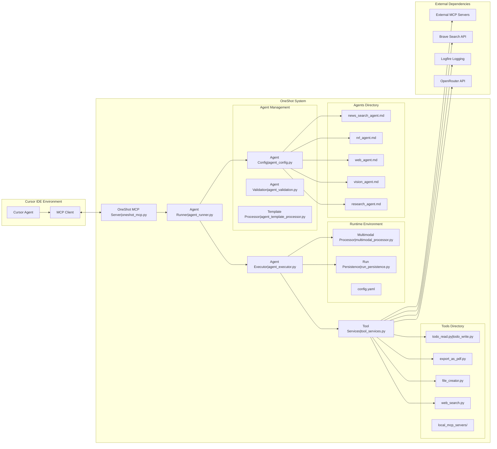
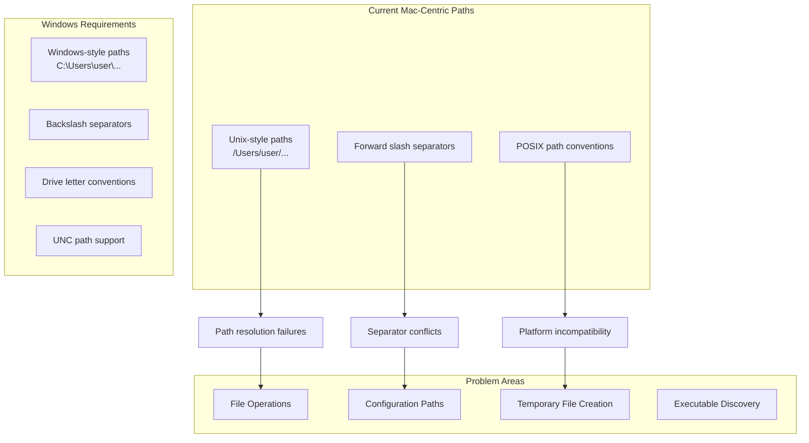
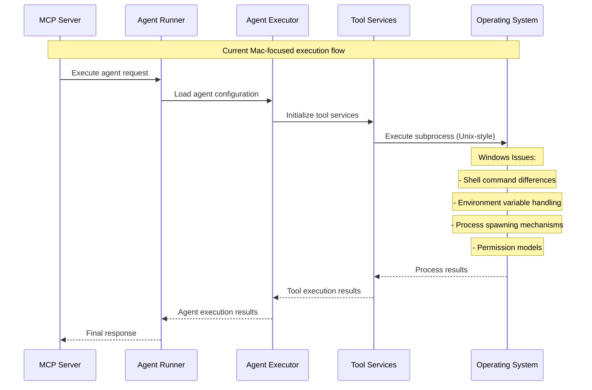
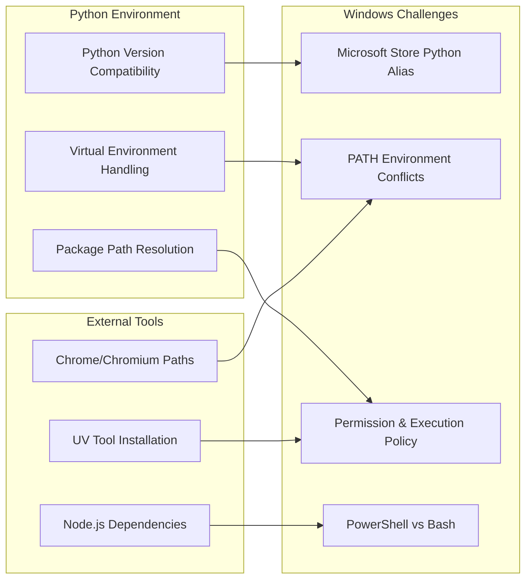
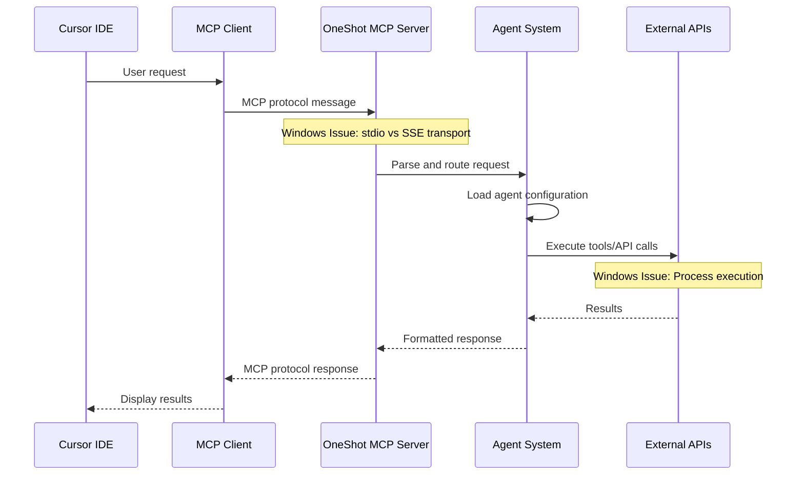
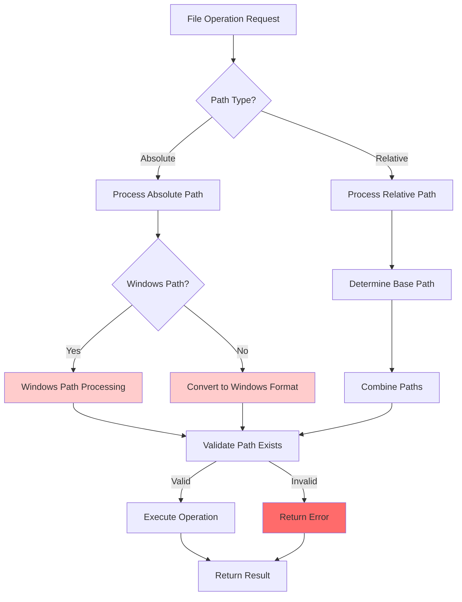
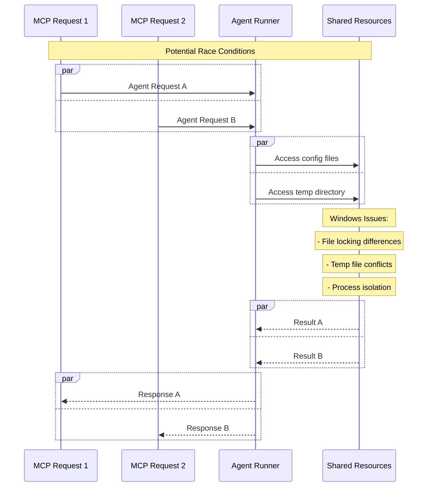
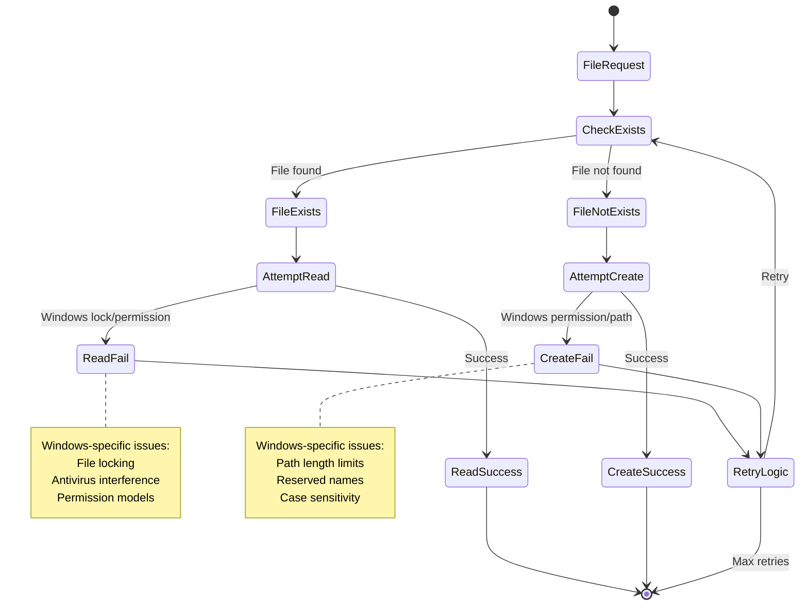
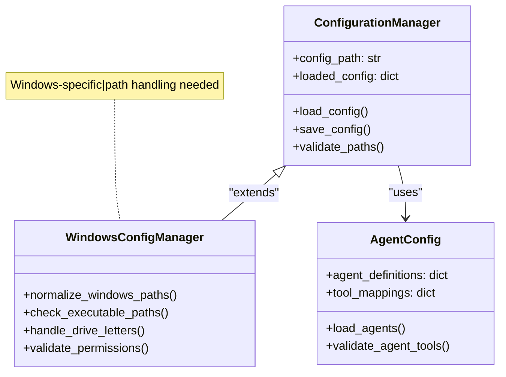
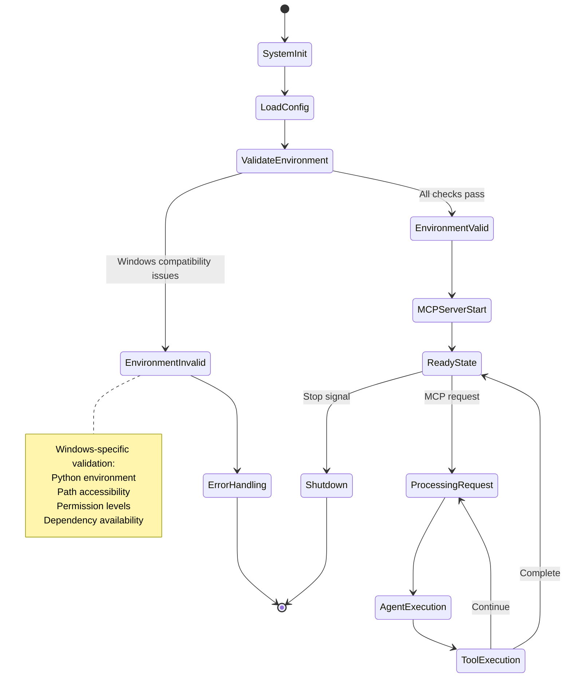

# OneShot MCP Architecture - Windows Compatibility Analysis

## Overview

This document provides comprehensive UML documentation and architectural analysis of the OneShot MCP system, with specific focus on Windows compatibility issues and required modifications.

## System Architecture Overview

## Windows Compatibility Issues Analysis

### 1. Path Handling Issues

### 2. Process Execution Architecture

### 3. Dependency Management Issues

## Data Flow Analysis

### 1. MCP Communication Flow

### 2. File System Operations

## Race Condition Mapping

### 1. Agent Execution Concurrency

### 2. File System Race Conditions

## State Management Audit

### 1. Configuration State

### 2. Runtime State

## Critical Windows Compatibility Points

### 1. High Priority Issues
- **Path Separator Handling**: Convert all Unix paths to Windows format
- **Process Execution**: Replace Unix subprocess calls with Windows-compatible versions
- **Environment Variables**: Handle Windows environment variable differences
- **File Permissions**: Implement Windows permission model compatibility

### 2. Medium Priority Issues
- **Shell Command Differences**: PowerShell vs Bash command adaptations
- **Temporary File Handling**: Windows temp directory conventions
- **Unicode Handling**: Windows filesystem encoding considerations

### 3. Low Priority Issues
- **Performance Optimizations**: Windows-specific performance tuning
- **Error Message Localization**: Windows error message formatting
- **Integration Improvements**: Better Windows ecosystem integration

## Next Steps

1. **Detailed Code Analysis**: Examine each Python module for Unix-specific code
2. **Test Environment Setup**: Create Windows-specific test scenarios
3. **Implementation Planning**: Design Windows compatibility layer
4. **Validation Strategy**: Define comprehensive testing approach

---

*This document will be continuously updated as we progress through the Windows compatibility implementation.*
