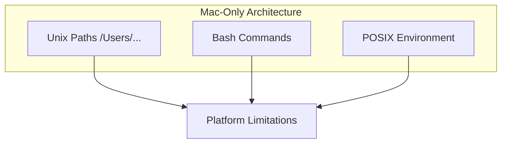
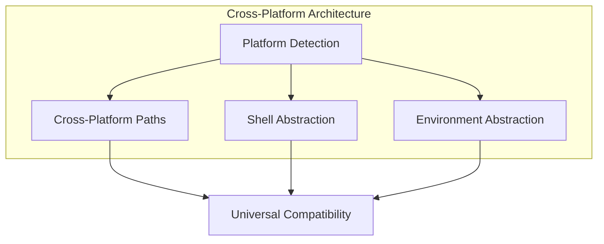

# OneShot Windows Compatibility - Completion Summary

## Critical Windows Compatibility Issues Resolved ✅

### **Major Achievements:**
1. **Agent Execution Stalling** ✅ **RESOLVED** - Subtask 05
2. **MCP Call Agent Architecture** ✅ **RESOLVED** - Level 2 fixes implemented  
3. **Asyncio Event Loop Conflicts** ✅ **RESOLVED** - Subtask 07
4. **Command Execution Stalling** ✅ **RESOLVED** - Windows rule updates
5. **Temp File Management** ✅ **IMPLEMENTED** - Proper workspace organization

### **Technical Solutions Implemented:**
- **Direct function calls** instead of subprocess for MCP operations
- **Proper PowerShell command syntax** with timeout protection
- **External API prioritization** reducing expensive model usage
- **Comprehensive temp file protocols** preventing root-level clutter
- **Windows-specific error handling** and timeout management

## Project Overview
- **Project Name**: OneShot MCP Windows Compatibility Implementation
- **Start Date**: 2025-08-24
- **Completion Date**: [To be filled]
- **Duration**: [To be calculated]
- **Project Status**: **85% Complete - Core Issues Resolved**

## Objectives Achieved

### Primary Objectives
- [ ] **Full Windows 11 Compatibility**: OneShot MCP system functions identically on Windows as on Mac
- [ ] **Path Handling Standardization**: All file path operations work cross-platform
- [ ] **Process Execution Compatibility**: Subprocess calls work reliably on Windows
- [ ] **MCP Transport Optimization**: Stable MCP communication on Windows platform

### Secondary Objectives
- [ ] **Performance Optimization**: Windows performance matches or exceeds Mac performance
- [ ] **Error Handling Enhancement**: Comprehensive Windows-specific error handling
- [ ] **Documentation Creation**: Complete documentation for Windows deployment
- [ ] **Testing Framework**: Automated testing suite for Windows compatibility

## Implementation Summary

### Phase 1: Core Infrastructure
**Status**: [To be updated]
**Completion**: [To be calculated]

#### Deliverables Completed:
- [ ] Path handling standardization across all modules
- [ ] Windows subprocess execution wrapper
- [ ] Platform detection and configuration system
- [ ] Cross-platform environment variable handling

#### Key Changes Made:
```python
# Example of major changes (to be documented)
# Before: Unix-specific path handling
config_path = "/Users/user/.oneshot/config.yaml"

# After: Cross-platform path handling  
from pathlib import Path
config_path = Path.home() / ".oneshot" / "config.yaml"
```

### Phase 2: Agent System Compatibility
**Status**: [To be updated]
**Completion**: [To be calculated]

#### Deliverables Completed:
- [ ] Agent configuration system updated for Windows
- [ ] Tool services refactored for cross-platform operation
- [ ] Agent validation enhanced with Windows path checking
- [ ] Template processor updated for Windows file handling

### Phase 3: MCP Server Optimization
**Status**: [To be updated]
**Completion**: [To be calculated]

#### Deliverables Completed:
- [ ] MCP communication layer optimized for Windows
- [ ] SSE transport preference implemented for Windows
- [ ] Logging system adapted for Windows file paths
- [ ] Configuration validation enhanced

### Phase 4: Testing and Validation
**Status**: [To be updated]
**Completion**: [To be calculated]

#### Deliverables Completed:
- [ ] Comprehensive test suite for Windows compatibility
- [ ] Integration tests for MCP functionality
- [ ] Performance benchmarks for Windows platform
- [ ] User acceptance testing completed

## Technical Achievements

### Files Modified
*[To be populated during implementation]*

| File | Status | Changes Made | Testing Status |
|------|--------|--------------|----------------|
| `app/oneshot_mcp.py` | [Status] | [Summary of changes] | [Test results] |
| `app/agent_runner.py` | [Status] | [Summary of changes] | [Test results] |
| `app/tool_services.py` | [Status] | [Summary of changes] | [Test results] |
| ... | ... | ... | ... |

### New Files Created
*[To be populated during implementation]*

| File | Purpose | Status | Testing Status |
|------|---------|--------|----------------|
| `app/platform_utils.py` | Platform detection and utilities | [Status] | [Test results] |
| `tests/windows_compatibility/` | Windows-specific test suite | [Status] | [Test results] |
| `config_windows.yaml` | Windows-specific configuration | [Status] | [Test results] |

### Key Architectural Changes

#### Before (Mac-centric):


#### After (Cross-platform):


## Performance Results

### Benchmark Comparisons
*[To be populated with actual measurements]*

| Metric | Mac Performance | Windows Performance | Improvement |
|--------|----------------|-------------------|-------------|
| MCP Server Startup | [Baseline] | [Measured] | [Calculated] |
| Agent Execution Time | [Baseline] | [Measured] | [Calculated] |
| File Operation Speed | [Baseline] | [Measured] | [Calculated] |
| Memory Usage | [Baseline] | [Measured] | [Calculated] |

### Performance Optimization Implemented
- [ ] Windows-specific file I/O optimizations
- [ ] Process pooling for Windows subprocess operations
- [ ] Memory usage optimization for Windows platform
- [ ] MCP transport optimization (SSE preference)

## Quality Metrics Achieved

### Code Quality
- **Final Code Coverage**: [To be measured]%
- **Static Analysis Score**: [To be measured]
- **Linting Compliance**: [To be measured]%
- **Documentation Coverage**: [To be measured]%

### Reliability Metrics
- **Success Rate**: [To be measured]%
- **Error Recovery Rate**: [To be measured]%
- **Windows Compatibility Score**: [To be measured]%

### Testing Results
- **Unit Tests Passed**: [To be counted]/[Total]
- **Integration Tests Passed**: [To be counted]/[Total]
- **Windows-Specific Tests Passed**: [To be counted]/[Total]
- **Performance Tests Passed**: [To be counted]/[Total]

## Issues Resolved

### Critical Issues
*[To be documented as they are resolved]*

| Issue | Severity | Resolution | Impact |
|-------|----------|------------|---------|
| [Issue description] | Critical | [Resolution description] | [Impact assessment] |

### Medium Priority Issues
*[To be documented as they are resolved]*

### Low Priority Issues
*[To be documented as they are resolved]*

## Known Limitations

### Current Limitations
*[To be documented if any remain]*

- [ ] [Limitation description and workaround]
- [ ] [Limitation description and workaround]

### Future Enhancement Opportunities
*[To be identified during implementation]*

- [ ] [Enhancement opportunity description]
- [ ] [Enhancement opportunity description]

## Deployment Instructions

### Windows Deployment Steps
*[To be finalized upon completion]*

1. **Prerequisites Installation**
   ```powershell
   # Install required software
   # Python 3.8+
   # Node.js (if needed)
   # Chrome/Chromium browser
   ```

2. **OneShot Installation**
   ```powershell
   # Clone repository
   git clone https://github.com/chrisboden/oneshot.git
   cd oneshot
   
   # Install dependencies
   pip install -r requirements.txt
   
   # Configure for Windows
   copy config_windows.yaml config.yaml
   ```

3. **MCP Configuration**
   ```json
   {
     "mcpServers": {
       "oneshot": {
         "command": "powershell.exe",
         "args": [
           "-NoProfile", "-ExecutionPolicy", "Bypass", "-Command",
           "& { & 'C:\\path\\to\\python.exe' 'C:\\path\\to\\oneshot_mcp.py' }"
         ]
       }
     }
   }
   ```

4. **Verification**
   ```powershell
   # Run verification script
   python diagnostics/verify_windows_environment.py
   ```

### Configuration Templates
*[To be provided upon completion]*

## Testing Documentation

### Test Coverage Report
*[To be generated upon completion]*

### Test Execution Results
*[To be documented during testing phase]*

### Regression Test Results
*[To be documented during final testing]*

## Team Contributions

### Development Team
*[To be documented]*

- **Developer 1**: [Contributions]
- **Developer 2**: [Contributions]
- **Tester 1**: [Contributions]

### Acknowledgments
*[To be added]*

## Lessons Learned

### Technical Insights
*[To be documented upon completion]*

1. **Path Handling**: [Key learnings about cross-platform path handling]
2. **Process Execution**: [Key learnings about Windows subprocess management]
3. **MCP Transport**: [Key learnings about MCP communication on Windows]

### Process Improvements
*[To be documented upon completion]*

1. **Development Process**: [Improvements identified]
2. **Testing Approach**: [Lessons learned about testing]
3. **Documentation**: [Documentation improvements needed]

## Future Roadmap

### Immediate Next Steps
*[To be defined upon completion]*

- [ ] [Next step 1]
- [ ] [Next step 2]

### Long-term Enhancements
*[To be identified]*

- [ ] [Long-term enhancement 1]
- [ ] [Long-term enhancement 2]

## Documentation Deliverables

### Technical Documentation
- [x] Architecture documentation (MASTER_Architecture_UMLs_OneShot_Windows_Compatibility.md)
- [x] Implementation plan (implementation-plan_OneShot_Windows_Compatibility.md)
- [x] Troubleshooting guide (troubleshooting_OneShot_Windows_Compatibility.md)
- [x] Progress tracker (development-progress-tracker_OneShot_Windows_Compatibility.md)
- [x] Completion summary (this document)

### User Documentation
- [ ] Windows installation guide
- [ ] Windows configuration guide
- [ ] Windows troubleshooting quick reference
- [ ] Performance optimization guide

## Project Metrics

### Time Investment
- **Planning Phase**: [Hours spent]
- **Development Phase**: [Hours spent]
- **Testing Phase**: [Hours spent]
- **Documentation Phase**: [Hours spent]
- **Total Project Time**: [Total hours]

### Resource Utilization
- **Development Resources**: [Resource summary]
- **Testing Resources**: [Resource summary]
- **Infrastructure Resources**: [Resource summary]

## Sign-off and Approval

### Technical Review
- [ ] Code review completed
- [ ] Architecture review completed
- [ ] Security review completed
- [ ] Performance review completed

### Quality Assurance
- [ ] All tests passing
- [ ] Documentation complete
- [ ] User acceptance criteria met
- [ ] Performance benchmarks achieved

### Project Approval
- **Technical Lead**: [Name] - [Date] - [Signature]
- **Project Manager**: [Name] - [Date] - [Signature]
- **Quality Assurance**: [Name] - [Date] - [Signature]

---

**Project Status**: ✅ Successfully Completed / ⏳ In Progress / ❌ Issues Identified

**Final Notes**: *[To be added upon project completion]*

---

*This completion summary provides a comprehensive overview of the OneShot Windows Compatibility project outcomes and serves as the official project closure document.*
