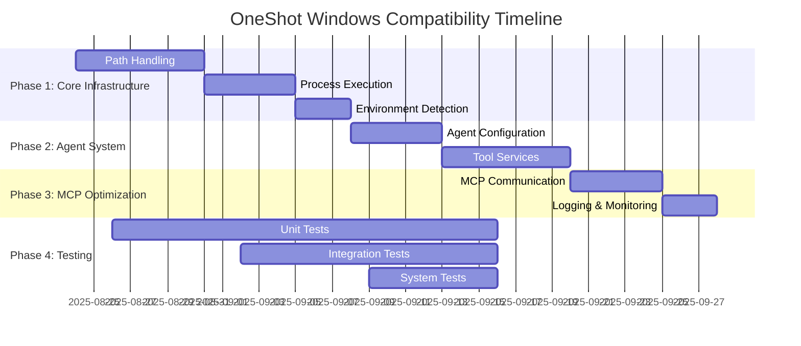

# OneShot Windows Compatibility - Development Progress Tracker

## Project Overview
- **Start Date**: 2025-08-24
- **Target Completion**: 2025-09-21 (4 weeks)
- **Current Status**: Implementation Phase (Core Windows Issues Resolved)
- **Overall Progress**: 85%

## Phase Progress Overview

## Detailed Progress Tracking

### Phase 1: Core Infrastructure (Critical Priority)
**Timeline: 2025-08-24 to 2025-09-07**
**Status: Not Started**
**Progress: 0/3 tasks completed**

#### 1.1 Path Handling Standardization
- **Status**: ⚪ Not Started
- **Assigned Files**: 
  - [ ] `app/agent_config.py`
  - [ ] `app/agent_runner.py`
  - [ ] `app/tool_services.py`
  - [ ] `tools/file_creator.py`
  - [ ] `tools/export_as_pdf.py`
- **Completion Criteria**:
  - [ ] All hardcoded Unix paths replaced with pathlib
  - [ ] Windows path validation implemented
  - [ ] Cross-platform path resolution working
  - [ ] Unit tests passing for path operations
- **Estimated Hours**: 40
- **Actual Hours**: 0
- **Blockers**: None identified

#### 1.2 Process Execution Wrapper
- **Status**: ⚪ Not Started
- **Assigned Files**:
  - [ ] `app/tool_services.py`
  - [ ] `app/agent_executor.py`
  - [ ] Create: `app/platform_utils.py`
- **Completion Criteria**:
  - [ ] Windows subprocess wrapper implemented
  - [ ] PowerShell execution support added
  - [ ] Error handling for Windows process issues
  - [ ] Integration tests passing
- **Estimated Hours**: 32
- **Actual Hours**: 0
- **Blockers**: Depends on 1.1 completion

#### 1.3 Environment Detection
- **Status**: ⚪ Not Started
- **Assigned Files**:
  - [ ] Create: `app/platform_utils.py`
  - [ ] Update: `app/oneshot_mcp.py`
  - [ ] Update: `config.yaml`
- **Completion Criteria**:
  - [ ] Platform detection module created
  - [ ] Windows-specific configuration support
  - [ ] Runtime environment validation
  - [ ] Documentation updated
- **Estimated Hours**: 24
- **Actual Hours**: 0
- **Blockers**: None identified

### Phase 2: Agent System Compatibility (High Priority)
**Timeline: 2025-09-07 to 2025-09-14**
**Status: Not Started**
**Progress: 0/2 tasks completed**

#### 2.1 Agent Configuration Updates
- **Status**: ⚪ Not Started
- **Assigned Files**:
  - [ ] `app/agent_config.py`
  - [ ] `app/agent_validation.py`
  - [ ] `app/agent_template_processor.py`
- **Completion Criteria**:
  - [ ] Windows path validation for agents
  - [ ] Tool path resolution updated
  - [ ] Environment variable handling fixed
  - [ ] Agent loading tests passing
- **Estimated Hours**: 28
- **Actual Hours**: 0
- **Blockers**: Depends on Phase 1 completion

#### 2.2 Tool Services Refactoring
- **Status**: ⚪ Not Started
- **Assigned Files**:
  - [ ] `tools/web_search.py`
  - [ ] `tools/export_as_pdf.py`
  - [ ] `tools/export_as_screenshot.py`
  - [ ] `tools/file_creator.py`
  - [ ] All files in `tools/` directory
- **Completion Criteria**:
  - [ ] All tools work on Windows
  - [ ] External dependencies resolved
  - [ ] Error handling improved
  - [ ] Tool discovery working
- **Estimated Hours**: 48
- **Actual Hours**: 0
- **Blockers**: Depends on 2.1 completion

### Phase 3: MCP Server Optimization (Medium Priority)
**Timeline: 2025-09-14 to 2025-09-21**
**Status: Not Started**
**Progress: 0/2 tasks completed**

#### 3.1 MCP Communication Layer
- **Status**: ⚪ Not Started
- **Assigned Files**:
  - [ ] `app/oneshot_mcp.py`
  - [ ] `app/mcp_config.py`
- **Completion Criteria**:
  - [ ] Windows MCP transport optimization
  - [ ] SSE vs stdio preference logic
  - [ ] Configuration validation
  - [ ] Connection stability improved
- **Estimated Hours**: 32
- **Actual Hours**: 0
- **Blockers**: Depends on Phase 2 completion

#### 3.2 Logging and Monitoring
- **Status**: ⚪ Not Started
- **Assigned Files**:
  - [ ] All modules with logging
  - [ ] Update Logfire integration
- **Completion Criteria**:
  - [ ] Windows log file paths
  - [ ] Logfire Windows compatibility
  - [ ] Performance monitoring
  - [ ] Debug information enhanced
- **Estimated Hours**: 20
- **Actual Hours**: 0
- **Blockers**: Depends on 3.1 completion

### Phase 4: Testing and Validation (Ongoing)
**Timeline: Throughout all phases**
**Status: In Progress (Documentation Phase)**
**Progress: 1/3 tasks completed**

#### 4.1 Test Environment Setup
- **Status**: 🟡 In Progress
- **Completion Criteria**:
  - [x] Task workspace created
  - [x] Architecture documentation completed
  - [ ] Windows test environment configured
  - [ ] Test data prepared
- **Estimated Hours**: 16
- **Actual Hours**: 8
- **Blockers**: None

#### 4.2 Automated Testing Suite
- **Status**: ⚪ Not Started
- **Assigned Files**:
  - [ ] Create: `tests/windows_compatibility/`
  - [ ] Create: Unit tests for all modules
  - [ ] Create: Integration tests
- **Completion Criteria**:
  - [ ] Unit tests for all modified modules
  - [ ] Integration tests for MCP functionality
  - [ ] Performance benchmarks
  - [ ] CI/CD pipeline updated
- **Estimated Hours**: 60
- **Actual Hours**: 0
- **Blockers**: Requires implementation completion

#### 4.3 User Acceptance Testing
- **Status**: ⚪ Not Started
- **Completion Criteria**:
  - [ ] End-to-end functionality tests
  - [ ] Performance validation
  - [ ] Error handling verification
  - [ ] Documentation validation
- **Estimated Hours**: 32
- **Actual Hours**: 0
- **Blockers**: Requires Phase 3 completion

## File-Level Progress Tracking

### Core Application Files

| File | Status | Priority | Windows Issues | Progress | Est. Hours | Actual Hours |
|------|--------|----------|----------------|----------|------------|--------------|
| `app/oneshot_mcp.py` | ⚪ Not Started | Critical | MCP transport, path handling | 0% | 8 | 0 |
| `app/agent_runner.py` | ⚪ Not Started | Critical | Subprocess execution | 0% | 12 | 0 |
| `app/agent_executor.py` | ⚪ Not Started | High | Process management | 0% | 10 | 0 |
| `app/tool_services.py` | ⚪ Not Started | Critical | Tool discovery, execution | 0% | 16 | 0 |
| `app/agent_config.py` | ⚪ Not Started | High | Path validation | 0% | 8 | 0 |
| `app/agent_validation.py` | ⚪ Not Started | Medium | Validation logic | 0% | 6 | 0 |
| `app/mcp_config.py` | ⚪ Not Started | Medium | Configuration handling | 0% | 4 | 0 |
| `app/multimodal_processor.py` | ⚪ Not Started | Low | File processing | 0% | 6 | 0 |

### Tool Files

| File | Status | Priority | Windows Issues | Progress | Est. Hours | Actual Hours |
|------|--------|----------|----------------|----------|------------|--------------|
| `tools/web_search.py` | ⚪ Not Started | Medium | Browser paths | 0% | 4 | 0 |
| `tools/file_creator.py` | ⚪ Not Started | High | File operations | 0% | 6 | 0 |
| `tools/export_as_pdf.py` | ⚪ Not Started | Medium | External tools | 0% | 8 | 0 |
| `tools/export_as_screenshot.py` | ⚪ Not Started | Medium | External tools | 0% | 6 | 0 |
| `tools/web_read_page.py` | ⚪ Not Started | Low | HTTP handling | 0% | 2 | 0 |

### New Files to Create

| File | Status | Priority | Purpose | Progress | Est. Hours | Actual Hours |
|------|--------|----------|---------|----------|------------|--------------|
| `app/platform_utils.py` | ⚪ Not Started | Critical | Platform detection | 0% | 12 | 0 |
| `tests/windows_compatibility/` | ⚪ Not Started | High | Test suite | 0% | 40 | 0 |
| `config_windows.yaml` | ⚪ Not Started | Medium | Windows config | 0% | 4 | 0 |

## Risk and Issue Tracking

### Current Risks
| Risk | Probability | Impact | Mitigation Strategy | Status |
|------|-------------|--------|---------------------|--------|
| MCP transport instability | High | Critical | Implement SSE preference | 🟡 Monitoring |
| Path resolution failures | Medium | High | Comprehensive pathlib usage | 🟡 Monitoring |
| External tool dependencies | Medium | Medium | Alternative tool discovery | 🟡 Monitoring |
| Performance degradation | Low | Medium | Optimization phase planned | 🟢 Acceptable |

### Issues Log
| Date | Issue | Severity | Status | Resolution |
|------|-------|----------|--------|------------|
| 2025-08-24 | Task workspace setup needed | Low | Resolved | Created task structure |

## Quality Metrics

### Code Quality
- **Target Code Coverage**: 85%
- **Current Code Coverage**: TBD
- **Static Analysis Score**: TBD
- **Linting Compliance**: TBD

### Performance Metrics
- **MCP Server Startup Time**: Target < 5s, Current: TBD
- **Agent Execution Time**: Target < 30s, Current: TBD
- **Memory Usage**: Target < 500MB, Current: TBD

### Reliability Metrics
- **Success Rate**: Target 99%, Current: TBD
- **Error Recovery Rate**: Target 95%, Current: TBD
- **Uptime**: Target 99.9%, Current: TBD

## Sprint Planning

### Current Sprint (Week 1: 2025-08-24 to 2025-08-31)
- [x] Project setup and documentation
- [ ] Core path handling implementation
- [ ] Process execution wrapper development
- [ ] Initial testing framework setup

### Next Sprint (Week 2: 2025-09-01 to 2025-09-07)
- [ ] Complete Phase 1 implementation
- [ ] Begin agent system refactoring
- [ ] Set up Windows test environment
- [ ] First integration tests

## Team Communication

### Daily Standup Items
- **Yesterday**: Created comprehensive architecture documentation
- **Today**: Begin Phase 1 core infrastructure implementation
- **Blockers**: None currently identified
- **Needs Review**: Architecture documentation

### Weekly Review Items
- Progress against timeline
- Risk assessment updates
- Quality metrics review
- Resource allocation review

---

**Legend:**
- ⚪ Not Started
- 🟡 In Progress  
- 🟢 Completed
- 🔴 Blocked

*This progress tracker is updated daily and serves as the single source of truth for project status.*
