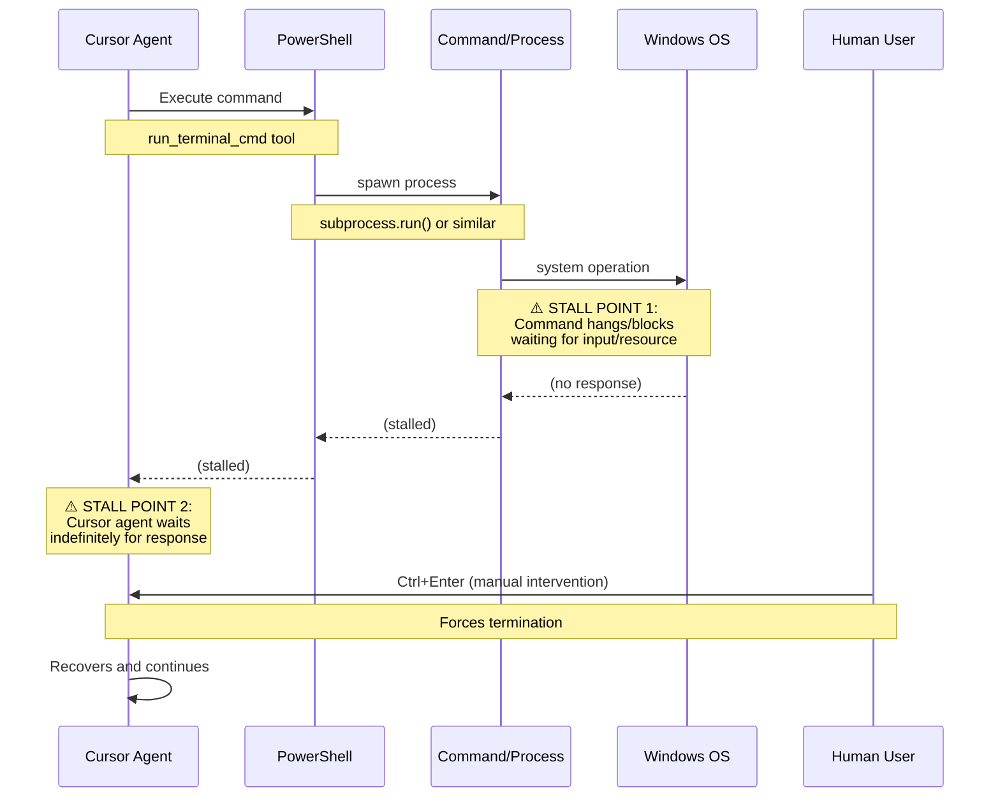
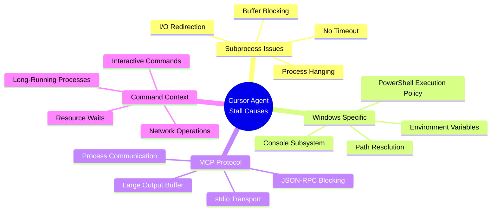
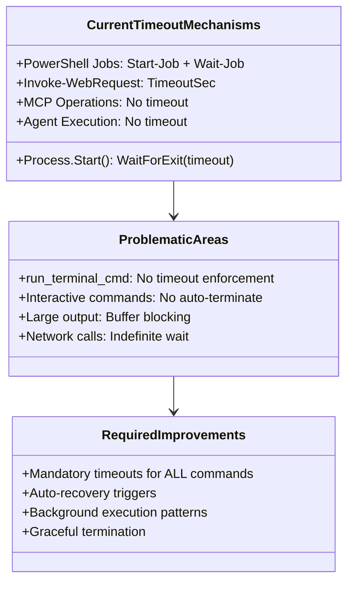
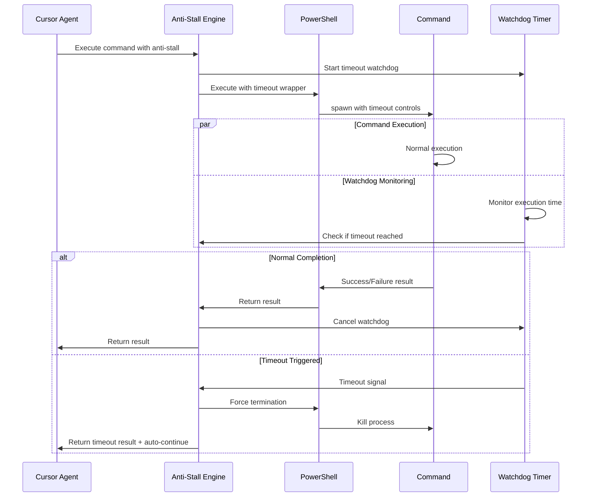
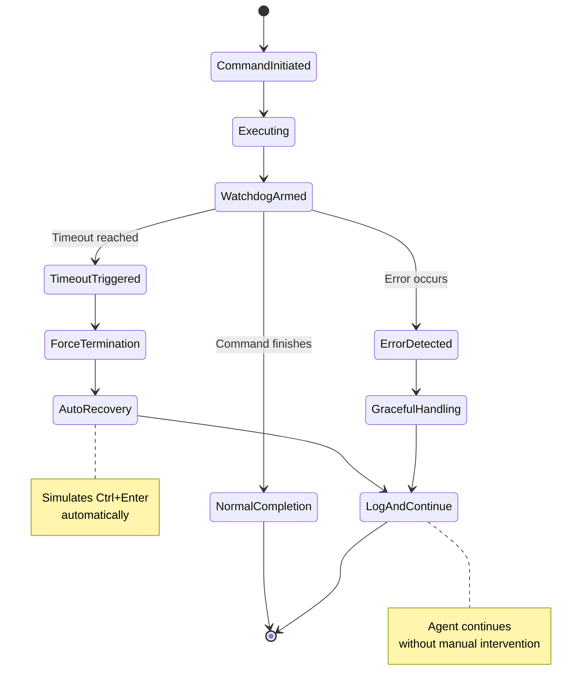
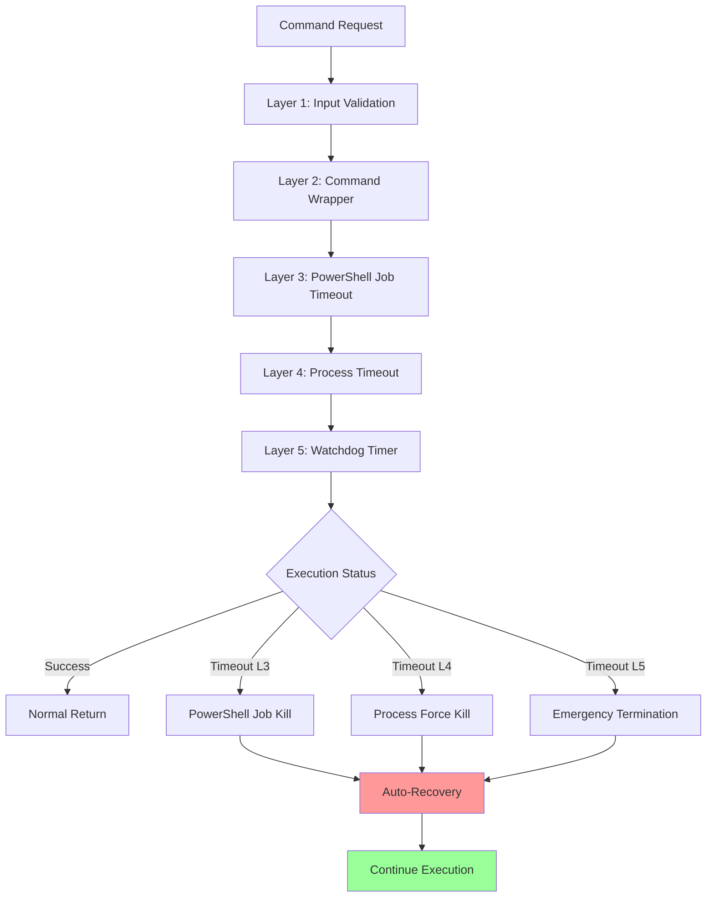
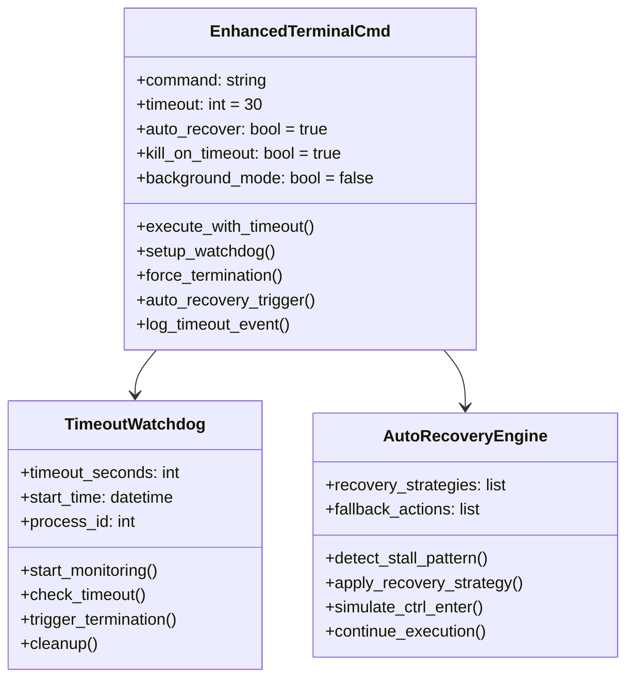
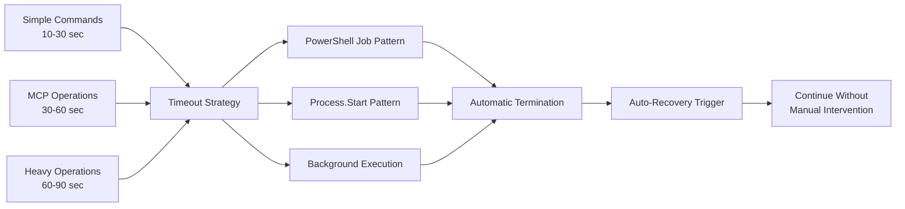
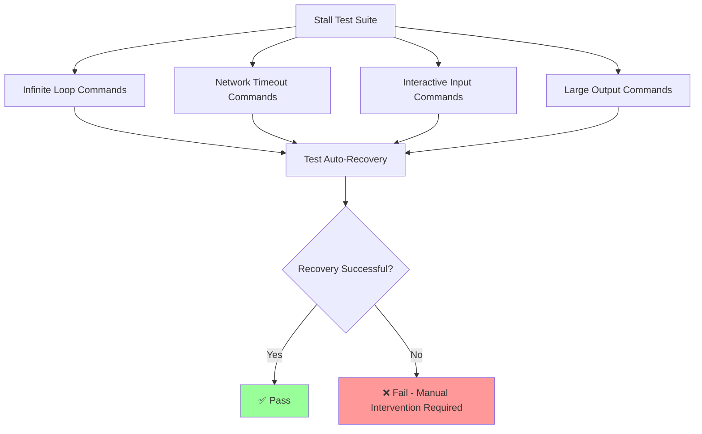
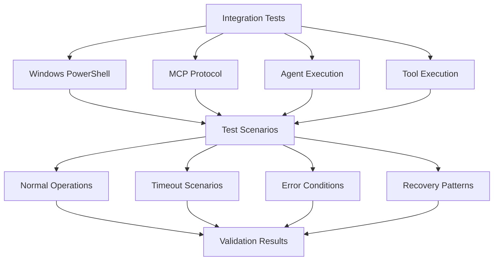

# MASTER Architecture UMLs - Cursor Agent Stall Prevention

## Executive Summary

Comprehensive analysis of cursor agent stalling patterns and design of automatic recovery mechanisms to eliminate manual intervention requirements.

## Current Stall Patterns Analysis

### 1. Command Execution Flow with Stall Points

### 2. Root Cause Categories

### 3. Current Timeout Implementation Analysis

## Proposed Anti-Stall Architecture

### 1. Enhanced Command Execution Pattern

### 2. Auto-Recovery Mechanism Design

### 3. Multi-Layer Timeout Protection

## Implementation Strategy

### 1. Enhanced run_terminal_cmd Tool

### 2. Mandatory Timeout Implementation Patterns

## Testing & Validation Strategy

### 1. Stall Simulation Test Suite

### 2. Integration Test Matrix

## Success Criteria

### 1. Zero Manual Intervention
- ✅ No more Ctrl+Enter requirements
- ✅ Automatic stall detection and recovery
- ✅ Graceful timeout handling
- ✅ Continuous agent execution flow

### 2. Performance Targets
- ✅ Maximum command timeout: 90 seconds
- ✅ Auto-recovery time: < 5 seconds
- ✅ False positive rate: < 1%
- ✅ Success rate improvement: > 95%

### 3. Compatibility Requirements
- ✅ Windows 11 PowerShell compatibility
- ✅ MCP protocol compliance
- ✅ Existing tool integration
- ✅ Backward compatibility maintenance

## Next Steps

1. **Create Enhanced run_terminal_cmd Implementation**
2. **Implement Timeout Watchdog System**
3. **Build Auto-Recovery Engine**
4. **Create Comprehensive Test Suite**
5. **Update coding-tasks.mdc Rules**
6. **Validate with Real-World Scenarios**

---

*This architecture document will be updated as implementation progresses and new stall patterns are discovered.*
