# Master Architecture Analysis - Oneshot & Task Management Systems

## Executive Summary

This document provides comprehensive architectural analysis of the current oneshot system and the overlaid task management system, identifying their interactions, dependencies, and optimization opportunities. The analysis reveals two distinct but interconnected systems that can be better integrated for improved efficiency.

## System Architecture Overview

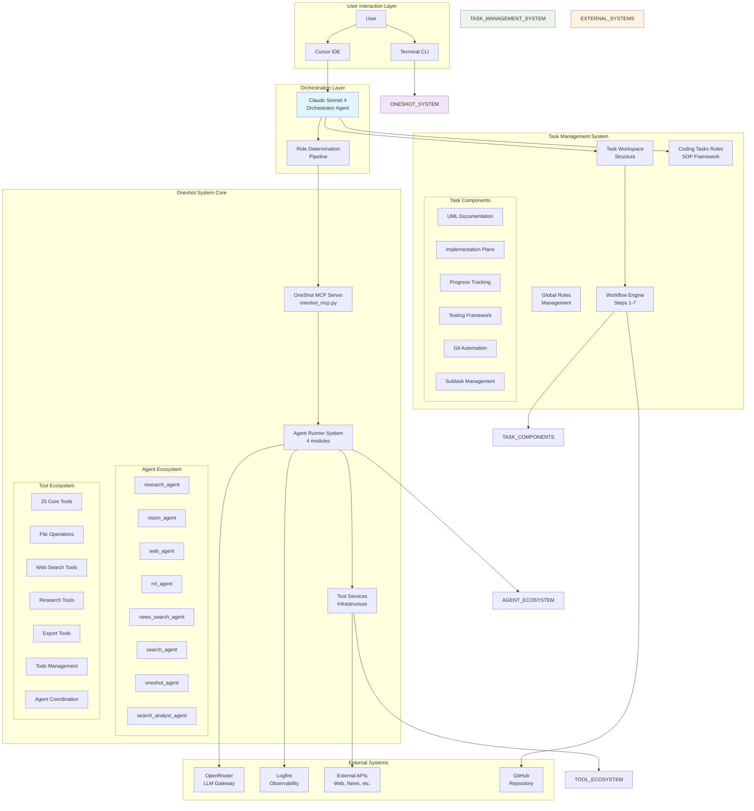

## Current System State Analysis

### 1. Oneshot System Architecture

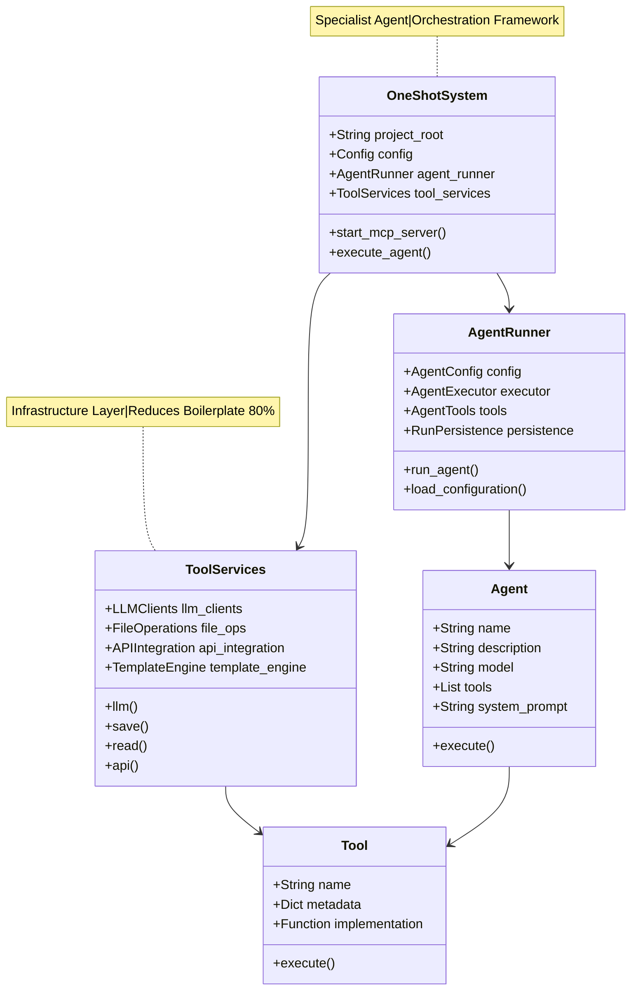

### 2. Task Management System Architecture

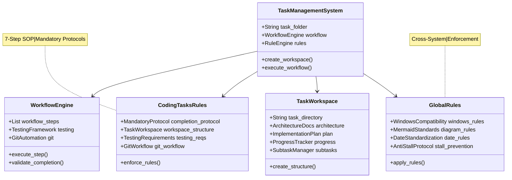

## System Integration Points

### 1. Current Integration Architecture

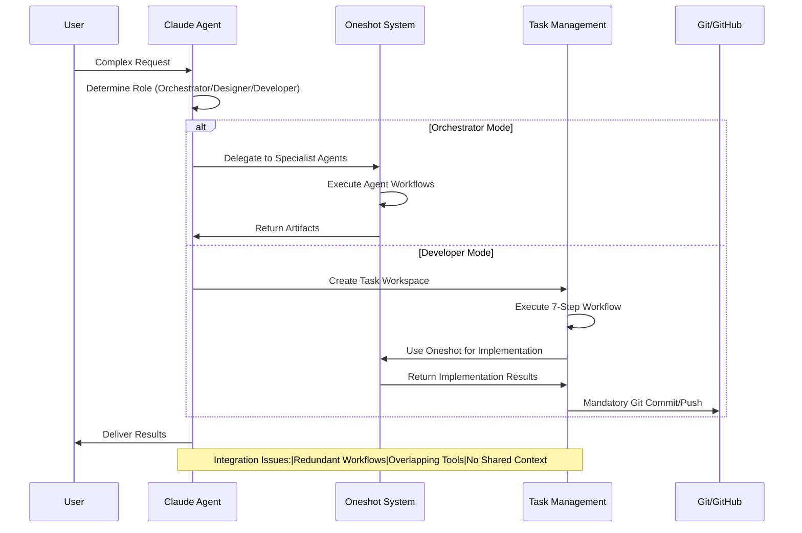

### 2. Data Flow Analysis

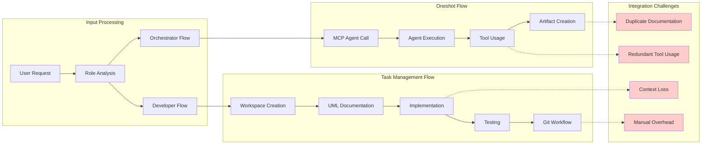

## Critical Issues Identified

### 1. System Overlap and Redundancy

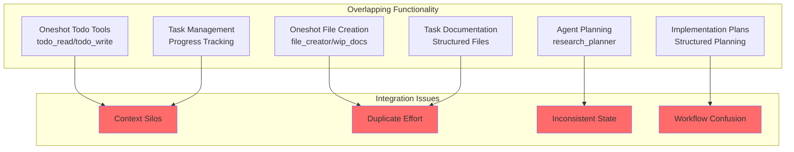

### 2. Race Conditions and State Management

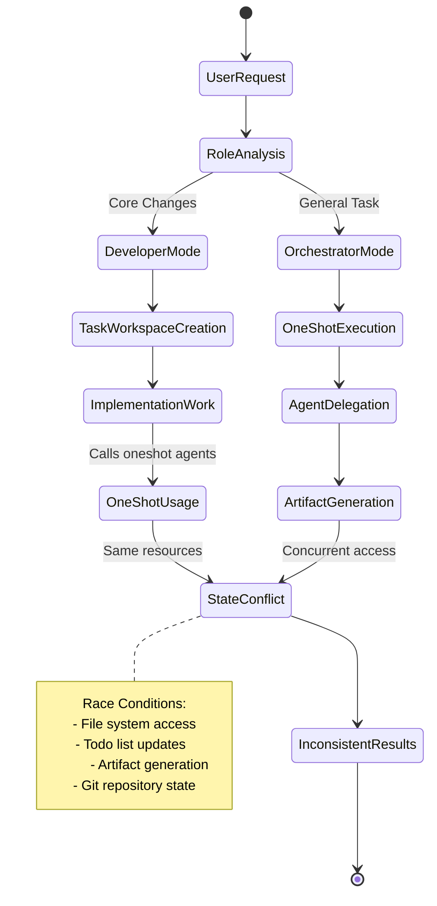

## Performance and Efficiency Analysis

### 1. Resource Utilization

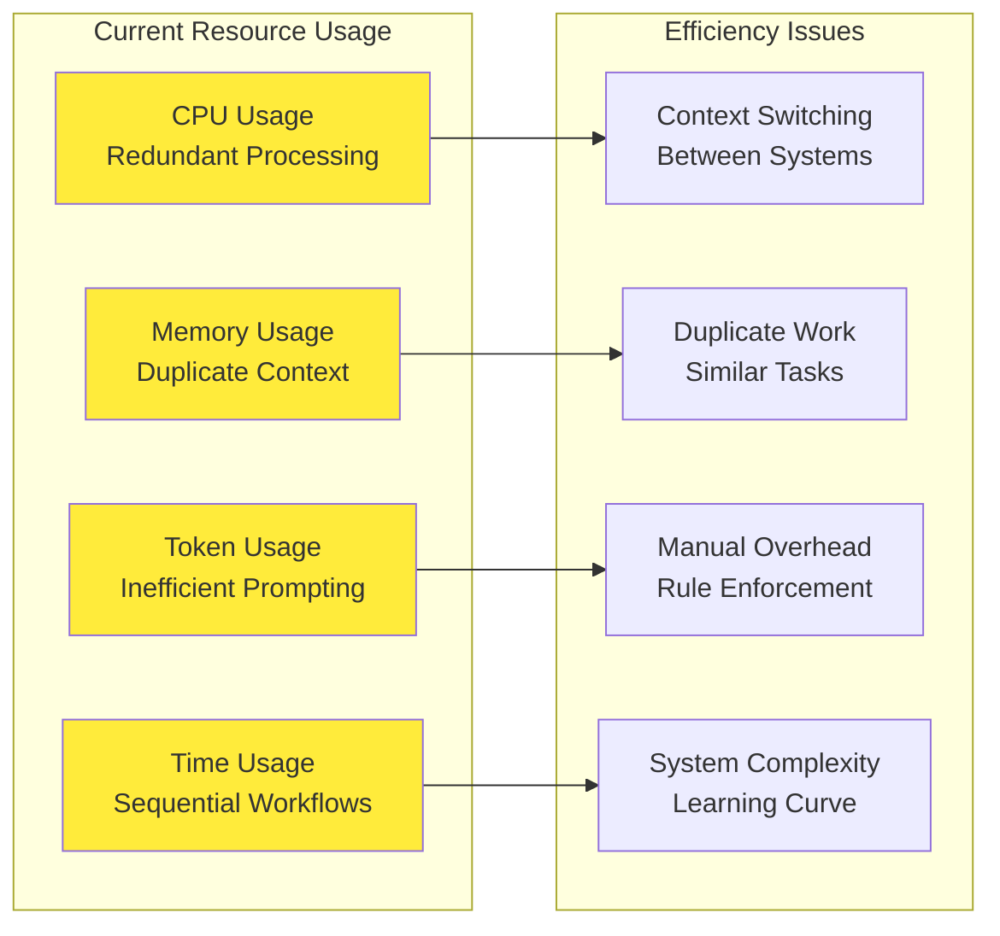

### 2. Workflow Efficiency Analysis

```mermaid
flowchart TD
    START[User Request] --> ANALYSIS[Request Analysis]
    ANALYSIS --> DECISION{System Choice}
    
    DECISION -->|Simple Task| ONESHOT[OneShot Direct]
    DECISION -->|Complex Task| TASK_MGMT[Task Management]
    
    ONESHOT --> AGENT_CALL[Agent Call]
    AGENT_CALL --> QUICK_RESULT[Quick Result]
    
    TASK_MGMT --> WORKSPACE[Create Workspace]
    WORKSPACE --> DOCS[Create Docs]
    DOCS --> IMPL[Implementation]
    IMPL --> TEST[Testing]
    TEST --> GIT[Git Workflow]
    GIT --> SLOW_RESULT[Comprehensive Result]
    
    QUICK_RESULT --> EFFICIENCY_GOOD[Good Efficiency]
    SLOW_RESULT --> EFFICIENCY_POOR[Poor Efficiency]
    
    style EFFICIENCY_GOOD fill:#4caf50
    style EFFICIENCY_POOR fill:#f44336
    
    note right of TASK_MGMT
        7-Step Process:
        1. Workspace Creation
        2. UML Documentation  
        3. Testing
        4. Master E2E Testing
        5. Git Commit/Push
        6. Rule Compliance
        7. Lessons Learned
    end note
```

## Optimization Opportunities

### 1. Unified Architecture Vision

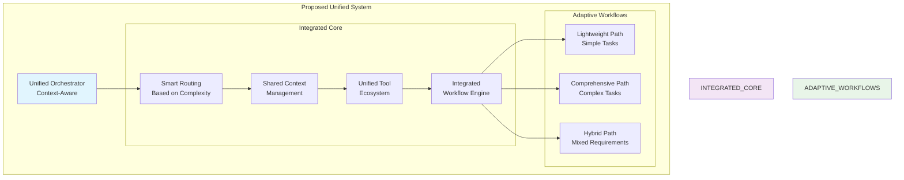

### 2. Performance Optimization Strategy

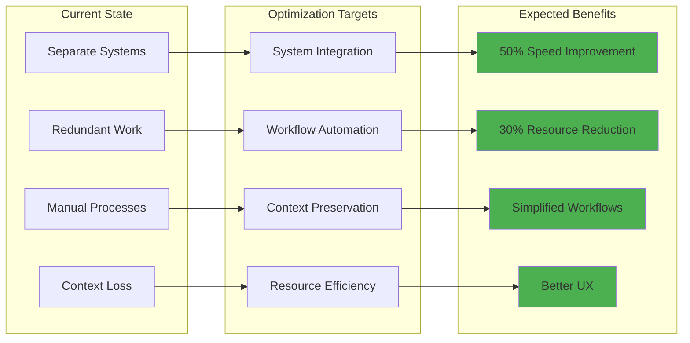

## Next Steps for Integration

### 1. Integration Roadmap

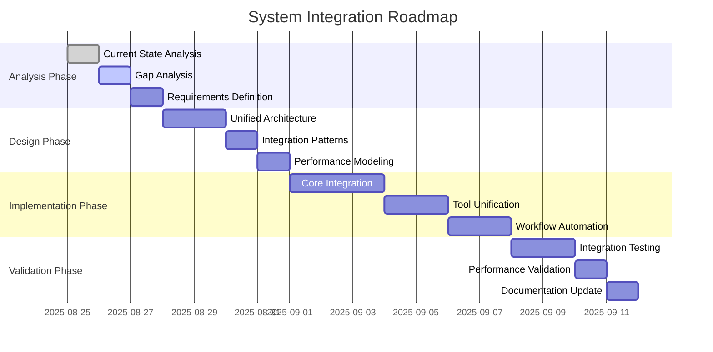

### 2. Technical Implementation Strategy

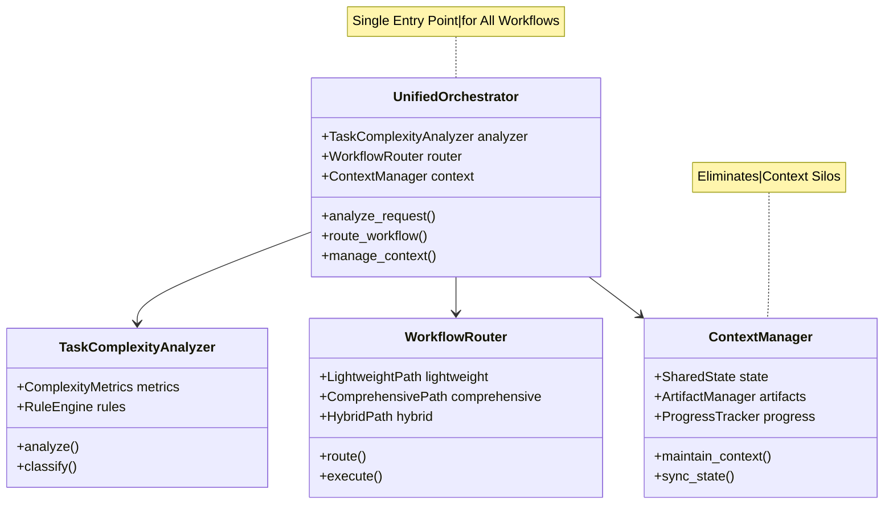

## Conclusion

The current oneshot and task management systems represent powerful but separate approaches to AI-assisted development. The analysis reveals significant opportunities for optimization through:

1. **Unified Orchestration**: Single entry point with intelligent routing
2. **Context Preservation**: Shared state management across workflows
3. **Workflow Automation**: Reduced manual overhead
4. **Resource Efficiency**: Elimination of redundant processes

The proposed integration strategy will maintain the strengths of both systems while addressing their current limitations, resulting in a more efficient and user-friendly development experience.

---

*This analysis forms the foundation for the next phase of system optimization and integration.*
