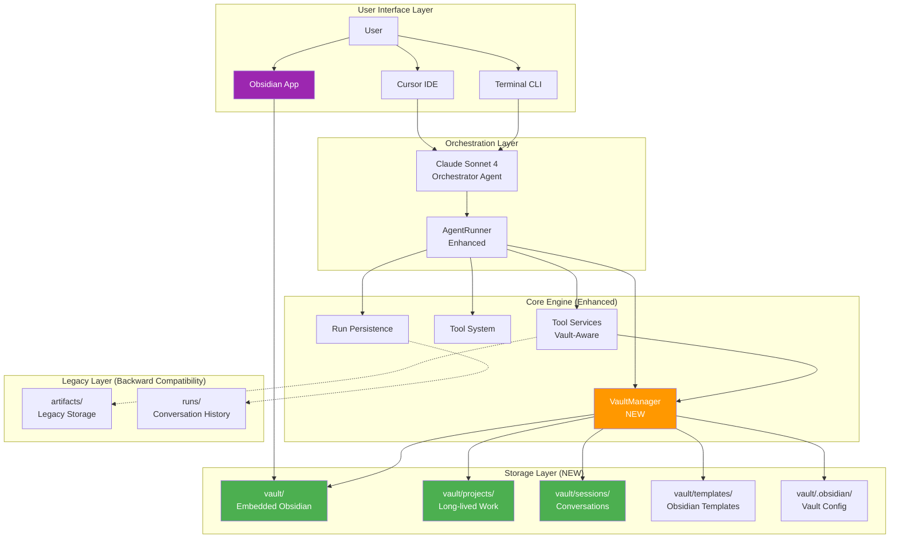
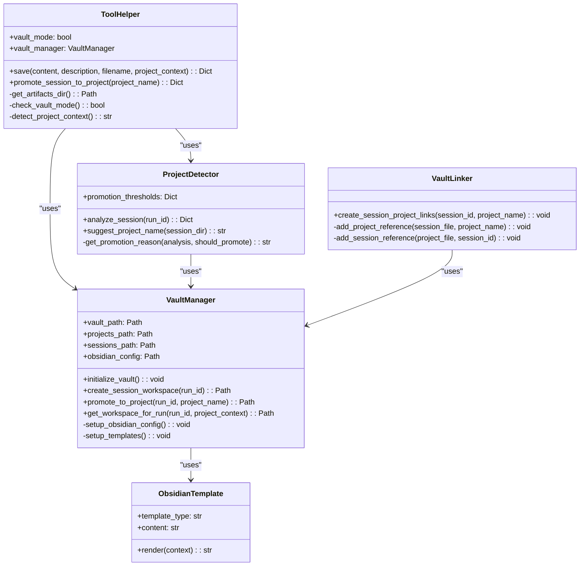
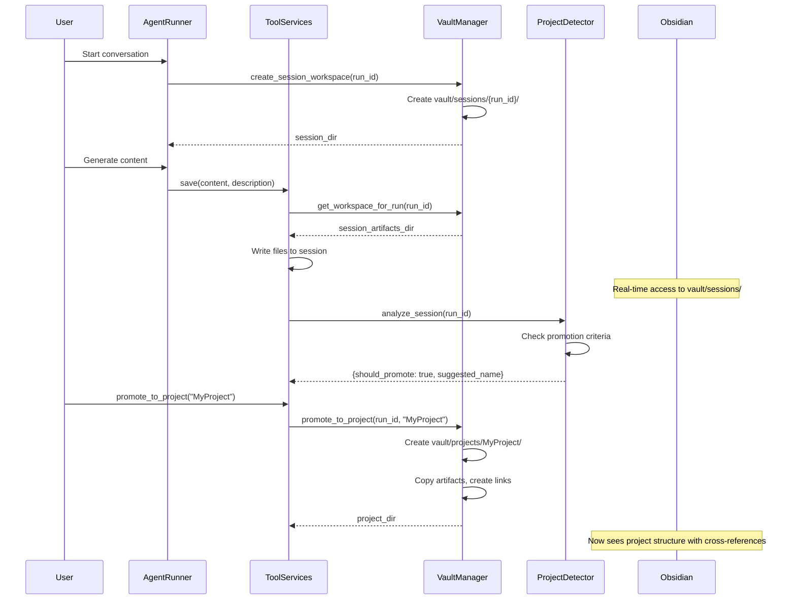
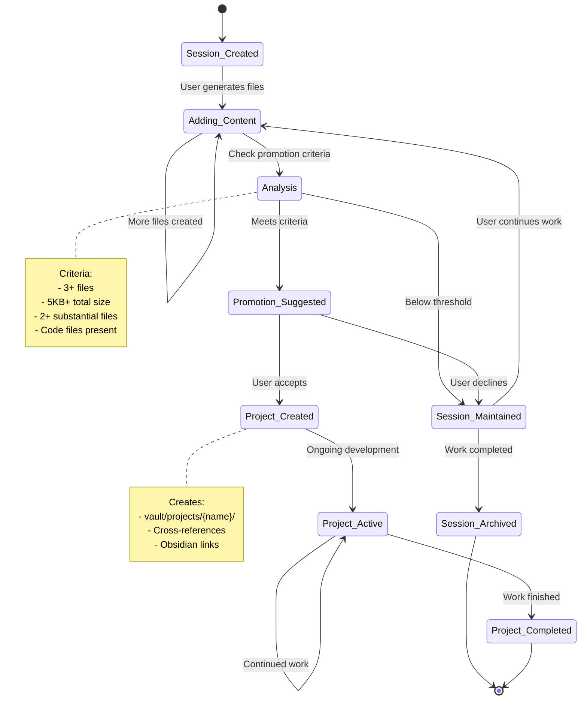
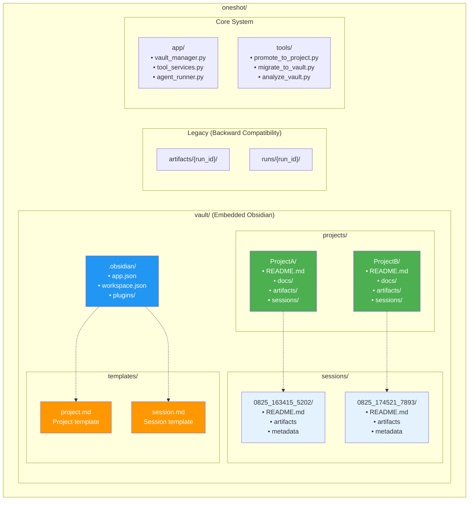
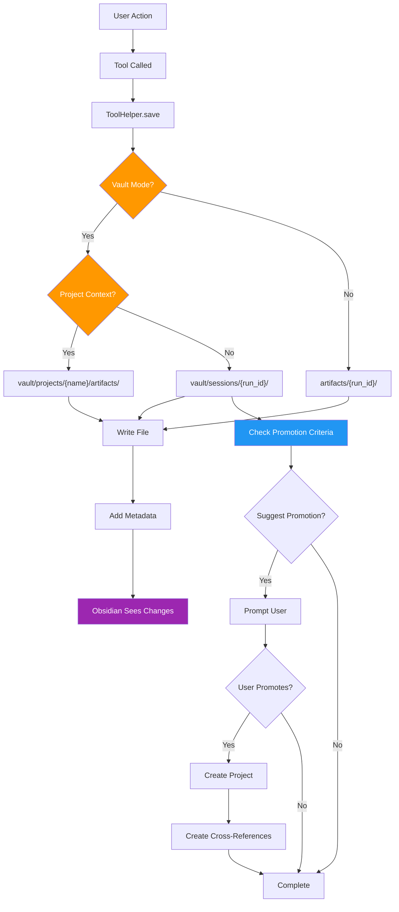

# FINAL Architecture - Embedded Obsidian Vault System

## Executive Summary

**FINAL DECISION**: Implement an embedded Obsidian vault within the oneshot codebase as the primary storage solution. This document provides the comprehensive UML diagrams and architectural specifications for the finalized approach that eliminates export/duplication issues while enhancing knowledge management capabilities.

## Final Architecture Overview

## Class Diagram - Core Components

## Sequence Diagram - Session to Project Workflow

## State Diagram - Content Lifecycle

## Component Diagram - Vault Structure

## Data Flow Diagram - File Operations

## Benefits Analysis

### ✅ Problems Solved
1. **No Duplication**: Single source of truth in embedded vault
2. **IDE Integration**: All files accessible within development environment
3. **Real-time Access**: Obsidian sees changes immediately
4. **Knowledge Management**: Powerful linking, tagging, and graph features
5. **Scalable Organization**: Natural progression from sessions to projects

### ✅ Enhanced Capabilities
1. **Cross-Referencing**: Automatic linking between related content
2. **Search**: Full-text search across all documents
3. **Templates**: Consistent formatting and structure
4. **Plugins**: Access to Obsidian's rich ecosystem
5. **Version Control**: Vault files integrated with Git workflow

### ✅ Future-Proof Design
1. **Backward Compatibility**: Legacy systems remain functional
2. **Gradual Migration**: Users can adopt vault mode when ready
3. **Configuration Toggle**: Easy to enable/disable vault features
4. **Extensible**: Architecture supports future enhancements

## Implementation Priority

### Phase 1: Foundation (Week 1)
- VaultManager class implementation
- Basic vault initialization
- Obsidian configuration setup

### Phase 2: Integration (Week 2)
- ToolHelper vault awareness
- Migration tool for existing content
- Session promotion workflow

### Phase 3: Advanced Features (Week 3)
- Project detection algorithms
- Cross-referencing system
- Vault analysis tools

### Phase 4: Production Ready (Week 4)
- User documentation
- Configuration validation
- Complete testing suite

## Conclusion

The embedded Obsidian vault architecture provides the optimal solution for document organization within the oneshot system. It eliminates the original export/duplication problems while adding powerful knowledge management capabilities that enhance the entire development workflow.

**Result**: A unified system where development artifacts and knowledge management coexist seamlessly within the familiar IDE environment, with optional Obsidian access for advanced knowledge work.