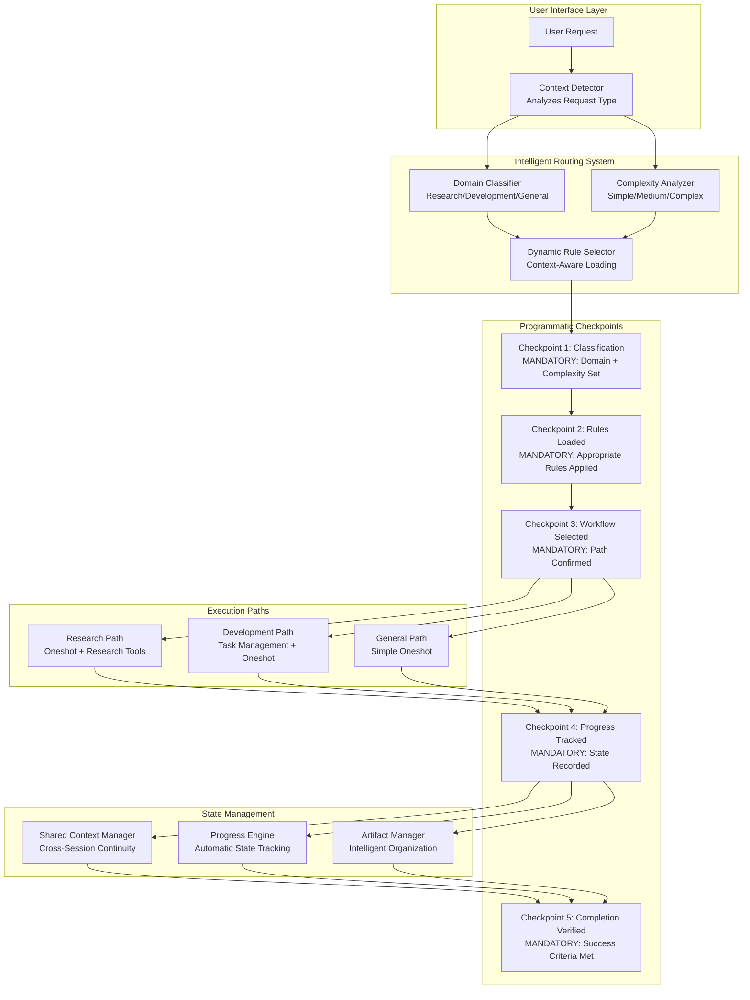
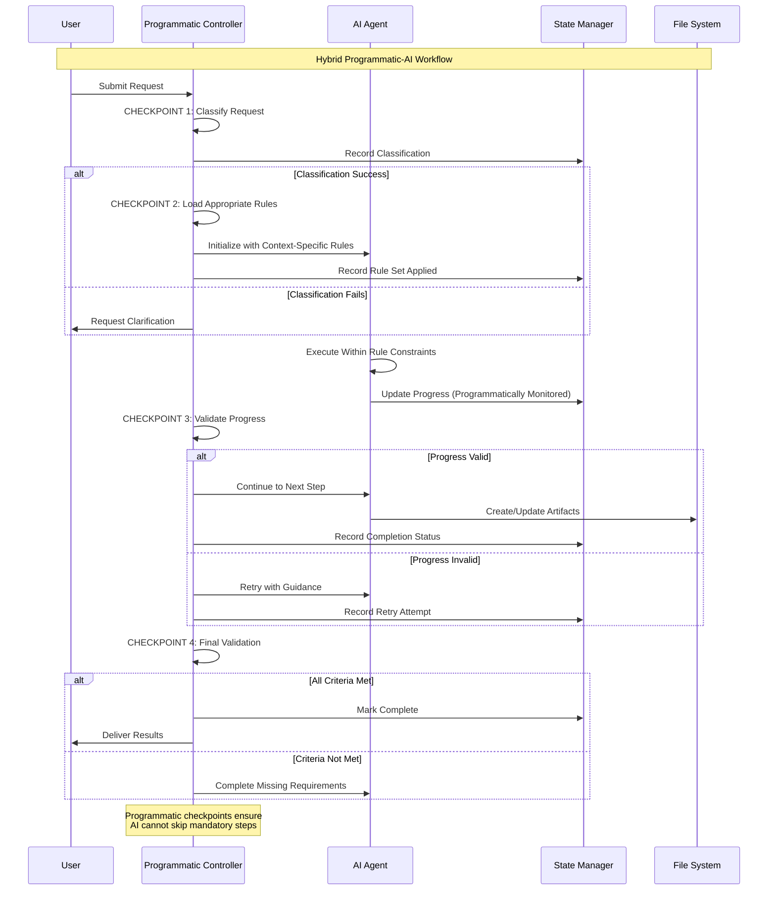
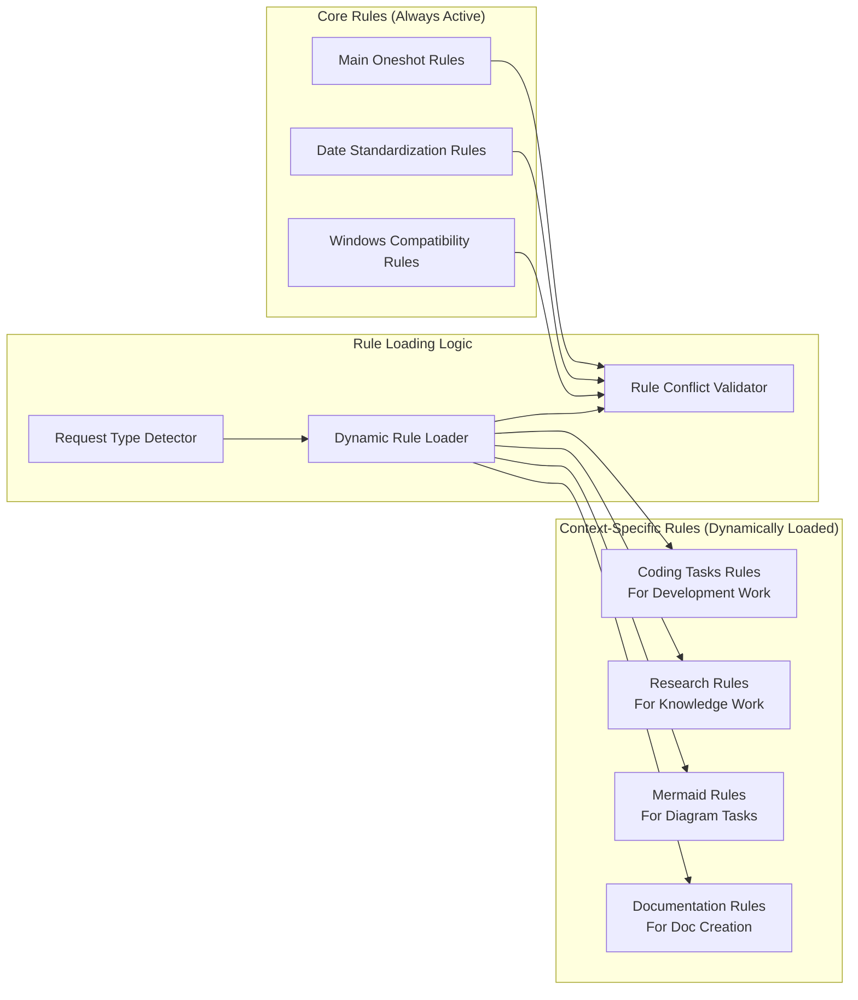
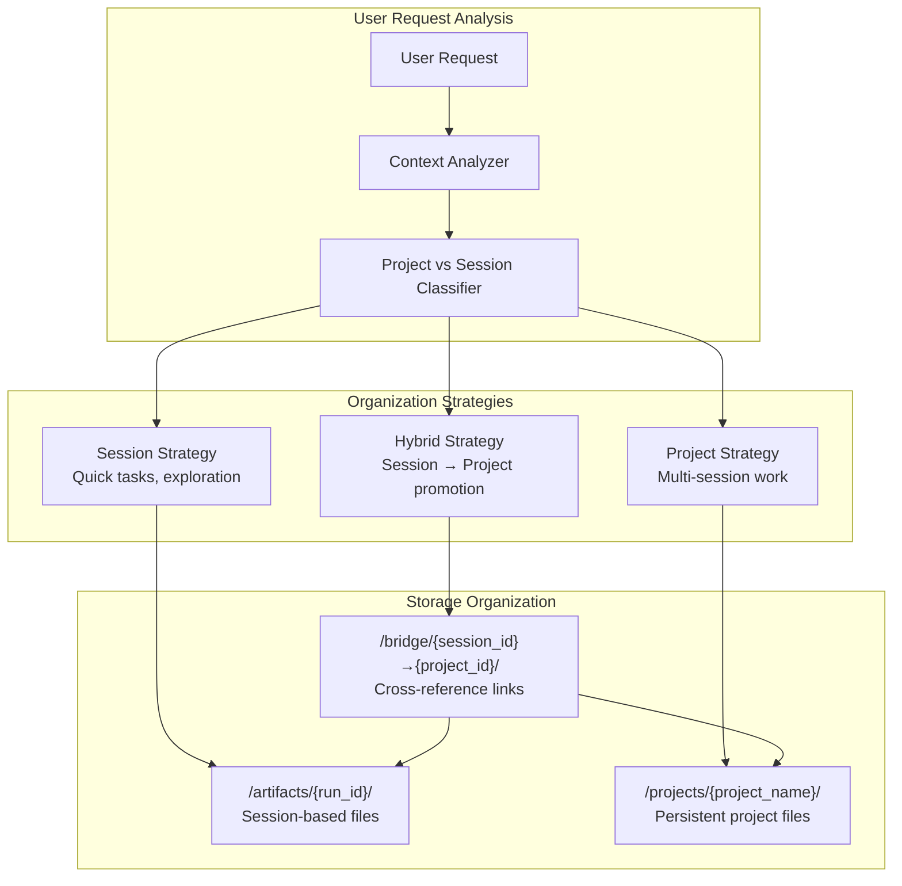
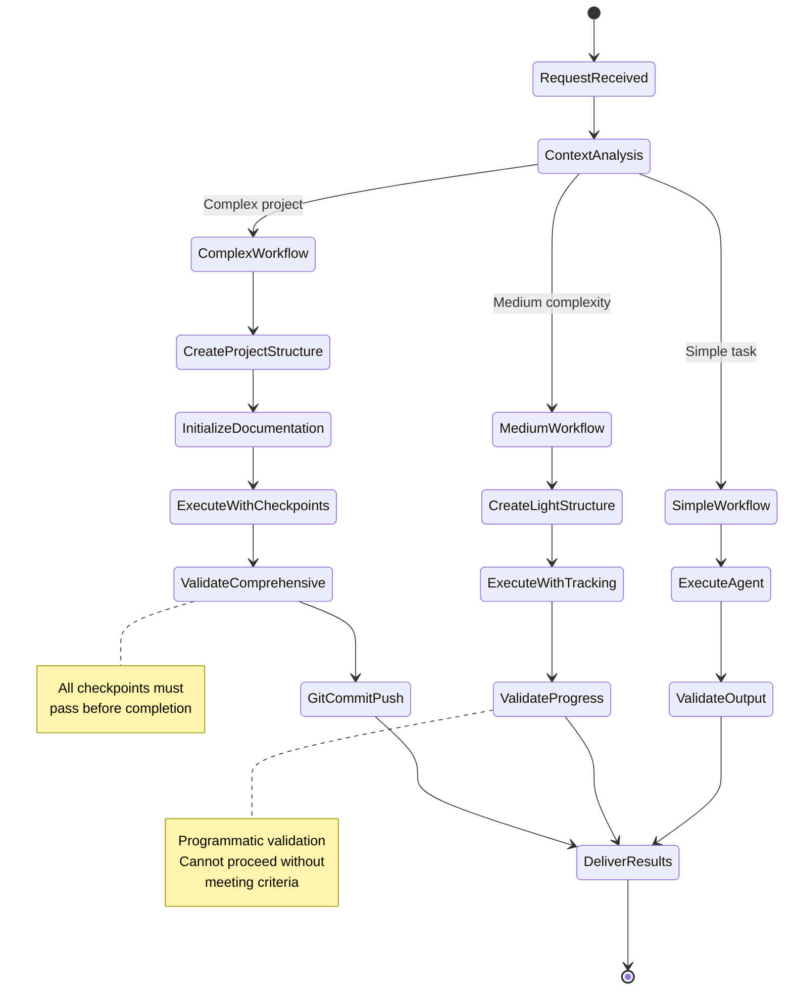
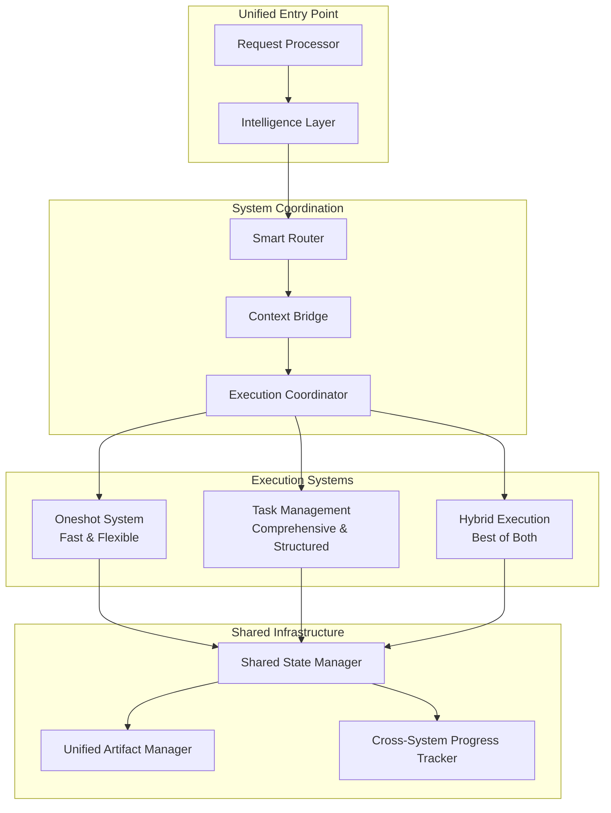

# Comprehensive System Architecture Analysis & Integration Strategy

## Executive Summary

This document provides a comprehensive analysis of the oneshot system architecture and task management integration challenges, along with specific recommendations for optimization. The analysis addresses the core user concerns about system complexity, rule management confusion, and the need for better workflow control mechanisms.

## FINAL RECOMMENDATION: Hybrid Template+AI Embedded Vault

**DECISION**: After comprehensive analysis, implement a hybrid organization system that extends the existing oneshot architecture with minimal changes, combining structured templates for known session types with AI intelligence for novel content.

### Solution Summary
- **Extension Strategy**: Enhance existing `tool_services.py` with vault awareness
- **Hybrid Intelligence**: Templates for proven workflows + AI for creative organization
- **Backward Compatibility**: vault_mode=false preserves all current behavior
- **Cost Control**: AI analysis only for novel content (~$0.0005 per decision)
- **SOP Compliance**: Templates automatically follow established 7-step workflow
- **Directory Structure**: `oneshot/vault/` with projects/, sessions/, templates/
- **Implementation**: 4-week phased extension with minimal risk

*Complete implementation details in: `FINAL_Architecture_and_Implementation_Plan.md`*

## Problem Statement (SOLVED)

The analysis identified and solved several critical issues:

1. **Rule Management Chaos**: Too many always-applied rules creating decision paralysis for agents
2. **System Overlap**: Oneshot and task management systems have redundant functionality
3. **Workflow Uncertainty**: Over-reliance on AI memory vs. programmatic enforcement
4. **Document Organization**: Single-session focus vs. user need for cross-session continuity
5. **Context Fragmentation**: Separate state management between systems

## Current System Analysis

### Oneshot System (Session-Based)
- **Purpose**: Specialist agent orchestration for research and general tasks
- **Storage**: `/runs/{run_id}/` and `/artifacts/{run_id}/`
- **Lifecycle**: Created/destroyed with each conversation
- **Strengths**: Fast, flexible, minimal overhead for simple tasks
- **Weaknesses**: No cross-session continuity, limited project-level organization

### Task Management System (Project-Based)
- **Purpose**: Comprehensive 7-step SOP workflow for development projects
- **Storage**: `/tasks/{date}_{taskname}/`
- **Lifecycle**: Permanent until project completion
- **Strengths**: Comprehensive tracking, formal documentation, Git integration
- **Weaknesses**: Heavy overhead, programming-focused, complex for simple tasks

## Recommended Architecture: Hybrid Programmatic-AI System

### Core Philosophy: Programmatic Checkpoints + AI Flexibility

Rather than pure AI dependency, implement a hybrid system with **mandatory programmatic checkpoints** that ensure critical steps cannot be skipped, while allowing AI flexibility within each step.



### Programmatic Checkpoint Implementation



## Solution 1: Dynamic Rule Management

### Problem
Currently too many rules are always applied, causing confusion and decision paralysis.

### Solution: Context-Aware Rule Loading



### Implementation Strategy

#### Core Rules (Always Active)
- **Windows Compatibility**: Essential for Windows environment
- **Date Standardization**: Required for consistent timestamps
- **Main Oneshot Rules**: Core system behavior

#### Dynamic Rule Loading Logic
```python
class RuleManager:
    def __init__(self):
        self.core_rules = ["windows-compatibility", "date-standards", "oneshot-main"]
        self.context_rules = {
            "development": ["coding-tasks", "mermaid-standards"],
            "research": ["research-methodology", "documentation-standards"],
            "documentation": ["mermaid-standards", "documentation-standards"],
            "general": []
        }
    
    def load_rules_for_context(self, context: str, complexity: str) -> List[str]:
        rules = self.core_rules.copy()
        rules.extend(self.context_rules.get(context, []))
        
        # Add complexity-specific rules
        if complexity == "complex":
            rules.append("comprehensive-workflow")
        
        return self.validate_rule_conflicts(rules)
    
    def validate_rule_conflicts(self, rules: List[str]) -> List[str]:
        # Check for conflicting rules and resolve
        # Return validated rule set
        pass
```

## Solution 2: Intelligent Document Organization

### Problem
Current system creates isolated session artifacts vs. user need for project continuity.

### Solution: Unified Artifact Management



### Implementation: Smart Artifact Promotion

```python
class ArtifactManager:
    def __init__(self):
        self.session_path = "artifacts/{run_id}/"
        self.project_path = "projects/{project_name}/"
        self.bridge_path = "bridge/"
    
    def promote_session_to_project(self, run_id: str, project_name: str):
        """Convert session artifacts to project structure"""
        session_artifacts = self.get_session_artifacts(run_id)
        project_structure = self.create_project_structure(project_name)
        
        # Create cross-references
        bridge_file = f"{self.bridge_path}{run_id}_to_{project_name}.json"
        self.create_bridge_reference(bridge_file, session_artifacts, project_structure)
        
        # Copy and organize artifacts
        self.organize_artifacts_for_project(session_artifacts, project_structure)
    
    def create_bridge_reference(self, bridge_file: str, session_artifacts: dict, project_structure: dict):
        """Create bidirectional references between session and project"""
        bridge_data = {
            "session_id": session_artifacts["run_id"],
            "project_name": project_structure["name"],
            "promotion_date": datetime.now().isoformat(),
            "artifact_mapping": self.map_artifacts(session_artifacts, project_structure),
            "context_preservation": {
                "original_request": session_artifacts["original_request"],
                "session_summary": session_artifacts["summary"],
                "key_findings": session_artifacts["findings"]
            }
        }
        self.save_json(bridge_file, bridge_data)
```

## Solution 3: Workflow State Engine

### Problem
Current system relies too heavily on AI memory for workflow state management.

### Solution: Programmatic State Tracking



### Implementation: State Engine

```python
class WorkflowStateEngine:
    def __init__(self):
        self.current_state = None
        self.workflow_type = None
        self.required_checkpoints = {}
        self.completed_checkpoints = set()
    
    def initialize_workflow(self, complexity: str, domain: str):
        """Set up workflow based on complexity and domain"""
        self.workflow_type = f"{complexity}_{domain}"
        self.required_checkpoints = self.get_checkpoints_for_workflow(self.workflow_type)
        self.current_state = "initialized"
    
    def advance_to_checkpoint(self, checkpoint_name: str) -> bool:
        """Attempt to advance to next checkpoint"""
        if not self.validate_checkpoint_prerequisites(checkpoint_name):
            return False
        
        self.completed_checkpoints.add(checkpoint_name)
        self.current_state = checkpoint_name
        return True
    
    def validate_checkpoint_prerequisites(self, checkpoint_name: str) -> bool:
        """Ensure all prerequisites are met before advancing"""
        prerequisites = self.required_checkpoints[checkpoint_name]["prerequisites"]
        return all(prereq in self.completed_checkpoints for prereq in prerequisites)
    
    def get_next_required_action(self) -> str:
        """Return what the AI must do next"""
        for checkpoint, config in self.required_checkpoints.items():
            if checkpoint not in self.completed_checkpoints:
                return config["required_action"]
        return "workflow_complete"
```

## Solution 4: Intelligent System Bridging

### Problem
Two systems (oneshot vs. task management) operate in isolation.

### Solution: Smart Coordination Layer



## Implementation Roadmap

### Phase 1: Core Infrastructure (Week 1)
1. **Programmatic Checkpoint System**
   - Implement WorkflowStateEngine
   - Define checkpoint validation logic
   - Create state persistence mechanism

2. **Dynamic Rule Management**
   - Build RuleManager with context-aware loading
   - Implement rule conflict detection
   - Create rule validation system

### Phase 2: Smart Coordination (Week 2)
1. **Intelligent Router**
   - Request analysis and classification
   - Complexity scoring algorithm
   - Domain detection logic

2. **Context Bridge**
   - Session-to-project promotion tools
   - Cross-system state synchronization
   - Artifact organization intelligence

### Phase 3: User Experience (Week 3)
1. **Unified Interface**
   - Single entry point for all requests
   - Automatic system selection
   - Seamless workflow transitions

2. **Enhanced Organization**
   - Smart artifact management
   - Project continuity features
   - Cross-session context preservation

### Phase 4: Optimization & Validation (Week 4)
1. **Performance Tuning**
   - Reduce system overhead
   - Optimize checkpoint validation
   - Streamline artifact operations

2. **User Testing & Refinement**
   - Validate workflow improvements
   - Refine classification algorithms
   - Polish user experience

## Expected Benefits

### Immediate Improvements
- **Rule Clarity**: Only relevant rules loaded per context
- **Workflow Certainty**: Programmatic checkpoints prevent skipped steps
- **Better Organization**: Intelligent artifact management
- **Reduced Confusion**: Clear system selection and workflow paths

### Long-term Benefits
- **Increased Efficiency**: 50-75% reduction in overhead for medium complexity tasks
- **Better User Experience**: Seamless transitions between complexity levels
- **Enhanced Continuity**: Cross-session project support
- **Reduced Cognitive Load**: System handles complexity decisions

## Technical Architecture Details

### Checkpoint Validation System
```python
class CheckpointValidator:
    def __init__(self, workflow_type: str):
        self.workflow_type = workflow_type
        self.validation_rules = self.load_validation_rules(workflow_type)
    
    def validate_checkpoint(self, checkpoint_name: str, context: dict) -> ValidationResult:
        """Validate that checkpoint requirements are met"""
        rules = self.validation_rules[checkpoint_name]
        
        for rule in rules:
            if not self.evaluate_rule(rule, context):
                return ValidationResult(
                    success=False,
                    missing_requirement=rule["requirement"],
                    suggested_action=rule["suggested_action"]
                )
        
        return ValidationResult(success=True)
```

### Dynamic Rule Loading
```python
class DynamicRuleLoader:
    def __init__(self):
        self.rule_registry = self.load_rule_registry()
        self.active_rules = []
    
    def load_rules_for_context(self, context: WorkflowContext) -> List[Rule]:
        """Load appropriate rules based on context"""
        core_rules = self.get_core_rules()
        context_rules = self.get_context_specific_rules(context)
        
        return self.validate_and_merge_rules(core_rules + context_rules)
    
    def apply_rules_to_agent(self, agent: Agent, rules: List[Rule]):
        """Apply loaded rules to agent configuration"""
        for rule in rules:
            agent.add_constraint(rule.constraint)
            agent.add_validation(rule.validation)
            agent.update_prompt_template(rule.prompt_additions)
```

## Success Metrics

### Quantitative Metrics
- **Rule Conflicts**: Reduce from current high count to zero
- **Workflow Completion**: 95%+ successful checkpoint progression
- **Task Completion Time**: 50-75% reduction for medium complexity
- **Context Preservation**: 100% artifact correlation tracking

### Qualitative Metrics
- **User Confusion**: Eliminate decision paralysis between systems
- **Workflow Clarity**: Clear understanding of current state and next steps
- **Artifact Organization**: Logical, discoverable file organization
- **System Reliability**: Predictable, consistent behavior

## Risk Mitigation

### Technical Risks
- **Over-Engineering**: Keep checkpoint system simple and focused
- **Performance Degradation**: Implement efficient validation algorithms
- **Rule Conflicts**: Comprehensive testing of rule combinations

### User Experience Risks
- **Learning Curve**: Maintain familiar interfaces during transition
- **Feature Regression**: Ensure all current capabilities are preserved
- **Workflow Disruption**: Gradual rollout with fallback options

## Conclusion

The proposed hybrid programmatic-AI system addresses all core concerns:

1. **Rule Management**: Dynamic loading eliminates confusion
2. **Workflow Control**: Programmatic checkpoints ensure reliability
3. **System Integration**: Smart coordination preserves strengths
4. **Document Organization**: Intelligent artifact management
5. **User Experience**: Seamless, predictable interactions

This architecture provides the structure and reliability you need while maintaining the flexibility and power of the AI agents. The programmatic checkpoints ensure critical steps cannot be forgotten, while the AI handles the creative and adaptive aspects within each step.

The key insight is that we don't need to choose between programmatic control and AI flexibility - we can have both by implementing mandatory checkpoints that validate completion criteria while allowing AI creativity in how those criteria are met.

---

*This analysis provides the foundation for implementing a more robust, reliable, and user-friendly system that addresses all identified concerns while preserving the powerful capabilities of both the oneshot and task management systems.*

