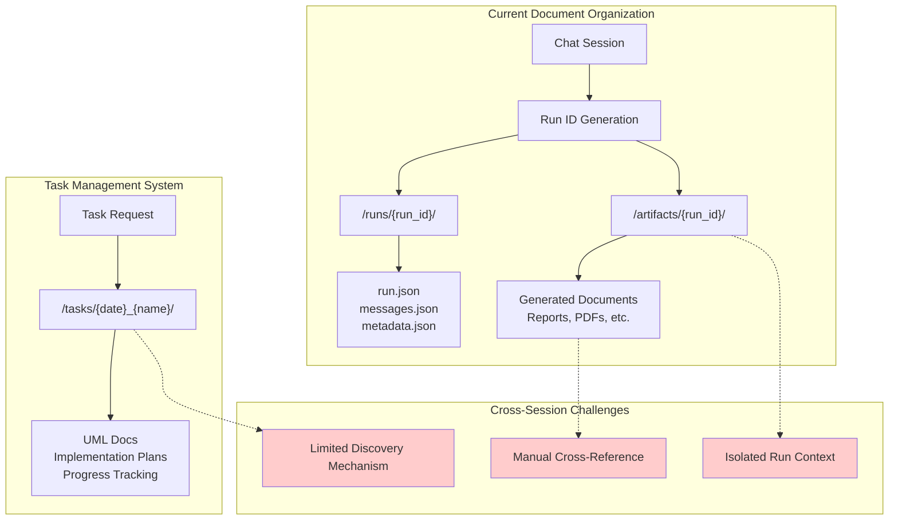

# Development Progress Tracker - GlobalDocs System Analysis

## Task Overview

**Objective**: Analyze the current oneshot system and task management system interactions, identifying optimization opportunities and document organization strategies.

**Key Focus Areas**:
- System architecture analysis
- Performance optimization opportunities  
- Document generation and organization from chat sessions
- Mermaid diagram syntax standardization
- Cross-session information persistence

## Progress Log

### 2025-08-25 - Mermaid Diagram Fixes & Document Organization Analysis

#### 13:30 - Mermaid Syntax Error Resolution
**Status**: ✅ **COMPLETED**

- **Fixed 3 Mermaid syntax errors** across multiple files:
  1. `MASTER_Architecture_UMLs_GlobalDocs_System_Analysis.md` - Workflow Efficiency Analysis
  2. `system_optimization_analysis.md` - Performance Impact Assessment  
  3. `refined_integration_strategy.md` - Context-Aware Routing

- **Root Cause**: Flowcharts don't support `note right of` syntax (state diagrams do)
- **Solution**: Replaced with dotted connections (`-.->`) to separate nodes using pipe `|` for line breaks
- **Additional Fix**: Replaced curly braces `{}` with parentheses `()` to avoid syntax conflicts

#### 13:25 - Updated Mermaid Rule Documentation
**Status**: ✅ **COMPLETED**

- **Condensed mermaid-rule.mdc** from 151 lines to 43 lines
- **Enhanced clarity** with diagram-specific syntax rules
- **Added key insight**: Flowcharts vs state diagrams note syntax difference
- **Improved actionability** with quick error fixes list

#### 13:20 - Document Organization System Analysis
**Status**: 🟡 **IN PROGRESS**

**Key Question Addressed**: "How does the current system organize information and keep it available for users across multiple sessions?"

**Current System Analysis**:

**Findings**:

1. **Session-Based Organization**: Each chat creates isolated `run_id` with separate artifact folders
2. **Task-Based Organization**: Development tasks create structured project folders
3. **Discovery Gap**: No unified system for finding/reusing documents across sessions
4. **Context Preservation**: Strong within-session, weak across-sessions

**Critical Issues Identified**:
- Users can't easily find documents from previous sessions
- No cross-session knowledge accumulation
- Limited artifact promotion from sessions to projects
- Manual effort required to link related work

#### Next Steps - Document Organization Enhancement

**Proposed Solutions**:

1. **Artifact Discovery System**: Create indexing for cross-session document discovery
2. **Context Bridging**: Enable promotion of session artifacts to project-level documentation
3. **Knowledge Accumulation**: Implement cross-session learning and reference systems
4. **Unified Search**: Enable finding documents regardless of creation context

## Completion Status

### Core Analysis Tasks
- [x] System architecture documentation
- [x] Performance bottleneck identification
- [x] Integration opportunity analysis
- [x] Mermaid diagram syntax standardization
- [x] Document organization system analysis
- [ ] Cross-session persistence strategy design
- [ ] Implementation roadmap creation

### Documentation Tasks  
- [x] Master Architecture UMLs
- [x] System optimization analysis
- [x] Refined integration strategy
- [x] Mermaid rule updates
- [x] Development progress tracking
- [ ] Final recommendations document

### Technical Tasks
- [x] Mermaid syntax error fixes
- [x] Diagram standards enforcement
- [ ] Cross-session artifact linking prototype
- [ ] Discovery mechanism design

## Testing & Validation

### Completed Tests
- [x] Mermaid diagram rendering validation
- [x] Syntax error elimination verification

### Pending Tests
- [ ] Cross-session document discovery testing
- [ ] Artifact promotion workflow testing
- [ ] Performance impact measurement

## Key Insights & Lessons Learned

### 2025-08-25 Session
1. **Mermaid Syntax**: Flowcharts and state diagrams have different note syntax requirements
2. **Documentation Quality**: Consistent syntax checking prevents rendering failures
3. **System Complexity**: Current document organization serves different use cases but lacks bridging
4. **User Experience Gap**: Strong session-level organization, weak cross-session discovery

### Technical Discoveries
- Flowchart `note right of` syntax causes parse errors - use dotted connections instead
- Curly braces `{}` in node text conflict with Mermaid syntax - use parentheses `()`
- Current artifact system well-designed for session isolation but lacks cross-session integration

## Next Actions Required

1. **Immediate**: Complete cross-session persistence strategy design
2. **Short-term**: Create implementation roadmap for document organization enhancement
3. **Medium-term**: Prototype artifact discovery and promotion mechanisms

---

*Last Updated: 2025-08-25T13:33:37.293Z*
*Status: In Progress - Document Organization Analysis Phase*
