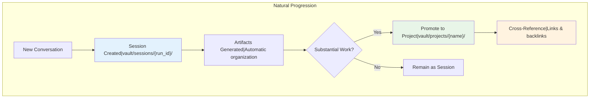

# Hybrid Template+AI Organization Strategy - Embedded Vault System

## Executive Summary

**DECISION FINALIZED**: After comprehensive analysis, the optimal solution combines **structured templates for proven workflows** with **AI intelligence for novel content**, all within an embedded Obsidian vault that extends the existing oneshot system with minimal changes.

This hybrid strategy provides:

1. **Best of Both Worlds** - Template reliability + AI creativity
2. **Minimal Implementation Risk** - Extends existing `tool_services.py` rather than replacing
3. **Backward Compatibility** - vault_mode=false preserves all current behavior  
4. **SOP Compliance** - Templates automatically follow established 7-step workflow
5. **Cost-Effective AI** - GPT-5 Nano at ~$0.0005 per analysis for novel content only
6. **Flexible & Extensible** - Easy to add new templates and validation rules

## Final Architecture

### Directory Structure
```
oneshot/
├── vault/                          # NEW: Embedded Obsidian vault
│   ├── .obsidian/                 # Vault configuration
│   ├── projects/                  # Long-lived projects
│   │   └── {ProjectName}/
│   │       ├── docs/              # Project documentation
│   │       ├── artifacts/         # Generated files
│   │       └── README.md          # Project overview
│   ├── sessions/                  # Individual conversations
│   │   └── {run_id}/              # Session artifacts
│   └── templates/                 # Obsidian templates
├── artifacts/                     # LEGACY: Backward compatibility
└── runs/                          # LEGACY: Conversation history
```

### Workflow Pattern


## Key Benefits

### ✅ Solves Original Problems
- **No Duplication**: Files exist in one location only
- **No Export Management**: Obsidian reads files directly
- **IDE Accessible**: All files remain in workspace
- **Real-time Sync**: Changes visible immediately in both environments

### ✅ Enhanced Capabilities
- **Knowledge Graph**: Obsidian's graph view shows connections
- **Powerful Search**: Full-text search across all content
- **Tagging System**: Organize by tags (#oneshot, #project, #session)
- **Templates**: Consistent formatting and structure
- **Plugin Ecosystem**: Access to Obsidian's rich features

### ✅ Development Workflow
- **Version Control**: Vault files committed to Git
- **Collaboration**: Team members can access via Obsidian
- **Backup**: Integrated with existing backup strategies
- **Portability**: Entire knowledge base travels with codebase

## Implementation Summary

### Phase 1: Foundation
- Create `VaultManager` class
- Set up vault initialization
- Configure Obsidian settings
- Test basic functionality

### Phase 2: Integration  
- Update `ToolHelper` for vault awareness
- Create migration tool for existing content
- Implement session promotion workflow
- Update key tools

### Phase 3: Advanced Features
- Project detection algorithms
- Cross-referencing system
- Vault analysis tools
- Optimization recommendations

### Phase 4: Polish
- User documentation
- Configuration validation
- Complete testing
- Production readiness

## User Experience

### Simple Usage
```python
# Conversations automatically create sessions
# Files saved to vault/sessions/{run_id}/

# When work becomes substantial:
promote_to_project("MyProject", "Description")
# Files moved to vault/projects/MyProject/
```

### Obsidian Access
1. Open Obsidian
2. "Open folder as vault"
3. Select `oneshot/vault/`
4. Immediate access to all content with full knowledge management features

### Natural Evolution
- **Exploratory work** stays in sessions
- **Substantial projects** get promoted automatically or manually
- **Cross-references** build knowledge graph naturally
- **Templates** ensure consistency
- **Search and tags** enable powerful discovery

## Conclusion

The embedded vault approach provides the optimal balance of convenience, power, and integration. It eliminates the original export/duplication problem while adding sophisticated knowledge management capabilities that enhance the entire oneshot development workflow.

**Result**: A unified system where development artifacts and knowledge management coexist seamlessly within the familiar IDE environment, with optional Obsidian access for advanced knowledge work.