# Hardcoded vs Dynamic Elements - Complete Breakdown

## Overview

This document provides a **comprehensive breakdown** of what elements are hardcoded (predictable/template-driven) versus what is dynamically generated by AI in the hybrid organization system.

## 🔧 HARDCODED ELEMENTS (Template-Driven)

### **Session Type Detection Patterns**
```python
# HARDCODED: Session type detection logic
TYPE_PATTERNS = {
    "coding_development": {
        "keywords": ["code", "fix", "bug", "implement", "function", "class", "debug"],
        "context_clues": ["programming", "software", "development", "troubleshooting"],
        "confidence_threshold": 0.7,
        "template": "SOP_7_Step"
    },
    "research": {
        "keywords": ["research", "analyze", "study", "investigate", "literature"],
        "context_clues": ["academic", "paper", "methodology", "findings"],
        "confidence_threshold": 0.75,
        "template": "Academic_Structure"
    },
    "documentation": {
        "keywords": ["document", "write", "guide", "manual", "instructions"],
        "context_clues": ["documentation", "tutorial", "how-to"],
        "confidence_threshold": 0.8,
        "template": "Technical_Writing"
    }
}
```

### **SOP Template Structure (Coding/Troubleshooting)**
```
🔧 HARDCODED: Required Files
├── README.md                           # Always created
├── MASTER_Architecture_UMLs_{Task}.md  # SOP Step 2 requirement
├── implementation-plan_{Task}.md       # SOP planning
├── development-progress-tracker.md     # SOP progress tracking
├── troubleshooting_{Task}.md           # Issue analysis
├── completion-summary_{Task}.md        # SOP final step
├── subtasks/                           # SOP requirement for complex tasks
│   ├── 01_{subtask_name}.md            # Numbered format required
│   ├── 02_{subtask_name}.md            # Sequential organization
│   └── 03_{subtask_name}.md            # Progressive numbering
└── tests/                              # SOP testing requirement
    ├── test_{feature}.py               # Testing format
    └── test_results.md                 # Results documentation
```

### **File Naming Conventions**
```python
# UPDATED: Consistent naming patterns with human-readable sessions
NAMING_PATTERNS = {
    "session_directories": "{topic_keywords}_{YYYY_MMDD}_{HHMMSS}",  # UPDATED: Human-readable
    "session_fallback": "{MMDD}_{HHMMSS}_{UUID}",                   # Fallback pattern
    "project_directories": "{project_name_snake_case}",
    "master_architecture": "MASTER_Architecture_UMLs_{TaskName}.md",
    "implementation_plan": "implementation-plan_{TaskName}.md", 
    "progress_tracker": "development-progress-tracker.md",
    "subtasks": "01_{subtask_name}.md, 02_{subtask_name}.md, ...",
    "test_files": "test_{feature_name}.py"
}
```

### **Frontmatter Structure**
```yaml
# UPDATED: Required metadata fields with session naming support
---
title: "REQUIRED"              # Always present
date: "REQUIRED"               # ISO format timestamp
session_id: "REQUIRED"         # Human-readable session identifier
run_id: "REQUIRED"             # Original technical run ID
task: "REQUIRED"               # Task name
status: "REQUIRED"             # Status tracking
priority: "REQUIRED"           # Priority level
organization_method: "REQUIRED" # template|ai_generated|hybrid
template_used: "OPTIONAL"     # Only for template sessions
ai_model: "OPTIONAL"           # Only for AI sessions
cost_analysis: "OPTIONAL"     # Only for AI sessions
topic_extraction: "OPTIONAL"  # Method used for topic extraction
tags: "REQUIRED"               # Array of tags
---
```

### **Directory Structure Requirements**
```python
# HARDCODED: Vault organization
VAULT_STRUCTURE = {
    "vault/": "Root vault directory",
    "vault/.obsidian/": "Obsidian configuration",
    "vault/projects/": "Long-lived projects",
    "vault/sessions/": "Individual conversations", 
    "vault/templates/": "Obsidian note templates"
}

# HARDCODED: Legacy compatibility
LEGACY_STRUCTURE = {
    "artifacts/{run_id}/": "Preserved when vault_mode=false",
    "runs/{run_id}/": "Conversation history (unchanged)",
    "tasks/{date}_{name}/": "Manual task workspaces (preserved)"
}
```

## 🤖 AI-GENERATED ELEMENTS (Dynamic Content)

### **Content Analysis & Organization**
```python
# AI-GENERATED: Dynamic content analysis
def ai_content_analysis(content, context):
    """
    🤖 AI analyzes content for:
    - Domain identification (e.g., urban planning + IoT + permaculture)
    - Complexity assessment (interdisciplinary score)
    - Optimal organization strategy (thematic, sequential, hierarchical)
    - Specific folder/file structure design
    - Cross-reference identification
    """
    return {
        "suggested_folders": ["concept-framework/", "technical-analysis/"],
        "file_recommendations": ["core-vision.md", "iot-requirements.md"],
        "organization_rationale": "Multi-dimensional thematic clustering",
        "cross_references": [["concept-framework/", "technical-analysis/"]],
        "estimated_cost": 0.0005
    }
```

### **Novel Content Organization Examples**

#### **Creative Session (AI-Generated Structure)**
```
🤖 AI-DESIGNED: Urban Garden Project
├── concept-framework/                  # AI identified foundational layer
│   ├── core-vision.md                  # AI determined vision needed
│   └── sustainability-principles.md    # AI connected sustainability
├── technical-analysis/                 # AI separated technical concerns
│   ├── iot-sensor-requirements.md      # AI identified IoT complexity
│   └── smart-irrigation-systems.md     # AI found automation need
├── community-engagement/               # AI detected social dimension
│   └── stakeholder-mapping.md          # AI emphasized community
└── cross-cutting-considerations/       # AI recognized interconnections
    ├── policy-regulatory-landscape.md  # AI identified governance
    └── economic-sustainability.md      # AI found financial concerns
```

### **AI Decision Process**
```json
{
  "ai_analysis_steps": {
    "step_1_content_categorization": {
      "domains_identified": ["urban_planning", "permaculture", "iot", "community"],
      "complexity_score": 0.95,
      "interdisciplinary": true
    },
    "step_2_organization_strategy": {
      "rejected_approaches": ["sequential", "alphabetical", "chronological"],
      "selected_approach": "multi_dimensional_thematic",
      "rationale": "Content spans multiple domains requiring thematic clustering"
    },
    "step_3_structure_design": {
      "folder_hierarchy": "content-driven categorization",
      "file_naming": "descriptive and specific to domain",
      "cross_references": "natural content relationships identified"
    }
  }
}
```

## ⚙️ HYBRID ELEMENTS (Template + Heuristic/AI)

### **Session Naming Generation**
```python
# HYBRID: Template creates structure, heuristics/AI fills meaningful content
def generate_session_name(run_id: str, context: str = None) -> str:
    if context:
        # ⚙️ HEURISTIC EXTRACTION: Simple but effective topic identification
        topic_keywords = extract_topic_keywords_heuristic(context)
        if topic_keywords:
            # 🔧 HARDCODED: Template timestamp format with year
            timestamp = datetime.now().strftime("%Y_%m%d_%H%M%S")
            return f"{topic_keywords}_{timestamp}"
    
    # 🔧 HARDCODED: Fallback to original format
    return run_id

def extract_topic_keywords_heuristic(content: str) -> str:
    """Heuristic-based topic extraction (current implementation)"""
    content_words = content.lower().split()
    stop_words = {'the', 'a', 'an', 'and', 'or', 'but', 'in', 'on', 'at', 'to', 'for', 'of', 'with', 'by'}
    meaningful_words = [word for word in content_words[:10] if word not in stop_words and len(word) > 2]
    return '_'.join(meaningful_words[:3]) if meaningful_words else None
```

### **Subtask Generation**
```python
# HYBRID: Template creates structure, AI fills content
def generate_subtasks(task_name, content, template_type):
    if template_type == "SOP_7_Step":
        # 🔧 HARDCODED: Template creates numbered structure
        structure = ["01_{name}.md", "02_{name}.md", "03_{name}.md"]
        
        # 🤖 AI-GENERATED: Specific subtask names based on content
        ai_analysis = analyze_content_for_subtasks(content)
        subtask_names = ai_analysis.get("subtask_names", [
            "issue_investigation", "solution_design", "implementation"
        ])
        
        # ⚙️ HYBRID: Combine template structure + AI content
        return [
            f"01_{subtask_names[0]}.md",  # "01_jwt_investigation.md"
            f"02_{subtask_names[1]}.md",  # "02_token_validation_fix.md"
            f"03_{subtask_names[2]}.md"   # "03_testing_validation.md"
        ]
```

### **Cross-Reference Generation**
```python
# HYBRID: Template provides linking mechanism, AI determines connections
def generate_cross_references(session_files, content_analysis):
    # 🔧 HARDCODED: Obsidian double-bracket linking format
    link_format = "[[{target}]]"
    
    # 🤖 AI-GENERATED: Relevant connections based on content analysis
    ai_connections = content_analysis.get("related_concepts", [])
    
    # ⚙️ HYBRID: Apply template format to AI-identified connections
    return [link_format.format(target=connection) for connection in ai_connections]
```

### **Project Promotion Logic**
```python
# HYBRID: Template defines promotion criteria, AI analyzes content
def analyze_for_promotion(session_id, session_content):
    # 🔧 HARDCODED: Promotion thresholds
    PROMOTION_THRESHOLDS = {
        "file_count": 8,
        "complexity_score": 0.7,
        "effort_hours": 16,
        "cross_system_impact": True
    }
    
    # 🤖 AI-GENERATED: Content analysis
    ai_analysis = analyze_session_complexity(session_content)
    
    # ⚙️ HYBRID: Compare AI analysis against hardcoded thresholds
    should_promote = all([
        ai_analysis["file_count"] > PROMOTION_THRESHOLDS["file_count"],
        ai_analysis["complexity"] > PROMOTION_THRESHOLDS["complexity_score"],
        ai_analysis["estimated_effort"] > PROMOTION_THRESHOLDS["effort_hours"],
        ai_analysis["cross_system_impact"] == PROMOTION_THRESHOLDS["cross_system_impact"]
    ])
    
    return {
        "should_promote": should_promote,
        "confidence": ai_analysis["confidence"],
        "reasoning": ai_analysis["promotion_rationale"]
    }
```

## Decision Flow Summary

```mermaid
flowchart TD
    INPUT[User Content] --> DETECT[Session Type Detection]
    
    DETECT --> HIGH_CONF{Confidence >= 0.7?}
    
    HIGH_CONF -->|Yes| TEMPLATE[🔧 Apply Template]
    HIGH_CONF -->|No| AI_ANALYZE[🤖 AI Analysis]
    
    TEMPLATE --> STRUCT[🔧 Hardcoded Structure]
    AI_ANALYZE --> CREATIVE[🤖 Creative Structure]
    
    STRUCT --> CONTENT[⚙️ Hybrid Content]
    CREATIVE --> CONTENT
    
    CONTENT --> CROSS_REF[⚙️ Hybrid Cross-References]
    CROSS_REF --> PROMOTE{🤖 Promotion Analysis}
    
    PROMOTE -->|Yes| PROJECT[⚙️ Hybrid Project]
    PROMOTE -->|No| SESSION[Session Complete]
    
    style TEMPLATE fill:#4caf50
    style AI_ANALYZE fill:#ff9800
    style CONTENT fill:#2196f3
    style PROJECT fill:#9c27b0
```



## Cost & Performance Summary

| Element Type | Source | Cost | Speed | Predictability |
|--------------|--------|------|--------|----------------|
| **Template Structure** | 🔧 Hardcoded | $0 | Instant | 100% |
| **Heuristic Topic Extraction** | ⚙️ Heuristic | $0 | Instant | High |
| **AI Content Analysis** | 🤖 Dynamic | ~$0.0005 | 5-10s | Variable |
| **Hybrid Organization** | ⚙️ Both | ~$0.0003 | 3-7s | High |
| **Cross-References** | ⚙️ Both | ~$0.0001 | 1-2s | High |
| **Promotion Analysis** | ⚙️ Both | ~$0.0002 | 2-3s | High |

**Updated Cost Estimate**: 
- **Current Implementation**: $0-2/day (heuristic extraction is free)
- **Future LLM Enhancement**: $2-5/day (when LLM-based topic extraction is enabled)
