# MASTER Architecture UMLs - JWT Authentication Fix

## 🔧 DOCUMENT STATUS: TEMPLATE-GENERATED Structure + AI Content

**File Creation**: 🔧 HARDCODED (SOP Step 2 requirement)
**Content Generation**: 🤖 AI-GENERATED (Technical analysis)
**Structure**: ⚙️ HYBRID (Template outline + AI specifics)

## Authentication Flow Analysis

### Current vs Proposed Authentication Flow

```mermaid
sequenceDiagram
    participant User
    participant Frontend
    participant AuthService
    participant JWTValidator
    participant Database
    
    Note over User,Database: CURRENT (Broken) Flow
    
    User->>Frontend: Login credentials
    Frontend->>AuthService: POST /auth/login
    AuthService->>Database: Validate user
    Database-->>AuthService: User valid
    AuthService->>JWTValidator: Generate token
    
    Note over JWTValidator: 🔴 BUG: Expires immediately
    JWTValidator-->>AuthService: Token (exp: now)
    
    AuthService-->>Frontend: {token, expires_in: 0}
    Frontend-->>User: Login success (but token invalid)
    
    Note over User,Database: PROPOSED (Fixed) Flow
    
    User->>Frontend: Login credentials  
    Frontend->>AuthService: POST /auth/login
    AuthService->>Database: Validate user
    Database-->>AuthService: User valid
    AuthService->>JWTValidator: Generate token (proper expiry)
    
    Note over JWTValidator: ✅ FIX: 24h expiration
    JWTValidator-->>AuthService: Token (exp: +24h)
    
    AuthService-->>Frontend: {token, expires_in: 86400}
    Frontend-->>User: Login success (token valid)
```

## Class Diagram - Authentication Components

## Root Cause Analysis Diagram

## Implementation Priority Diagram

## 🎯 Template vs AI Breakdown

### 🔧 HARDCODED (Template Requirements)
- **Document Title Format**: "MASTER Architecture UMLs - {TaskName}"
- **Required Sections**: Current vs Proposed, Class Diagram, Root Cause Analysis
- **File Location**: Session root directory
- **Frontmatter Structure**: Standard metadata fields

### 🤖 AI-GENERATED (Technical Content)
- **Specific Bug Analysis**: AI identified JWT expiry configuration issue
- **UML Diagram Details**: AI analyzed authentication flow and components
- **Root Cause Discovery**: AI traced issue to defaultExpiry = 0
- **Technical Solutions**: AI proposed specific fixes and implementation steps

### ⚙️ HYBRID (Template + AI)
- **Diagram Types**: Template requires diagrams, AI determines specific types needed
- **Implementation Phases**: Template suggests phased approach, AI determines priorities
- **Cross-References**: Template creates linking structure, AI determines relevant connections
