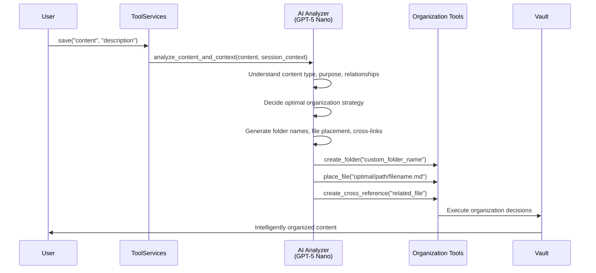
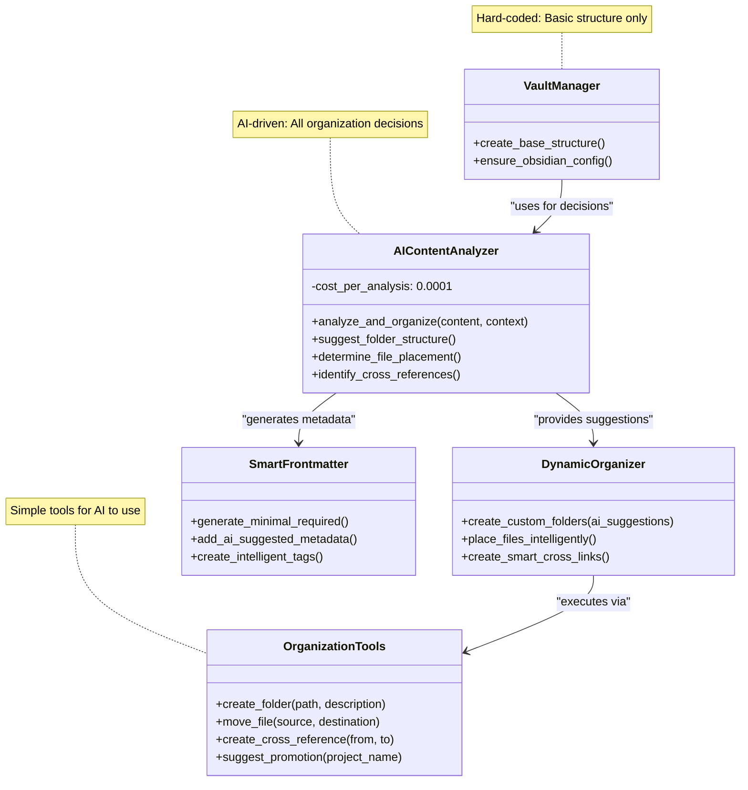

# AI-Driven Organization Strategy - Smart Balance of Structure vs Intelligence

## Philosophy: Minimal Structure, Maximum Intelligence

Instead of rigid templates, provide **minimal structure** + **intelligent AI decision-making** + **simple tools** for the AI to use.

## Architecture Overview



## What's Hard-Coded (Minimal Structure)

### 1. Base Directory Requirements
```
vault/
├── .obsidian/           # Obsidian configuration (static)
├── projects/            # Projects container (static)  
├── sessions/            # Sessions container (static)
└── templates/           # Templates (static)
```

### 2. Core Frontmatter Schema (Required Fields Only)
```yaml
---
created: "timestamp"     # Always required
run_id: "session_id"     # Always required  
type: "content_type"     # AI-determined
tags: []                 # AI-generated
# Everything else is AI-decided
---
```

### 3. Essential Tools for AI
```python
# Simple tools the AI can use to organize content
create_folder(path, description)
move_file(source, destination)  
create_cross_reference(from_file, to_file, relationship_type)
analyze_relationships(content)
suggest_promotion_to_project(session_id, reasoning)
```

## What's AI-Driven (Everything Else)

### 1. Intelligent Content Analysis
```python
class AIContentAnalyzer:
    def __init__(self):
        self.model = "openai/gpt-5-nano"  # Cost-effective for quick decisions
        self.cost_per_analysis = 0.0001   # Extremely low cost
    
    async def analyze_and_organize(self, content: str, context: Dict) -> Dict:
        """AI makes all organization decisions"""
        
        prompt = f"""
        Analyze this content and decide how to organize it intelligently:
        
        CONTENT: {content[:1000]}...
        
        CONTEXT:
        - Session ID: {context.get('session_id')}
        - Existing files: {context.get('existing_files', [])}
        - Project context: {context.get('project_context')}
        - User's working style: {context.get('user_preferences', {})}
        
        DECISIONS NEEDED:
        1. What type of content is this? (code, analysis, documentation, research, etc.)
        2. What's the most logical folder structure for this specific content?
        3. What should the file be named?
        4. What other files does this relate to?
        5. Should this trigger a session→project promotion?
        
        TOOLS AVAILABLE:
        - create_folder(path, description)
        - place_file(path, filename)
        - create_cross_reference(target_file, relationship)
        - suggest_promotion(project_name, reasoning)
        
        Respond with specific tool calls that make sense for this unique content.
        Be creative with folder names - make them descriptive and contextual.
        """
        
        response = await self.llm_call(prompt)
        return self.parse_ai_decisions(response)
    
    def parse_ai_decisions(self, ai_response: str) -> Dict:
        """Parse AI response into actionable decisions"""
        return {
            "folder_structure": extract_folder_decisions(ai_response),
            "file_placement": extract_file_decisions(ai_response),
            "cross_references": extract_reference_decisions(ai_response),
            "promotion_suggestion": extract_promotion_decisions(ai_response),
            "reasoning": extract_reasoning(ai_response)
        }
```

### 2. Dynamic Folder Creation
```python
# AI can create contextual folders like:
# "authentication_research/"
# "jwt_implementation_docs/"  
# "api_security_analysis/"
# "user_feedback_integration/"
# "performance_optimization_notes/"

class DynamicFolderManager:
    def __init__(self, ai_analyzer: AIContentAnalyzer):
        self.ai_analyzer = ai_analyzer
    
    async def create_intelligent_structure(self, session_dir: Path, 
                                         content: str, context: Dict) -> Path:
        """Let AI decide the folder structure"""
        
        # AI analyzes content and creates custom folder structure
        decisions = await self.ai_analyzer.analyze_and_organize(content, context)
        
        optimal_path = session_dir
        
        # Create AI-suggested folder hierarchy
        for folder in decisions["folder_structure"]:
            folder_path = optimal_path / folder["name"]
            folder_path.mkdir(exist_ok=True)
            
            # Create README in folders for context
            readme_content = f"""# {folder['name']}

{folder['description']}

Created: {datetime.now().isoformat()}
Purpose: {folder['purpose']}
"""
            (folder_path / "README.md").write_text(readme_content)
            
            optimal_path = folder_path
        
        return optimal_path
```

### 3. Smart Project Type Detection
```python
class AIProjectDetector:
    async def analyze_session_for_promotion(self, session_id: str) -> Dict:
        """AI analyzes entire session to suggest project promotion"""
        
        session_files = self.get_session_files(session_id)
        content_summary = self.summarize_session_content(session_files)
        
        prompt = f"""
        Analyze this session and determine if it should become a project:
        
        SESSION SUMMARY: {content_summary}
        FILES: {[f.name for f in session_files]}
        
        CONSIDER:
        1. Is this substantial enough to be a standalone project?
        2. What type of project would this be? (be creative, not limited to templates)
        3. What would be a good project name?
        4. How should the content be reorganized?
        5. What additional structure would help this project?
        
        EXAMPLE PROJECT TYPES (be creative beyond these):
        - "API Authentication System"
        - "Customer Feedback Analysis Dashboard" 
        - "Machine Learning Model Optimization"
        - "Documentation Modernization Initiative"
        - "Security Audit and Remediation"
        
        If promotion is recommended, suggest:
        - Unique project name
        - Custom folder structure for this specific project
        - How to reorganize existing files
        - What additional components might be needed
        """
        
        response = await self.ai_call(prompt)
        return self.parse_promotion_decision(response)
```

## UML: AI-Driven vs Hard-Coded Components



## Cost-Effective AI Usage

### GPT-5 Nano Integration
```python
class CostEffectiveAI:
    def __init__(self):
        self.model = "openai/gpt-5-nano"
        self.cost_per_1k_tokens = 0.0001  # Extremely cheap
        self.typical_analysis_cost = 0.0005  # Less than 1 cent per analysis
    
    async def quick_content_analysis(self, content: str, context: Dict) -> Dict:
        """Fast, cheap analysis for organization decisions"""
        
        # Keep prompts focused and efficient
        prompt = self.create_focused_prompt(content, context)
        
        response = await openai.ChatCompletion.acreate(
            model=self.model,
            messages=[{"role": "user", "content": prompt}],
            max_tokens=200,  # Keep responses concise
            temperature=0.3   # Consistent decisions
        )
        
        return self.parse_response(response)
    
    def create_focused_prompt(self, content: str, context: Dict) -> str:
        """Create efficient prompts for specific decisions"""
        
        return f"""
        Quick analysis needed:
        
        Content type: {self.detect_content_type(content)}
        Length: {len(content)} chars
        Context: {context.get('session_type', 'general')}
        
        Decide:
        1. Folder name (creative, descriptive): 
        2. File placement strategy:
        3. Related files to link:
        
        Format: folder_name|file_path|related_files
        """
```

## Balanced Implementation Strategy

### 1. Session Creation (AI-Driven Organization)
```python
async def create_intelligent_session(run_id: str, initial_content: str) -> Path:
    """Create session with AI-suggested organization"""
    
    # Hard-coded: Base session directory
    session_dir = vault_manager.sessions_path / run_id
    session_dir.mkdir(parents=True, exist_ok=True)
    
    # AI-driven: Everything else
    context = {
        "session_id": run_id,
        "content_preview": initial_content[:500],
        "user_preferences": load_user_preferences()
    }
    
    # Let AI decide the organization
    ai_decisions = await ai_analyzer.analyze_and_organize(initial_content, context)
    
    # AI creates custom folder structure
    for folder_suggestion in ai_decisions["folder_structure"]:
        folder_path = session_dir / folder_suggestion["name"]
        folder_path.mkdir(exist_ok=True)
        
        # Create context file explaining the folder's purpose
        context_file = folder_path / ".context.md"
        context_file.write_text(f"""# {folder_suggestion['name']}

Purpose: {folder_suggestion['purpose']}
AI Reasoning: {folder_suggestion['reasoning']}
Created: {datetime.now().isoformat()}
""")
    
    return session_dir
```

### 2. File Placement (AI-Driven Decisions)
```python
async def save_with_ai_organization(content: str, description: str, 
                                  session_dir: Path) -> Dict:
    """Save file with AI-determined placement"""
    
    # AI analyzes content and decides placement
    placement_decision = await ai_analyzer.analyze_content_placement(
        content=content,
        description=description,
        existing_structure=list_existing_folders(session_dir),
        session_context=get_session_context(session_dir)
    )
    
    # AI decides:
    # - Which subfolder (existing or new)
    # - What to name the file
    # - What metadata to include
    # - What cross-references to create
    
    target_path = session_dir / placement_decision["folder_path"]
    target_path.mkdir(parents=True, exist_ok=True)
    
    filename = placement_decision["suggested_filename"]
    file_path = target_path / filename
    
    # AI generates appropriate frontmatter
    frontmatter = generate_ai_frontmatter(content, placement_decision)
    
    final_content = f"---\n{yaml.dump(frontmatter)}---\n\n{content}"
    file_path.write_text(final_content)
    
    # AI creates cross-references
    for ref in placement_decision["cross_references"]:
        create_cross_reference(file_path, ref["target"], ref["type"])
    
    return {
        "filepath": str(file_path),
        "ai_reasoning": placement_decision["reasoning"],
        "folder_created": placement_decision.get("new_folder_created", False),
        "cross_references_created": len(placement_decision["cross_references"])
    }
```

## Benefits of AI-Driven Approach

### ✅ Intelligent Adaptation
- **Context-Aware**: AI understands the unique nature of each project
- **Creative Naming**: Descriptive, meaningful folder and file names
- **Relationship Detection**: AI identifies connections humans might miss
- **Flexible Structure**: No rigid templates that force square pegs into round holes

### ✅ Cost-Effective Intelligence
- **GPT-5 Nano**: ~$0.0005 per analysis (less than 1 cent)
- **Quick Decisions**: Fast responses for organization choices
- **Scalable**: Can analyze every file placement without cost concerns
- **Smart Caching**: Remember patterns for similar content types

### ✅ User-Friendly Results
- **Natural Organization**: Folders and structure make intuitive sense
- **Discoverable**: AI creates logical hierarchies for easy navigation
- **Obsidian Compatible**: All decisions result in proper Obsidian structures
- **Self-Documenting**: AI adds context and reasoning to its decisions

## Implementation Priority

### Phase 1: Replace Static Templates with AI
- Implement `AIContentAnalyzer` for dynamic organization decisions
- Create simple organization tools for AI to use
- Replace rigid folder templates with AI-suggested structures

### Phase 2: Intelligent Cross-Referencing  
- AI-driven relationship detection between files
- Smart backlinking based on content similarity
- Dynamic tag generation based on actual content

### Phase 3: Learning and Optimization
- AI learns from user preferences and adjustments
- Pattern recognition for similar content types
- Optimization suggestions for existing structures

This approach gives you the best of both worlds: reliable basic structure with intelligent, adaptive organization that makes sense for each unique project or session.
