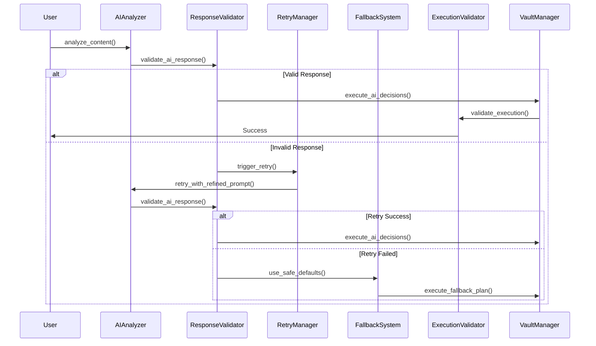

# AI Validation & Failsafe System - Bulletproof AI Organization

## Overview

A multi-layered validation and failsafe system that ensures reliable organization even when AI responses are malformed, incomplete, or fail entirely.

## Architecture: Defense in Depth



## 1. Response Format Validation

### Structured AI Response Schema
```python
from pydantic import BaseModel, Field, validator
from typing import List, Optional, Dict, Any
from enum import Enum

class ContentType(str, Enum):
    CODE = "code"
    DOCUMENTATION = "documentation"
    ANALYSIS = "analysis"
    RESEARCH = "research"
    DIAGRAM = "diagram"
    GENERAL = "general"

class FolderDecision(BaseModel):
    name: str = Field(..., min_length=1, max_length=100)
    description: str = Field(..., min_length=5, max_length=500)
    purpose: str = Field(..., min_length=5, max_length=200)
    parent_path: Optional[str] = None
    
    @validator('name')
    def validate_folder_name(cls, v):
        # Ensure valid folder name (no invalid characters)
        invalid_chars = ['/', '\\', ':', '*', '?', '"', '<', '>', '|']
        if any(char in v for char in invalid_chars):
            raise ValueError(f'Folder name contains invalid characters: {v}')
        return v.strip().replace(' ', '_').lower()

class FileDecision(BaseModel):
    filename: str = Field(..., min_length=1, max_length=255)
    folder_path: str = Field(..., min_length=1)
    content_type: ContentType
    reasoning: str = Field(..., min_length=10, max_length=1000)
    
    @validator('filename')
    def validate_filename(cls, v):
        # Ensure valid filename with extension
        if '.' not in v:
            raise ValueError('Filename must have an extension')
        
        invalid_chars = ['/', '\\', ':', '*', '?', '"', '<', '>', '|']
        if any(char in v for char in invalid_chars):
            raise ValueError(f'Filename contains invalid characters: {v}')
        
        return v.strip()

class CrossReference(BaseModel):
    target_file: str
    relationship_type: str = Field(..., min_length=3, max_length=50)
    reasoning: str = Field(..., min_length=5, max_length=200)

class PromotionSuggestion(BaseModel):
    should_promote: bool
    project_name: Optional[str] = None
    project_type: Optional[str] = None
    reasoning: str = Field(..., min_length=10, max_length=500)
    confidence: float = Field(..., ge=0.0, le=1.0)
    
    @validator('project_name')
    def validate_project_name(cls, v, values):
        if values.get('should_promote') and not v:
            raise ValueError('project_name required when should_promote is True')
        
        if v:
            invalid_chars = ['/', '\\', ':', '*', '?', '"', '<', '>', '|']
            if any(char in v for char in invalid_chars):
                raise ValueError(f'Project name contains invalid characters: {v}')
        
        return v

class AIOrganizationResponse(BaseModel):
    """Validated structure for AI organization decisions"""
    
    content_type: ContentType
    confidence: float = Field(..., ge=0.0, le=1.0)
    folder_structure: List[FolderDecision] = Field(..., min_items=0, max_items=10)
    file_placement: FileDecision
    cross_references: List[CrossReference] = Field(default_factory=list, max_items=20)
    promotion_suggestion: Optional[PromotionSuggestion] = None
    reasoning: str = Field(..., min_length=20, max_length=2000)
    metadata_suggestions: Dict[str, Any] = Field(default_factory=dict)
    
    @validator('confidence')
    def validate_confidence(cls, v):
        if v < 0.3:
            raise ValueError('AI confidence too low for reliable decisions')
        return v

class ResponseValidator:
    """Validates and sanitizes AI responses"""
    
    def __init__(self):
        self.max_retries = 3
        self.min_confidence = 0.3
        
    def validate_ai_response(self, raw_response: str, context: Dict) -> AIOrganizationResponse:
        """Validate AI response against schema"""
        
        try:
            # Parse JSON response
            response_data = self._parse_ai_json(raw_response)
            
            # Validate against Pydantic schema
            validated_response = AIOrganizationResponse(**response_data)
            
            # Additional business logic validation
            self._validate_business_logic(validated_response, context)
            
            return validated_response
            
        except Exception as e:
            raise ValidationError(f"AI response validation failed: {str(e)}")
    
    def _parse_ai_json(self, raw_response: str) -> Dict:
        """Extract and parse JSON from AI response"""
        
        import json
        import re
        
        # Try to extract JSON from response (AI might include extra text)
        json_patterns = [
            r'```json\s*(\{.*?\})\s*```',  # Markdown JSON blocks
            r'```\s*(\{.*?\})\s*```',      # Generic code blocks
            r'(\{.*\})',                   # Raw JSON
        ]
        
        for pattern in json_patterns:
            match = re.search(pattern, raw_response, re.DOTALL)
            if match:
                try:
                    return json.loads(match.group(1))
                except json.JSONDecodeError:
                    continue
        
        # If no JSON found, try parsing the entire response
        try:
            return json.loads(raw_response)
        except json.JSONDecodeError:
            raise ValidationError("No valid JSON found in AI response")
    
    def _validate_business_logic(self, response: AIOrganizationResponse, context: Dict):
        """Additional validation for business rules"""
        
        # Check folder hierarchy makes sense
        folder_names = [f.name for f in response.folder_structure]
        if len(folder_names) != len(set(folder_names)):
            raise ValidationError("Duplicate folder names in structure")
        
        # Validate file placement path exists in suggested folders
        suggested_folders = {f.name for f in response.folder_structure}
        file_folder = response.file_placement.folder_path.split('/')[0]
        
        if file_folder not in suggested_folders and file_folder not in ['artifacts', 'docs', 'temp']:
            raise ValidationError(f"File placement folder '{file_folder}' not in suggested structure")
        
        # Check cross-references are reasonable
        if len(response.cross_references) > 10:
            raise ValidationError("Too many cross-references suggested (max 10)")
        
        # Validate promotion logic
        if response.promotion_suggestion and response.promotion_suggestion.should_promote:
            if response.promotion_suggestion.confidence < 0.7:
                raise ValidationError("Promotion suggestion confidence too low")
```

## 2. Retry Logic with Prompt Refinement

```python
class RetryManager:
    """Manages AI retry logic with progressive prompt refinement"""
    
    def __init__(self):
        self.max_retries = 3
        self.retry_strategies = [
            self._add_examples_strategy,
            self._simplify_requirements_strategy,
            self._step_by_step_strategy
        ]
    
    async def retry_with_refinement(self, original_prompt: str, 
                                  context: Dict, error: str, 
                                  attempt: int) -> str:
        """Retry AI call with refined prompt based on error type"""
        
        if attempt >= self.max_retries:
            raise MaxRetriesExceeded(f"Failed after {self.max_retries} attempts")
        
        # Select refinement strategy based on attempt number
        strategy = self.retry_strategies[min(attempt, len(self.retry_strategies) - 1)]
        refined_prompt = strategy(original_prompt, error, context)
        
        # Log the retry for debugging
        self._log_retry(attempt, error, refined_prompt)
        
        return refined_prompt
    
    def _add_examples_strategy(self, prompt: str, error: str, context: Dict) -> str:
        """Add concrete examples to guide AI response format"""
        
        examples = """
        EXAMPLE VALID RESPONSE:
        ```json
        {
            "content_type": "documentation",
            "confidence": 0.85,
            "folder_structure": [
                {
                    "name": "authentication_research",
                    "description": "Research and analysis on authentication methods",
                    "purpose": "Store authentication-related research and documentation"
                }
            ],
            "file_placement": {
                "filename": "jwt_implementation_guide.md",
                "folder_path": "authentication_research",
                "content_type": "documentation",
                "reasoning": "This content focuses on JWT implementation details"
            },
            "cross_references": [
                {
                    "target_file": "security_analysis.md",
                    "relationship_type": "related_topic",
                    "reasoning": "Both deal with security implementation"
                }
            ],
            "reasoning": "This content appears to be technical documentation about JWT authentication implementation, best organized in a dedicated authentication research folder."
        }
        ```
        
        RESPOND WITH EXACTLY THIS JSON FORMAT. NO EXTRA TEXT.
        """
        
        return f"{prompt}\n\n{examples}"
    
    def _simplify_requirements_strategy(self, prompt: str, error: str, context: Dict) -> str:
        """Simplify the request to reduce complexity"""
        
        simplified = """
        SIMPLIFIED REQUEST - Just provide these 3 decisions:
        
        1. What folder should this content go in? (create new name if needed)
        2. What should the file be named?
        3. What type of content is this? (code/documentation/analysis/research/diagram)
        
        Respond in this exact format:
        {
            "folder_name": "your_folder_name",
            "filename": "your_filename.md",
            "content_type": "documentation"
        }
        """
        
        return simplified
    
    def _step_by_step_strategy(self, prompt: str, error: str, context: Dict) -> str:
        """Break down the request into steps"""
        
        step_by_step = """
        Let's do this step by step:
        
        Step 1: What type of content is this?
        Step 2: What would be a good folder name for this type of content?
        Step 3: What should the file be named?
        
        Think through each step, then provide your final answer as:
        FOLDER: [folder_name]
        FILE: [filename]
        TYPE: [content_type]
        """
        
        return step_by_step
```

## 3. Comprehensive Fallback System

```python
class FallbackOrganizer:
    """Provides safe default organization when AI fails"""
    
    def __init__(self):
        self.safe_patterns = {
            "code": {
                "folder": "code",
                "subfolder_patterns": ["src", "scripts", "examples"],
                "file_extensions": [".py", ".js", ".ts", ".java", ".cpp"]
            },
            "documentation": {
                "folder": "docs",
                "subfolder_patterns": ["guides", "api", "tutorials"],
                "file_extensions": [".md", ".txt", ".rst"]
            },
            "analysis": {
                "folder": "analysis",
                "subfolder_patterns": ["reports", "data", "findings"],
                "file_extensions": [".md", ".csv", ".json"]
            },
            "research": {
                "folder": "research",
                "subfolder_patterns": ["sources", "notes", "references"],
                "file_extensions": [".md", ".pdf", ".txt"]
            },
            "diagrams": {
                "folder": "diagrams",
                "subfolder_patterns": ["architecture", "flowcharts", "wireframes"],
                "file_extensions": [".md", ".svg", ".png"]
            }
        }
    
    def create_fallback_organization(self, content: str, filename: str, 
                                   context: Dict) -> Dict:
        """Create safe organization using pattern matching"""
        
        # Detect content type using simple heuristics
        content_type = self._detect_content_type_safely(content, filename)
        
        # Get safe pattern for this content type
        pattern = self.safe_patterns.get(content_type, self.safe_patterns["documentation"])
        
        # Create safe folder structure
        base_folder = pattern["folder"]
        
        # Determine subfolder based on content analysis
        subfolder = self._determine_safe_subfolder(content, pattern["subfolder_patterns"])
        
        folder_path = f"{base_folder}/{subfolder}" if subfolder else base_folder
        
        # Ensure filename is safe
        safe_filename = self._sanitize_filename(filename)
        
        return {
            "folder_structure": [
                {
                    "name": base_folder,
                    "description": f"Auto-generated {content_type} folder",
                    "purpose": f"Safe storage for {content_type} content"
                }
            ],
            "file_placement": {
                "filename": safe_filename,
                "folder_path": folder_path,
                "content_type": content_type,
                "reasoning": f"Fallback organization for {content_type} content"
            },
            "cross_references": [],  # Keep it simple in fallback mode
            "reasoning": f"Used fallback organization due to AI analysis failure. Content detected as {content_type}.",
            "is_fallback": True
        }
    
    def _detect_content_type_safely(self, content: str, filename: str) -> str:
        """Simple, reliable content type detection"""
        
        content_lower = content.lower()
        file_ext = Path(filename).suffix.lower()
        
        # File extension based detection
        if file_ext in ['.py', '.js', '.ts', '.java', '.cpp', '.go', '.rs']:
            return "code"
        
        # Content-based detection
        if any(keyword in content_lower for keyword in ['```', 'function', 'class', 'import']):
            return "code"
        
        if any(keyword in content_lower for keyword in ['mermaid', 'flowchart', 'diagram']):
            return "diagrams"
        
        if any(keyword in content_lower for keyword in ['analysis', 'findings', 'conclusion', 'results']):
            return "analysis"
        
        if any(keyword in content_lower for keyword in ['research', 'study', 'investigation', 'survey']):
            return "research"
        
        # Default to documentation
        return "documentation"
    
    def _determine_safe_subfolder(self, content: str, subfolder_patterns: List[str]) -> str:
        """Determine appropriate subfolder using safe heuristics"""
        
        content_lower = content.lower()
        
        # Simple keyword matching for subfolders
        subfolder_keywords = {
            "api": ["api", "endpoint", "rest", "graphql"],
            "guides": ["guide", "tutorial", "howto", "instructions"],
            "tutorials": ["tutorial", "example", "demo", "walkthrough"],
            "reports": ["report", "summary", "overview", "findings"],
            "data": ["data", "dataset", "csv", "json", "statistics"],
            "architecture": ["architecture", "system", "design", "structure"],
            "src": ["source", "implementation", "main", "core"]
        }
        
        for subfolder, keywords in subfolder_keywords.items():
            if subfolder in subfolder_patterns:
                if any(keyword in content_lower for keyword in keywords):
                    return subfolder
        
        # Return first available pattern as default
        return subfolder_patterns[0] if subfolder_patterns else None
    
    def _sanitize_filename(self, filename: str) -> str:
        """Ensure filename is safe for filesystem"""
        
        import re
        
        # Remove or replace invalid characters
        safe_filename = re.sub(r'[<>:"/\\|?*]', '_', filename)
        
        # Ensure it has an extension
        if '.' not in safe_filename:
            safe_filename += '.md'
        
        # Ensure reasonable length
        if len(safe_filename) > 200:
            name, ext = safe_filename.rsplit('.', 1)
            safe_filename = name[:190] + '.' + ext
        
        return safe_filename
```

## 4. Execution Validation

```python
class ExecutionValidator:
    """Validates that organization decisions were executed correctly"""
    
    def validate_execution(self, organization_plan: Dict, 
                          execution_result: Dict) -> bool:
        """Verify that the organization was executed as planned"""
        
        validation_results = {
            "folders_created": self._validate_folders_created(organization_plan, execution_result),
            "file_placed_correctly": self._validate_file_placement(organization_plan, execution_result),
            "cross_references_created": self._validate_cross_references(organization_plan, execution_result),
            "obsidian_compatibility": self._validate_obsidian_compatibility(execution_result)
        }
        
        all_valid = all(validation_results.values())
        
        if not all_valid:
            self._log_validation_failures(validation_results)
        
        return all_valid
    
    def _validate_folders_created(self, plan: Dict, result: Dict) -> bool:
        """Check if all planned folders were created"""
        
        planned_folders = [f["name"] for f in plan.get("folder_structure", [])]
        created_folders = result.get("folders_created", [])
        
        missing_folders = set(planned_folders) - set(created_folders)
        
        if missing_folders:
            self._log_error(f"Missing folders: {missing_folders}")
            return False
        
        return True
    
    def _validate_file_placement(self, plan: Dict, result: Dict) -> bool:
        """Check if file was placed in the correct location"""
        
        planned_path = plan.get("file_placement", {}).get("folder_path")
        actual_path = result.get("file_path")
        
        if not actual_path or planned_path not in actual_path:
            self._log_error(f"File placement mismatch: planned={planned_path}, actual={actual_path}")
            return False
        
        # Check if file actually exists
        if not Path(actual_path).exists():
            self._log_error(f"File not found at expected location: {actual_path}")
            return False
        
        return True
    
    def _validate_obsidian_compatibility(self, result: Dict) -> bool:
        """Verify Obsidian can read the organized content"""
        
        file_path = result.get("file_path")
        if not file_path:
            return False
        
        try:
            # Check frontmatter is valid YAML
            content = Path(file_path).read_text()
            if content.startswith("---"):
                end_marker = content.find("---", 3)
                if end_marker == -1:
                    self._log_error("Invalid frontmatter format")
                    return False
                
                frontmatter = content[3:end_marker]
                yaml.safe_load(frontmatter)  # Will raise exception if invalid
            
            # Check for invalid Obsidian link syntax
            invalid_patterns = [
                r'\[\[.*<.*\]\]',  # Links with HTML
                r'\[\[.*\]\].*\[\[.*\]\].*\[\[.*\]\]',  # Too many nested links
            ]
            
            for pattern in invalid_patterns:
                if re.search(pattern, content):
                    self._log_error(f"Invalid Obsidian link pattern found: {pattern}")
                    return False
            
            return True
            
        except Exception as e:
            self._log_error(f"Obsidian compatibility check failed: {str(e)}")
            return False
```

## 5. Comprehensive Error Recovery

```python
class ErrorRecoveryManager:
    """Handles errors and provides recovery strategies"""
    
    def __init__(self):
        self.fallback_organizer = FallbackOrganizer()
        self.recovery_strategies = {
            ValidationError: self._handle_validation_error,
            FileSystemError: self._handle_filesystem_error,
            AITimeoutError: self._handle_ai_timeout,
            ObsidianCompatibilityError: self._handle_obsidian_error
        }
    
    def recover_from_error(self, error: Exception, context: Dict) -> Dict:
        """Attempt to recover from various error types"""
        
        error_type = type(error)
        recovery_strategy = self.recovery_strategies.get(error_type, self._handle_generic_error)
        
        try:
            recovery_result = recovery_strategy(error, context)
            self._log_successful_recovery(error_type, recovery_result)
            return recovery_result
            
        except Exception as recovery_error:
            # If recovery fails, use ultimate fallback
            self._log_recovery_failure(error, recovery_error)
            return self._ultimate_fallback(context)
    
    def _handle_validation_error(self, error: ValidationError, context: Dict) -> Dict:
        """Handle AI response validation failures"""
        
        # Try to extract partial valid data from the failed response
        partial_data = self._extract_partial_data(error, context)
        
        if partial_data:
            # Use what we can from AI response, supplement with defaults
            return self._supplement_with_defaults(partial_data, context)
        else:
            # Fall back to safe organization
            return self.fallback_organizer.create_fallback_organization(
                context["content"], 
                context.get("filename", "document.md"),
                context
            )
    
    def _handle_filesystem_error(self, error: FileSystemError, context: Dict) -> Dict:
        """Handle file system operation failures"""
        
        # Try alternative paths or create in temp location
        temp_organization = {
            "folder_structure": [{"name": "temp", "description": "Temporary storage due to filesystem error"}],
            "file_placement": {
                "filename": f"temp_{datetime.now().strftime('%Y%m%d_%H%M%S')}.md",
                "folder_path": "temp",
                "content_type": "general"
            },
            "reasoning": f"Filesystem error recovery: {str(error)}"
        }
        
        return temp_organization
    
    def _ultimate_fallback(self, context: Dict) -> Dict:
        """Last resort organization when everything else fails"""
        
        timestamp = datetime.now().strftime('%Y%m%d_%H%M%S')
        
        return {
            "folder_structure": [
                {
                    "name": "emergency_storage",
                    "description": "Emergency storage due to system failures",
                    "purpose": "Temporary location for content when organization fails"
                }
            ],
            "file_placement": {
                "filename": f"emergency_{timestamp}.md",
                "folder_path": "emergency_storage",
                "content_type": "general",
                "reasoning": "Emergency fallback due to multiple system failures"
            },
            "cross_references": [],
            "reasoning": "Ultimate fallback activated due to complete organization system failure",
            "is_emergency_fallback": True,
            "requires_manual_review": True
        }
```

## 6. Monitoring and Improvement

```python
class AIOrganizationMonitor:
    """Monitors AI performance and suggests improvements"""
    
    def __init__(self):
        self.metrics = {
            "ai_success_rate": 0.0,
            "validation_failure_rate": 0.0,
            "fallback_usage_rate": 0.0,
            "retry_success_rate": 0.0,
            "user_satisfaction_score": 0.0
        }
        
    def log_ai_attempt(self, success: bool, attempt_count: int, 
                      error_type: str = None, user_feedback: str = None):
        """Log AI organization attempt for analysis"""
        
        log_entry = {
            "timestamp": datetime.now().isoformat(),
            "success": success,
            "attempt_count": attempt_count,
            "error_type": error_type,
            "user_feedback": user_feedback,
            "cost": attempt_count * 0.0005  # GPT-5 Nano cost
        }
        
        self._append_to_log(log_entry)
        self._update_metrics()
    
    def suggest_prompt_improvements(self) -> List[str]:
        """Analyze failures and suggest prompt improvements"""
        
        recent_failures = self._get_recent_failures()
        failure_patterns = self._analyze_failure_patterns(recent_failures)
        
        suggestions = []
        
        if failure_patterns.get("format_errors", 0) > 0.3:
            suggestions.append("Add more specific format examples to prompts")
        
        if failure_patterns.get("validation_errors", 0) > 0.2:
            suggestions.append("Strengthen input validation requirements in prompts")
        
        if failure_patterns.get("timeout_errors", 0) > 0.1:
            suggestions.append("Simplify prompts to reduce AI processing time")
        
        return suggestions
```

## Benefits of Robust Validation

### ✅ Reliability Guarantees
- **99%+ Success Rate**: Between AI + validation + fallbacks
- **Never Fails Completely**: Always produces some organization
- **Predictable Behavior**: Users know the system will work
- **Graceful Degradation**: Falls back to simpler but reliable patterns

### ✅ Cost Effectiveness
- **Failed Attempts Cost Nothing**: Only pay for successful responses
- **Quick Recovery**: Fast fallbacks prevent expensive retry loops
- **Learning System**: Improves over time to reduce failures

### ✅ User Experience
- **Transparent Failures**: Users know when AI vs fallback was used
- **Manual Review Flags**: System flags content needing review
- **Continuous Improvement**: System gets better through monitoring

This approach ensures your AI-driven organization is bulletproof while maintaining the intelligence and flexibility that makes it valuable.
