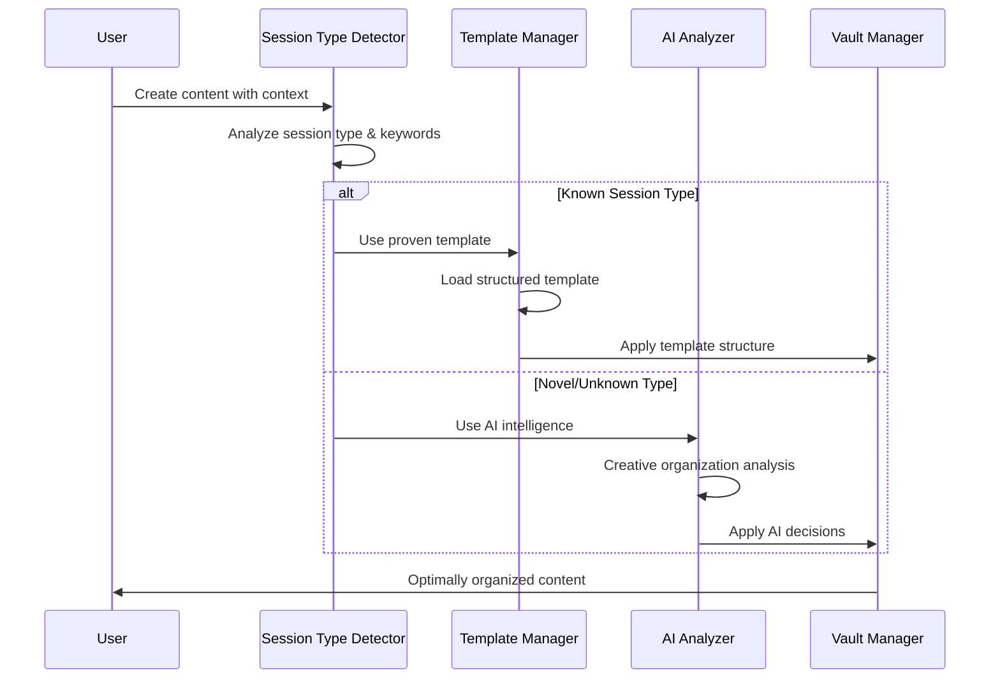

# Hybrid Template + AI Organization System

## Philosophy: Proven Patterns + Creative Intelligence

**Known Session Types** → **Structured Templates** (Proven workflows)  
**Novel/Unknown Work** → **AI Intelligence** (Creative organization)

This hybrid approach provides **control where you need it** and **flexibility where you want it**.

## Architecture Overview



## 1. Session Type Detection System

### Intelligent Type Detection
```python
class SessionTypeDetector:
    def __init__(self):
        self.type_patterns = {
            "coding_development": {
                "keywords": ["implement", "develop", "code", "programming", "software", "feature", "bug fix"],
                "context_patterns": ["task", "development", "coding", "implementation"],
                "file_patterns": [".py", ".js", ".ts", ".java", ".cpp"],
                "content_indicators": ["```", "function", "class", "import", "def "]
            },
            "troubleshooting": {
                "keywords": ["troubleshoot", "debug", "error", "issue", "problem", "fix", "resolve"],
                "context_patterns": ["troubleshooting", "debugging", "error analysis", "problem solving"],
                "content_indicators": ["error:", "exception", "failed", "not working", "issue with"]
            },
            "research": {
                "keywords": ["research", "investigate", "analyze", "study", "explore", "survey"],
                "context_patterns": ["research", "analysis", "investigation", "study"],
                "content_indicators": ["hypothesis", "findings", "methodology", "literature review"]
            },
            "documentation": {
                "keywords": ["document", "guide", "manual", "documentation", "reference", "tutorial"],
                "context_patterns": ["documentation", "guide creation", "manual writing"],
                "content_indicators": ["## ", "step-by-step", "how to", "tutorial"]
            },
            "architecture_design": {
                "keywords": ["architecture", "design", "system", "structure", "blueprint", "planning"],
                "context_patterns": ["architecture", "system design", "planning"],
                "content_indicators": ["mermaid", "diagram", "architecture", "components"]
            }
        }
        
        self.confidence_threshold = 0.7
    
    def detect_session_type(self, content: str, context: Dict, 
                          filename: str = None) -> Dict:
        """Detect session type with confidence scoring"""
        
        scores = {}
        
        for session_type, patterns in self.type_patterns.items():
            score = self._calculate_type_score(content, context, filename, patterns)
            scores[session_type] = score
        
        # Find best match
        best_type = max(scores, key=scores.get)
        best_score = scores[best_type]
        
        return {
            "detected_type": best_type if best_score >= self.confidence_threshold else "unknown",
            "confidence": best_score,
            "all_scores": scores,
            "use_template": best_score >= self.confidence_threshold
        }
    
    def _calculate_type_score(self, content: str, context: Dict, 
                            filename: str, patterns: Dict) -> float:
        """Calculate confidence score for a session type"""
        
        score = 0.0
        content_lower = content.lower()
        context_str = str(context).lower()
        
        # Keyword matching (40% weight)
        keyword_matches = sum(1 for keyword in patterns["keywords"] 
                            if keyword in content_lower or keyword in context_str)
        keyword_score = min(keyword_matches / len(patterns["keywords"]), 1.0) * 0.4
        
        # Context pattern matching (30% weight)
        context_matches = sum(1 for pattern in patterns["context_patterns"]
                            if pattern in context_str)
        context_score = min(context_matches / len(patterns["context_patterns"]), 1.0) * 0.3
        
        # Content indicator matching (20% weight)
        indicator_matches = sum(1 for indicator in patterns["content_indicators"]
                              if indicator in content_lower)
        indicator_score = min(indicator_matches / len(patterns["content_indicators"]), 1.0) * 0.2
        
        # File pattern matching (10% weight)
        file_score = 0.0
        if filename and "file_patterns" in patterns:
            file_ext = Path(filename).suffix.lower()
            if file_ext in patterns["file_patterns"]:
                file_score = 0.1
        
        return keyword_score + context_score + indicator_score + file_score
```

## 2. Template Management System

### Structured Templates for Known Types

#### Coding Development Template (Following SOP)
```python
class CodingDevelopmentTemplate:
    """Template following the established 7-step SOP"""
    
    def __init__(self):
        self.template_structure = {
            "base_structure": {
                "MASTER_Architecture_UMLs_{task_name}.md": "architecture_template",
                "implementation-plan_{task_name}.md": "implementation_template", 
                "development-progress-tracker_{task_name}.md": "progress_template",
                "troubleshooting_{task_name}.md": "troubleshooting_template",
                "subtasks/": "directory",
                "tests/": "directory"
            },
            "required_documents": [
                "MASTER_Architecture_UMLs",
                "implementation-plan", 
                "development-progress-tracker"
            ],
            "workflow_steps": [
                "workspace_creation",
                "architecture_documentation",
                "automated_testing",
                "master_end_to_end_test",
                "git_workflow",
                "lessons_learned",
                "compliance_check"
            ]
        }
    
    def create_structure(self, task_name: str, context: Dict) -> Dict:
        """Create coding development structure following SOP"""
        
        task_folder = f"tasks/{context.get('date')}_{task_name}"
        
        return {
            "folder_structure": [
                {
                    "name": task_folder,
                    "description": f"Coding development task: {task_name}",
                    "purpose": "Follow 7-step SOP for development tasks"
                },
                {
                    "name": f"{task_folder}/subtasks",
                    "description": "Individual subtask tracking",
                    "purpose": "Break complex tasks into manageable pieces"
                },
                {
                    "name": f"{task_folder}/tests",
                    "description": "Automated testing and validation",
                    "purpose": "Ensure quality and functionality"
                }
            ],
            "required_files": self._generate_required_files(task_name, context),
            "workflow": self.template_structure["workflow_steps"],
            "template_type": "coding_development",
            "sop_compliance": True
        }
    
    def _generate_required_files(self, task_name: str, context: Dict) -> List[Dict]:
        """Generate required files with proper content"""
        
        current_date = context.get('date', datetime.now().strftime('%Y-%m-%d'))
        
        return [
            {
                "filename": f"MASTER_Architecture_UMLs_{task_name}.md",
                "template": "architecture_uml_template",
                "frontmatter": {
                    "title": f"Master Architecture - {task_name}",
                    "date": current_date,
                    "task": task_name,
                    "status": "In Progress",
                    "tags": ["architecture", "uml", "coding-task"]
                }
            },
            {
                "filename": f"implementation-plan_{task_name}.md", 
                "template": "implementation_plan_template",
                "frontmatter": {
                    "title": f"Implementation Plan - {task_name}",
                    "date": current_date,
                    "task": task_name,
                    "status": "Planning",
                    "tags": ["implementation", "planning", "coding-task"]
                }
            },
            {
                "filename": f"development-progress-tracker_{task_name}.md",
                "template": "progress_tracker_template", 
                "frontmatter": {
                    "title": f"Progress Tracker - {task_name}",
                    "date": current_date,
                    "task": task_name,
                    "status": "Active",
                    "tags": ["progress", "tracking", "coding-task"]
                }
            }
        ]
```

#### Troubleshooting Template
```python
class TroubleshootingTemplate:
    """Systematic troubleshooting structure"""
    
    def __init__(self):
        self.template_structure = {
            "investigation_phases": [
                "problem_identification",
                "information_gathering", 
                "hypothesis_formation",
                "testing_and_validation",
                "solution_implementation",
                "verification_and_monitoring"
            ],
            "required_sections": [
                "Problem Statement",
                "Environment Information",
                "Reproduction Steps",
                "Investigation Log",
                "Hypothesis Testing",
                "Solution Documentation",
                "Prevention Measures"
            ]
        }
    
    def create_structure(self, issue_description: str, context: Dict) -> Dict:
        """Create systematic troubleshooting structure"""
        
        issue_id = self._generate_issue_id(issue_description)
        
        return {
            "folder_structure": [
                {
                    "name": f"troubleshooting/{issue_id}",
                    "description": f"Troubleshooting: {issue_description}",
                    "purpose": "Systematic problem resolution"
                },
                {
                    "name": f"troubleshooting/{issue_id}/investigation",
                    "description": "Investigation logs and findings",
                    "purpose": "Track investigation process"
                },
                {
                    "name": f"troubleshooting/{issue_id}/solutions", 
                    "description": "Tested solutions and results",
                    "purpose": "Document solution attempts"
                },
                {
                    "name": f"troubleshooting/{issue_id}/resources",
                    "description": "Reference materials and documentation",
                    "purpose": "Store relevant resources"
                }
            ],
            "required_files": [
                {
                    "filename": f"troubleshooting/{issue_id}/README.md",
                    "template": "troubleshooting_overview_template",
                    "content": self._generate_troubleshooting_overview(issue_description)
                },
                {
                    "filename": f"troubleshooting/{issue_id}/investigation/investigation_log.md",
                    "template": "investigation_log_template",
                    "content": self._generate_investigation_template()
                }
            ],
            "template_type": "troubleshooting",
            "systematic_approach": True
        }
    
    def _generate_troubleshooting_overview(self, issue_description: str) -> str:
        """Generate structured troubleshooting overview"""
        
        return f"""---
title: "Troubleshooting: {issue_description}"
created: {datetime.now().isoformat()}
status: "investigating"
priority: "medium"
tags: [troubleshooting, investigation]
---

# Troubleshooting: {issue_description}

## Problem Statement
{issue_description}

## Environment Information
- **System**: 
- **Version**: 
- **Configuration**: 
- **Last Working State**: 

## Current Status
- **Status**: Investigating
- **Started**: {datetime.now().strftime('%Y-%m-%d %H:%M')}
- **Assigned**: 
- **Priority**: Medium

## Quick Links
- [[investigation/investigation_log.md|Investigation Log]]
- [[solutions/|Solution Attempts]]
- [[resources/|Reference Materials]]

## Summary
Brief description of the issue and current understanding.

## Next Steps
- [ ] Gather environment information
- [ ] Reproduce the issue
- [ ] Analyze logs
- [ ] Form initial hypothesis
"""
```

#### Research Template
```python
class ResearchTemplate:
    """Academic/professional research structure"""
    
    def create_structure(self, research_topic: str, context: Dict) -> Dict:
        """Create academic research structure"""
        
        return {
            "folder_structure": [
                {
                    "name": f"research/{research_topic}",
                    "description": f"Research project: {research_topic}",
                    "purpose": "Comprehensive research investigation"
                },
                {
                    "name": f"research/{research_topic}/literature_review",
                    "description": "Literature review and source analysis",
                    "purpose": "Background research and source compilation"
                },
                {
                    "name": f"research/{research_topic}/methodology",
                    "description": "Research methodology and approach",
                    "purpose": "Document research methods and procedures"
                },
                {
                    "name": f"research/{research_topic}/data_collection",
                    "description": "Data collection and raw findings",
                    "purpose": "Store collected data and initial findings"
                },
                {
                    "name": f"research/{research_topic}/analysis",
                    "description": "Data analysis and interpretation",
                    "purpose": "Process and analyze collected data"
                },
                {
                    "name": f"research/{research_topic}/findings",
                    "description": "Research findings and conclusions",
                    "purpose": "Document final findings and insights"
                }
            ],
            "required_files": [
                {
                    "filename": f"research/{research_topic}/README.md",
                    "template": "research_overview_template"
                },
                {
                    "filename": f"research/{research_topic}/research_plan.md",
                    "template": "research_plan_template"
                }
            ],
            "template_type": "research",
            "academic_structure": True
        }
```

## 3. Hybrid Decision Engine

### Template vs AI Decision Logic
```python
class HybridOrganizationEngine:
    def __init__(self):
        self.type_detector = SessionTypeDetector()
        self.template_manager = TemplateManager()
        self.ai_analyzer = AIContentAnalyzer()
        
        self.templates = {
            "coding_development": CodingDevelopmentTemplate(),
            "troubleshooting": TroubleshootingTemplate(),
            "research": ResearchTemplate(),
            "documentation": DocumentationTemplate(),
            "architecture_design": ArchitectureDesignTemplate()
        }
    
    async def organize_content(self, content: str, context: Dict, 
                             filename: str = None) -> Dict:
        """Main organization logic: Template vs AI"""
        
        # Step 1: Detect session type
        type_detection = self.type_detector.detect_session_type(content, context, filename)
        
        if type_detection["use_template"]:
            # Use proven template for known session types
            return self._apply_template_organization(type_detection, content, context)
        else:
            # Use AI intelligence for novel/unknown work
            return await self._apply_ai_organization(content, context)
    
    def _apply_template_organization(self, type_detection: Dict, 
                                   content: str, context: Dict) -> Dict:
        """Apply structured template organization"""
        
        session_type = type_detection["detected_type"]
        template = self.templates[session_type]
        
        # Extract key information for template customization
        template_context = self._extract_template_context(content, context, session_type)
        
        # Generate structure using template
        organization = template.create_structure(**template_context)
        
        # Add metadata about template usage
        organization.update({
            "organization_method": "template",
            "template_type": session_type,
            "confidence": type_detection["confidence"],
            "reasoning": f"Used {session_type} template based on content analysis"
        })
        
        return organization
    
    async def _apply_ai_organization(self, content: str, context: Dict) -> Dict:
        """Apply AI-driven organization for novel work"""
        
        # Use AI with enhanced prompt for creative organization
        ai_prompt = f"""
        This content doesn't match our known templates for:
        - Coding Development (SOP-based)
        - Troubleshooting (systematic approach)
        - Research (academic structure)
        - Documentation (technical writing)
        - Architecture Design (UML-focused)
        
        Create a custom organization strategy that's optimal for this unique content:
        
        CONTENT: {content[:1000]}...
        CONTEXT: {context}
        
        Be creative and contextual in your organization approach.
        """
        
        ai_organization = await self.ai_analyzer.analyze_and_organize(content, context, ai_prompt)
        
        # Add metadata about AI usage
        ai_organization.update({
            "organization_method": "ai_intelligence",
            "template_type": "custom_ai",
            "reasoning": "Used AI intelligence for novel content organization"
        })
        
        return ai_organization
    
    def _extract_template_context(self, content: str, context: Dict, 
                                session_type: str) -> Dict:
        """Extract context needed for template customization"""
        
        if session_type == "coding_development":
            return {
                "task_name": self._extract_task_name(content, context),
                "context": context
            }
        elif session_type == "troubleshooting":
            return {
                "issue_description": self._extract_issue_description(content),
                "context": context
            }
        elif session_type == "research":
            return {
                "research_topic": self._extract_research_topic(content),
                "context": context
            }
        
        return {"context": context}
```

## 4. Template Registry and Management

### Dynamic Template Registration
```python
class TemplateManager:
    """Manages templates and allows easy addition of new ones"""
    
    def __init__(self):
        self.templates = {}
        self.template_metadata = {}
        self._register_core_templates()
    
    def register_template(self, template_name: str, template_class: type, 
                         metadata: Dict = None):
        """Register a new template for future use"""
        
        self.templates[template_name] = template_class()
        self.template_metadata[template_name] = metadata or {}
        
        # Update type detector patterns if provided
        if metadata and "detection_patterns" in metadata:
            self._update_detection_patterns(template_name, metadata["detection_patterns"])
    
    def get_available_templates(self) -> Dict:
        """Get all available templates with their metadata"""
        
        return {
            name: {
                "class": type(template).__name__,
                "metadata": self.template_metadata.get(name, {}),
                "description": getattr(template, "description", "No description available")
            }
            for name, template in self.templates.items()
        }
    
    def create_custom_template(self, template_name: str, structure: Dict, 
                             detection_patterns: Dict = None) -> str:
        """Allow users to create custom templates"""
        
        class CustomTemplate:
            def __init__(self, structure_def):
                self.structure = structure_def
                self.description = f"Custom template: {template_name}"
            
            def create_structure(self, **kwargs):
                return self.structure
        
        custom_template = CustomTemplate(structure)
        self.register_template(template_name, type(custom_template), {
            "custom": True,
            "detection_patterns": detection_patterns
        })
        
        return f"Custom template '{template_name}' registered successfully"

# Example: Adding a new template
template_manager.register_template("security_audit", SecurityAuditTemplate, {
    "detection_patterns": {
        "keywords": ["security", "audit", "vulnerability", "penetration test"],
        "context_patterns": ["security assessment", "audit"],
        "content_indicators": ["vulnerability", "security risk", "audit checklist"]
    },
    "description": "Systematic security audit and assessment workflow"
})
```

## 5. Benefits of Hybrid Approach

### ✅ **Best of Both Worlds**

#### **For Known Session Types (Templates)**:
- **Proven Workflows**: Battle-tested structures that work
- **Consistency**: Same approach every time for similar work
- **Compliance**: Automatic SOP adherence for coding tasks
- **Efficiency**: No decision-making needed, just apply template

#### **For Novel Work (AI)**:
- **Creative Organization**: AI designs optimal structure for unique content
- **Contextual Intelligence**: Understands the specific nature of the work
- **Flexible Adaptation**: Not constrained by rigid templates
- **Learning Opportunity**: AI discoveries can become future templates

### ✅ **User Control**
- **Predictable**: Known work types get expected structures
- **Flexible**: Novel work gets creative organization
- **Overrideable**: Users can force AI mode even for known types
- **Extensible**: Easy to add new templates as patterns emerge

### ✅ **Continuous Improvement**
- **Template Evolution**: AI insights can improve existing templates
- **Pattern Recognition**: AI discovers new patterns that become templates
- **User Feedback**: Manual adjustments inform both templates and AI
- **Cost Optimization**: Templates are free, AI used only when valuable

## Implementation Strategy

### Phase 1: Core Templates (Week 1)
- Implement coding development template (SOP-compliant)
- Implement troubleshooting template (systematic approach)
- Basic template detection and application

### Phase 2: AI Integration (Week 2)  
- Integrate AI for unknown session types
- Implement hybrid decision engine
- Add validation and fallback systems

### Phase 3: Advanced Templates (Week 3)
- Add research and documentation templates
- Implement custom template creation
- Advanced pattern detection

### Phase 4: Optimization (Week 4)
- Monitor template vs AI usage patterns
- Optimize detection algorithms
- User feedback integration

This hybrid approach gives you **structure where you need it** (proven workflows for known tasks) and **intelligence where you want it** (creative solutions for novel work), creating the perfect balance of control and flexibility.
