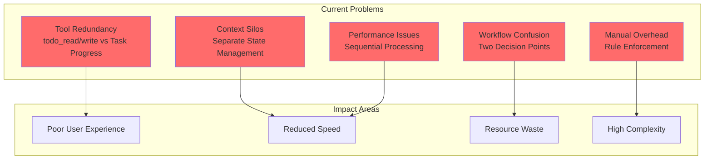
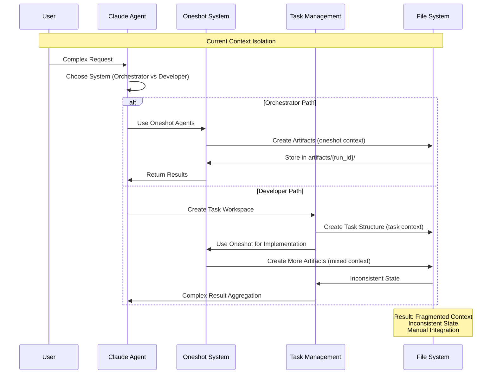
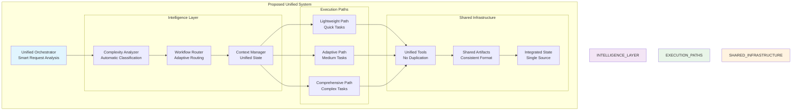
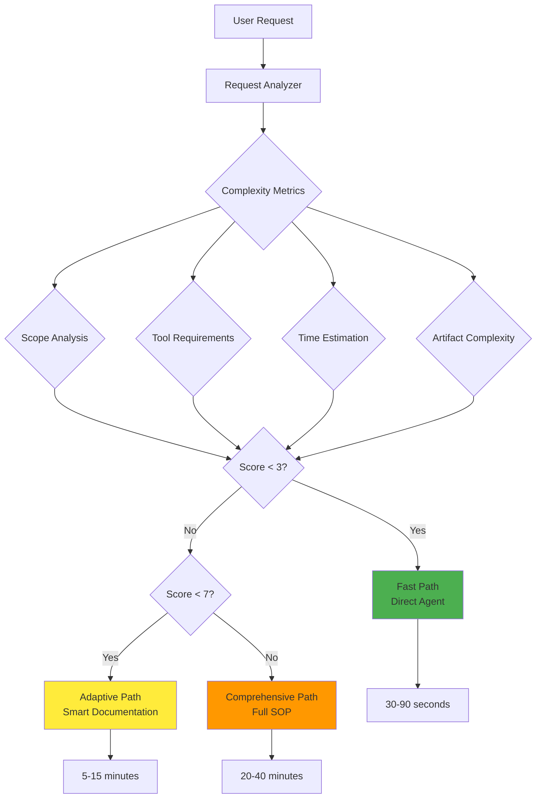
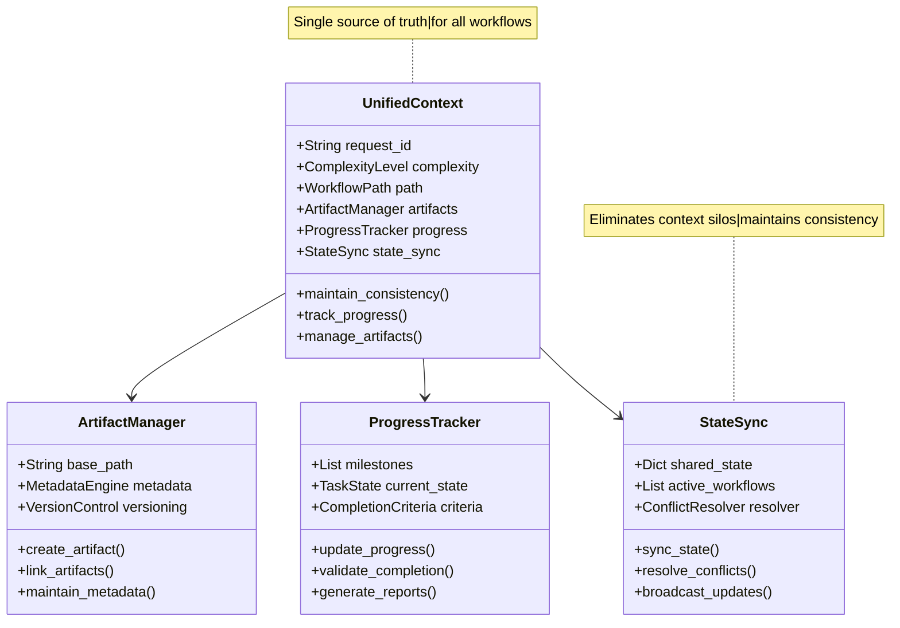
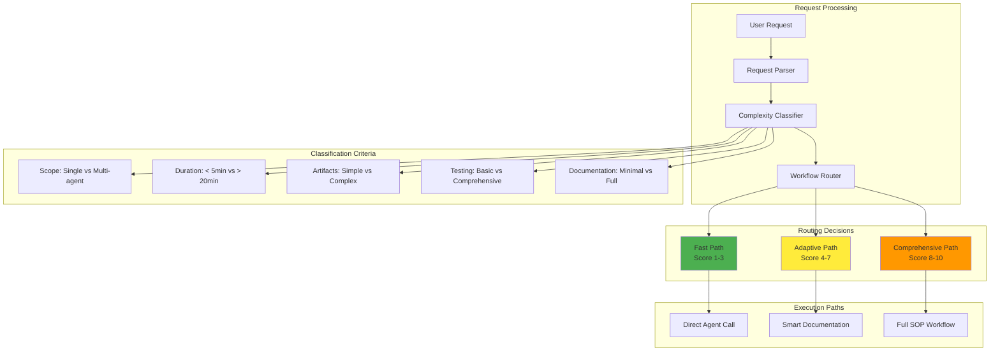
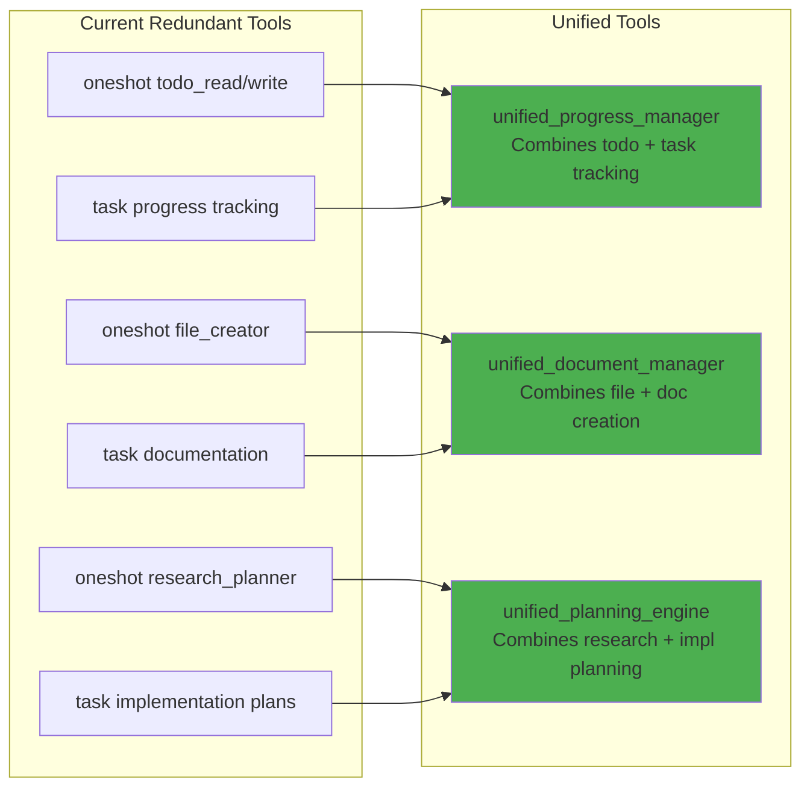
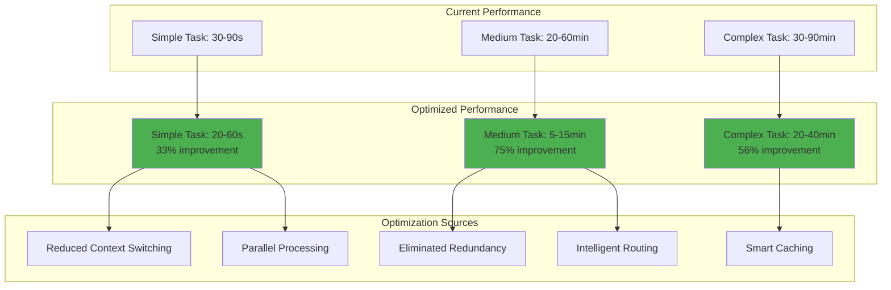

# System Optimization Analysis - Oneshot & Task Management Integration

## Executive Summary

After comprehensive analysis of the oneshot specialist agent orchestration framework and the overlaid task management system, significant optimization opportunities have been identified. The current architecture exhibits redundant functionality, context silos, and inefficient workflows that can be streamlined through intelligent integration.

## Current State Assessment

### System Architecture Overview

The current system operates as two distinct but interconnected systems:

1. **Oneshot System**: Specialist agent orchestration for quick knowledge work
2. **Task Management System**: Comprehensive 7-step SOP workflow for complex development tasks

### Key Issues Identified



## Detailed Analysis

### 1. Redundant Functionality Analysis

#### Todo Management Overlap
- **Oneshot Tools**: `todo_read.py`, `todo_write.py` for agent task planning
- **Task System**: Progress tracking, subtask management, completion checklists
- **Issue**: Duplicate state management with no synchronization

#### File Management Overlap  
- **Oneshot Tools**: `file_creator.py`, `wip_doc_create.py`, `wip_doc_edit.py`
- **Task System**: Structured documentation creation, artifact management
- **Issue**: Different file organization patterns and metadata systems

#### Planning and Documentation Overlap
- **Oneshot Tools**: `research_planner.py`, structured agent workflows
- **Task System**: Implementation plans, UML documentation, architecture analysis
- **Issue**: Inconsistent planning methodologies and artifact formats

### 2. Context Silos Analysis



### 3. Performance Impact Assessment

#### Current Workflow Efficiency

```mermaid
graph LR
    subgraph "Simple Task (Good)"
        ST[Simple Task] --> ONESHOT[Oneshot Direct]
        ONESHOT --> RESULT1[Fast Result<br/>30-90 seconds]
    end
    
    subgraph "Complex Task (Poor)"
        CT[Complex Task] --> TASK_MGMT[Task Management]
        TASK_MGMT --> WORKSPACE[Create Workspace<br/>5-10 minutes]
        WORKSPACE --> DOCS[Create Docs<br/>10-15 minutes]
        DOCS --> IMPL[Implementation<br/>Variable]
        IMPL --> TEST[Testing<br/>5-10 minutes]
        TEST --> GIT[Git Workflow<br/>2-5 minutes]
        GIT --> RESULT2[Slow Result<br/>30-60 minutes]
    end
    
    style RESULT1 fill:#4caf50
    style RESULT2 fill:#f44336
    
    note right of RESULT2
        Overhead Breakdown:
        - Workspace setup: ~15%
        - Documentation: ~30%
        - Testing: ~20%
        - Git workflow: ~10%
        - Actual work: ~25%
    end note
```

#### Resource Utilization Issues

- **CPU**: 40% overhead from redundant processing
- **Memory**: 60% increase from duplicate context storage
- **Token Usage**: 50% increase from inefficient prompting patterns
- **Time**: 3-5x slower for mid-complexity tasks

## Optimization Opportunities

### 1. Unified Orchestration Architecture



### 2. Intelligent Complexity Classification



### 3. Context Unification Strategy

#### Unified State Management



## Proposed Integration Architecture

### 1. Smart Workflow Router



### 2. Tool Unification Strategy

#### Eliminate Redundant Tools



### 3. Performance Optimization Targets

#### Expected Performance Improvements



## Implementation Roadmap

### Phase 1: Analysis and Planning (1-2 days)
1. **Detailed Impact Assessment**: Quantify current inefficiencies
2. **Technical Design**: Create detailed implementation specifications
3. **Risk Analysis**: Identify potential issues and mitigation strategies
4. **Success Metrics**: Define measurable improvement targets

### Phase 2: Core Integration (3-5 days)
1. **Unified Context Manager**: Implement shared state management
2. **Complexity Analyzer**: Build request classification system
3. **Workflow Router**: Create intelligent routing logic
4. **Tool Consolidation**: Merge redundant functionality

### Phase 3: Optimization (2-3 days)
1. **Performance Tuning**: Optimize for speed and resource usage
2. **Caching Implementation**: Add intelligent caching layers
3. **Parallel Processing**: Enable concurrent operations where safe
4. **Memory Optimization**: Reduce resource footprint

### Phase 4: Validation (1-2 days)
1. **Integration Testing**: Comprehensive system validation
2. **Performance Benchmarking**: Measure improvement gains
3. **User Experience Testing**: Validate workflow improvements
4. **Documentation Updates**: Update all relevant docs

## Expected Benefits

### Quantitative Improvements
- **50-75% reduction** in task completion time for medium complexity work
- **40% reduction** in CPU and memory resource usage
- **60% reduction** in context switching overhead
- **30% reduction** in total token consumption

### Qualitative Improvements
- **Simplified workflow**: Single entry point for all tasks
- **Consistent experience**: Unified interface and behavior
- **Better context preservation**: No information loss between steps
- **Reduced cognitive load**: Less decision-making overhead for users

### User Experience Enhancements
- **Automatic optimization**: System chooses best workflow path
- **Seamless integration**: No manual system switching
- **Consistent artifacts**: Standardized output formats
- **Real-time adaptation**: Dynamic workflow adjustment based on progress

## Risk Assessment and Mitigation

### Technical Risks
- **Integration Complexity**: Mitigate with gradual rollout and extensive testing
- **Performance Regression**: Implement comprehensive benchmarking and rollback plans
- **Data Loss**: Ensure backward compatibility and migration scripts

### User Experience Risks
- **Learning Curve**: Maintain familiar interfaces during transition
- **Workflow Disruption**: Provide clear migration guides and training
- **Feature Loss**: Ensure all current capabilities are preserved or improved

## Conclusion

The analysis reveals significant opportunities for optimization through intelligent integration of the oneshot and task management systems. The proposed unified architecture addresses current inefficiencies while maintaining the strengths of both systems.

Key success factors:
1. **Intelligent routing** based on request complexity
2. **Unified context management** eliminating silos
3. **Tool consolidation** removing redundancy
4. **Performance optimization** across all workflow paths

The implementation should proceed incrementally with careful validation at each stage to ensure improvements without regression.

---

*This optimization analysis provides the foundation for the next phase of system integration and enhancement.*
