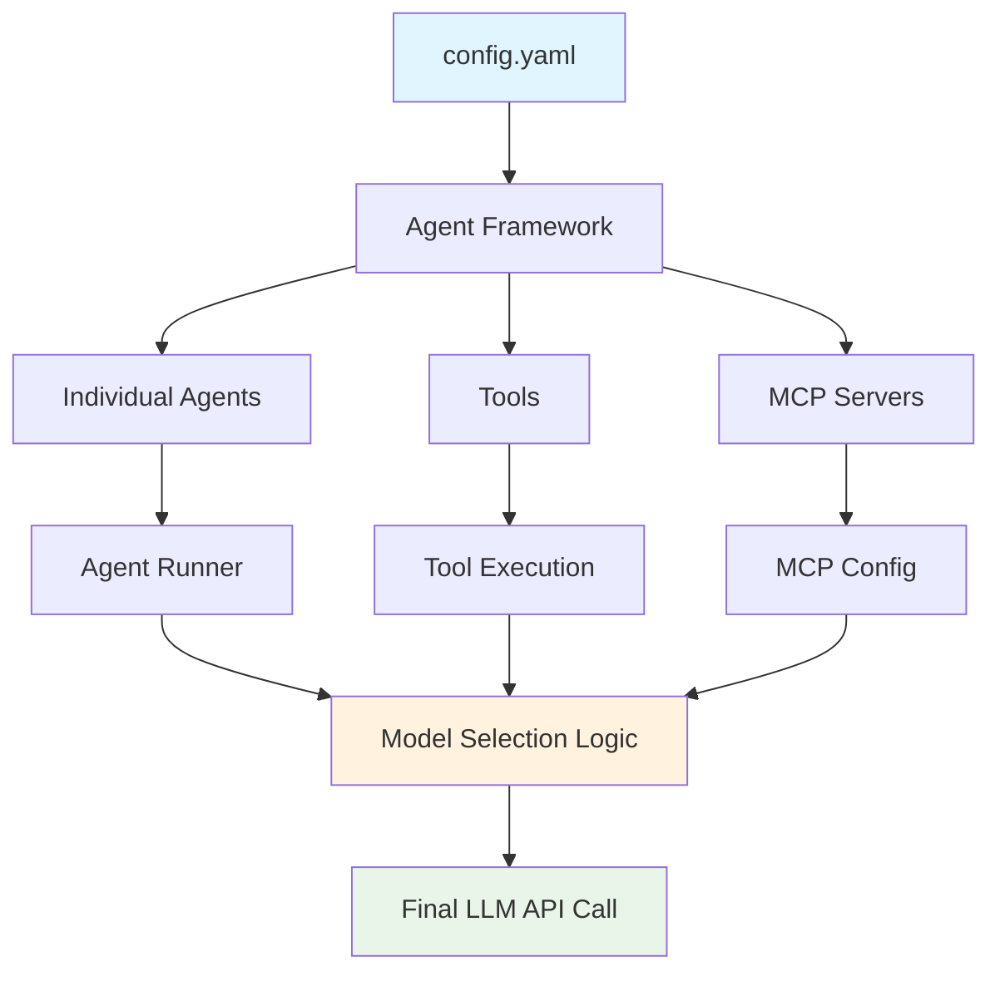
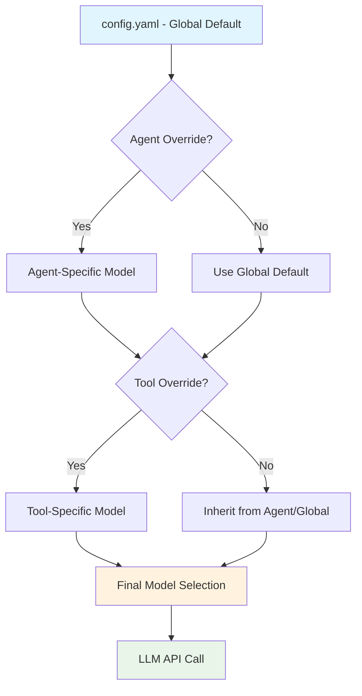
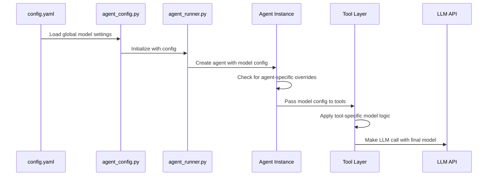

# MASTER Architecture UMLs - LLM Model Architecture Analysis

**Generated:** 2025-08-25T04:52:51.141Z  
**Task:** Comprehensive analysis of LLM model selection across oneshot architecture  
**Objective:** Verify config.yaml changes propagate system-wide and identify all model configuration points

---

## Executive Summary

This analysis examines how LLM model selection works throughout the oneshot agent framework to ensure our recent config.yaml updates (changing default from `gpt-4o-mini` to `gpt-5-nano`) actually take effect across all agents and tools.

**Key Questions to Answer:**
1. Do ALL agents inherit from config.yaml model settings?
2. Are there agent-specific model overrides in individual agent files?
3. How do tools specify their LLM model requirements?
4. Is there a hierarchy of model selection (global → agent → tool)?
5. Are there hardcoded model references that bypass config.yaml?

---

## System Architecture Overview

---

## Analysis Plan

### Phase 1: Core Configuration Analysis
- [ ] Examine agent_config.py and related configuration modules
- [ ] Analyze model_settings inheritance patterns
- [ ] Map configuration loading hierarchy

### Phase 2: Agent-Level Model Specification
- [ ] Search all agent markdown files for model specifications
- [ ] Identify agent-specific model overrides
- [ ] Document agent model selection patterns

### Phase 3: Tool-Level Model Requirements
- [ ] Analyze tool Python scripts for model references
- [ ] Check tool_services.py for model handling
- [ ] Identify tools that bypass agent model settings

### Phase 4: Runtime Model Selection Flow
- [ ] Trace agent_runner.py model selection logic
- [ ] Analyze agent_executor.py model handling
- [ ] Document complete model resolution process

### Phase 5: MCP Integration Model Handling
- [ ] Examine MCP server model configuration
- [ ] Check oneshot_mcp.py for model handling
- [ ] Verify MCP tools model inheritance

---

## Configuration Architecture Deep Dive

### Model Selection Hierarchy (Hypothesis)

### Expected Configuration Points
1. **Global Level**: `config.yaml` → `model_settings.model`
2. **Agent Level**: Individual agent `.md` files → model specifications
3. **Tool Level**: Tool Python scripts → model requirements
4. **Runtime Level**: Dynamic model selection based on task requirements

---

## Data Flow Analysis

### Configuration Loading Process

---

## Risk Analysis

### Potential Issues to Investigate
1. **Hardcoded Models**: Tools or agents with hardcoded model references
2. **Override Conflicts**: Multiple override sources causing conflicts
3. **Legacy References**: Old model names that don't exist anymore
4. **MCP Bypasses**: MCP servers that ignore agent model settings
5. **Cost Control**: Tools that might use expensive models despite config restrictions

### Configuration Drift Risks
- Agent files created before config.yaml updates
- Tools that directly call LLM APIs without checking config
- MCP servers with independent model configuration
- Development artifacts with hardcoded test models

---

## Testing Strategy

### Verification Methods
1. **Static Analysis**: Search codebase for all model references
2. **Configuration Tracing**: Follow config loading through call stack
3. **Runtime Testing**: Execute agents and verify actual model usage
4. **Cost Monitoring**: Confirm cost-effective models are actually used

### Test Cases to Execute
- [ ] Default agent execution (should use gpt-5-nano)
- [ ] Agent with explicit model override
- [ ] Tool with specific model requirements
- [ ] MCP server tool execution
- [ ] Blocked model fallback behavior

---

## Next Steps

1. **Immediate Actions**:
   - Search codebase for all "model" and "gpt" references
   - Analyze agent_config.py and agent_runner.py
   - Check individual agent files for model specifications

2. **Deep Analysis**:
   - Trace complete model selection flow
   - Identify all override mechanisms
   - Document configuration hierarchy

3. **Validation**:
   - Test actual model usage in runtime
   - Verify cost controls are working
   - Confirm config.yaml changes take effect

---

**Status**: Analysis in progress  
**Next Action**: Begin codebase search for model references
