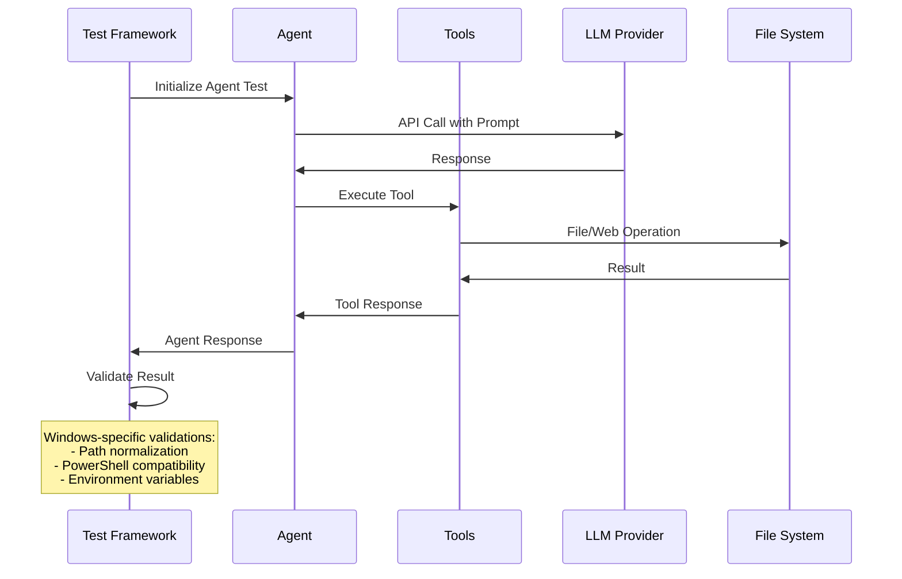
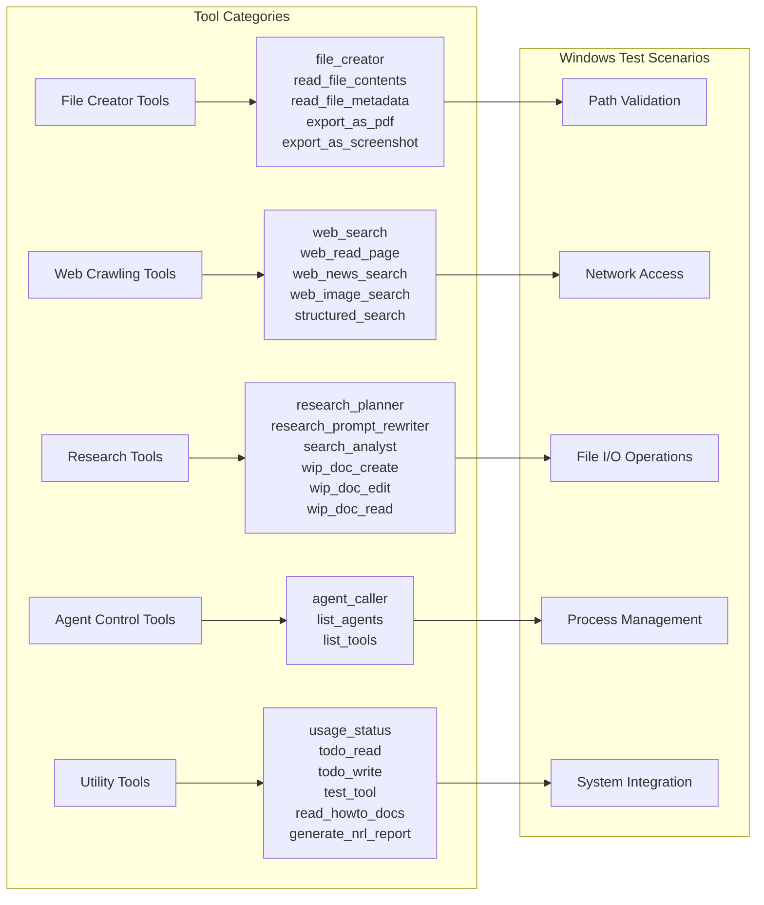
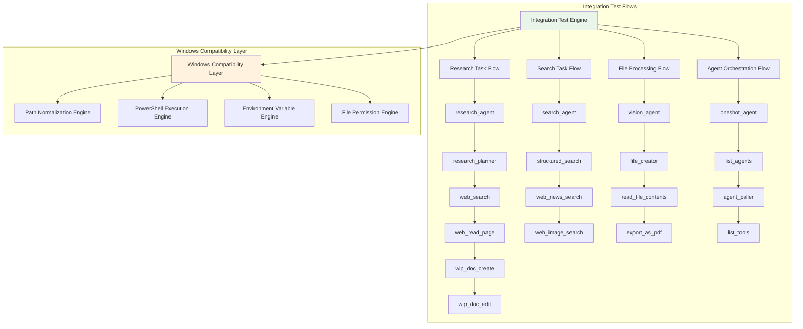
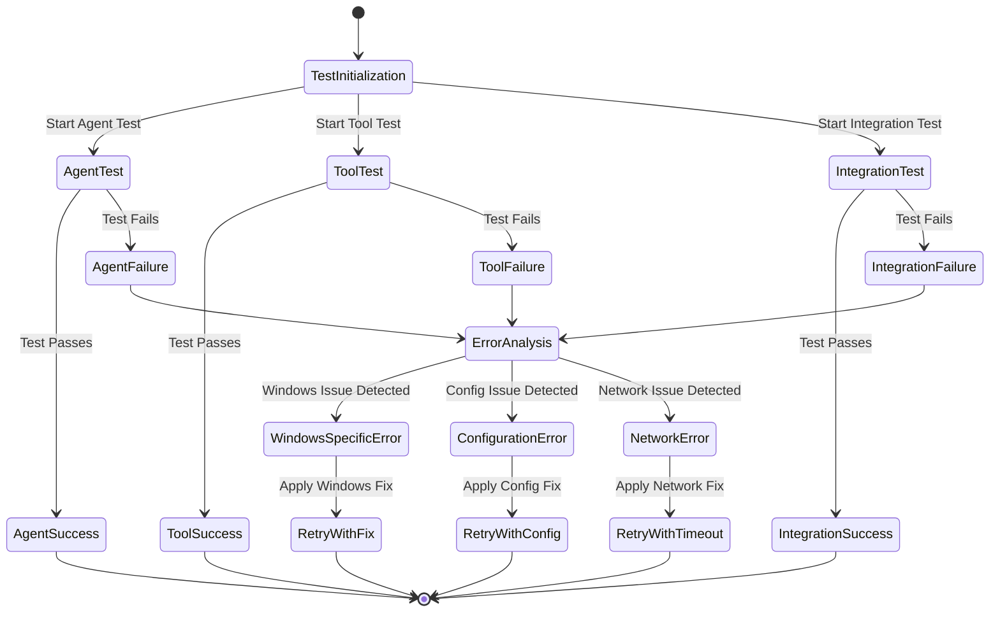
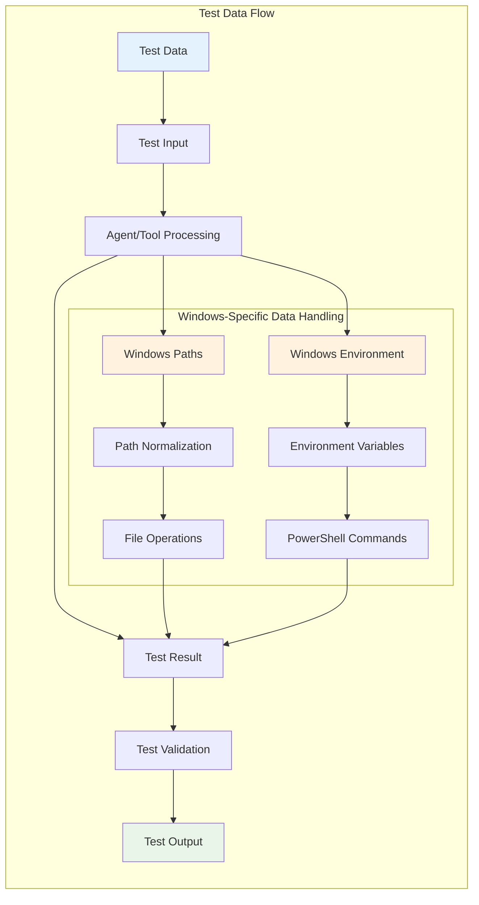
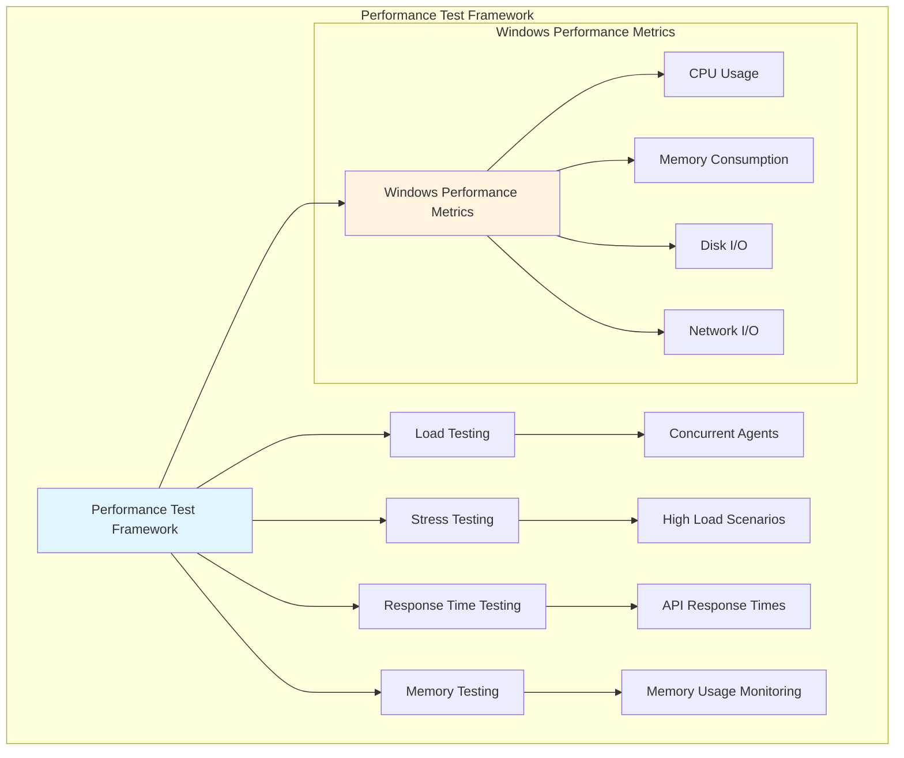

# Master Architecture UMLs - Oneshot Windows Testing

## System Testing Architecture Overview

```mermaid
graph TB
    subgraph "Test Framework Architecture"
        TR[Test Runner] --> AT[Agent Tests]
        TR --> TT[Tool Tests]
        TR --> IT[Integration Tests]
        TR --> WT[Windows Compatibility Tests]
        
        AT --> A1[news_search_agent]
        AT --> A2[nrl_agent]
        AT --> A3[oneshot_agent]
        AT --> A4[research_agent]
        AT --> A5[search_agent]
        AT --> A6[search_analyst]
        AT --> A7[vision_agent]
        AT --> A8[web_agent]
        
        TT --> T1[File Operations Tools]
        TT --> T2[Web Operations Tools]
        TT --> T3[Research Tools]
        TT --> T4[Agent Management Tools]
        TT --> T5[Document Tools]
        
        IT --> E2E[End-to-End Workflows]
        IT --> ATC[Agent-Tool Combinations]
        
        WT --> PE[Path Handling]
        WT --> CE[Command Execution]
        WT --> EV[Environment Variables]
        WT --> PS[PowerShell Integration]
    end
    
    subgraph "Oneshot System Under Test"
        OS[Oneshot System] --> AG[Agents]
        OS --> TO[Tools]
        OS --> MCP[MCP Servers]
        OS --> API[API Layer]
        
        AG --> LLM[LLM Providers]
        TO --> FS[File System]
        TO --> WEB[Web Services]
        MCP --> EXT[External Systems]
    end
    
    TR --> OS
    
    style TR fill:#e1f5fe
    style OS fill:#f3e5f5
    style WT fill:#fff3e0
```

## Agent Testing Flow Diagram

## Tool Testing Matrix

## Integration Test Architecture

## Error Handling and Recovery Architecture

## Data Flow Analysis

## Test Coverage Matrix

| Component Type | Test Coverage | Windows Specific | Integration Coverage |
|---------------|---------------|------------------|---------------------|
| Agents (8) | ✅ Unit Tests | ✅ Path Validation | ✅ End-to-End |
| Tools (25) | ✅ Unit Tests | ✅ Command Execution | ✅ Tool Chains |
| MCP Integration | ✅ Connection Tests | ✅ PowerShell Compatibility | ✅ Multi-Agent |
| File Operations | ✅ CRUD Tests | ✅ Windows Permissions | ✅ Workflow Tests |
| Web Operations | ✅ API Tests | ✅ Network Configuration | ✅ Search Workflows |

## Performance Testing Architecture

