# FINAL Architecture - Hybrid Template+AI Embedded Vault System

## Executive Summary

**FINAL DECISION**: Implement a hybrid organization system that extends the existing oneshot architecture with minimal changes. The system combines **structured templates for known session types** (coding, troubleshooting, research) with **AI intelligence for novel content**, all within an embedded Obsidian vault structure.

**Key Principles**:
- **Extend, Don't Replace**: Leverage existing `tool_services.py`, guides system, and MCP integration
- **Minimal Changes**: Backward-compatible extensions to core system
- **Human-Readable Naming**: Topic-based session names using heuristic/AI extraction
- **Hybrid Intelligence**: Templates for proven workflows + AI for creative organization
- **Flexible & Modular**: Easy to configure, extend, and customize

## Implementation Status

### **✅ Implemented Features**
- **Human-readable session naming**: `{topic_keywords}_{YYYY_MMDD}_{HHMMSS}` format
- **Heuristic topic extraction**: Simple but effective keyword extraction
- **VaultManager integration**: Session naming built into vault creation flow
- **Backward compatibility**: Fallback to original run_id format
- **Year-based timestamps**: Better chronological organization

### **🔄 In Development** 
- **LLM-enhanced topic extraction**: Using `tool_services.llm()` for better accuracy
- **Session type detection**: Improved classification for better organization
- **Cross-reference automation**: Obsidian-compatible linking system

### **🆕 Latest Developments - Intelligent Workspace Organization**
- **Dynamic Checkpoint System**: AI-driven validation with programmatic SOPs
- **Jinja2 Integration**: Enhanced snippet system for checkpoint templates
- **Reusable Checkpoint Library**: Multi-level template reusability (global, user, project)
- **Context-Aware Validation**: AI intelligence for nuanced validation decisions
- **Modular Architecture**: Clear separation in `/snippets/checkpoints/` and `/snippets/validation/`

## Current vs Proposed Architecture

### Current System (Preserved)

### Proposed Hybrid System (Extension)

## Class Diagram - Hybrid System Components

## Sequence Diagram - Hybrid Organization Workflow

## State Diagram - Content Lifecycle

## Component Diagram - Vault Structure

```mermaid
graph TB
    subgraph "oneshot/"
        subgraph "vault/ (Embedded Obsidian)"
            OBSIDIAN_CONFIG[".obsidian/<br/>• app.json<br/>• workspace.json<br/>• plugins/"]
            
            subgraph "projects/"
                PROJECT_A["ProjectA/<br/>• README.md<br/>• docs/<br/>• artifacts/<br/>• sessions/"]
                PROJECT_B["ProjectB/<br/>• README.md<br/>• docs/<br/>• artifacts/<br/>• sessions/"]
            end
            
            subgraph "sessions/"
                SESSION_1["0825_163415_5202/<br/>• README.md<br/>• artifacts<br/>• metadata"]
                SESSION_2["0825_174521_7893/<br/>• README.md<br/>• artifacts<br/>• metadata"]
            end
            
            subgraph "templates/"
                PROJECT_TEMPLATE["project.md<br/>Project template"]
                SESSION_TEMPLATE["session.md<br/>Session template"]
            end
        end
        
        subgraph "Legacy (Backward Compatibility)"
            LEGACY_ARTIFACTS["artifacts/{run_id}/"]
            LEGACY_RUNS["runs/{run_id}/"]
        end
        
        subgraph "Core System"
            APP_DIR["app/<br/>• vault_manager.py<br/>• tool_services.py<br/>• agent_runner.py"]
            TOOLS_DIR["tools/<br/>• promote_to_project.py<br/>• migrate_to_vault.py<br/>• analyze_vault.py"]
        end
    end
    
    OBSIDIAN_CONFIG -.-> PROJECT_TEMPLATE
    OBSIDIAN_CONFIG -.-> SESSION_TEMPLATE
    PROJECT_A -.-> SESSION_1
    PROJECT_B -.-> SESSION_2
    
    style OBSIDIAN_CONFIG fill:#2196f3,color:#fff
    style PROJECT_A fill:#4caf50,color:#fff
    style PROJECT_B fill:#4caf50,color:#fff
    style SESSION_1 fill:#e3f2fd
    style SESSION_2 fill:#e3f2fd
    style PROJECT_TEMPLATE fill:#ff9800,color:#fff
    style SESSION_TEMPLATE fill:#ff9800,color:#fff
```

## Data Flow Diagram - File Operations

## Benefits Analysis

### ✅ **Hybrid System Advantages**

#### **For Known Session Types (Templates)**
1. **Proven Workflows**: Battle-tested structures for coding, troubleshooting, research
2. **SOP Compliance**: Automatic adherence to 7-step coding workflow
3. **Consistency**: Same approach every time for similar work types
4. **Zero Learning Curve**: Uses established oneshot patterns
5. **Immediate Value**: No AI analysis needed, instant organization

#### **For Novel Content (AI Intelligence)**
1. **Creative Organization**: AI designs optimal structure for unique content
2. **Contextual Understanding**: Grasps specific nature of the work
3. **Cost-Effective**: GPT-5 Nano at ~$0.0005 per analysis
4. **Adaptive**: Not constrained by rigid templates
5. **Learning Opportunity**: AI discoveries can become future templates

#### **System Integration Benefits**
1. **Minimal Risk**: Extends existing system rather than replacing
2. **Backward Compatible**: All current workflows preserved
3. **Gradual Adoption**: Vault mode is completely optional
4. **Resource Efficient**: Leverages existing infrastructure
5. **Developer Friendly**: Follows established oneshot patterns

### ✅ **Enhanced Capabilities**
1. **Dual Organization**: Template precision + AI creativity
2. **Real-time Obsidian**: Immediate knowledge management access
3. **Cross-Referencing**: Automatic linking between related content
4. **Full-Text Search**: Powerful discovery across all content
5. **Graph Visualization**: Obsidian's knowledge graph features
6. **Extensible Templates**: Easy to add new session types
7. **AI Validation**: Bulletproof fallback systems

### ✅ **Future-Proof Design**
1. **Modular Architecture**: Each component can evolve independently
2. **Template Evolution**: AI insights can improve existing templates
3. **Easy Extension**: New session types and validation rules
4. **Configuration Driven**: YAML-based customization
5. **Tool Ecosystem**: Follows oneshot tool creation patterns

## Implementation Strategy

### **PRIORITY 1: Extension Approach** ⭐⭐⭐
**Focus**: Minimal changes to existing system
- **Extend** `app/tool_services.py` with vault awareness
- **Add** vault configuration to existing `config.yaml`
- **Create** new guides following existing pattern in `app/guides/`
- **Leverage** existing MCP integration and tool discovery

### **Phase 1: Core Extensions (Week 1)**
**Files Modified (Minimal)**:
- `app/tool_services.py` - Add vault mode check and enhanced save()
- `config.yaml` - Add vault configuration section

**New Files Created**:
- `app/vault_manager.py` - New module following existing patterns
- `app/session_type_detector.py` - Template vs AI routing
- `app/guides/how_to_use_vault_organization.md` - Following existing guide format

### **Phase 2: Hybrid Engine (Week 2)**
**New Tools** (Following existing `/tools/*.py` pattern):
- `tools/organize_content.py` - Main organization tool
- `tools/create_template.py` - Template creation tool
- `tools/promote_to_project.py` - Session promotion tool

**Templates**:
- Coding development template (SOP-compliant)
- Troubleshooting template (systematic approach)
- Research template (academic structure)

### **Phase 3: AI Integration (Week 3)**
- GPT-5 Nano integration for novel content
- Response validation and fallback systems
- Template vs AI decision engine

### **Phase 4: Polish & Validation (Week 4)**
- Comprehensive testing with existing workflows
- Documentation updates
- Migration tools for existing content

## Key Design Decisions

### **Extension Over Replacement**
- **ToolHelper.save()**: Enhanced with optional vault awareness
- **Backward Compatibility**: vault_mode=false preserves existing behavior
- **Guide System**: New guides added to existing `read_instructions_for()` system
- **Tool Discovery**: New tools auto-discovered by existing system

### **Hybrid Intelligence**
- **Known Types**: Use proven templates (coding=SOP, troubleshooting=systematic)
- **Unknown Types**: Use AI creativity for novel organization
- **Cost Control**: AI only used when templates don't match
- **Learning Loop**: AI discoveries can become future templates

### **Modular & Extensible**
- **YAML Configuration**: Easy to modify session types and templates
- **Template Registry**: Dynamic template registration system
- **Validation Framework**: Pluggable checkpoint system
- **Tool Ecosystem**: Follows established oneshot patterns

## Critical Questions for User Alignment

### **Template Configuration**
1. **Session Types**: Are the proposed session types sufficient (coding, troubleshooting, research, documentation)? 
   - Should we add others (design, analysis, planning)?
   - What specific templates would be most valuable for your workflow?

   **✅ USER ANSWERS**:
   - Eventually yes, will have more types, but need to avoid overlap
   - **Concern**: Overlap between types (design=planning, coding=troubleshooting)
   - **Solution**: Bundle similar types together for simplicity 
   - **Complexity Consideration**: Templates should adapt to task complexity
   - **Simple tasks**: AI should be intelligent enough to use just one document
   - **Complex tasks**: AI expands into full template structure as needed
   - **Non-coding tasks**: More dynamic, AI uses templates as inspiration

2. **SOP Integration**: For coding development template:
   - Should it strictly follow the current 7-step SOP?
   - Any modifications needed for the SOP workflow within vault structure?

   **✅ USER ANSWERS**:
   - **Coding/Troubleshooting**: Keep strict 7-step SOP (validation is critical)
   - **Scope**: OneShot for smaller development tasks, not full apps
   - **Full apps**: Would move to separate IDE workspace
   - **Current SOP**: Keep 7-step for now, can add more later
   - **Rationale**: Need comprehensive validation and easy system overview

### **AI Decision Boundaries**
3. **Confidence Threshold**: The current threshold is 0.7 for template vs AI routing
   - Is this appropriate or should it be higher/lower?
   - Should users be able to force AI mode even for known types?

   **✅ USER ANSWERS**:
   - **Confidence threshold**: Not confident about 0.7 - too subjective
   - **Need**: More definitions for confidence ranges to make less subjective
   - **Force AI mode**: Definitely yes - users should be able to force modes
   - **Implementation**: Dynamic switching via chat commands
   - **Examples**: "Change to development task", "restructure as planning task"
   - **System requirement**: Orchestrator should recognize and redirect

4. **Cost Tolerance**: GPT-5 Nano costs ~$0.0005 per analysis
   - Is this cost acceptable for organization decisions?
   - Should there be daily/monthly limits?

   **✅ USER ANSWERS**:
   - **Cost**: Don't care - GPT-5 Nano extremely cheap and negligible
   - **Usage**: Use as many calls as needed to make system smarter
   - **Optimization**: Be optimal but cost not a constraint
   - **Priority**: System intelligence > cost optimization

### **Vault Integration**
5. **Obsidian Dependency**: The system embeds Obsidian vault but doesn't require Obsidian app
   - Should the system work equally well without Obsidian installed?
   - Any specific Obsidian features that are critical vs nice-to-have?

   **✅ USER ANSWERS**:
   - **Without Obsidian**: Should work equally well (vault is just files/folders)
   - **Obsidian compatibility**: Use same syntax/structure so user can add Obsidian later
   - **Easy migration**: Point Obsidian app to directory → everything works
   - **Features**: Frontmatter, linking syntax all intact without app
   - **Plugins**: Can add later, auto-update when user opens Obsidian
   - **Current focus**: Don't worry about Obsidian features for now

6. **Migration Strategy**: For existing content:
   - Automatic migration vs manual selection?
   - Should legacy `/artifacts/{run_id}/` structure be preserved indefinitely?

   **✅ USER ANSWERS**:
   - **No legacy**: This is brand new development, no existing users
   - **No migration needed**: Everything in codebase is just tests
   - **Fresh start**: Complete restructure - OneShot 2.0
   - **No backward compatibility**: Not needed since no real legacy data
   - **Renaming**: Will rename from "oneshot" to something else

### **Implementation Priorities**
7. **Rollout Approach**: 
   - Should vault mode be disabled by default initially?
   - Beta testing with specific session types first?
   - Which templates should be implemented first?

   **✅ USER ANSWERS**:
   - **Vault mode**: Start enabled - create vault folder from beginning
   - **Default behavior**: Should work with or without Obsidian
   - **Templates**: Need clarity on templates vs agents relationship
   - **Question**: Do templates live under agents/ or templates/ directory?
   - **Agents vs Templates**: Agents have different tools, templates structure files/folders

8. **Extension Points**: 
   - Priority for checkpoint validation system?
   - Most important new tools to implement first?

   **✅ USER ANSWERS**:
   - **Checkpoint validation**: High priority - system gets complex, AI gets confused
   - **Purpose**: Programmatic checkpoints for reliable, consistent operation
   - **Need**: Keep system running reliably as complexity grows

## Optimization Strategies

### **Performance Optimizations**
1. **AI Caching**: Cache AI decisions for similar content patterns
2. **Template Matching**: Optimize session type detection algorithms
3. **Vault Indexing**: Implement efficient file organization and search
4. **Lazy Loading**: Load vault components only when needed

### **User Experience Optimizations**
1. **Progressive Disclosure**: Start simple, reveal advanced features gradually
2. **Smart Defaults**: Learn from user patterns to improve defaults
3. **Quick Actions**: Keyboard shortcuts for common operations
4. **Preview Mode**: Show organization preview before applying

### **System Optimizations**
1. **Resource Management**: Minimize memory footprint of vault operations
2. **Error Recovery**: Graceful degradation when systems fail
3. **Monitoring**: Track usage patterns to optimize template matching
4. **Feedback Loop**: Capture user corrections to improve AI decisions

## Enhanced Architecture - Intelligent Workspace Organization & Checkpoint System

### **Dynamic Checkpoint Creation Flow**

```mermaid
graph TD
    USER_REQUEST["User Request: Create workspace"] --> AI_PLANNER["AI Checkpoint Planner<br/>🧠 Analyzes request"]
    
    AI_PLANNER --> CHECK_LIBRARY["Check Existing Library<br/>📚 available_checkpoints.md"]
    
    CHECK_LIBRARY --> DECISION{"Checkpoint Types<br/>Exist?"}
    
    DECISION -->|"All Exist"| USE_EXISTING["Use Existing Types<br/>✅ Load from library"]
    
    DECISION -->|"Some Missing"| CREATE_NEW["Create New Checkpoint Types<br/>🆕 AI generates definitions"]
    
    CREATE_NEW --> SAVE_TO_LIBRARY["Save to Library<br/>💾 Update available_checkpoints.md<br/>💾 Create instruction files"]
    
    USE_EXISTING --> BUILD_SEQUENCE["Build Custom Sequence"]
    SAVE_TO_LIBRARY --> BUILD_SEQUENCE
    
    BUILD_SEQUENCE --> EXECUTE["Execute Checkpoints<br/>🔄 Validate each step<br/>🔄 AI + programmatic validation"]
    
    EXECUTE --> REUSABLE["Save as Template<br/>📚 Global/User/Project library"]
    
    style AI_PLANNER fill:#e3f2fd
    style CREATE_NEW fill:#e8f5e8
    style BUILD_SEQUENCE fill:#fff3e0
    style EXECUTE fill:#f3e5f5
```

### **OneShot 2.0 Integration Architecture**

```mermaid
graph TD
    subgraph "OneShot System Architecture"
        subgraph "Core System (/app)"
            APP_CORE["Agent Runner<br/>Agent Executor<br/>Tool Services<br/>MCP Server"]
        end
        
        subgraph "Agent Definitions (/agents)"
            AGENTS["Specialist Agents<br/>research_agent.md<br/>vision_agent.md<br/>web_agent.md"]
        end
        
        subgraph "Enhanced Template System (/snippets)"
            CONTENT["content/<br/>📄 Agent templates<br/>📄 Content snippets"]
            CHECKPOINTS["checkpoints/<br/>📋 Validation templates<br/>📋 Sequence definitions<br/>📋 Library catalog"]
            VALIDATION["validation/<br/>⚡ Rules & patterns<br/>⚡ Quality standards"]
        end
        
        subgraph "Tool Ecosystem (/tools)"
            EXISTING_TOOLS["Existing Tools<br/>web_search.py<br/>file_creator.py"]
            NEW_TOOLS["🆕 Checkpoint Tools<br/>checkpoint_manager.py<br/>sop_generator.py"]
        end
    end
    
    APP_CORE --> CHECKPOINTS
    AGENTS --> CONTENT
    NEW_TOOLS --> CHECKPOINTS
    NEW_TOOLS --> VALIDATION
    CHECKPOINTS --> VALIDATION
    
    style CHECKPOINTS fill:#e8f5e8
    style VALIDATION fill:#fff3e0
    style NEW_TOOLS fill:#e3f2fd
```

### **Workspace Evolution System**

### **Multi-Level Reusability Framework**

```mermaid
graph TD
    subgraph "Reusability Levels"
        GLOBAL["Global Library<br/>🌍 System-wide templates<br/>📚 Available to all users"]
        
        USER["User Library<br/>👤 Personal templates<br/>🔄 Across user's projects"]
        
        PROJECT["Project Library<br/>📁 Project-specific<br/>🎯 Optimized for domain"]
        
        SESSION["Session Cache<br/>⚡ Current session<br/>🗑️ Temporary"]
    end
    
    subgraph "Reuse Mechanisms"
        SAVE_AS["Save Sequence As Template"]
        LOAD_FROM["Load Sequence From Template"]
        CUSTOMIZE["Customize Existing Template"]
        SHARE["Share Template with Others"]
    end
    
    GLOBAL --> LOAD_FROM
    USER --> LOAD_FROM
    PROJECT --> LOAD_FROM
    SESSION --> SAVE_AS
    
    SAVE_AS --> USER
    SAVE_AS --> PROJECT
    CUSTOMIZE --> SESSION
    SHARE --> GLOBAL
    
    style GLOBAL fill:#e8f5e8
    style USER fill:#e3f2fd
    style PROJECT fill:#fff3e0
    style SESSION fill:#fff9c4
```

### **Key Integration Benefits**

1. **Seamless Enhancement**: Checkpoint system integrates with existing OneShot architecture
2. **AI-Driven Intelligence**: Dynamic checkpoint creation based on user needs
3. **Reusable Templates**: Multi-level library system for efficient reuse
4. **Context Preservation**: System improvements don't lose task progress
5. **Flexible Validation**: Mix of programmatic checks and AI intelligence
6. **Continuous Learning**: System gets smarter with each use

## Conclusion

The enhanced hybrid template+AI embedded vault system with intelligent workspace organization provides **the optimal balance** of:
- **Proven workflows** for established patterns (templates)
- **Creative intelligence** for novel content (AI)
- **Dynamic validation** through programmatic checkpoints
- **Intelligent organization** that evolves with user needs
- **Minimal implementation risk** (extends existing system)
- **Maximum user value** (Obsidian knowledge management + smart workflows)

**Next Steps**: Complete workspace reorganization and consistency updates, then proceed with implementation of checkpoint system starting with enhanced snippets structure.