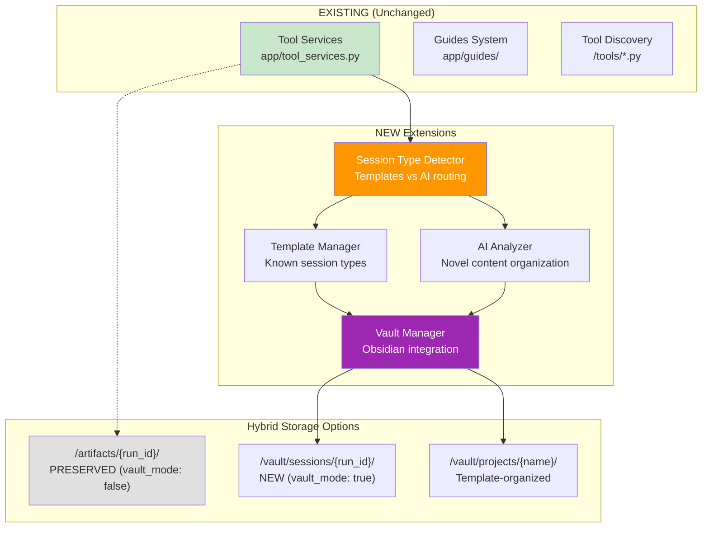
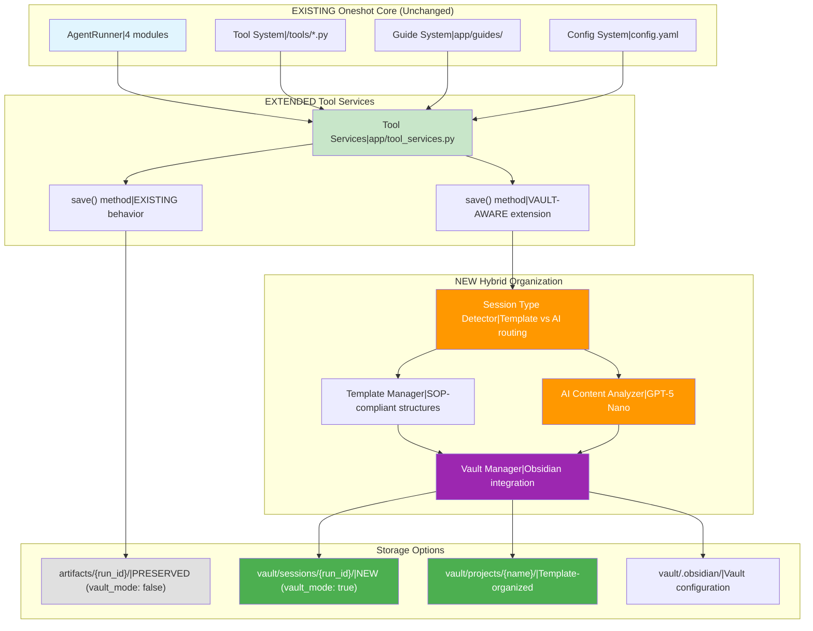
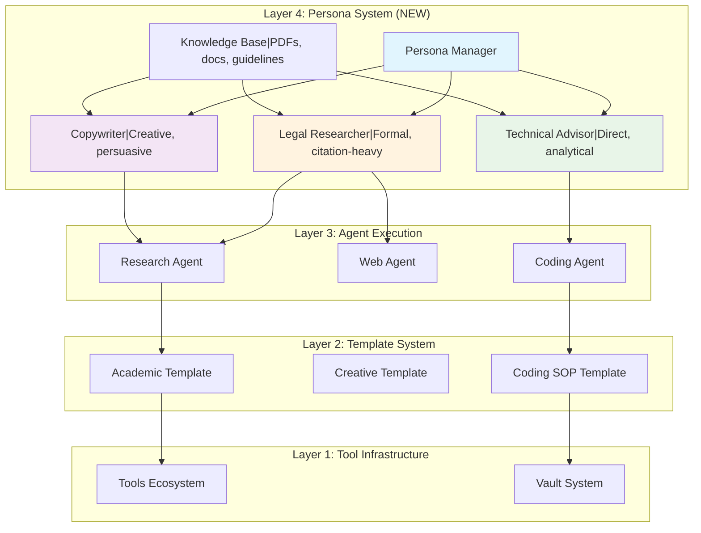

# FINAL Architecture & Implementation Plan - Hybrid Template+AI Vault System

## Executive Summary

After comprehensive analysis of the oneshot system architecture and the need to balance structure with flexibility, this document presents the final recommended approach: **A hybrid organization system that extends the existing oneshot architecture** with minimal changes, combining **structured templates for known session types** with **AI intelligence for novel content**, all within an embedded Obsidian vault.

**Core Strategy**: Extend existing `tool_services.py`, guides system, and MCP integration rather than replacing them, ensuring backward compatibility while adding sophisticated organization capabilities.

## System Analysis: Current vs Proposed

### **CURRENT SYSTEM (Preserved & Extended)**

#### **Existing Infrastructure (UNCHANGED)**
- **`app/tool_services.py`**: Core functionality for LLM integration, file operations
- **`app/guides/`**: Documentation system with `read_instructions_for()` MCP tool
- **`/tools/*.py`**: Auto-discovered tool ecosystem
- **`config.yaml`**: Configuration management
- **Agent Runner**: 4-module system for agent execution
- **Run Persistence**: `/runs/{run_id}/` conversation history

#### **Current Organization (Preserved)**
```
/artifacts/{run_id}/          # PRESERVED - Legacy mode
├── file1.md                  # YAML frontmatter
├── file2.json                # JSON metadata wrapper
└── file3.py                  # Generated code
```

#### **Current Workflow (Enhanced)**
1. User creates content → `tool_services.save()` → `/artifacts/{run_id}/`
2. Automatic YAML frontmatter injection
3. Run-aware organization by conversation
4. Manual task workspace creation via Cursor rules

### **PROPOSED EXTENSIONS (New Capabilities)**

#### **Hybrid Organization Engine (NEW)**


#### **Template System (NEW)**
- **Coding Development**: SOP-compliant 7-step workflow structure
- **Troubleshooting**: Systematic problem resolution approach  
- **Research**: Academic structure with methodology, findings
- **Documentation**: Technical writing patterns
- **Custom Templates**: User-defined structures via YAML

#### **AI Intelligence (NEW)**
- **GPT-5 Nano Integration**: Cost-effective analysis (~$0.0005)
- **Dynamic Organization**: Creative structure for novel content
- **Content Analysis**: Contextual understanding and placement
- **Fallback Systems**: Validation and error recovery

#### **Front-Matter & Indexing System (NEW)**
- **Mandatory Standards**: 6 required fields (title, created, type, purpose, status, tags)
- **Cross-Platform Support**: Windows (`\r\n`) and Unix (`\n`) line endings
- **Automated Validation**: Real-time compliance checking via `frontmatter_validator.cjs`
- **Auto-Generation**: Intelligent INDEX.md creation via `global_indexer.cjs`
- **Quality Assurance**: Eliminates "No description available" through proper metadata

## Recommended Solution: Hybrid Template+AI Embedded Vault with Persona Layer

### **Final Architecture: Extension Approach**


### Directory Structure
```
oneshot/
├── vault/                          # NEW: Embedded Obsidian vault
│   ├── .obsidian/                 # Obsidian configuration
│   │   ├── app.json               # Vault settings
│   │   ├── workspace.json         # Layout configuration
│   │   ├── templates/             # Note templates
│   │   └── plugins/               # Obsidian plugins
│   ├── projects/                  # Long-lived projects
│   │   ├── {ProjectName}/
│   │   │   ├── docs/              # Project documentation
│   │   │   ├── artifacts/         # Generated files
│   │   │   ├── sessions/          # Related conversations
│   │   │   └── README.md          # Project overview
│   ├── sessions/                  # Individual conversations
│   │   └── {topic_keywords}_{YYYY_MMDD}_{HHMMSS}/    # Human-readable session names
│   ├── .temp/                     # Temporary workspace
│   │   └── {run_id}/              # Working files
│   └── templates/                 # Obsidian templates
│       ├── project.md             # Project template
│       └── session.md             # Session template
├── artifacts/                     # LEGACY: Backward compatibility
├── runs/                          # LEGACY: Conversation history
├── tasks/                         # MIGRATION TARGET
└── app/
    ├── vault_manager.py           # NEW: Vault management
    ├── tool_services.py           # Enhanced with vault support
    └── agent_runner.py            # Vault-aware routing
```

## Persona System Integration (CustomGPT Equivalent)

### **4-Layer Architecture with Persona Support**

The hybrid system includes a **persona layer** for CustomGPT-equivalent functionality:



### **Persona Configuration Structure**

```
vault/personas/                        # NEW: Chat personalities
├── legal_researcher/
│   ├── config.md                      # Persona configuration
│   ├── system_instructions.md         # Communication style
│   └── knowledge/                     # Knowledge base
│       ├── legal_research_methodology.pdf
│       ├── citation_standards.md
│       └── jurisdiction_guidelines.pdf
├── copywriter/
│   ├── config.md
│   ├── system_instructions.md
│   └── knowledge/
│       ├── copywriting_frameworks.md
│       ├── brand_voice_guidelines.pdf
│       └── conversion_psychology.md
└── technical_advisor/
    ├── config.md
    ├── system_instructions.md
    └── knowledge/
        ├── software_architecture_patterns.md
        └── security_best_practices.md
```

### **Persona vs Agent Decision Framework**

| **Create a PERSONA when** | **Create an AGENT when** |
|---------------------------|---------------------------|
| ✅ Changes communication style | ✅ Needs specialized tools |
| ✅ Has specialized knowledge base | ✅ Executes technical tasks |
| ✅ Delegates to existing agents | ✅ Has unique capabilities |
| ✅ Manages conversation approach | ✅ Does work vs manages communication |

### **Context-Efficient Persona Switching**

```python
class PersonaContextManager:
    def switch_persona(self, new_persona_name: str, current_run_id: str):
        """Switch persona without losing conversation context"""
        persona_config = self.load_persona(new_persona_name)
        
        return {
            "system_instructions": persona_config["system_instructions"],
            "knowledge_base": self.get_relevant_knowledge(persona_config),
            "communication_style": persona_config["communication_style"],
            "message_history": self.preserve_existing_history(current_run_id),
            "token_optimization": "Previous persona instructions replaced"
        }
        
    def get_relevant_knowledge(self, persona_config):
        """Just-in-time knowledge retrieval (like index-first file selection)"""
        knowledge_index = self.index_persona_documents(persona_config["name"])
        return self.selective_knowledge_loading(knowledge_index, max_tokens=1000)
```

### **Persona Integration Benefits**

- ✅ **CustomGPT Migration**: Direct path for importing custom GPT configurations
- ✅ **Knowledge Base Support**: Attach PDFs, documents, domain expertise
- ✅ **Context Efficiency**: Token-optimized persona switching
- ✅ **Agent Coordination**: Personas delegate to appropriate specialist agents
- ✅ **Communication Styles**: Legal precision, creative persuasion, technical analysis

## Implementation Strategy: Extension Approach

### **Key Implementation Principles**
1. **Minimal Changes**: Extend existing `tool_services.py` rather than replace
2. **Backward Compatibility**: vault_mode=false preserves current behavior
3. **Gradual Adoption**: Users can enable vault features when ready
4. **Leverage Existing**: Use current guides, tools, and MCP integration

### **Phase 1: Core Extensions**

#### **1. Enhanced Tool Services (MINIMAL CHANGE)**
```python
# NEW: app/vault_manager.py
from pathlib import Path
import json
from datetime import datetime
from typing import Dict, Any, Optional

class VaultManager:
    def __init__(self, vault_path: Path = None):
        self.vault_path = vault_path or Path("vault")
        self.projects_path = self.vault_path / "projects"
        self.sessions_path = self.vault_path / "sessions"
        self.temp_path = self.vault_path / ".temp"
        self.obsidian_config = self.vault_path / ".obsidian"
        self.templates_path = self.vault_path / "templates"
    
    def initialize_vault(self):
        """Set up embedded Obsidian vault with optimal configuration"""
        # Create directory structure
        for path in [self.projects_path, self.sessions_path, self.temp_path, 
                     self.obsidian_config, self.templates_path]:
            path.mkdir(parents=True, exist_ok=True)
        
        # Configure Obsidian settings
        self._setup_obsidian_config()
        self._setup_templates()
        self._create_vault_index()
    
    def _setup_obsidian_config(self):
        """Create optimized Obsidian configuration"""
        app_config = {
            "legacyEditor": False,
            "livePreview": True,
            "foldHeading": True,
            "foldIndent": True,
            "showFrontmatter": True,
            "showLineNumber": True,
            "spellcheck": True,
            "strictLineBreaks": True,
            "tabSize": 2,
            "useMarkdownLinks": True,
            "newFileLocation": "folder",
            "newFileFolderPath": "sessions",
            "attachmentFolderPath": "artifacts"
        }
        
        (self.obsidian_config / "app.json").write_text(
            json.dumps(app_config, indent=2)
        )
        
        # Workspace layout
        workspace_config = {
            "main": {
                "id": "oneshot-workspace",
                "type": "split",
                "children": [
                    {
                        "id": "file-explorer",
                        "type": "leaf",
                        "state": {"type": "file-explorer"}
                    },
                    {
                        "id": "graph-view",
                        "type": "leaf", 
                        "state": {"type": "graph"}
                    }
                ]
            },
            "left": {
                "id": "sidebar",
                "type": "split",
                "children": [
                    {"type": "tab", "children": [
                        {"id": "file-explorer", "type": "leaf"}
                    ]}
                ]
            }
        }
        
        (self.obsidian_config / "workspace.json").write_text(
            json.dumps(workspace_config, indent=2)
        )
    
    def _setup_templates(self):
        """Create Obsidian templates for consistent formatting"""
        # Project template
        project_template = """---
project: {{title}}
created: {{date:YYYY-MM-DD}}
status: active
tags: [oneshot, project]
type: project-overview
---

# {{title}}

## Overview

**Purpose**: Brief description of what this project accomplishes.

**Status**: {{status}}

**Created**: {{date:YYYY-MM-DD}}

## Goals

- [ ] Primary objective 1
- [ ] Primary objective 2
- [ ] Primary objective 3

## Progress Log

### {{date:YYYY-MM-DD}} - Project Created
- Initial setup and planning

## Related Sessions

*Sessions that contributed to this project will be listed here*

## Key Artifacts

*Important files and documents will be referenced here*

## Notes

*Additional context, decisions, and learnings*
"""
        
        (self.templates_path / "project.md").write_text(project_template)
        
        # Session template
        session_template = """---
session_id: {{title}}
created: {{date:YYYY-MM-DD HH:mm}}
tags: [oneshot, session]
type: conversation
related_project: 
status: active
---

# Session: {{title}}

**Started**: {{date:YYYY-MM-DD HH:mm}}
**Run ID**: {{title}}

## Context

*What prompted this conversation?*

## Objectives

- [ ] Objective 1
- [ ] Objective 2

## Key Outputs

*Files and artifacts generated during this session*

## Decisions Made

*Important decisions and their rationale*

## Next Steps

*Follow-up actions or related work*
"""
        
        (self.templates_path / "session.md").write_text(session_template)
    
    def _generate_session_name(self, run_id: str, context: str = None) -> str:
        """Generate human-readable session name using AI topic extraction"""
        if context:
            # Use AI to extract meaningful topic keywords
            topic_keywords = self._extract_topic_keywords(context)
            if topic_keywords and len(topic_keywords) > 0:
                # Format: {topic_keywords}_{YYYY_MMDD}_{HHMMSS}
                timestamp = datetime.now().strftime("%Y_%m%d_%H%M%S")
                return f"{topic_keywords}_{timestamp}"
        
        # Fallback to run_id if AI extraction fails
        return run_id
    
    def _extract_topic_keywords(self, content: str) -> str:
        """Extract 2-4 key topic words from content using AI"""
        # Simplified extraction for example - in real implementation would use LLM
        content_words = content.lower().split()
        
        # Remove common words and extract meaningful terms
        stop_words = {'the', 'a', 'an', 'and', 'or', 'but', 'in', 'on', 'at', 'to', 'for', 'of', 'with', 'by'}
        meaningful_words = [word for word in content_words[:10] if word not in stop_words and len(word) > 2]
        
        # Take first 2-3 words and join with underscores
        return '_'.join(meaningful_words[:3]) if meaningful_words else "session_topic"
    
    def create_session_workspace(self, run_id: str, context: str = None) -> Path:
        """Create a new session workspace with human-readable naming"""
        # Generate human-readable session name using AI topic extraction
        session_name = self._generate_session_name(run_id, context)
        session_dir = self.sessions_path / session_name
        session_dir.mkdir(parents=True, exist_ok=True)
        
        # Create session overview
        session_file = session_dir / "README.md"
        if not session_file.exists():
            content = f"""---
session_id: {session_name}
run_id: {run_id}
created: {datetime.now().isoformat()}
tags: [oneshot, session]
type: conversation
status: active
organization_method: hybrid
---

# Session: {session_name}

**Started**: {datetime.now().strftime('%Y-%m-%d %H:%M')}

## Context
{context or 'New conversation session'}

## Artifacts
*Generated files will be listed here as they are created*

## Progress
- [x] Session started
- [ ] Objectives defined
- [ ] Work completed
"""
            session_file.write_text(content)
        
        return session_dir
    
    def promote_to_project(self, run_id: str, project_name: str, 
                          description: str = None) -> Path:
        """Promote session artifacts to project status"""
        session_dir = self.sessions_path / run_id
        project_dir = self.projects_path / project_name
        
        # Create project structure
        project_dir.mkdir(parents=True, exist_ok=True)
        (project_dir / "docs").mkdir(exist_ok=True)
        (project_dir / "artifacts").mkdir(exist_ok=True)
        (project_dir / "sessions").mkdir(exist_ok=True)
        
        # Create project overview
        overview_file = project_dir / "README.md"
        if not overview_file.exists():
            content = f"""---
project: {project_name}
created: {datetime.now().isoformat()}
status: active
tags: [oneshot, project]
type: project-overview
source_session: {run_id}
---

# {project_name}

## Overview
{description or f'Project promoted from session {run_id}'}

## Goals
- [ ] Define project objectives
- [ ] Complete implementation
- [ ] Document results

## Sessions
- [[sessions/{run_id}]] - Original session

## Progress Log
### {datetime.now().strftime('%Y-%m-%d')} - Project Created
- Promoted from session {run_id}
- {description or 'Initial project setup'}
"""
            overview_file.write_text(content)
        
        # Copy relevant artifacts
        if session_dir.exists():
            self._copy_session_artifacts(session_dir, project_dir, run_id)
        
        return project_dir
    
    def _copy_session_artifacts(self, session_dir: Path, project_dir: Path, run_id: str):
        """Copy and organize session artifacts into project structure"""
        artifacts_target = project_dir / "artifacts"
        sessions_target = project_dir / "sessions" / run_id
        
        # Copy session files to project sessions
        if session_dir.exists():
            import shutil
            shutil.copytree(session_dir, sessions_target, dirs_exist_ok=True)
        
        # Link important artifacts to project artifacts folder
        # (Implementation would analyze files and create appropriate links/copies)
    
    def get_workspace_for_run(self, run_id: str, project_context: str = None) -> Path:
        """Get appropriate workspace directory for a run"""
        if project_context:
            # Use project workspace
            project_dir = self.projects_path / project_context
            project_dir.mkdir(parents=True, exist_ok=True)
            return project_dir / "artifacts"
        else:
            # Use session workspace
            return self.create_session_workspace(run_id)
```

#### 2. Enhanced Tool Services
```python
# Enhanced app/tool_services.py (key additions)
class ToolHelper:
    def __init__(self):
        self.vault_mode = self._check_vault_mode()
        self.vault_manager = VaultManager() if self.vault_mode else None
        self._current_run_id = self._get_current_run_id()
        self._project_context = self._detect_project_context()
    
    def _check_vault_mode(self) -> bool:
        """Check if vault mode is enabled in configuration"""
        config = self._load_config()
        return config.get("vault", {}).get("enabled", False)
    
    def _detect_project_context(self) -> Optional[str]:
        """Detect if current session is part of a project"""
        # Implementation would analyze context clues to determine
        # if this session should be part of an existing project
        return None  # Default to session mode
    
    def _get_artifacts_dir(self) -> Path:
        """Get run-specific directory (vault-aware)"""
        if self.vault_mode and self.vault_manager:
            return self.vault_manager.get_workspace_for_run(
                self._current_run_id, 
                self._project_context
            )
        else:
            # Legacy mode
            return Path("artifacts") / self._current_run_id
    
    def save(self, content: str, description: str = "", 
             filename: str = None, add_frontmatter: bool = True,
             project_context: str = None) -> Dict[str, Any]:
        """Enhanced save with vault and project awareness"""
        
        # Determine target directory
        if self.vault_mode and project_context:
            # Save to project
            artifacts_dir = (self.vault_manager.projects_path / 
                           project_context / "artifacts")
        else:
            # Save to session or legacy location
            artifacts_dir = self._get_artifacts_dir()
        
        artifacts_dir.mkdir(parents=True, exist_ok=True)
        
        # Rest of save logic remains the same...
        # (existing implementation continues)
        
    def promote_session_to_project(self, project_name: str, 
                                  description: str = None) -> Dict[str, Any]:
        """Promote current session to project status"""
        if not self.vault_mode:
            return {"error": "Vault mode not enabled"}
        
        project_dir = self.vault_manager.promote_to_project(
            self._current_run_id, project_name, description
        )
        
        return {
            "success": True,
            "project_dir": str(project_dir),
            "project_name": project_name,
            "source_session": self._current_run_id
        }
```

### Phase 2: Configuration and Migration

#### 1. Configuration Setup
```yaml
# Enhanced config.yaml
vault:
  enabled: true                    # Enable embedded vault mode
  path: "vault"                    # Vault directory within oneshot
  auto_promote_projects: true      # Auto-detect and promote to projects
  legacy_support: true             # Maintain backward compatibility
  obsidian_config:
    themes: ["minimal"]
    plugins: ["templater", "dataview", "obsidian-git"]
    
# Existing configuration continues...
```

#### 2. Tool Updates
Key tools that need vault awareness:
- `file_creator.py` - Vault-aware file creation
- `wip_doc_create.py` - Project context detection
- `export_as_pdf.py` - Vault-aware path handling

### Phase 3: Advanced Features

#### 1. Project Detection and Promotion
```python
# NEW: app/project_detector.py
class ProjectDetector:
    def __init__(self, vault_manager: VaultManager):
        self.vault_manager = vault_manager
        
    def should_promote_to_project(self, run_id: str, 
                                 artifacts: List[Path]) -> Optional[str]:
        """Detect if session should be promoted to project"""
        
        # Criteria for project promotion:
        # 1. Multiple substantial documents (>1000 words)
        # 2. Code files with meaningful structure
        # 3. Documentation suggesting ongoing work
        # 4. User explicitly mentions project context
        
        total_content_size = sum(self._get_content_size(f) for f in artifacts)
        has_code_files = any(f.suffix in ['.py', '.js', '.ts', '.md'] 
                           for f in artifacts)
        has_substantial_docs = any(self._get_content_size(f) > 1000 
                                 for f in artifacts)
        
        if (total_content_size > 5000 and has_code_files and 
            has_substantial_docs):
            # Suggest project name based on content analysis
            return self._suggest_project_name(artifacts)
        
        return None
    
    def _suggest_project_name(self, artifacts: List[Path]) -> str:
        """Analyze artifacts to suggest a project name"""
        # Implementation would analyze file contents, 
        # extract key terms, and suggest meaningful project name
        return "untitled_project"
```

#### 2. Cross-Reference and Linking
```python
# NEW: app/vault_linker.py
class VaultLinker:
    def __init__(self, vault_manager: VaultManager):
        self.vault_manager = vault_manager
    
    def create_session_project_links(self, session_id: str, 
                                   project_name: str):
        """Create bidirectional links between sessions and projects"""
        
        # Update session to reference project
        session_file = (self.vault_manager.sessions_path / 
                       session_id / "README.md")
        if session_file.exists():
            self._add_project_reference(session_file, project_name)
        
        # Update project to reference session
        project_file = (self.vault_manager.projects_path / 
                       project_name / "README.md")
        if project_file.exists():
            self._add_session_reference(project_file, session_id)
    
    def _add_project_reference(self, session_file: Path, project_name: str):
        """Add project reference to session file"""
        content = session_file.read_text()
        
        # Update frontmatter
        if content.startswith("---"):
            end_marker = content.find("---", 3)
            frontmatter = content[3:end_marker]
            body = content[end_marker + 3:]
            
            # Add related_project field
            enhanced_frontmatter = frontmatter + f"\nrelated_project: {project_name}"
            new_content = f"---{enhanced_frontmatter}---{body}"
            
            # Add link in body
            link_section = f"\n\n## Related Project\nThis session contributed to: [[projects/{project_name}]]\n"
            new_content += link_section
            
            session_file.write_text(new_content)
```

## Integration with Jinja2 Template System

### **Enhanced Context Management** (New Insights)

Based on comprehensive analysis of OneShot's Jinja2 template system, we can optimize context handling for large file sets:

#### **Current Jinja2 Template Variables**
- `provided_files` (dict): Full file contents - optimal for small file sets  
- `provided_filepaths` (list): File paths only - optimal for large file sets
- `provided_files_summary` (str): Overview text when available

#### **Intelligent File Selection Pattern**
```markdown

## Available Files: {{ provided_filepaths | length }}
{{ provided_filepaths | join(', ') }}

**Agent Strategy**: 
1. Analyze task requirements
2. Filter files by metadata/naming patterns  
3. Use read_file_contents tool for selective reading
4. Process only relevant 2-3 files (but more if necessary for accuracy-required jobs)

```

#### **Index-First Approach Enhancement**
Leverage existing `build-index.cjs` tool for session-level indexing:

1. **Auto-Index Generation**: Extract front-matter from all artifacts
2. **Lightweight Master Index**: Metadata-only compilation (~100 tokens vs 10,000+ for full content)
3. **Just-in-Time Loading**: Agents read index first, then selectively load content
4. **Template Integration**: Jinja2 templates use index for intelligent file selection

#### **Proposed Enhancement to Hybrid System**
```python
class ContextOptimizedVaultManager:
    def save(self, content, description, **kwargs):
        # Standard save operation
        file_path = self.standard_save(content, description, **kwargs)
        
        # Enhanced: Auto-generate session index
        self.update_session_index(file_path, self.extract_metadata(content))
        
        # Enhanced: Optimize template context
        if len(self.get_session_files()) > 5:  # Smart threshold
            return {
                "strategy": "index_first",
                "template_vars": {
                    "provided_filepaths": self.get_file_paths(),
                    "session_index": self.generate_lightweight_index(),
                    "intelligent_selection": True
                }
            }
        else:
            return {
                "strategy": "full_content", 
                "template_vars": {
                    "provided_files": self.get_file_contents()
                }
            }
```

### **Template Enhancement Benefits**
- ✅ **Token Efficiency**: Index-first reduces context size by 90%+
- ✅ **Intelligent Selection**: AI chooses relevant files based on metadata
- ✅ **Scalability**: Handles 20+ files per session efficiently  
- ✅ **Reusable**: Leverages existing `build-index.cjs` infrastructure
- ✅ **Backward Compatible**: Falls back to full content for small file sets

## Benefits of Embedded Vault Approach

### ✅ Advantages
1. **Single Source of Truth** - No duplication, files exist in one place
2. **IDE Integration** - All files accessible in coding environment
3. **Real-time Obsidian Access** - Open vault folder in Obsidian for immediate access
4. **Gradual Migration** - Enable vault mode when ready, full backward compatibility
5. **Project Promotion** - Natural workflow from sessions → projects
6. **No External Dependencies** - Everything stays within oneshot codebase
7. **Cross-Referencing** - Obsidian's linking creates powerful knowledge graph
8. **Template System** - Consistent formatting and structure
9. **Plugin Ecosystem** - Access to Obsidian's rich plugin system

### ⚠️ Considerations
1. **Initial Setup** - Requires one-time vault configuration
2. **Storage in Git** - Vault files will be committed to repository
3. **Obsidian Updates** - May need to manage Obsidian configuration compatibility

## Migration Strategy

### Existing Content Migration
```python
# NEW: tools/migrate_to_vault.py
def migrate_existing_artifacts():
    """One-time migration of existing artifacts to vault structure"""
    
    vault_manager = VaultManager()
    vault_manager.initialize_vault()
    
    # Migrate artifacts
    artifacts_dir = Path("artifacts")
    if artifacts_dir.exists():
        for run_dir in artifacts_dir.iterdir():
            if run_dir.is_dir():
                # Create session in vault
                vault_manager.create_session_workspace(run_dir.name)
                
                # Copy artifacts
                target_dir = vault_manager.sessions_path / run_dir.name
                shutil.copytree(run_dir, target_dir, dirs_exist_ok=True)
    
    # Migrate tasks
    tasks_dir = Path("tasks")
    if tasks_dir.exists():
        for task_dir in tasks_dir.iterdir():
            if task_dir.is_dir():
                # Promote substantial tasks to projects
                project_name = task_dir.name.split("_", 1)[1]  # Remove date prefix
                vault_manager.promote_to_project("", project_name, 
                                                f"Migrated from {task_dir.name}")
```

## Implementation Timeline - Enhanced with Intelligent Workspace Organization

### Week 1: Foundation & Workspace Organization
- [ ] Implement `VaultManager` class with intelligent organization
- [ ] Create vault initialization system
- [ ] Set up enhanced `/snippets` directory structure
  - [ ] Create `/snippets/checkpoints/` structure
  - [ ] Create `/snippets/validation/` structure
  - [ ] Update Jinja2 loader configuration
- [ ] Implement AI-driven structure detection
- [ ] Test basic vault creation and workspace structure

### Week 2: Checkpoint System & Integration
- [ ] Develop `BaseCheckpoint` framework
- [ ] Create `CheckpointManager` core system
- [ ] Implement dynamic checkpoint creation
- [ ] Enhance `ToolHelper` with vault awareness
- [ ] Update core tools to use vault paths
- [ ] Create session promotion functionality

### Week 3: AI Intelligence & Validation
- [ ] Implement AI-powered validation system
- [ ] Create checkpoint library management
- [ ] Build reusable template system (global/user/project)
- [ ] Implement cross-referencing system
- [ ] Add configuration toggle system
- [ ] Test AI-driven organization workflows

### Week 4: Advanced Features & Context Preservation
- [ ] Create context preservation system
- [ ] Implement designer agent integration
- [ ] Build checkpoint sequence reusability
- [ ] Create persona configuration system
- [ ] Implement persona context switching
- [ ] Add knowledge base integration

### Week 5: System Integration & Polish
- [ ] Complete OneShot 2.0 integration
- [ ] Build persona-agent coordination
- [ ] Create comprehensive user documentation
- [ ] Optimize Obsidian configuration
- [ ] Add comprehensive error handling and validation
- [ ] Implement system improvement automation
- [ ] Prepare for production use

### Week 6: Testing & Refinement (NEW)
- [ ] End-to-end testing of checkpoint system
- [ ] Validate workspace organization in real projects
- [ ] Test reusability across different project types
- [ ] Performance optimization for large workspaces
- [ ] User acceptance testing with real workflows
- [ ] Final bug fixes and system refinements

## Conclusion

The enhanced embedded Obsidian vault approach with intelligent workspace organization provides the optimal balance of:
- **Convenience** - No external file management
- **Intelligence** - AI-driven workspace organization that evolves with user needs
- **Power** - Full Obsidian knowledge management capabilities + dynamic checkpoint validation
- **Integration** - Seamless IDE and development workflow with OneShot 2.0 architecture
- **Flexibility** - Project vs. session organization as needed + reusable checkpoint templates
- **Growth** - Scalable architecture for complex documentation needs + continuous system improvement
- **Reliability** - Programmatic validation ensures SOPs are followed consistently

This enhanced solution eliminates the export/duplication problem while providing a superior knowledge management experience with intelligent automation, context preservation, and continuous learning capabilities within the familiar development environment.
