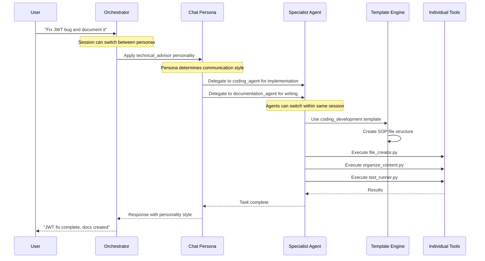

# System Architecture Clarification - Agents vs Templates vs Tools vs Personas

## 🎯 **The Architectural Challenge**

**User's Confusion** (completely understandable!):
- **Agents** = Tool access & capabilities
- **Tools** = Separate comprehensive tool list
- **Templates** = File organization patterns
- **Future Custom GPTs** = Chat personalities with system instructions
- **Question**: How do these all fit together without overlap?

## 🏗️ **Proposed Clean Architecture**

### **Layer 1: Foundation - Tools** 🔧
```
/tools/                           # ATOMIC FUNCTIONS
├── web_search.py                 # Single capability
├── file_creator.py               # Single function
├── structured_search.py          # Specific tool
└── organize_content.py           # NEW: Template execution
```
**Purpose**: Atomic functions that do ONE thing well

### **Layer 2: Execution - Agents** 🤖
```
/agents/                          # TOOL ORCHESTRATORS
├── search_agent.md               # Has access to: web_search, structured_search
├── research_agent.md             # Has access to: web_search, file_creator, pdf_tools
├── web_agent.md                  # Has access to: web_read, web_search, screenshot
└── /app/agent_runner.py          # Executes agents with their assigned tools
```
**Purpose**: Orchestrate multiple tools to accomplish complex tasks

### **Layer 3: Organization - Templates** 📁
```
/templates/                       # CONTENT ORGANIZATION PATTERNS
├── coding_development.py         # SOP structure logic
├── research_planning.py          # Academic organization patterns
└── documentation.py              # Technical writing structure
```
**Purpose**: Determine HOW content should be organized (files/folders)

### **Layer 4: Personality - Chat Personas** 💬
```
/personas/                        # FUTURE: CHAT PERSONALITIES
├── technical_advisor.md          # System instructions + knowledge docs
├── research_coordinator.md       # Different communication style
├── project_manager.md            # Different approach to problems
└── creative_strategist.md        # Novel thinking patterns
```
**Purpose**: Different conversation styles and approaches

## 🔄 **How They Work Together**

### **Single Chat Session Flow**


### **Multi-Agent Session Capability**
**Answer to your question**: Yes! The orchestrator can switch agents throughout the same session:

```python
# Example session flow
user_message_1 = "Research JWT authentication best practices"
→ orchestrator delegates to research_agent (tools: web_search, structured_search)

user_message_2 = "Now implement the fix in our codebase"  
→ orchestrator delegates to coding_agent (tools: file_creator, test_runner)

user_message_3 = "Create user documentation for this feature"
→ orchestrator delegates to documentation_agent (tools: file_creator, export_pdf)

# Same session, multiple agents, each with appropriate tools
```

## 📋 **Clear Separation of Concerns**

### **🔧 Tools Layer**
```python
# Example: organize_content.py
def organize_content(content, template_type, complexity_level):
    """
    TOOL: Executes template organization logic
    Input: Content + template choice + complexity
    Output: Organized file structure
    """
    template = load_template(template_type)
    return template.organize(content, complexity_level)
```

### **🤖 Agents Layer**  
```python
# Example: coding_agent.md capabilities
tools_available: [
    "file_creator", "test_runner", "organize_content", 
    "syntax_validator", "git_manager"
]
specialization: "Software development and troubleshooting"
template_preference: "coding_development"  # Default template
can_switch_templates: true  # Via user request
```

### **📁 Templates Layer**
```python
# Example: coding_development.py
class CodingDevelopmentTemplate:
    def organize(self, content, complexity_level):
        if complexity_level == "simple":
            return create_simple_structure(content)
        else:
            return create_full_sop_structure(content)  # 7-step SOP
    
    def get_required_documents(self):
        return [
            "MASTER_Architecture_UMLs_{task}.md",
            "implementation-plan_{task}.md", 
            "development-progress-tracker.md",
            "troubleshooting_{task}.md",
            "completion-summary_{task}.md"
        ]
```

### **💬 Personas Layer (Future)**
```python
# Example: technical_advisor.md
personality: "Direct, analytical, focuses on best practices"
communication_style: "Concise technical explanations"
knowledge_base: [
    "software_architecture_patterns.md",
    "security_best_practices.md", 
    "testing_methodologies.md"
]
agent_delegation_style: "Prefers coding_agent for implementation"
```

## 🎯 **Template-Specific Checkpoint System**

Based on your feedback about what breaks most often:

### **Priority 1: High-Failure Checkpoints**
```python
HIGH_PRIORITY_CHECKPOINTS = {
    "mermaid_syntax": {
        "templates": ["coding_development"],  # Where UML diagrams are required
        "frequency": "after_each_diagram",
        "validation": "syntax_parser + render_test"
    },
    "progress_tracking": {
        "templates": ["coding_development", "research_planning"],
        "frequency": "after_each_major_update", 
        "validation": "ensure_all_docs_updated + consolidation_check"
    },
    "document_alignment": {
        "templates": ["all"],
        "frequency": "session_milestone",
        "validation": "cross_reference_check + redundancy_removal"
    }
}
```

### **Smart Index System** (From Your Imported Tools Concept)
```python
# Inspired by your existing tools
class IntelligentIndexManager:
    def create_session_index(self, session_folder):
        """
        Extract frontmatter from all documents to create lean index
        Minimize context while maximizing scope awareness
        """
        index = {}
        for file in session_folder.glob("**/*.md"):
            frontmatter = extract_frontmatter(file)
            index[file.name] = {
                "title": frontmatter.get("title"),
                "description": frontmatter.get("description"), 
                "status": frontmatter.get("status"),
                "tags": frontmatter.get("tags"),
                "last_updated": frontmatter.get("date")
            }
        
        return create_index_file(index)  # Minimal token consumption
    
    def identify_update_needs(self, new_content, current_index):
        """
        AI determines which existing docs need updates for alignment
        Just-in-time resource gathering approach
        """
        affected_docs = analyze_cross_impact(new_content, current_index)
        return prioritize_updates(affected_docs)
```

### **Checkpoint Timing Strategy**
```python
CHECKPOINT_TIMING = {
    "immediate": [
        "mermaid_syntax",      # After each diagram creation
        "file_creation"        # After each new document
    ],
    "milestone": [
        "progress_tracking",   # After completing subtasks
        "document_alignment",  # After major updates
        "sop_compliance"       # After template application
    ],
    "session_end": [
        "full_consolidation", # Remove redundant docs
        "cross_references",   # Ensure all links work
        "index_rebuild"       # Update session index
    ]
}
```

## 🚀 **Implementation Priority Based on Your Feedback**

### **Phase 1: Foundation (Week 1)**
1. **Clean separation**: Tools ↔ Agents ↔ Templates architecture
2. **High-priority checkpoints**: Mermaid syntax, progress tracking
3. **Intelligent index system**: Minimal context, maximum scope

### **Phase 2: Smart Organization (Week 2)** 
1. **Adaptive complexity**: Simple tasks → single docs, complex → full templates
2. **Cross-session agent switching**: Orchestrator manages agent delegation
3. **Template-specific checkpoints**: Different validation per template type

### **Phase 3: Intelligence Layer (Week 3)**
1. **Document alignment automation**: Reduce manual consolidation work
2. **Just-in-time context**: Zoom in/out based on needs
3. **Smart update detection**: Which docs need updating when new content added

### **Phase 4: Persona Layer (Week 4)**
1. **Custom GPT integration**: Import system instructions + knowledge docs
2. **Communication style separation**: Technical vs creative vs managerial
3. **Persona-agent coordination**: How personalities delegate to specialists

## ✅ **This Architecture Solves Your Concerns**

1. **Clear Separation**: Each layer has distinct purpose, no overlap
2. **Agent Switching**: Orchestrator can delegate to different agents per message
3. **Template Flexibility**: Adaptive complexity, not over-engineering simple tasks
4. **Failure Prevention**: Priority checkpoints for common break points
5. **Context Optimization**: Index-based just-in-time resource gathering
6. **Future-Proof**: Clean integration path for custom GPT personas

Does this architecture clarify the relationships and address the overlap confusion?

