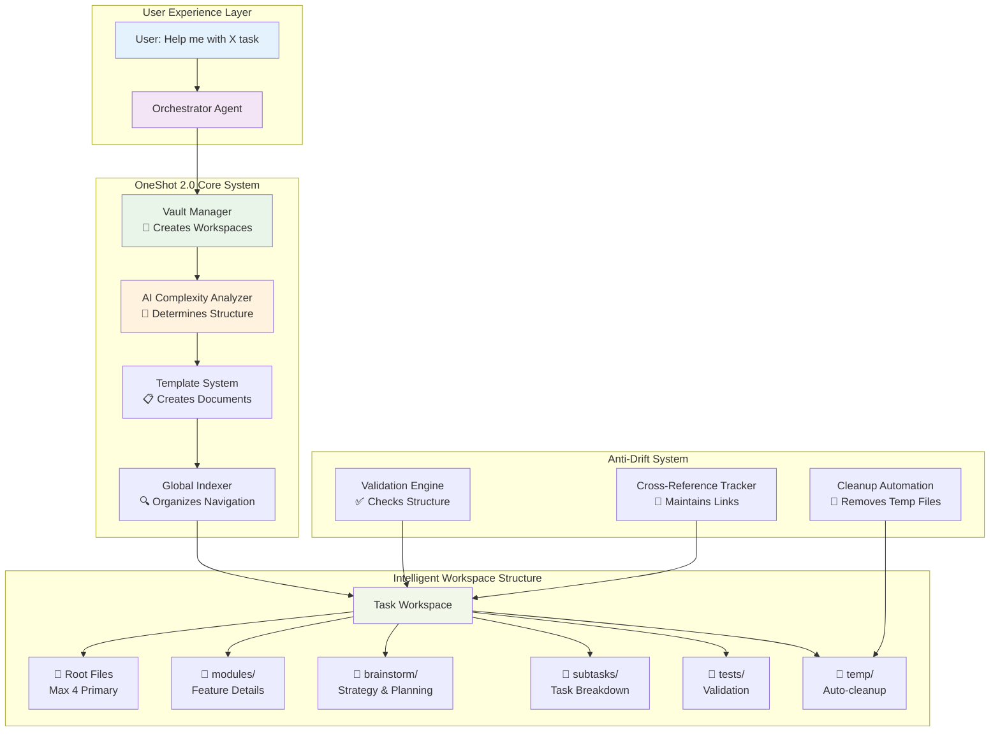
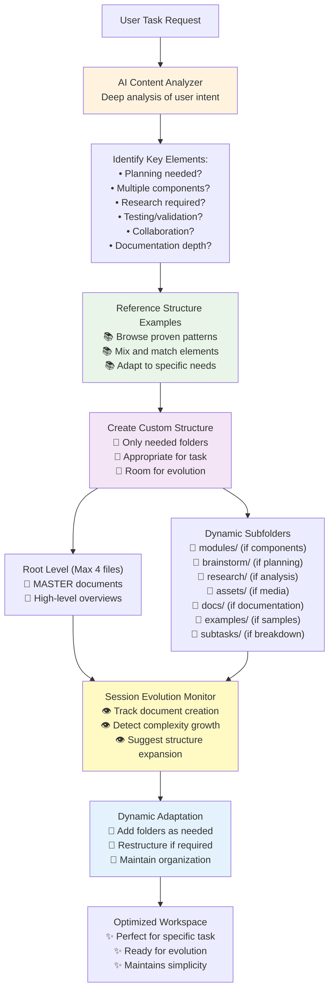
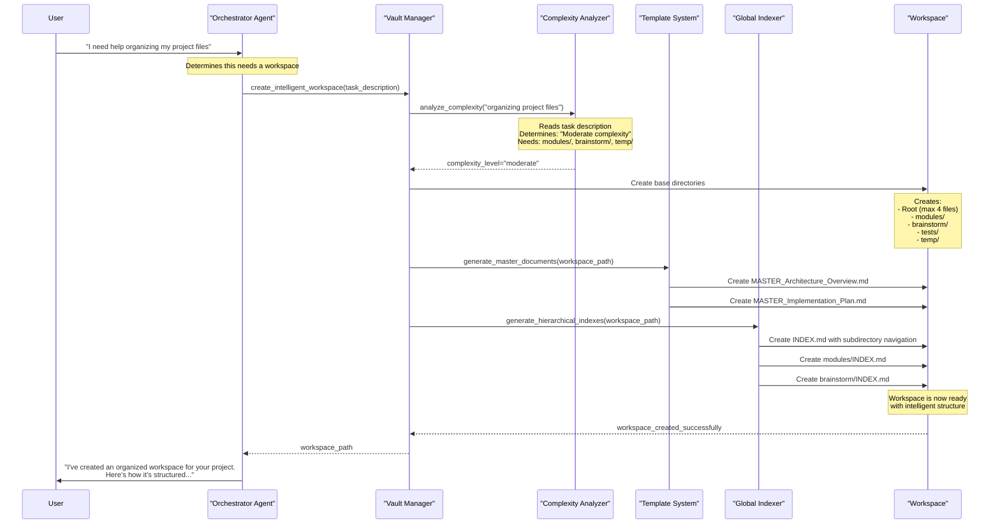
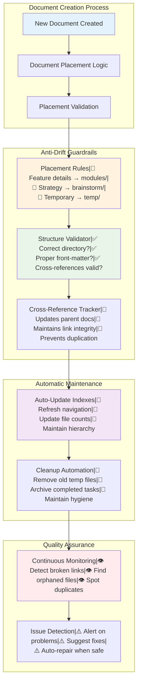
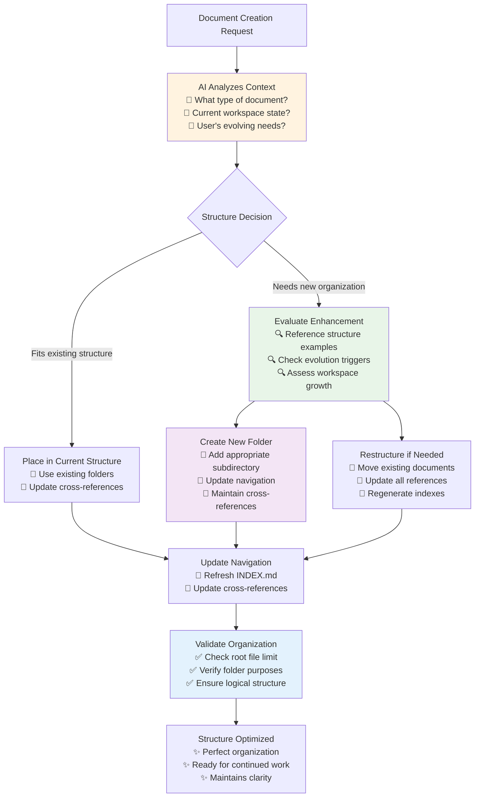
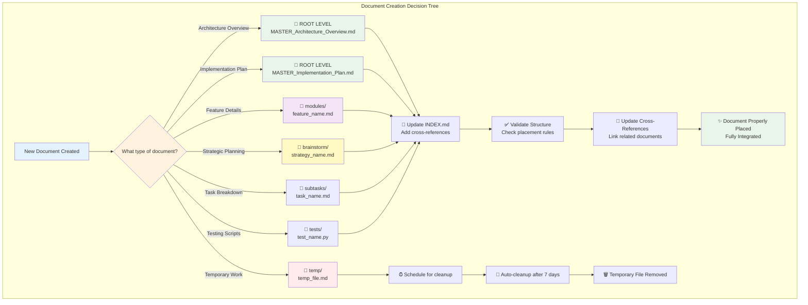

# Intelligent Workspace Organization Strategy

## 🎯 **Core Problem Statement**

The current flat file structure in task workspaces becomes cumbersome as projects grow in complexity. We need intelligent, scalable organization that:

1. **Minimizes Root Clutter**: Max 3-4 primary files in root directory
2. **Eliminates Redundancy**: Single source of truth with intelligent cross-referencing
3. **Prevents Information Drift**: Clear hierarchical structure with anti-drift guardrails
4. **Supports Dynamic Growth**: Intelligent subfolder creation based on project complexity
5. **Manages Temporary Files**: Clear separation and automatic cleanup

## 📊 **Current Issues Analysis**

### **Root Directory Clutter**
**Current State**: 10+ files in root directory
- ✅ Master architecture documents (should stay)
- ❌ Feature-specific documents cluttering root
- ❌ Brainstorming/working documents mixed with finals
- ❌ No clear hierarchy or navigation

### **Information Redundancy**
**Problem**: Same concepts explained multiple times across documents
- Context management details repeated
- Architecture decisions duplicated
- Implementation specifics scattered

### **Missing Subdirectory Navigation**
**Discovered Issue**: Global indexer creates subdirectory indexes but doesn't link them in parent
- `example_tools/INDEX.md` exists but invisible from main index
- No navigation path between hierarchical levels
- Subdirectories feel orphaned

### **Temporary File Management**
**Current State**: No systematic approach to temporary files
- Debug scripts mixed with permanent documentation
- Working documents become permanent accidentally
- No cleanup protocols

## 🏗️ **Proposed Intelligent Structure**

### **Root Directory (Max 4 Primary Files)**
```
tasks/YYYY-MM-DD_TaskName/
├── INDEX.md                          # Auto-generated with subdirectory navigation
├── MASTER_Architecture_Overview.md   # High-level system architecture
├── MASTER_Implementation_Plan.md     # Broad implementation timeline
├── COMPLETION_Summary.md             # Final results and lessons learned
├── modules/                          # Feature-specific detailed documents
├── brainstorm/                       # Working documents and strategic planning
├── subtasks/                         # Traditional subtask breakdown
├── tests/                           # Testing and validation
└── temp/                            # Temporary files (auto-cleanup)
```

### **Modules Subdirectory** 
**Purpose**: Feature-specific deep-dive documentation
```
modules/
├── INDEX.md
├── ai_validation_system.md          # Moved from root
├── context_management.md            # Moved from root  
├── persona_architecture.md          # Moved from root
├── checkpoint_system.md             # Moved from root
└── file_organization_logic.md       # Moved from root
```

### **Brainstorm Subdirectory**
**Purpose**: Working documents, strategy sessions, idea development
```
brainstorm/
├── INDEX.md
├── intelligent_workspace_organization.md  # This document
├── user_feedback_analysis.md
├── strategic_decisions.md
└── working_notes/                    # For ongoing discussions
```

### **Temp Subdirectory**
**Purpose**: Temporary files with automatic cleanup
```
temp/
├── debug_scripts/                   # Temporary debugging
├── test_drafts/                     # Draft documents
└── working_files/                   # Temporary working files
```

## 🔗 **Anti-Drift Guardrails**

### **Single Source of Truth Architecture**
1. **Root files**: Broad overviews with references to modules
2. **Module files**: Detailed implementations and specifications  
3. **Cross-references**: Mandatory linking between root and modules
4. **Update propagation**: Changes in modules trigger root file updates

### **Reference Standards**
- Root documents mention topics briefly with `→ See modules/feature_name.md for details`
- Module documents reference parent context: `← Part of MASTER_Architecture_Overview.md`
- No duplication of detailed specifications
- Clear ownership: each concept has ONE authoritative document

### **Modular Checkpoint Integration**
- **Validation Rules**: Ensure cross-references remain valid
- **Consistency Checks**: Detect information drift between documents
- **Structure Enforcement**: Validate proper file placement
- **Cleanup Automation**: Remove orphaned temporary files

## 🚀 **Enhanced Global Indexer Requirements**

### **✅ IMPLEMENTED: Enhanced Index Structure**
The global indexer has been successfully enhanced with subdirectory navigation!

**Current Implementation:**
1. ✅ **Subdirectory Navigation**: Parent index now includes subdirectory references with file counts
2. ✅ **Hierarchical Organization**: Clear separation between subdirectories and root files
3. ✅ **Smart Descriptions**: Each subdirectory includes purpose and file count
4. ✅ **Nested Directory Detection**: Shows nested structures (e.g., "Nested: automation, indexing, testing, validation")

**Evidence from Current INDEX.md:**
- Subdirectories section shows: `💡 [brainstorm](./brainstorm/) - 1 files`
- Purpose descriptions: `*Strategic planning and working documents*`
- Proper linking: `[Intelligent Workspace Organization Strategy](./brainstorm/intelligent_workspace_organization.md)`
- Statistics tracking: File counts by type and status

### **Enhanced Index Structure**
```markdown
# Index: TaskName

## 📄 Primary Documents (Root Level)
- Master Architecture Overview
- Master Implementation Plan  
- Completion Summary

## 📁 Subdirectories
### 🔧 [Modules](./modules/) - Feature Documentation
- 8 documents | Last updated: Date
- Purpose: Detailed feature specifications and blueprints

### 💡 [Brainstorm](./brainstorm/) - Strategic Planning  
- 3 documents | Last updated: Date
- Purpose: Working documents and strategic discussions

### ⚙️ [Subtasks](./subtasks/) - Implementation Tasks
- 5 documents | Last updated: Date  
- Purpose: Granular task breakdown and tracking
```

## ⚡ **OneShot 2.0 Integration Strategy - Visual Guide**

### **🎯 What Is OneShot 2.0?**
OneShot 2.0 is like having a smart assistant that creates perfectly organized filing systems for every project. Instead of you manually creating folders and documents, the AI analyzes your task and automatically builds the right structure.

**Think of it like this:** 
- **Traditional approach**: You create folders manually, often inconsistently
- **OneShot 2.0 approach**: AI analyzes your needs and creates the perfect organizational structure automatically

### **📍 Where AI Structure Guidance Lives in OneShot System**

The AI needs access to structure examples and principles. Here's where this intelligence should be integrated:

#### **Option 1: Enhanced Snippets System**
```
app/snippets/workspace_organization/
├── structure_examples.md        # All the reference examples above
├── evolution_triggers.md        # When to expand structures
├── folder_purposes.md          # What each folder type is for
└── organization_principles.md   # Core rules (root limit, etc.)
```

#### **Option 2: Specialized Tool Integration**
```python
# Enhanced vault_manager.py tool
class IntelligentWorkspaceCreator:
    def __init__(self):
        self.structure_examples = self.load_structure_examples()
        self.evolution_rules = self.load_evolution_triggers()
        self.organization_principles = self.load_principles()
    
    def analyze_and_create_structure(self, user_request: str) -> dict:
        """Use AI + examples to create perfect structure"""
        # AI analyzes request against examples
        # Returns custom structure recommendation
```

#### **Option 3: Agent Persona Enhancement**
```
app/personas/workspace_architect.md
---
name: "Workspace Architect"
role: "Intelligent structure creation and evolution"
instructions: |
  You are an expert at creating optimal workspace structures.
  Reference the structure examples and adapt them to user needs.
  Never use rigid templates - always customize based on specific requirements.
examples: |
  [Include all the structure examples from this document]
triggers: |
  [Include evolution trigger points]
---
```

#### **🎯 Recommended Integration Point**
**Hybrid Approach**: 
1. **Snippets** for storing examples and principles (easily updatable)
2. **Enhanced Tool** for intelligent structure creation logic
3. **Agent Instructions** for dynamic decision-making during sessions

This ensures the AI has access to comprehensive guidance while maintaining flexibility for future updates and improvements.

### **📊 High-Level System Overview**
The system works in layers, each handling a specific part of organization:

1. **User Layer**: You describe what you need help with
2. **Intelligence Layer**: AI figures out how complex your project is
3. **Creation Layer**: System builds the right structure automatically
4. **Maintenance Layer**: Keeps everything organized over time



### **🧠 How The AI Dynamically Creates Workspace Structure**

The AI acts like an intelligent architect who analyzes your specific needs and creates a custom organizational structure. Instead of rigid templates, it uses examples and principles to build the perfect workspace for your exact situation.

**Dynamic Structure Creation Process:**
1. **Analyze User Intent**: What exactly does the user want to accomplish?
2. **Reference Example Structures**: Look at proven organizational patterns
3. **Create Custom Structure**: Build folders based on actual needs, not templates
4. **Plan for Evolution**: Design structure that can grow and adapt

**Key Principles:**
- **Root Folder Limit**: Maximum 4 primary files to maintain clarity
- **Folder Purpose**: Each subdirectory serves a specific organizational function
- **Dynamic Creation**: Folders created only when needed for the specific task
- **Evolution Ready**: Structure can expand as sessions grow in complexity



### **🔄 The User Journey - Step by Step**

Here's exactly what happens when you ask for help:

1. **You Say**: "I need help organizing my project files"
2. **Orchestrator Thinks**: "This needs a workspace, let me create one"
3. **AI Analyzes**: "This seems like moderate complexity - needs modules and planning"
4. **System Creates**: Perfect folder structure with navigation
5. **You Get**: Fully organized workspace ready to use



### **🛡️ Anti-Drift System - Keeping Things Organized**

Think of this like having a super-organized assistant who:

**Placement Rules**: Knows exactly where different types of documents belong
- Feature details always go in `modules/`
- Strategic planning goes in `brainstorm/`
- Temporary work goes in `temp/` (and gets cleaned up automatically)

**Quality Control**: Constantly checks that everything is in the right place
- Makes sure links between documents work
- Prevents duplicate information
- Keeps the filing system clean

**Automatic Maintenance**: Like having a filing clerk who:
- Updates navigation when you add new documents
- Cleans up temporary files automatically
- Keeps everything properly cross-referenced



### **🔧 Technical Implementation (Simplified)**

**Vault Manager**: The "workspace creator"
- Analyzes what you need
- Creates the right folder structure
- Sets up all the basic documents

**Template System**: The "document generator" 
- Creates proper document templates
- Puts everything in the right place
- Ensures consistent formatting

**Global Indexer**: The "navigation builder"
- Creates those helpful INDEX.md files you see
- Maintains links between all documents
- Updates navigation automatically

**Validation System**: The "quality controller"
- Checks that everything is properly organized
- Fixes broken links automatically
- Prevents information from getting scattered

### **📚 AI Reference Examples - Dynamic Structure Patterns**

*These examples serve as inspiration for the AI - not rigid templates. The AI can mix, match, and adapt based on specific user needs.*

#### **🎯 Task-Driven Structure Examples**

**Blog Content Creation**
```
📁 2025-08-27_Blog_Content/
├── 📄 MASTER_Content_Strategy.md
├── 📄 MASTER_Editorial_Calendar.md
├── 📁 brainstorm/           # Planning needed for content ideas
│   ├── topic_research.md
│   └── audience_analysis.md
└── 📁 drafts/               # Working documents
    └── article_drafts.md
```

**Marketing Website Project**
```
📁 2025-08-27_Marketing_Website/
├── 📄 MASTER_Site_Architecture.md
├── 📄 MASTER_Project_Timeline.md
├── 📁 modules/              # Multiple components
│   ├── homepage_design.md
│   ├── contact_system.md
│   └── seo_strategy.md
├── 📁 brainstorm/           # Strategic planning
│   └── brand_positioning.md
├── 📁 assets/               # Media and resources
│   └── design_assets.md
└── 📁 tests/                # User testing
    └── usability_testing.md
```

**Research Project**
```
📁 2025-08-27_Market_Research/
├── 📄 MASTER_Research_Framework.md
├── 📄 MASTER_Findings_Summary.md
├── 📁 research/             # Primary research folder
│   ├── data_collection.md
│   ├── survey_results.md
│   └── interview_notes.md
├── 📁 analysis/             # Data analysis
│   └── trend_analysis.md
└── 📁 brainstorm/           # Strategic insights
    └── implications.md
```

**Product Development**
```
📁 2025-08-27_Product_Launch/
├── 📄 MASTER_Product_Vision.md
├── 📄 MASTER_Development_Roadmap.md
├── 📁 modules/              # Product components
│   ├── user_interface.md
│   ├── backend_system.md
│   └── integration_apis.md
├── 📁 research/             # Market research
│   └── user_needs_analysis.md
├── 📁 brainstorm/           # Creative planning
│   ├── feature_ideation.md
│   └── monetization_strategy.md
├── 📁 subtasks/             # Breakdown needed
│   ├── 01_mvp_development.md
│   ├── 02_testing_phase.md
│   └── 03_launch_preparation.md
└── 📁 tests/                # Quality assurance
    └── testing_protocols.md
```

**Learning & Documentation**
```
📁 2025-08-27_Learning_Python/
├── 📄 MASTER_Learning_Path.md
├── 📄 MASTER_Progress_Tracker.md
├── 📁 modules/              # Topic-based learning
│   ├── data_structures.md
│   ├── web_frameworks.md
│   └── databases.md
├── 📁 examples/             # Code samples
│   └── practice_projects.md
├── 📁 notes/                # Study notes
│   └── key_concepts.md
└── 📁 exercises/            # Practice work
    └── coding_challenges.md
```

#### **🔄 Evolution Examples - How Structures Grow**

**Session Evolution: Simple → Complex**
```
Initial Request: "Help me write a blog post"
📁 Initial Structure:
├── 📄 MASTER_Content_Plan.md
└── 📁 drafts/

User adds: "Actually, I want to create a content series"
📁 Evolved Structure:
├── 📄 MASTER_Content_Strategy.md    # Expanded scope
├── 📄 MASTER_Editorial_Calendar.md  # Series planning
├── 📁 brainstorm/                   # Added for planning
│   └── series_concept.md
├── 📁 modules/                      # Added for episodes
│   ├── episode_01.md
│   ├── episode_02.md
│   └── episode_03.md
└── 📁 drafts/                       # Maintained
```

**Trigger Points for Structure Evolution:**
- **5+ documents created** → Consider adding `modules/` or topic-based folders
- **Planning discussions** → Add `brainstorm/` folder
- **Research mentioned** → Add `research/` folder  
- **Testing/validation needed** → Add `tests/` folder
- **Media/assets referenced** → Add `assets/` folder
- **Task breakdown requested** → Add `subtasks/` folder

#### **🔄 Dynamic Adaptation in Action**

**Session Evolution Intelligence:**


**Real-Time Decision Making:**
- **Before each document creation**: AI evaluates optimal placement
- **Root folder monitoring**: Automatic subfolder creation when approaching limit
- **Context awareness**: Understands session evolution and adapts accordingly
- **User intent recognition**: Detects when scope is expanding or changing direction

### **🔄 How Changes Propagate**

When you add or modify content, here's what happens automatically:

1. **Document Created** → AI determines proper placement
2. **Cross-References Updated** → Related documents get linked
3. **Indexes Refreshed** → Navigation stays current
4. **Quality Checks** → System ensures everything is organized
5. **Cleanup Scheduled** → Temporary files marked for removal

**Example**: You create a new feature document
- Gets placed in `modules/new_feature.md`
- `MASTER_Architecture_Overview.md` gets updated with a reference
- `modules/INDEX.md` adds the new file to navigation
- Cross-references are created to related documents
- You see everything connected and organized



## 📋 **Implementation Action Plan**

### **Phase 1: Enhanced Indexer (Week 1)**
1. **Update global_indexer.cjs**:
   - Add subdirectory navigation to parent indexes
   - Include hierarchical breadcrumbs
   - Add structure validation

2. **Test enhanced indexing**:
   - Verify subdirectory links work
   - Confirm navigation is intuitive
   - Validate structure compliance

### **Phase 2: Workspace Reorganization (Week 1)**
1. **Reorganize current workspace**:
   - Move feature documents to modules/
   - Move brainstorming docs to brainstorm/
   - Clean up root to max 4 files

2. **Update cross-references**:
   - Modify root documents to reference modules
   - Add navigation breadcrumbs
   - Ensure no information duplication

### **Phase 3: Global Rules Update (Week 2)**
1. **Update coding-tasks.mdc**:
   - Add intelligent workspace structure requirements
   - Specify file placement rules
   - Include cleanup protocols

2. **Add anti-drift guardrails**:
   - Cross-reference validation rules
   - Structure enforcement standards
   - Cleanup automation requirements

### **Phase 4: OneShot 2.0 Integration (Week 3-4)**
1. **Enhance vault_manager.py**:
   - Intelligent complexity analysis
   - Dynamic structure creation
   - Automatic document placement

2. **Template system integration**:
   - Smart document categorization
   - Proper front-matter injection
   - Hierarchical organization

## 🎯 **Success Metrics**

### **Organizational Efficiency**
- Max 4 files in root directory
- Zero information duplication across documents
- 100% subdirectory navigation functionality
- Automatic temporary file cleanup

### **Developer Experience** 
- Clear navigation between hierarchy levels
- Intuitive document placement
- Fast location of specific information
- Consistent cross-referencing

### **Anti-Drift Effectiveness**
- Validation catches broken cross-references
- Structure enforcement prevents misplacement
- Automatic cleanup maintains workspace hygiene
- Modular checkpoints ensure consistency

---

## 🚨 **Next Steps for User Approval**

1. **Review proposed structure**: Does this address your organizational concerns?
2. **Confirm subdirectory strategy**: Modules, brainstorm, temp structure acceptable?
3. **Approve anti-drift approach**: Single source of truth with cross-referencing?
4. **Validate OneShot integration**: Does this fit with the GlobalDocs vision?
5. **Prioritize implementation**: Which phases should we tackle first?

**This document serves as our strategic planning foundation. Once approved, we'll implement the enhanced structure and update all relevant systems.**
