# Intelligent Workspace Organization Strategy

## 🎯 **Core Problem Statement**

The current flat file structure in task workspaces becomes cumbersome as projects grow in complexity. We need intelligent, scalable organization that:

1. **Minimizes Root Clutter**: Max 3-4 primary files in root directory
2. **Eliminates Redundancy**: Single source of truth with intelligent cross-referencing
3. **Prevents Information Drift**: Clear hierarchical structure with anti-drift guardrails
4. **Supports Dynamic Growth**: Intelligent subfolder creation based on project complexity
5. **Manages Temporary Files**: Clear separation and automatic cleanup

## 📊 **Current Issues Analysis**

### **Root Directory Clutter**
**Current State**: 10+ files in root directory
- ✅ Master architecture documents (should stay)
- ❌ Feature-specific documents cluttering root
- ❌ Brainstorming/working documents mixed with finals
- ❌ No clear hierarchy or navigation

### **Information Redundancy**
**Problem**: Same concepts explained multiple times across documents
- Context management details repeated
- Architecture decisions duplicated
- Implementation specifics scattered

### **Missing Subdirectory Navigation**
**Discovered Issue**: Global indexer creates subdirectory indexes but doesn't link them in parent
- `example_tools/INDEX.md` exists but invisible from main index
- No navigation path between hierarchical levels
- Subdirectories feel orphaned

### **Temporary File Management**
**Current State**: No systematic approach to temporary files
- Debug scripts mixed with permanent documentation
- Working documents become permanent accidentally
- No cleanup protocols

## 🏗️ **Proposed Intelligent Structure**

### **Root Directory (Max 4 Primary Files)**
```
tasks/YYYY-MM-DD_TaskName/
├── INDEX.md                          # Auto-generated with subdirectory navigation
├── MASTER_Architecture_Overview.md   # High-level system architecture
├── MASTER_Implementation_Plan.md     # Broad implementation timeline
├── COMPLETION_Summary.md             # Final results and lessons learned
├── modules/                          # Feature-specific detailed documents
├── brainstorm/                       # Working documents and strategic planning
├── subtasks/                         # Traditional subtask breakdown
├── tests/                           # Testing and validation
└── temp/                            # Temporary files (auto-cleanup)
```

### **Modules Subdirectory** 
**Purpose**: Feature-specific deep-dive documentation
```
modules/
├── INDEX.md
├── ai_validation_system.md          # Moved from root
├── context_management.md            # Moved from root  
├── persona_architecture.md          # Moved from root
├── checkpoint_system.md             # Moved from root
└── file_organization_logic.md       # Moved from root
```

### **Brainstorm Subdirectory**
**Purpose**: Working documents, strategy sessions, idea development
```
brainstorm/
├── INDEX.md
├── intelligent_workspace_organization.md  # This document
├── user_feedback_analysis.md
├── strategic_decisions.md
└── working_notes/                    # For ongoing discussions
```

### **Temp Subdirectory**
**Purpose**: Temporary files with automatic cleanup
```
temp/
├── debug_scripts/                   # Temporary debugging
├── test_drafts/                     # Draft documents
└── working_files/                   # Temporary working files
```

## 🔗 **Anti-Drift Guardrails**

### **Single Source of Truth Architecture**
1. **Root files**: Broad overviews with references to modules
2. **Module files**: Detailed implementations and specifications  
3. **Cross-references**: Mandatory linking between root and modules
4. **Update propagation**: Changes in modules trigger root file updates

### **Reference Standards**
- Root documents mention topics briefly with `→ See modules/feature_name.md for details`
- Module documents reference parent context: `← Part of MASTER_Architecture_Overview.md`
- No duplication of detailed specifications
- Clear ownership: each concept has ONE authoritative document

### **Modular Checkpoint Integration**
- **Validation Rules**: Ensure cross-references remain valid
- **Consistency Checks**: Detect information drift between documents
- **Structure Enforcement**: Validate proper file placement
- **Cleanup Automation**: Remove orphaned temporary files

## 🚀 **Enhanced Global Indexer Requirements**

### **✅ IMPLEMENTED: Enhanced Index Structure**
The global indexer has been successfully enhanced with subdirectory navigation!

**Current Implementation:**
1. ✅ **Subdirectory Navigation**: Parent index now includes subdirectory references with file counts
2. ✅ **Hierarchical Organization**: Clear separation between subdirectories and root files
3. ✅ **Smart Descriptions**: Each subdirectory includes purpose and file count
4. ✅ **Nested Directory Detection**: Shows nested structures (e.g., "Nested: automation, indexing, testing, validation")

**Evidence from Current INDEX.md:**
- Subdirectories section shows: `💡 [brainstorm](./brainstorm/) - 1 files`
- Purpose descriptions: `*Strategic planning and working documents*`
- Proper linking: `[Intelligent Workspace Organization Strategy](./brainstorm/intelligent_workspace_organization.md)`
- Statistics tracking: File counts by type and status

### **Enhanced Index Structure**
```markdown
# Index: TaskName

## 📄 Primary Documents (Root Level)
- Master Architecture Overview
- Master Implementation Plan  
- Completion Summary

## 📁 Subdirectories
### 🔧 [Modules](./modules/) - Feature Documentation
- 8 documents | Last updated: Date
- Purpose: Detailed feature specifications and blueprints

### 💡 [Brainstorm](./brainstorm/) - Strategic Planning  
- 3 documents | Last updated: Date
- Purpose: Working documents and strategic discussions

### ⚙️ [Subtasks](./subtasks/) - Implementation Tasks
- 5 documents | Last updated: Date  
- Purpose: Granular task breakdown and tracking
```

## ⚡ **OneShot 2.0 Integration Strategy - Visual Guide**

### **🎯 What Is OneShot 2.0?**
OneShot 2.0 is like having a smart assistant that creates perfectly organized filing systems for every project. Instead of you manually creating folders and documents, the AI analyzes your task and automatically builds the right structure.

**Think of it like this:** 
- **Traditional approach**: You create folders manually, often inconsistently
- **OneShot 2.0 approach**: AI analyzes your needs and creates the perfect organizational structure automatically

### **📍 Where AI Structure Guidance Lives in OneShot System**

The AI needs access to structure examples and principles. Here's where this intelligence should be integrated:

#### **Option 1: Enhanced Snippets System**
```
app/snippets/workspace_organization/
├── structure_examples.md        # All the reference examples above
├── evolution_triggers.md        # When to expand structures
├── folder_purposes.md          # What each folder type is for
└── organization_principles.md   # Core rules (root limit, etc.)
```

#### **Option 2: Specialized Tool Integration**
```python
# Enhanced vault_manager.py tool
class IntelligentWorkspaceCreator:
    def __init__(self):
        self.structure_examples = self.load_structure_examples()
        self.evolution_rules = self.load_evolution_triggers()
        self.organization_principles = self.load_principles()
    
    def analyze_and_create_structure(self, user_request: str) -> dict:
        """Use AI + examples to create perfect structure"""
        # AI analyzes request against examples
        # Returns custom structure recommendation
```

#### **Option 3: Agent Persona Enhancement**
```
app/personas/workspace_architect.md
---
name: "Workspace Architect"
role: "Intelligent structure creation and evolution"
instructions: |
  You are an expert at creating optimal workspace structures.
  Reference the structure examples and adapt them to user needs.
  Never use rigid templates - always customize based on specific requirements.
examples: |
  [Include all the structure examples from this document]
triggers: |
  [Include evolution trigger points]
---
```

#### **🎯 Recommended Integration Point**
**Hybrid Approach**: 
1. **Snippets** for storing examples and principles (easily updatable)
2. **Enhanced Tool** for intelligent structure creation logic
3. **Agent Instructions** for dynamic decision-making during sessions

This ensures the AI has access to comprehensive guidance while maintaining flexibility for future updates and improvements.

### **📊 High-Level System Overview**
The system works in layers, each handling a specific part of organization:

1. **User Layer**: You describe what you need help with
2. **Intelligence Layer**: AI figures out how complex your project is
3. **Creation Layer**: System builds the right structure automatically
4. **Maintenance Layer**: Keeps everything organized over time

```mermaid
graph TB
    subgraph "User Experience Layer"
        U["User: Help me with X task"]
        O["Orchestrator Agent"]
    end
    
    subgraph "OneShot 2.0 Core System"
        VM["Vault Manager<br/>📁 Creates Workspaces"]
        AI["AI Complexity Analyzer<br/>🧠 Determines Structure"]
        TS["Template System<br/>📋 Creates Documents"]
        GI["Global Indexer<br/>🔍 Organizes Navigation"]
    end
    
    subgraph "Intelligent Workspace Structure"
        WS["Task Workspace"]
        ROOT["📄 Root Files<br/>Max 4 Primary"]
        MOD["📁 modules/<br/>Feature Details"]
        BRAIN["📁 brainstorm/<br/>Strategy & Planning"]
        SUB["📁 subtasks/<br/>Task Breakdown"]
        TEST["📁 tests/<br/>Validation"]
        TEMP["📁 temp/<br/>Auto-cleanup"]
    end
    
    subgraph "Anti-Drift System"
        VAL["Validation Engine<br/>✅ Checks Structure"]
        REF["Cross-Reference Tracker<br/>🔗 Maintains Links"]
        CLEAN["Cleanup Automation<br/>🧹 Removes Temp Files"]
    end
    
    U --> O
    O --> VM
    VM --> AI
    AI --> TS
    TS --> GI
    GI --> WS
    
    WS --> ROOT
    WS --> MOD
    WS --> BRAIN
    WS --> SUB
    WS --> TEST
    WS --> TEMP
    
    VAL --> WS
    REF --> WS
    CLEAN --> TEMP
    
    style U fill:#e3f2fd
    style O fill:#f3e5f5
    style VM fill:#e8f5e8
    style AI fill:#fff3e0
    style WS fill:#f1f8e9
```

### **🧠 How The AI Dynamically Creates Workspace Structure**

The AI acts like an intelligent architect who analyzes your specific needs and creates a custom organizational structure. Instead of rigid templates, it uses examples and principles to build the perfect workspace for your exact situation.

**Dynamic Structure Creation Process:**
1. **Analyze User Intent**: What exactly does the user want to accomplish?
2. **Reference Example Structures**: Look at proven organizational patterns
3. **Create Custom Structure**: Build folders based on actual needs, not templates
4. **Plan for Evolution**: Design structure that can grow and adapt

**Key Principles:**
- **Root Folder Limit**: Maximum 4 primary files to maintain clarity
- **Folder Purpose**: Each subdirectory serves a specific organizational function
- **Dynamic Creation**: Folders created only when needed for the specific task
- **Evolution Ready**: Structure can expand as sessions grow in complexity

```mermaid
flowchart TD
    START["User Task Request"] --> ANALYZE["AI Content Analyzer<br/>Deep analysis of user intent"]
    
    ANALYZE --> INTENT["Identify Key Elements:<br/>• Planning needed?<br/>• Multiple components?<br/>• Research required?<br/>• Testing/validation?<br/>• Collaboration?<br/>• Documentation depth?"]
    
    INTENT --> EXAMPLES["Reference Structure Examples<br/>📚 Browse proven patterns<br/>📚 Mix and match elements<br/>📚 Adapt to specific needs"]
    
    EXAMPLES --> CUSTOM["Create Custom Structure<br/>🎯 Only needed folders<br/>🎯 Appropriate for task<br/>🎯 Room for evolution"]
    
    CUSTOM --> ROOT["Root Level (Max 4 files)<br/>📄 MASTER documents<br/>📄 High-level overviews"]
    
    CUSTOM --> FOLDERS["Dynamic Subfolders<br/>📁 modules/ (if components)<br/>📁 brainstorm/ (if planning)<br/>📁 research/ (if analysis)<br/>📁 assets/ (if media)<br/>📁 docs/ (if documentation)<br/>📁 examples/ (if samples)<br/>📁 subtasks/ (if breakdown)"]
    
    ROOT --> MONITOR["Session Evolution Monitor<br/>👁️ Track document creation<br/>👁️ Detect complexity growth<br/>👁️ Suggest structure expansion"]
    FOLDERS --> MONITOR
    
    MONITOR --> ADAPT["Dynamic Adaptation<br/>🔄 Add folders as needed<br/>🔄 Restructure if required<br/>🔄 Maintain organization"]
    
    ADAPT --> FINAL["Optimized Workspace<br/>✨ Perfect for specific task<br/>✨ Ready for evolution<br/>✨ Maintains simplicity"]
    
    style ANALYZE fill:#fff3e0
    style EXAMPLES fill:#e8f5e8
    style CUSTOM fill:#f3e5f5
    style MONITOR fill:#fff9c4
    style ADAPT fill:#e3f2fd
```

### **🔄 The User Journey - Step by Step**

Here's exactly what happens when you ask for help:

1. **You Say**: "I need help organizing my project files"
2. **Orchestrator Thinks**: "This needs a workspace, let me create one"
3. **AI Analyzes**: "This seems like moderate complexity - needs modules and planning"
4. **System Creates**: Perfect folder structure with navigation
5. **You Get**: Fully organized workspace ready to use


### **🛡️ Anti-Drift System - Keeping Things Organized**

Think of this like having a super-organized assistant who:

**Placement Rules**: Knows exactly where different types of documents belong
- Feature details always go in `modules/`
- Strategic planning goes in `brainstorm/`
- Temporary work goes in `temp/` (and gets cleaned up automatically)

**Quality Control**: Constantly checks that everything is in the right place
- Makes sure links between documents work
- Prevents duplicate information
- Keeps the filing system clean

**Automatic Maintenance**: Like having a filing clerk who:
- Updates navigation when you add new documents
- Cleans up temporary files automatically
- Keeps everything properly cross-referenced

```mermaid
graph TD
    subgraph "Document Creation Process"
        DOC["New Document Created"]
        PLACE["Document Placement Logic"]
        CHECK["Placement Validation"]
    end
    
    subgraph "Anti-Drift Guardrails"
        RULES["Placement Rules|🎯 Feature details → modules/|🎯 Strategy → brainstorm/|🎯 Temporary → temp/"]
        VALIDATE["Structure Validator|✅ Correct directory?|✅ Proper front-matter?|✅ Cross-references valid?"]
        CROSSREF["Cross-Reference Tracker|🔗 Updates parent docs|🔗 Maintains link integrity|🔗 Prevents duplication"]
    end
    
    subgraph "Automatic Maintenance"
        UPDATE["Auto-Update Indexes|📇 Refresh navigation|📇 Update file counts|📇 Maintain hierarchy"]
        CLEANUP["Cleanup Automation|🧹 Remove old temp files|🧹 Archive completed tasks|🧹 Maintain hygiene"]
    end
    
    subgraph "Quality Assurance"
        MONITOR["Continuous Monitoring|👁️ Detect broken links|👁️ Find orphaned files|👁️ Spot duplicates"]
        ALERT["Issue Detection|⚠️ Alert on problems|⚠️ Suggest fixes|⚠️ Auto-repair when safe"]
    end
    
    DOC --> PLACE
    PLACE --> CHECK
    CHECK --> RULES
    RULES --> VALIDATE
    VALIDATE --> CROSSREF
    CROSSREF --> UPDATE
    UPDATE --> CLEANUP
    CLEANUP --> MONITOR
    MONITOR --> ALERT
    
    style DOC fill:#e3f2fd
    style RULES fill:#fff3e0
    style VALIDATE fill:#e8f5e8
    style UPDATE fill:#f3e5f5
    style MONITOR fill:#ffebee
```

### **🔧 Technical Implementation (Simplified)**

**Vault Manager**: The "workspace creator"
- Analyzes what you need
- Creates the right folder structure
- Sets up all the basic documents

**Template System**: The "document generator" 
- Creates proper document templates
- Puts everything in the right place
- Ensures consistent formatting

**Global Indexer**: The "navigation builder"
- Creates those helpful INDEX.md files you see
- Maintains links between all documents
- Updates navigation automatically

**Validation System**: The "quality controller"
- Checks that everything is properly organized
- Fixes broken links automatically
- Prevents information from getting scattered

### **📚 AI Reference Examples - Dynamic Structure Patterns**

*These examples serve as inspiration for the AI - not rigid templates. The AI can mix, match, and adapt based on specific user needs.*

#### **🎯 Task-Driven Structure Examples**

**Blog Content Creation**
```
📁 2025-08-27_Blog_Content/
├── 📄 MASTER_Content_Strategy.md
├── 📄 MASTER_Editorial_Calendar.md
├── 📁 brainstorm/           # Planning needed for content ideas
│   ├── topic_research.md
│   └── audience_analysis.md
└── 📁 drafts/               # Working documents
    └── article_drafts.md
```

**Marketing Website Project**
```
📁 2025-08-27_Marketing_Website/
├── 📄 MASTER_Site_Architecture.md
├── 📄 MASTER_Project_Timeline.md
├── 📁 modules/              # Multiple components
│   ├── homepage_design.md
│   ├── contact_system.md
│   └── seo_strategy.md
├── 📁 brainstorm/           # Strategic planning
│   └── brand_positioning.md
├── 📁 assets/               # Media and resources
│   └── design_assets.md
└── 📁 tests/                # User testing
    └── usability_testing.md
```

**Research Project**
```
📁 2025-08-27_Market_Research/
├── 📄 MASTER_Research_Framework.md
├── 📄 MASTER_Findings_Summary.md
├── 📁 research/             # Primary research folder
│   ├── data_collection.md
│   ├── survey_results.md
│   └── interview_notes.md
├── 📁 analysis/             # Data analysis
│   └── trend_analysis.md
└── 📁 brainstorm/           # Strategic insights
    └── implications.md
```

**Product Development**
```
📁 2025-08-27_Product_Launch/
├── 📄 MASTER_Product_Vision.md
├── 📄 MASTER_Development_Roadmap.md
├── 📁 modules/              # Product components
│   ├── user_interface.md
│   ├── backend_system.md
│   └── integration_apis.md
├── 📁 research/             # Market research
│   └── user_needs_analysis.md
├── 📁 brainstorm/           # Creative planning
│   ├── feature_ideation.md
│   └── monetization_strategy.md
├── 📁 subtasks/             # Breakdown needed
│   ├── 01_mvp_development.md
│   ├── 02_testing_phase.md
│   └── 03_launch_preparation.md
└── 📁 tests/                # Quality assurance
    └── testing_protocols.md
```

**Learning & Documentation**
```
📁 2025-08-27_Learning_Python/
├── 📄 MASTER_Learning_Path.md
├── 📄 MASTER_Progress_Tracker.md
├── 📁 modules/              # Topic-based learning
│   ├── data_structures.md
│   ├── web_frameworks.md
│   └── databases.md
├── 📁 examples/             # Code samples
│   └── practice_projects.md
├── 📁 notes/                # Study notes
│   └── key_concepts.md
└── 📁 exercises/            # Practice work
    └── coding_challenges.md
```

#### **🔄 Evolution Examples - How Structures Grow**

**Session Evolution: Simple → Complex**
```
Initial Request: "Help me write a blog post"
📁 Initial Structure:
├── 📄 MASTER_Content_Plan.md
└── 📁 drafts/

User adds: "Actually, I want to create a content series"
📁 Evolved Structure:
├── 📄 MASTER_Content_Strategy.md    # Expanded scope
├── 📄 MASTER_Editorial_Calendar.md  # Series planning
├── 📁 brainstorm/                   # Added for planning
│   └── series_concept.md
├── 📁 modules/                      # Added for episodes
│   ├── episode_01.md
│   ├── episode_02.md
│   └── episode_03.md
└── 📁 drafts/                       # Maintained
```

**Trigger Points for Structure Evolution:**
- **5+ documents created** → Consider adding `modules/` or topic-based folders
- **Planning discussions** → Add `brainstorm/` folder
- **Research mentioned** → Add `research/` folder  
- **Testing/validation needed** → Add `tests/` folder
- **Media/assets referenced** → Add `assets/` folder
- **Task breakdown requested** → Add `subtasks/` folder

#### **🔄 Dynamic Adaptation in Action**

**Session Evolution Intelligence:**
```mermaid
graph TD
    DOC_CREATE["Document Creation Request"] --> AI_ANALYZE["AI Analyzes Context<br/>🧠 What type of document?<br/>🧠 Current workspace state?<br/>🧠 User's evolving needs?"]
    
    AI_ANALYZE --> DECISION{"Structure Decision"}
    
    DECISION -->|"Fits existing structure"| PLACE_EXISTING["Place in Current Structure<br/>📁 Use existing folders<br/>📄 Update cross-references"]
    
    DECISION -->|"Needs new organization"| EVALUATE["Evaluate Enhancement<br/>🔍 Reference structure examples<br/>🔍 Check evolution triggers<br/>🔍 Assess workspace growth"]
    
    EVALUATE --> CREATE_FOLDER["Create New Folder<br/>📁 Add appropriate subdirectory<br/>📄 Update navigation<br/>🔗 Maintain cross-references"]
    
    EVALUATE --> RESTRUCTURE["Restructure if Needed<br/>📁 Move existing documents<br/>📄 Update all references<br/>🔄 Regenerate indexes"]
    
    PLACE_EXISTING --> UPDATE_NAV["Update Navigation<br/>📇 Refresh INDEX.md<br/>🔗 Update cross-references"]
    CREATE_FOLDER --> UPDATE_NAV
    RESTRUCTURE --> UPDATE_NAV
    
    UPDATE_NAV --> VALIDATE["Validate Organization<br/>✅ Check root file limit<br/>✅ Verify folder purposes<br/>✅ Ensure logical structure"]
    
    VALIDATE --> COMPLETE["Structure Optimized<br/>✨ Perfect organization<br/>✨ Ready for continued work<br/>✨ Maintains clarity"]
    
    style AI_ANALYZE fill:#fff3e0
    style EVALUATE fill:#e8f5e8
    style CREATE_FOLDER fill:#f3e5f5
    style VALIDATE fill:#e3f2fd
```

**Real-Time Decision Making:**
- **Before each document creation**: AI evaluates optimal placement
- **Root folder monitoring**: Automatic subfolder creation when approaching limit
- **Context awareness**: Understands session evolution and adapts accordingly
- **User intent recognition**: Detects when scope is expanding or changing direction

## 🔒 **Modular Checkpoint Integration - Ensuring Compliance**

### **🎯 The Context Overload Problem**

**The Challenge**: As conversations grow longer and context increases, AI models can:
- Forget earlier instructions buried in massive prompts
- Skip steps in long 20+ item checklists
- Get confused by conflicting or overwhelming context
- Not follow SOPs consistently due to information overload

**The Solution**: Modular Checkpoint System with just-in-time validation

### **🔧 Programmatic SOP Validation Architecture**

Instead of giving the AI a massive list of instructions, we break the workspace organization process into discrete, programmatically validated checkpoints:

```mermaid
graph TD
    USER_REQUEST["User Request: Create Workspace"] --> CHECKPOINT_1["🔍 Checkpoint 1: Intent Analysis"]
    
    CHECKPOINT_1 --> VALIDATE_1["✅ Validate: User intent captured?<br/>📋 Required context present?<br/>🎯 Clear scope defined?"]
    
    VALIDATE_1 -->|Pass| CHECKPOINT_2["🏗️ Checkpoint 2: Structure Design"]
    VALIDATE_1 -->|Fail| RETRY_1["🔄 Retry: Gather missing context"]
    
    CHECKPOINT_2 --> VALIDATE_2["✅ Validate: Structure appropriate?<br/>📋 Root files ≤ 4?<br/>🎯 Folders match examples?"]
    
    VALIDATE_2 -->|Pass| CHECKPOINT_3["📁 Checkpoint 3: Directory Creation"]
    VALIDATE_2 -->|Fail| RETRY_2["🔄 Retry: Redesign structure"]
    
    CHECKPOINT_3 --> VALIDATE_3["✅ Validate: Directories created?<br/>📋 Proper permissions?<br/>🎯 Structure matches design?"]
    
    VALIDATE_3 -->|Pass| CHECKPOINT_4["📄 Checkpoint 4: Master Document Creation"]
    VALIDATE_3 -->|Fail| RETRY_3["🔄 Retry: Fix directory issues"]
    
    CHECKPOINT_4 --> VALIDATE_4["✅ Validate: Master docs created?<br/>📋 Proper front-matter?<br/>🎯 Cross-references set?"]
    
    VALIDATE_4 -->|Pass| CHECKPOINT_5["🔗 Checkpoint 5: Index Generation"]
    VALIDATE_4 -->|Fail| RETRY_4["🔄 Retry: Fix document issues"]
    
    CHECKPOINT_5 --> VALIDATE_5["✅ Validate: Indexes generated?<br/>📋 Navigation working?<br/>🎯 All links functional?"]
    
    VALIDATE_5 -->|Pass| COMPLETE["✅ Workspace Complete"]
    VALIDATE_5 -->|Fail| RETRY_5["🔄 Retry: Fix index issues"]
    
    RETRY_1 --> CHECKPOINT_1
    RETRY_2 --> CHECKPOINT_2
    RETRY_3 --> CHECKPOINT_3
    RETRY_4 --> CHECKPOINT_4
    RETRY_5 --> CHECKPOINT_5
    
    style CHECKPOINT_1 fill:#e3f2fd
    style CHECKPOINT_2 fill:#e8f5e8
    style CHECKPOINT_3 fill:#fff3e0
    style CHECKPOINT_4 fill:#f3e5f5
    style CHECKPOINT_5 fill:#fff9c4
    style COMPLETE fill:#c8e6c9
```

### **📋 Just-In-Time Instruction Delivery**

**Traditional Approach (Prone to Failure)**:
```
Here are 20 steps to create a workspace:
1. Analyze user intent
2. Reference structure examples
3. Design custom structure
4. Validate root file limit
5. Create directories...
[15 more steps]
20. Generate final validation report

Please follow ALL steps in order.
```

**Modular Checkpoint Approach (Reliable)**:
```python
# Only current step context provided to AI
current_checkpoint = {
    "step": "structure_design",
    "instruction": "Design workspace structure based on user intent",
    "context": {
        "user_request": "...",
        "intent_analysis": "...",
        "available_patterns": ["pattern1", "pattern2"]
    },
    "validation_criteria": [
        "Root files ≤ 4",
        "Folders match proven patterns", 
        "Structure supports evolution"
    ]
}
```

### **🔄 Dynamic Checkpoint Configuration**

Each workspace creation type has its own checkpoint sequence:

**Simple Content Creation**:
```yaml
checkpoints:
  - intent_analysis: {critical: true, order: 10}
  - basic_structure: {critical: true, order: 20}
  - master_docs: {critical: true, order: 30}
  - index_generation: {critical: false, order: 40}
```

**Complex Project Development**:
```yaml
checkpoints:
  - intent_analysis: {critical: true, order: 10}
  - complexity_assessment: {critical: true, order: 15}
  - structure_design: {critical: true, order: 20}
  - directory_creation: {critical: true, order: 30}
  - master_docs: {critical: true, order: 40}
  - module_setup: {critical: true, order: 50}
  - brainstorm_setup: {critical: false, order: 60}
  - subtask_framework: {critical: false, order: 70}
  - index_generation: {critical: true, order: 80}
  - cross_reference_validation: {critical: true, order: 90}
```

### **🛡️ Programmatic Validation Examples**

**Checkpoint: Structure Design Validation**
```python
class WorkspaceStructureCheckpoint(BaseCheckpoint):
    def validate(self, context: Dict) -> CheckpointResult:
        structure = context.get("proposed_structure", {})
        
        # Validate root file limit
        root_files = structure.get("root_files", [])
        if len(root_files) > 4:
            return CheckpointResult(
                passed=False,
                message=f"Root directory has {len(root_files)} files. Maximum is 4.",
                details={"root_files": root_files, "limit": 4}
            )
        
        # Validate folder purposes
        folders = structure.get("folders", {})
        required_purposes = ["modules", "brainstorm", "tests", "temp"]
        
        for folder, config in folders.items():
            purpose = config.get("purpose")
            if not purpose:
                return CheckpointResult(
                    passed=False,
                    message=f"Folder '{folder}' missing purpose definition",
                    details={"folder": folder}
                )
        
        return CheckpointResult(
            passed=True,
            message="Workspace structure validated successfully",
            details={"structure": structure}
        )
```

**Checkpoint: Evolution Trigger Validation**
```python
class EvolutionTriggerCheckpoint(BaseCheckpoint):
    def validate(self, context: Dict) -> CheckpointResult:
        session_state = context.get("session_state", {})
        document_count = session_state.get("document_count", 0)
        current_structure = context.get("current_structure", {})
        
        # Check if structure evolution needed
        if document_count >= 5 and "modules" not in current_structure:
            return CheckpointResult(
                passed=False,
                message="Document count suggests modules/ folder needed",
                details={
                    "trigger": "document_count",
                    "count": document_count,
                    "suggested_action": "add_modules_folder"
                }
            )
        
        # Check for brainstorm trigger
        recent_messages = session_state.get("recent_messages", [])
        planning_keywords = ["plan", "strategy", "brainstorm", "think through"]
        
        if any(keyword in msg.lower() for msg in recent_messages for keyword in planning_keywords):
            if "brainstorm" not in current_structure:
                return CheckpointResult(
                    passed=False,
                    message="Planning discussion detected, brainstorm/ folder recommended",
                    details={
                        "trigger": "planning_keywords",
                        "suggested_action": "add_brainstorm_folder"
                    }
                )
        
        return CheckpointResult(
            passed=True,
            message="Current structure appropriate for session state",
            details={"session_state": session_state}
        )
```

### **⚡ Integration with OneShot 2.0**

**Enhanced Vault Manager with Checkpoint Integration**:
```python
class IntelligentWorkspaceCreator:
    def __init__(self):
        self.checkpoint_manager = CheckpointManager()
        self.structure_examples = self.load_structure_examples()
    
    def create_workspace_with_validation(self, user_request: str) -> dict:
        """Create workspace with programmatic checkpoint validation"""
        
        context = {"user_request": user_request}
        
        # Step 1: Intent Analysis Checkpoint
        context = self.run_checkpoint("intent_analysis", context)
        if not context["checkpoint_results"][-1]["passed"]:
            return self.handle_checkpoint_failure(context)
        
        # Step 2: Structure Design Checkpoint  
        context = self.run_checkpoint("structure_design", context)
        if not context["checkpoint_results"][-1]["passed"]:
            return self.handle_checkpoint_failure(context)
        
        # Continue through remaining checkpoints...
        
        return context
    
    def run_checkpoint(self, checkpoint_name: str, context: dict) -> dict:
        """Execute specific checkpoint with just-in-time instructions"""
        
        # Provide only relevant context for this checkpoint
        checkpoint_context = self.prepare_checkpoint_context(checkpoint_name, context)
        
        # Execute checkpoint validation
        result = self.checkpoint_manager.run_checkpoint(checkpoint_name, checkpoint_context)
        
        # Store result and continue or retry
        context.setdefault("checkpoint_results", []).append(result)
        
        return context
```

### **🎯 Benefits of This Approach**

1. **Guaranteed Execution**: Each step must pass validation before proceeding
2. **Manageable Context**: AI only sees current step's requirements 
3. **Automatic Retry**: Failed checkpoints trigger specific retry logic
4. **Flexibility**: Easy to add/remove/reorder checkpoints
5. **Auditability**: Complete validation trail for debugging
6. **Consistency**: Same validation logic regardless of context size

**Result**: Instead of hoping the AI follows 20 instructions in a massive prompt, we guarantee each step happens correctly through programmatic validation with focused, just-in-time instruction delivery.

## 🔧 **Reusable Checkpoint/SOP Tools - System-Wide Intelligence**

### **🎯 The Reusability Opportunity**

You're absolutely right! Checkpoint/SOP functionality can be reused across MANY OneShot scenarios:

- **Agent Creation**: Step-by-step validation of agent.md structure, tool assignments, prompt quality
- **Tool Development**: Validate tool metadata, test functionality, ensure proper integration
- **Content Generation**: Multi-step content creation with quality gates at each stage
- **Research Projects**: Systematic research plan execution with validation checkpoints
- **System Maintenance**: Automated health checks, dependency validation, performance monitoring

### **🔄 Jinja2 Integration Strategy - Dynamic Checkpoint Templates**

**The Power of Jinja2 for Checkpoints**: Jinja2 isn't just for content - it's perfect for creating dynamic, context-aware validation templates!

#### **Checkpoint Template Architecture**

```yaml
# snippets/checkpoints/workspace_creation.md
---
checkpoint_type: "workspace_creation"
variables:
  - user_intent
  - project_complexity
  - structure_examples
  - validation_rules
---


## Checkpoint Sequence: Simple Project
1. **Intent Analysis** (Critical: true)
2. **Basic Structure Design** (Critical: true) 
3. **Directory Creation** (Critical: true)
4. **Master Documents** (Critical: false)

### Intent Analysis Validation


### Structure Design Validation  



## Checkpoint Sequence: Complex Project
1. **Intent Analysis** (Critical: true)
2. **Complexity Assessment** (Critical: true)
3. **Structure Design** (Critical: true)
4. **Module Planning** (Critical: true)
5. **Directory Creation** (Critical: true)
6. **Master Documents** (Critical: true)
7. **Cross-Reference Setup** (Critical: true)

### Intent Analysis Validation


### Structure Design Validation




## Universal Validation Rules

- **{{ rule.name }}**: {{ rule.description }}
  - **Check**: {{ rule.validation_code }}
  - **Failure Action**: {{ rule.failure_action }}

```

#### **Modular Checkpoint Snippets**

**Base Validation Template** (`snippets/checkpoints/base_validation.md`):
```markdown
## {{ checkpoint_name }} Validation

**Context Required**:

- {{ item }}


**Validation Steps**:

{{ loop.index }}. **{{ step.name }}**: {{ step.description }}
   - **Expected**: {{ step.expected }}
   - **Command**: `{{ step.validation_command }}`
   - **Pass Criteria**: {{ step.pass_criteria }}
   - **Retry Action**: {{ step.retry_action }}



🚨 **CRITICAL CHECKPOINT**: Failure stops entire process

⚠️ **WARNING CHECKPOINT**: Failure logged but process continues

```

**Intent Analysis Checkpoint** (`snippets/checkpoints/intent_analysis.md`):
```markdown


{% set validation_steps = [
    {
        "name": "User Intent Clarity",
        "description": "Verify user request is specific and actionable",
        "expected": "Clear understanding of what user wants to accomplish",
        "validation_command": "validate_intent_clarity(user_request)",
        "pass_criteria": "Intent confidence score > 0.8",
        "retry_action": "Request clarification from user"
    },
    {
        "name": "Scope Definition", 
        "description": "Determine project boundaries and complexity",
        "expected": "Defined scope with clear deliverables",
        "validation_command": "assess_project_scope(user_request, session_history)",
        "pass_criteria": "Scope clarity score > 0.7",
        "retry_action": "Ask follow-up questions about scope"
    }
] %}



```

### **🛠️ Reusable Checkpoint Tools**

#### **Universal Checkpoint Manager Tool**

```python
# tools/checkpoint_manager.py
TOOL_METADATA = {
    "type": "function",
    "function": {
        "name": "checkpoint_manager",
        "description": "Execute programmatic checkpoint validation for any OneShot process. Supports dynamic template loading and context-aware validation.",
        "parameters": {
            "type": "object",
            "properties": {
                "checkpoint_template": {
                    "type": "string",
                    "description": "Jinja2 template name for checkpoint sequence (e.g., 'workspace_creation', 'agent_development', 'research_execution')"
                },
                "context": {
                    "type": "object", 
                    "description": "Context variables for template rendering and validation"
                },
                "step": {
                    "type": "string",
                    "description": "Specific checkpoint step to execute (if resuming)"
                },
                "validation_mode": {
                    "type": "string",
                    "enum": ["strict", "permissive", "dry_run"],
                    "description": "How strictly to enforce validation rules"
                }
            },
            "required": ["checkpoint_template", "context"]
        }
    }
}

def checkpoint_manager(checkpoint_template: str, context: dict, 
                      step: str = None, validation_mode: str = "strict") -> str:
    """Execute programmatic checkpoint validation using dynamic Jinja2 templates"""
    
    # Load checkpoint template with Jinja2
    template_path = f"checkpoints/{checkpoint_template}.md"
    template = load_jinja_template(template_path)
    
    # Render checkpoint sequence with context
    rendered_checkpoints = template.render(**context)
    
    # Parse rendered template into executable checkpoints
    checkpoint_sequence = parse_checkpoint_sequence(rendered_checkpoints)
    
    # Execute checkpoints programmatically
    results = execute_checkpoint_sequence(
        checkpoint_sequence, 
        context, 
        start_step=step,
        mode=validation_mode
    )
    
    return format_checkpoint_results(results)
```

#### **Dynamic SOP Generator Tool**

```python
# tools/sop_generator.py
TOOL_METADATA = {
    "type": "function",
    "function": {
        "name": "sop_generator", 
        "description": "Generate custom SOP sequences using Jinja2 templates. Creates reusable, context-aware standard operating procedures.",
        "parameters": {
            "type": "object",
            "properties": {
                "sop_type": {
                    "type": "string",
                    "enum": ["workspace_creation", "agent_development", "tool_creation", "research_execution", "content_generation", "custom"],
                    "description": "Type of SOP to generate"
                },
                "customization": {
                    "type": "object",
                    "description": "Custom parameters for SOP generation"
                },
                "output_format": {
                    "type": "string", 
                    "enum": ["markdown", "yaml", "json", "executable"],
                    "description": "Format for generated SOP"
                }
            },
            "required": ["sop_type"]
        }
    }
}

def sop_generator(sop_type: str, customization: dict = None, 
                 output_format: str = "markdown") -> str:
    """Generate dynamic SOPs using Jinja2 templates"""
    
    # Load SOP template library
    template_library = load_sop_templates()
    
    # Generate context from customization
    sop_context = prepare_sop_context(sop_type, customization)
    
    # Render SOP template
    sop_template = template_library[sop_type]
    rendered_sop = sop_template.render(**sop_context)
    
    # Format output based on requirements
    formatted_sop = format_sop_output(rendered_sop, output_format)
    
    return formatted_sop
```

### **📚 Reusable Template Library Structure**

```
snippets/
├── checkpoints/
│   ├── base_validation.md          # Universal validation template
│   ├── intent_analysis.md          # Intent clarity validation
│   ├── structure_design.md         # Workspace structure validation
│   ├── document_creation.md        # Document quality validation
│   ├── cross_reference.md          # Link integrity validation
│   └── completion_verification.md  # Final completion checks
├── sop_templates/
│   ├── workspace_creation.md       # Complete workspace SOP
│   ├── agent_development.md        # Agent creation SOP
│   ├── tool_creation.md           # Tool development SOP
│   ├── research_execution.md       # Research project SOP
│   └── content_generation.md       # Content creation SOP
└── validation_rules/
    ├── universal_rules.md          # Rules that apply everywhere
    ├── workspace_rules.md          # Workspace-specific rules
    ├── agent_rules.md             # Agent development rules
    └── quality_standards.md       # Quality assurance rules
```

### **🔄 Cross-Scenario Applications**

#### **Agent Development with Checkpoints**
```yaml
# Context for agent development
agent_context:
  agent_name: "research_specialist"
  required_tools: ["web_search", "document_analysis"]
  complexity: "moderate"
  validation_rules:
    - name: "Tool Assignment Validation"
      check: "verify_tool_compatibility(assigned_tools)"
    - name: "Prompt Quality Check"
      check: "analyze_prompt_clarity(system_prompt)"
```

#### **Research Project with Checkpoints**
```yaml
# Context for research execution
research_context:
  research_type: "market_analysis"
  required_sections: ["executive_summary", "market_overview", "recommendations"]
  validation_rules:
    - name: "Source Quality Check"
      check: "validate_source_credibility(sources, min_count=5)"
    - name: "Content Completeness"
      check: "verify_section_coverage(sections, required_sections)"
```

### **🎯 Jinja2 Benefits for Checkpoints**

1. **Dynamic Context**: Templates adapt based on project type, complexity, user preferences
2. **Reusable Components**: Base validation patterns used across different scenarios  
3. **Maintainable Rules**: Update rules in one place, affects all checkpoint sequences
4. **Flexible Configuration**: Easy to add new checkpoint types or modify existing ones
5. **Conditional Logic**: Smart branching based on project characteristics
6. **Just-in-Time Instructions**: Generate only relevant validation steps for current context

**Result**: A universal checkpoint system that provides programmatic SOP validation across ALL OneShot scenarios, powered by dynamic Jinja2 templates that adapt to any context!

## 🎯 **Jinja2 Integration - Explained Simply**

### **🤔 What is Jinja2 Really?**

Think of Jinja2 as a **smart text replacer**. Instead of writing the same instructions over and over, you create a template that automatically fills in the blanks based on the situation.

**Real-World Analogy**: Like a form letter template
```
Dear [NAME],
Thank you for your [ORDER_TYPE] order.

We'll need 5-7 business days for delivery.

We'll ship within 2 business days.

Sincerely, The Team
```

**What Jinja2 Does**: Replaces `[NAME]` and `[ORDER_TYPE]` with actual values, and shows different text based on conditions.

### **🏗️ How This Works for Checkpoints**

**Instead of writing separate instructions for every scenario**, we create **one smart template** that adapts:

```mermaid
graph TD
    USER["User Request:<br/>Create a marketing website"] --> ANALYZER["OneShot Analyzer<br/>🧠 Determines: Complex Project"]
    
    ANALYZER --> TEMPLATE["Jinja2 Template<br/>📋 workspace_creation.md"]
    
    TEMPLATE --> VARS["Template Variables:<br/>• project_type = 'website'<br/>• complexity = 'complex'<br/>• user_request = 'marketing website'"]
    
    VARS --> RENDER["Jinja2 Rendering<br/>🔄 Fills in the template"]
    
    RENDER --> CHECKPOINTS["Generated Checkpoints:<br/>1. Intent Analysis ✅<br/>2. Structure Design ✅<br/>3. Module Planning ✅<br/>4. Directory Creation ✅<br/>5. Master Documents ✅"]
    
    CHECKPOINTS --> EXECUTION["Execute Each Checkpoint<br/>⚡ One at a time with validation"]
    
    style USER fill:#e3f2fd
    style ANALYZER fill:#fff3e0
    style TEMPLATE fill:#e8f5e8
    style RENDER fill:#f3e5f5
    style EXECUTION fill:#c8e6c9
```

### **📝 Simple Template Example**

**Before Jinja2** (We'd need separate files for each scenario):
```
workspace_creation_simple.md
workspace_creation_moderate.md  
workspace_creation_complex.md
agent_creation_simple.md
agent_creation_moderate.md
[... 20+ separate files]
```

**With Jinja2** (One smart template handles all scenarios):
```markdown
# Workspace Creation Checklist


## Simple Project Steps:
1. ✅ Understand what user wants
2. ✅ Create basic folder structure  
3. ✅ Add main document


## Complex Project Steps:
1. ✅ Understand what user wants
2. ✅ Plan detailed structure
3. ✅ Create modules folder
4. ✅ Create brainstorm folder
5. ✅ Set up cross-references
6. ✅ Generate navigation



## Validation Rules for {{ project_type }}:

- Check: {{ rule.name }}
- Command: {{ rule.check }}

```

**What happens**: OneShot fills in `project_complexity`, `project_type`, and `validation_rules` automatically based on the user's request.

### **🔄 The Complete User Journey**

#### **Step 1: User Makes Request**
```
User: "Help me create a marketing website"
```

#### **Step 2: OneShot Analysis (Happens Automatically)**
```python
# OneShot determines:
project_context = {
    "project_type": "website",
    "project_complexity": "complex",
    "user_request": "marketing website",
    "needs_modules": True,
    "needs_brainstorm": True,
    "validation_rules": [
        {"name": "Root Folder Limit", "check": "max_4_files"},
        {"name": "Module Structure", "check": "verify_modules"}
    ]
}
```

#### **Step 3: Template Selection & Rendering**
```
OneShot loads: snippets/checkpoints/workspace_creation.md
Fills in variables from project_context
Generates custom checkpoint sequence
```

#### **Step 4: Checkpoint Execution**


### **🏗️ Architecture Integration**

**Where Jinja2 Fits in OneShot System:**

```mermaid
graph TD
    subgraph "Current OneShot System"
        AGENT["Agent.md Files"]
        SNIPPETS["Snippets Directory"]
        JINJA["Jinja2 Engine<br/>(Already Exists!)"]
    end
    
    subgraph "New Checkpoint System"
        TEMPLATES["Checkpoint Templates<br/>📁 snippets/checkpoints/"]
        MANAGER["Checkpoint Manager Tool<br/>🔧 tools/checkpoint_manager.py"]
        VALIDATOR["Validation Engine<br/>⚡ Executes checks"]
    end
    
    subgraph "User Experience"
        REQUEST["User Request"]
        RESPONSE["Completed Workspace"]
    end
    
    REQUEST --> AGENT
    AGENT --> JINJA
    JINJA --> TEMPLATES
    TEMPLATES --> MANAGER
    MANAGER --> VALIDATOR
    VALIDATOR --> RESPONSE
    
    SNIPPETS -.-> TEMPLATES
    
    style JINJA fill:#fff3e0
    style TEMPLATES fill:#e8f5e8
    style MANAGER fill:#f3e5f5
    style VALIDATOR fill:#e3f2fd
```

**Key Point**: We're **extending** the existing Jinja2 system, not replacing it!

### **📁 File Structure - What Gets Created**

**Current OneShot Structure**:
```
oneshot/
├── agents/           # Agent definitions
├── snippets/         # Jinja2 templates (EXISTS)
├── tools/           # Available tools
└── ...
```

**Enhanced with Checkpoints**:
```
oneshot/
├── agents/
├── snippets/
│   ├── checkpoints/           # NEW: Checkpoint templates
│   │   ├── workspace_creation.md
│   │   ├── agent_development.md
│   │   └── base_validation.md
│   └── (existing snippets...)
├── tools/
│   ├── checkpoint_manager.py  # NEW: Checkpoint execution
│   └── (existing tools...)
└── ...
```

### **🎮 User Control Flow**

**Option 1: Automatic (Recommended)**
```
User: "Create marketing website"
↓
OneShot: Automatically selects and runs checkpoints
↓
User: Gets completed workspace
```

**Option 2: Manual Control**
```
User: "Create workspace with custom checkpoints"
↓
OneShot: "What type of project? What validations do you want?"
↓
User: Specifies preferences
↓
OneShot: Generates custom checkpoint sequence
```

**Option 3: Checkpoint Debugging**
```
User: "Run workspace creation with detailed validation"
↓
OneShot: Shows each checkpoint step as it executes
↓
User: Sees exactly what's being validated and why
```

### **🤝 Is Jinja2 the Primary Engine?**

**Answer: Yes, but it's invisible to you!**

**What You See:**
- Request: "Create marketing website"
- Result: Perfectly organized workspace

**What Happens Behind the Scenes:**
1. OneShot analyzes your request
2. Jinja2 generates appropriate checkpoints
3. Validation engine executes each step
4. You get the result

**Think of it like**: Ordering from a restaurant menu. You say "I want pasta," and the kitchen follows a recipe (template) to make exactly what you want. You don't need to know the recipe - you just get great pasta!

### **🎯 Confidence Building Examples**

**Example 1: Simple Blog Post**
```
Your Request: "Help me write a blog post"
Template Used: workspace_creation.md
Variables: complexity="simple", type="content"
Generated Steps:
1. ✅ Understand topic
2. ✅ Create writing folder
3. ✅ Set up draft document
Result: Simple, clean workspace for writing
```

**Example 2: Complex Business Plan**
```
Your Request: "Help me create a business plan"
Template Used: workspace_creation.md  
Variables: complexity="complex", type="business"
Generated Steps:
1. ✅ Understand business concept
2. ✅ Plan comprehensive structure
3. ✅ Create modules (finance, marketing, operations)
4. ✅ Set up brainstorm folder
5. ✅ Create cross-references
6. ✅ Generate navigation
Result: Professional business planning workspace
```

**The Magic**: Same template, completely different results based on your needs!

## 🧠 **AI Intelligence vs Rigid Rules - Clarification**

### **🎯 Your Key Questions Answered**

#### **Question 1: Are validation rules hard-coded or flexible?**

**Current Issue**: My examples showed rigid lists like `["modules", "brainstorm", "tests", "temp"]` - this is **too inflexible**!

**Better Approach**: **Hybrid Intelligence System**


#### **Question 2: Can AI create dynamic checkpoint sequences?**

**Answer: Yes! AI should absolutely create custom sequences.**

```mermaid
graph TD
    USER_REQUEST["User: Help me launch a podcast"] --> AI_PLANNER["AI Checkpoint Planner<br/>🧠 Analyzes request<br/>🧠 References checkpoint library<br/>🧠 Creates custom sequence"]
    
    AI_PLANNER --> CUSTOM_SEQUENCE["Custom Checkpoint Sequence:<br/>1. Content Strategy Analysis<br/>2. Audio Setup Planning<br/>3. Platform Distribution Design<br/>4. Content Calendar Creation<br/>5. Launch Validation"]
    
    CUSTOM_SEQUENCE --> VALIDATION["Each Checkpoint Uses:<br/>📋 Programmatic checks (when possible)<br/>🧠 AI validation (when needed)<br/>🔄 Hybrid approach (best practice)"]
    
    style AI_PLANNER fill:#e3f2fd
    style CUSTOM_SEQUENCE fill:#e8f5e8
    style VALIDATION fill:#fff3e0
```

### **🔧 How the Intelligent System Actually Works**

#### **Checkpoint Library (Flexible Foundation)**

Instead of hard-coded lists, we have **intelligent checkpoint types**:

```yaml
# snippets/checkpoint_library/available_checkpoints.md
checkpoint_types:
  content_analysis:
    description: "Validate content strategy and planning"
    ai_validation: true
    programmatic_checks: ["file_count", "structure_exists"]
    
  structure_design:
    description: "Ensure workspace organization makes sense"
    ai_validation: true
    programmatic_checks: ["root_file_limit", "folder_purposes"]
    
  quality_assurance:
    description: "Validate output meets quality standards"
    ai_validation: true
    programmatic_checks: ["link_integrity", "front_matter"]
    
  # AI can dynamically create NEW checkpoint types based on needs!
```

#### **AI-Powered Validation Example**

**Flexible Structure Validation** (Not Hard-Coded):
```python
# Instead of hard-coded folder list
def ai_validate_structure(proposed_structure, user_context):
    """Use AI to validate if structure makes sense for user's needs"""
    
    validation_prompt = f"""
    Analyze this workspace structure for a {user_context['project_type']} project:
    
    Proposed Structure: {proposed_structure}
    User Request: {user_context['user_request']}
    
    Evaluate:
    1. Does the folder structure make sense for this type of project?
    2. Are there any missing folders that would be essential?
    3. Are there any unnecessary folders that add complexity?
    4. Is the organization logical and intuitive?
    
    Respond with:
    - validation_result: "pass" or "fail"
    - confidence_score: 0.0 to 1.0
    - suggestions: ["specific improvements"]
    """
    
    # Use GPT-5-nano (cheap, fast) for validation
    ai_response = call_ai_model("openai/gpt-5-nano", validation_prompt)
    return parse_validation_response(ai_response)
```

**AI Trigger Detection** (Not Keyword Lists):
```python
def ai_detect_evolution_triggers(session_messages, current_structure):
    """Use AI to detect when workspace needs evolution"""
    
    analysis_prompt = f"""
    Analyze this conversation to determine if workspace structure needs updating:
    
    Recent Messages: {session_messages[-5:]}  # Last 5 messages
    Current Structure: {current_structure}
    
    Look for signs that indicate:
    - Project scope is expanding
    - User needs strategic planning (brainstorm folder)
    - Multiple components emerging (modules folder)
    - Research/analysis needed (research folder)
    - Media/assets being discussed (assets folder)
    
    Respond with:
    - evolution_needed: true/false
    - suggested_additions: ["folder_type": "reason"]
    - confidence_score: 0.0 to 1.0
    """
    
    # Cheap AI call for intelligent detection
    return call_ai_model("openai/gpt-5-nano", analysis_prompt)
```

### **🎯 Dynamic Checkpoint Creation Process**

#### **Step 1: AI Analyzes Request & Creates Sequence**

```python
def create_dynamic_checkpoint_sequence(user_request, project_context):
    """AI creates custom checkpoint sequence for specific request"""
    
    planning_prompt = f"""
    Create a validation checkpoint sequence for this request:
    
    User Request: {user_request}
    Project Context: {project_context}
    
    Available Checkpoint Types: {load_checkpoint_library()}
    
    Create a logical sequence of 3-7 checkpoints that ensures:
    1. User intent is properly understood
    2. Appropriate structure is created
    3. Quality standards are met
    4. User gets exactly what they need
    
    You can:
    - Use existing checkpoint types
    - Modify checkpoint types for specific needs
    - Create entirely new checkpoint types if needed
    
    Respond with:
    checkpoints: [
      {
        "name": "Intent Validation",
        "type": "content_analysis", 
        "validation_method": "ai_assisted",
        "critical": true,
        "custom_criteria": "Ensure podcast concept is clearly defined"
      }
    ]
    """
    
    # AI creates the sequence
    sequence = call_ai_model("openai/gpt-5-nano", planning_prompt)
    return parse_checkpoint_sequence(sequence)
```

#### **Step 2: Each Checkpoint Uses Appropriate Validation**

```python
def execute_checkpoint(checkpoint_config, context):
    """Execute checkpoint using most appropriate validation method"""
    
    if checkpoint_config["validation_method"] == "programmatic":
        # Fast, deterministic checks
        return run_programmatic_validation(checkpoint_config, context)
        
    elif checkpoint_config["validation_method"] == "ai_assisted":
        # AI makes intelligent decision
        return run_ai_validation(checkpoint_config, context)
        
    elif checkpoint_config["validation_method"] == "hybrid":
        # Combine both approaches
        programmatic_result = run_programmatic_validation(checkpoint_config, context)
        if programmatic_result["needs_ai_review"]:
            return run_ai_validation(checkpoint_config, context)
        return programmatic_result
```

### **🔄 AI Validation with Instructions**

#### **Checkpoint Instruction Documents**

Each checkpoint type has detailed instructions:

```markdown
# snippets/checkpoint_instructions/content_analysis.md

## Content Analysis Checkpoint

### Purpose
Validate that content strategy and planning are appropriate for project goals.

### AI Validation Instructions
When validating content strategy, consider:

1. **Clarity of Purpose**
   - Is the content goal clearly defined?
   - Does the strategy align with user intent?
   - Are success metrics identifiable?

2. **Audience Alignment** 
   - Is target audience clearly identified?
   - Does content approach match audience needs?
   - Are distribution channels appropriate?

3. **Scope Appropriateness**
   - Is content scope manageable for user?
   - Are timeline expectations realistic?
   - Is complexity level appropriate?

### Validation Criteria
- purpose_clarity_score > 0.8
- audience_alignment_score > 0.7  
- scope_feasibility_score > 0.7
- overall_confidence > 0.75

### Pass/Fail Decision
**PASS**: All criteria met and overall strategy is sound
**FAIL**: Critical issues identified that need addressing

### Sample Validation Response
```json
{
  "result": "pass",
  "confidence": 0.85,
  "scores": {
    "purpose_clarity": 0.9,
    "audience_alignment": 0.8,
    "scope_feasibility": 0.8
  },
  "feedback": "Content strategy is well-defined with clear goals and realistic scope.",
  "suggestions": ["Consider adding content calendar timeline"]
}
```
```

#### **AI Validation Process**

```python
def run_ai_validation(checkpoint_config, context):
    """AI validates checkpoint using detailed instructions"""
    
    # Load specific instructions for this checkpoint type
    instructions = load_checkpoint_instructions(checkpoint_config["type"])
    
    validation_prompt = f"""
    {instructions}
    
    Context to Validate:
    {context}
    
    Custom Criteria for this instance:
    {checkpoint_config.get("custom_criteria", "Standard criteria apply")}
    
    Please validate according to the instructions above and respond in the specified JSON format.
    """
    
    # Use appropriate model (GPT-5-nano for speed/cost)
    ai_response = call_ai_model("openai/gpt-5-nano", validation_prompt)
    
    # Parse and validate AI response
    validation_result = parse_ai_validation(ai_response)
    
    return validation_result
```

### **🎯 Benefits of This Approach**

1. **Intelligent Flexibility**: AI creates custom sequences for each unique situation
2. **Cost-Effective**: Use cheap models (GPT-5-nano) for simple validation decisions
3. **Hybrid Intelligence**: Combine fast programmatic checks with AI insight
4. **Iterative Improvement**: Checkpoint instructions can be refined over time
5. **No Hard-Coding**: System adapts to any type of project or request
6. **Quality Assurance**: AI validates based on detailed, specific instructions

**Result**: A truly intelligent checkpoint system that uses AI for nuanced decisions while maintaining programmatic efficiency where appropriate!

## 🏗️ **OneShot Architecture & Checkpoint System Placement**

### **🎯 Understanding OneShot's Separation of Concerns**

Based on the OneShot architecture, here are the major components and their responsibilities:


### **🤔 Where Should Checkpoint Instructions Live?**

**The Key Question**: Checkpoint instructions are **system-wide infrastructure** that support multiple components. Let's analyze each option:

#### **Option 1: `/snippets` Directory** 
**Current Purpose**: Jinja2 templates for dynamic content in agent prompts

**Pros**:
- ✅ Already integrated with Jinja2 system
- ✅ Easy to include in agent templates: ``
- ✅ Supports dynamic templating with variables
- ✅ Familiar pattern for existing system

**Cons**:
- ❌ Mixes content templates with system validation logic
- ❌ May confuse purpose (content vs infrastructure)
- ❌ Could become cluttered with non-content items

#### **Option 2: `/app` Directory (New Subdirectory)**
**Proposed**: `/app/checkpoint_system/`

**Pros**:
- ✅ Lives with core system infrastructure
- ✅ Clear separation from content templates
- ✅ Close to AgentRunner and Tool Services
- ✅ Follows existing `/app/guides/` pattern

**Cons**:
- ❌ Not easily accessible to Jinja2 loader
- ❌ Requires additional configuration
- ❌ Harder to include in agent templates

#### **Option 3: New Top-Level Directory**
**Proposed**: `/checkpoints` or `/validation`

**Pros**:
- ✅ Clear, dedicated purpose
- ✅ Easy to find and organize
- ✅ Room for growth and expansion
- ✅ Clear ownership boundary

**Cons**:
- ❌ Adds complexity to project structure
- ❌ Not integrated with existing systems
- ❌ Requires significant configuration changes

#### **Option 4: Hybrid Approach (Recommended)**
**Proposed**: Enhanced `/snippets` with clear organization

```
snippets/
├── content/              # Current content templates
│   ├── agent_loop.md
│   ├── provided_content.md
│   └── todo_management.md
├── checkpoints/          # NEW: Checkpoint system
│   ├── instructions/     # Detailed validation instructions
│   ├── templates/        # Checkpoint sequence templates  
│   └── library/          # Available checkpoint types
└── validation/           # NEW: Validation rules and patterns
    ├── rules/           # Validation rule definitions
    └── patterns/        # Common validation patterns
```

### **🎯 Recommended Architecture Solution**

**Decision: Enhanced `/snippets` Directory with Clear Separation**

#### **Why This Makes Sense**:

1. **Leverages Existing Infrastructure**: Jinja2 loader already configured for `/snippets`
2. **Clear Separation of Concerns**: Organized subdirectories maintain clarity
3. **Easy Integration**: Checkpoint instructions easily included in agent templates
4. **Minimal System Changes**: Works with existing architecture
5. **Future Growth**: Structure supports expansion without major refactoring

#### **Detailed Structure Proposal**:

```
snippets/
├── content/                          # Existing content templates (renamed)
│   ├── agent_loop.md
│   ├── provided_content.md
│   ├── todo_management.md
│   └── wip_document_management.md
│
├── checkpoints/                      # NEW: Checkpoint system templates
│   ├── instructions/                 # AI validation instruction documents
│   │   ├── content_analysis.md       # How to validate content strategy
│   │   ├── structure_design.md       # How to validate workspace structure
│   │   ├── quality_assurance.md      # How to validate quality standards
│   │   └── base_validation.md        # Universal validation template
│   │
│   ├── templates/                    # Checkpoint sequence templates
│   │   ├── workspace_creation.md     # Workspace creation checkpoints
│   │   ├── agent_development.md      # Agent creation checkpoints
│   │   ├── research_execution.md     # Research project checkpoints
│   │   └── content_generation.md     # Content creation checkpoints
│   │
│   └── library/                      # Available checkpoint types
│       ├── available_checkpoints.md  # Catalog of checkpoint types
│       └── checkpoint_metadata.yaml  # Checkpoint configuration data
│
└── validation/                       # NEW: Validation system components
    ├── rules/                        # Validation rule definitions
    │   ├── universal_rules.md         # Rules that apply everywhere
    │   ├── workspace_rules.md         # Workspace-specific rules
    │   └── quality_standards.md       # Quality assurance standards
    │
    └── patterns/                     # Common validation patterns
        ├── file_structure_patterns.md
        ├── content_quality_patterns.md
        └── integration_patterns.md
```

### **🔧 Implementation Strategy**

#### **Phase 1: Directory Restructure**
```bash
# Reorganize existing snippets
mkdir snippets/content
mv snippets/*.md snippets/content/

# Create new checkpoint structure  
mkdir -p snippets/checkpoints/{instructions,templates,library}
mkdir -p snippets/validation/{rules,patterns}
```

#### **Phase 2: Jinja2 Loader Configuration Update**
```python
# In app/agent_template_processor.py
def _setup_jinja_environment(self):
    base_path = self.project_root / 'snippets'
    
    self.jinja_env = Environment(
        loader=FileSystemLoader([
            str(base_path),              # Root snippets access
            str(base_path / 'content'),  # Content templates
            str(base_path / 'checkpoints'), # Checkpoint templates
            str(base_path / 'validation'),  # Validation components
            '/',  # Allow absolute paths
        ]),
        autoescape=False,
        enable_async=self.enable_async
    )
```

#### **Phase 3: Integration Examples**

**Agent Template Usage**:
```markdown
---
name: workspace_creation_agent
---

You create intelligently organized workspaces.

## Validation Process


## Quality Standards  

```

**Tool Integration**:
```python
# In tools/checkpoint_manager.py
def load_checkpoint_instructions(checkpoint_type: str) -> str:
    """Load checkpoint instructions from snippets"""
    template_path = f"checkpoints/instructions/{checkpoint_type}.md"
    return load_jinja_template(template_path)
```

### **🎯 Benefits of This Approach**

1. **Clear Ownership**: `/snippets` owns all template-based content
2. **Logical Organization**: Content vs checkpoints vs validation clearly separated
3. **Easy Discovery**: Developers know where to find checkpoint-related files
4. **Integration Ready**: Works seamlessly with existing Jinja2 infrastructure
5. **Future Proof**: Structure supports growth without major changes
6. **Maintains Simplicity**: Doesn't add unnecessary complexity to project structure

### **🔄 Migration Impact**

**Low Risk Changes**:
- Existing snippet includes continue working: `` becomes ``
- Jinja2 loader updated to handle new structure
- New checkpoint functionality added without breaking existing features

**Result**: A clean, organized approach that enhances OneShot's capabilities while respecting existing architecture and maintaining clear separation of concerns!

## 🔧 **Dynamic Checkpoint Creation & System Evolution**

### **🎯 Issue 1: Creating Brand New Checkpoint Types**

**Your Observation**: When AI suggests "Audio Setup Planning" for podcasts, that checkpoint type might not exist yet.

**Solution: Dynamic Checkpoint Creation with Persistence**

```mermaid
graph TD
    USER_REQUEST["User: Launch a podcast"] --> AI_PLANNER["AI Checkpoint Planner"]
    
    AI_PLANNER --> CHECK_LIBRARY["Check Existing Library<br/>📚 available_checkpoints.md"]
    
    CHECK_LIBRARY --> DECISION{"Checkpoint Type<br/>Exists?"}
    
    DECISION -->|"Yes"| USE_EXISTING["Use Existing Type<br/>✅ Load from library"]
    
    DECISION -->|"No"| CREATE_NEW["Create New Checkpoint Type<br/>🆕 AI generates definition"]
    
    CREATE_NEW --> SAVE_TO_LIBRARY["Save to Library<br/>💾 Update available_checkpoints.md<br/>💾 Create instruction file"]
    
    USE_EXISTING --> BUILD_SEQUENCE["Build Custom Sequence"]
    SAVE_TO_LIBRARY --> BUILD_SEQUENCE
    
    BUILD_SEQUENCE --> EXECUTE["Execute Checkpoints"]
    
    style CREATE_NEW fill:#e3f2fd
    style SAVE_TO_LIBRARY fill:#e8f5e8
    style BUILD_SEQUENCE fill:#fff3e0
```

#### **Dynamic Checkpoint Type Creation Process**

**Step 1: AI Creates New Checkpoint Definition**
```python
def create_new_checkpoint_type(checkpoint_name: str, context: dict) -> dict:
    """AI creates a brand new checkpoint type when needed"""
    
    creation_prompt = f"""
    Create a new checkpoint type: "{checkpoint_name}"
    
    Context: {context}
    
    Generate:
    1. Checkpoint definition
    2. Validation instructions
    3. Success criteria
    4. Common use cases
    
    Format as complete checkpoint specification:
    ```yaml
    checkpoint_type: {checkpoint_name}
    description: "Clear purpose description"
    validation_method: "ai_assisted|programmatic|hybrid"
    common_use_cases: ["podcast_creation", "audio_content"]
    ```
    
    Also create detailed validation instructions in markdown format.
    """
    
    # AI generates complete checkpoint specification
    new_checkpoint = call_ai_model("openai/gpt-5-nano", creation_prompt)
    
    # Save to library for future reuse
    save_checkpoint_to_library(checkpoint_name, new_checkpoint)
    
    return new_checkpoint
```

**Step 2: Persist New Checkpoint for Future Use**
```python
def save_checkpoint_to_library(checkpoint_name: str, checkpoint_spec: dict):
    """Save new checkpoint type to library for future reuse"""
    
    # Update available checkpoints catalog
    library_path = "snippets/checkpoints/library/available_checkpoints.md"
    update_checkpoint_catalog(library_path, checkpoint_name, checkpoint_spec)
    
    # Create instruction file
    instruction_path = f"snippets/checkpoints/instructions/{checkpoint_name}.md"
    create_instruction_file(instruction_path, checkpoint_spec["instructions"])
    
    # Log creation for system improvement
    log_checkpoint_creation(checkpoint_name, checkpoint_spec)
```

### **🔄 Issue 2: System Improvement & Context Preservation**

**Your Scenario**: User says "Can you update this checkpoint sequence to do a better job at that?"

**Solution: Designer Agent Integration with Context Handoff**


#### **Context Preservation System**

```python
class CheckpointContextManager:
    """Manages task context during system improvements"""
    
    def save_current_state(self, task_context: dict, checkpoint_position: int) -> str:
        """Save current task state before system improvement"""
        context_id = f"task_{task_context['task_id']}_checkpoint_{checkpoint_position}"
        
        saved_state = {
            "task_context": task_context,
            "checkpoint_position": checkpoint_position,
            "completed_checkpoints": task_context.get("completed_checkpoints", []),
            "pending_checkpoints": task_context.get("pending_checkpoints", []),
            "user_request": task_context.get("original_request"),
            "timestamp": datetime.now().isoformat()
        }
        
        # Save to persistent storage
        save_context_state(context_id, saved_state)
        return context_id
    
    def restore_context(self, context_id: str) -> dict:
        """Restore task context after system improvement"""
        return load_context_state(context_id)
```

#### **Designer Agent System Improvement**

```python
def improve_checkpoint_system(improvement_request: str, context_id: str) -> str:
    """Designer agent improves checkpoint system without losing context"""
    
    # Load context to understand what's being improved
    task_context = context_manager.restore_context(context_id)
    
    improvement_prompt = f"""
    DESIGNER MODE: Improve checkpoint system
    
    Current Task Context: {task_context}
    User Request: {improvement_request}
    
    Analyze and improve:
    1. Current checkpoint sequence
    2. Specific issues mentioned
    3. Suggested improvements
    
    Make improvements to:
    - Checkpoint definitions
    - Validation criteria
    - Instruction documents
    
    Ensure improvements don't break existing functionality.
    """
    
    # AI analyzes and makes improvements
    improvements = call_ai_model("openai/gpt-5-nano", improvement_prompt)
    
    # Apply improvements to system
    apply_checkpoint_improvements(improvements)
    
    return "Checkpoint system improved successfully"
```

### **🔧 Issue 3: Temporary vs Permanent Modifications**

**Your Question**: Does AI modify original files or create temporary versions?

**Solution: Layered Modification System**

```mermaid
graph TD
    ORIGINAL["Original Checkpoint<br/>📁 Library Definition"]
    
    MODIFICATION["Modification Request"] --> DECISION{"Modification Type?"}
    
    DECISION -->|"Task-Specific"| TEMPORARY["Temporary Override<br/>📄 Session-specific variant<br/>🗑️ Auto-cleanup after task"]
    
    DECISION -->|"Universal Improvement"| PERMANENT["Permanent Update<br/>💾 Update library definition<br/>📝 Version control"]
    
    DECISION -->|"User Customization"| USER_VARIANT["User Variant<br/>👤 Personal checkpoint library<br/>🔄 Reusable across sessions"]
    
    TEMPORARY --> SCOPE1["Scope: Current session only"]
    PERMANENT --> SCOPE2["Scope: All future uses"]
    USER_VARIANT --> SCOPE3["Scope: User's projects"]
    
    style TEMPORARY fill:#fff3e0
    style PERMANENT fill:#e8f5e8
    style USER_VARIANT fill:#e3f2fd
```

#### **Modification Strategy Implementation**

```python
class CheckpointModificationManager:
    """Manages different types of checkpoint modifications"""
    
    def modify_checkpoint(self, checkpoint_type: str, modifications: dict, 
                         scope: str = "temporary") -> str:
        """Apply checkpoint modifications based on scope"""
        
        if scope == "temporary":
            return self._create_temporary_override(checkpoint_type, modifications)
        elif scope == "permanent":
            return self._update_library_definition(checkpoint_type, modifications)
        elif scope == "user_variant":
            return self._create_user_variant(checkpoint_type, modifications)
    
    def _create_temporary_override(self, checkpoint_type: str, modifications: dict) -> str:
        """Create session-specific checkpoint variant"""
        temp_id = f"temp_{checkpoint_type}_{generate_session_id()}"
        
        # Load base checkpoint
        base_checkpoint = load_checkpoint_from_library(checkpoint_type)
        
        # Apply modifications
        modified_checkpoint = merge_modifications(base_checkpoint, modifications)
        
        # Save as temporary (auto-cleanup after session)
        save_temporary_checkpoint(temp_id, modified_checkpoint, ttl="session")
        
        return temp_id
    
    def _update_library_definition(self, checkpoint_type: str, modifications: dict) -> str:
        """Permanently update checkpoint in library"""
        # Version control: backup current version
        backup_checkpoint_version(checkpoint_type)
        
        # Apply modifications to library
        update_checkpoint_library(checkpoint_type, modifications)
        
        # Update instruction files
        regenerate_instruction_files(checkpoint_type)
        
        return f"library_{checkpoint_type}"
```

### **🔄 Issue 4: Checkpoint Sequence Reusability**

**Your Question**: How can checkpoint sequences be reused across projects?

**Solution: Multi-Level Reusability System**

```mermaid
graph TD
    subgraph "Reusability Levels"
        GLOBAL["Global Library<br/>🌍 System-wide templates<br/>📚 Available to all users"]
        
        USER["User Library<br/>👤 Personal templates<br/>🔄 Across user's projects"]
        
        PROJECT["Project Library<br/>📁 Project-specific<br/>🎯 Optimized for domain"]
        
        SESSION["Session Cache<br/>⚡ Current session<br/>🗑️ Temporary"]
    end
    
    subgraph "Reuse Mechanisms"
        SAVE_AS["Save Sequence As Template"]
        LOAD_FROM["Load Sequence From Template"]
        CUSTOMIZE["Customize Existing Template"]
        SHARE["Share Template with Others"]
    end
    
    GLOBAL --> LOAD_FROM
    USER --> LOAD_FROM
    PROJECT --> LOAD_FROM
    SESSION --> SAVE_AS
    
    SAVE_AS --> USER
    SAVE_AS --> PROJECT
    CUSTOMIZE --> SESSION
    SHARE --> GLOBAL
    
    style GLOBAL fill:#e8f5e8
    style USER fill:#e3f2fd
    style PROJECT fill:#fff3e0
    style SESSION fill:#fff9c4
```

#### **Sequence Reusability Implementation**

```python
class CheckpointSequenceManager:
    """Manages reusable checkpoint sequences"""
    
    def save_sequence_as_template(self, sequence: list, template_name: str, 
                                scope: str = "user") -> str:
        """Save successful checkpoint sequence as reusable template"""
        
        template_data = {
            "name": template_name,
            "description": f"Auto-generated from successful execution",
            "checkpoints": sequence,
            "use_cases": self._extract_use_cases(sequence),
            "success_metrics": self._calculate_success_metrics(sequence),
            "created_by": "ai_system",
            "scope": scope
        }
        
        if scope == "global":
            save_to_global_library(template_name, template_data)
        elif scope == "user":
            save_to_user_library(template_name, template_data)
        elif scope == "project":
            save_to_project_library(template_name, template_data)
        
        return f"Template '{template_name}' saved to {scope} library"
    
    def load_sequence_template(self, template_name: str, customizations: dict = None) -> list:
        """Load and optionally customize sequence template"""
        
        # Search in order: project -> user -> global
        template = (
            load_from_project_library(template_name) or
            load_from_user_library(template_name) or
            load_from_global_library(template_name)
        )
        
        if not template:
            raise TemplateNotFoundError(f"Template '{template_name}' not found")
        
        sequence = template["checkpoints"]
        
        # Apply customizations if provided
        if customizations:
            sequence = self._customize_sequence(sequence, customizations)
        
        return sequence
```

#### **User Interface for Reusability**

```python
# User commands for sequence management
def list_available_sequences(scope: str = "all") -> str:
    """List available checkpoint sequence templates"""
    sequences = []
    
    if scope in ["all", "global"]:
        sequences.extend(list_global_sequences())
    if scope in ["all", "user"]:
        sequences.extend(list_user_sequences())
    if scope in ["all", "project"]:
        sequences.extend(list_project_sequences())
    
    return format_sequence_list(sequences)

def create_sequence_from_template(template_name: str, 
                                 customizations: dict = None) -> str:
    """Create new checkpoint sequence from template"""
    
    try:
        sequence = sequence_manager.load_sequence_template(template_name, customizations)
        return f"Sequence loaded from template '{template_name}'"
    except TemplateNotFoundError:
        # Offer to create new template if not found
        return f"Template '{template_name}' not found. Would you like me to create it?"
```

### **🎯 Complete System Integration Example**

#### **Podcast Launch Sequence - Full Lifecycle**

```python
# 1. Initial Request
user_request = "Help me launch a podcast"

# 2. AI creates new checkpoint types (if needed)
new_checkpoints = [
    "audio_setup_planning",  # Doesn't exist - AI creates it
    "content_strategy_analysis",  # Exists - AI uses it
    "platform_distribution_design"  # Doesn't exist - AI creates it
]

# 3. AI builds custom sequence
custom_sequence = ai_planner.create_sequence(user_request, new_checkpoints)

# 4. Execute with improvement support
for checkpoint in custom_sequence:
    result = execute_checkpoint(checkpoint)
    if user_feedback_received():
        # Switch to designer mode for improvements
        improved_checkpoint = designer_agent.improve_checkpoint(checkpoint, user_feedback)
        checkpoint = improved_checkpoint
        # Resume execution with improved checkpoint

# 5. Save successful sequence as template
sequence_manager.save_sequence_as_template(
    custom_sequence, 
    "podcast_launch_sequence", 
    scope="global"  # Available for all future podcast projects
)
```

### **🎯 Key Benefits of This Approach**

1. **Dynamic Creation**: AI creates new checkpoint types when needed
2. **Context Preservation**: System improvements don't lose task progress
3. **Flexible Modifications**: Temporary, permanent, or user-specific changes
4. **Multi-Level Reusability**: Global, user, project, and session templates
5. **Continuous Improvement**: System gets smarter with each use
6. **User Control**: Users can customize and improve sequences over time

**Result**: A truly intelligent, evolving checkpoint system that grows more capable and personalized with each use!

### **🔄 How Changes Propagate**

When you add or modify content, here's what happens automatically:

1. **Document Created** → AI determines proper placement
2. **Cross-References Updated** → Related documents get linked
3. **Indexes Refreshed** → Navigation stays current
4. **Quality Checks** → System ensures everything is organized
5. **Cleanup Scheduled** → Temporary files marked for removal

**Example**: You create a new feature document
- Gets placed in `modules/new_feature.md`
- `MASTER_Architecture_Overview.md` gets updated with a reference
- `modules/INDEX.md` adds the new file to navigation
- Cross-references are created to related documents
- You see everything connected and organized

```mermaid
graph TD
    subgraph "Document Creation Decision Tree"
        NEW["New Document Created"]
        
        NEW --> TYPE{"What type of document?"}
        
        TYPE -->|"Architecture Overview"| ROOT1["📄 ROOT LEVEL<br/>MASTER_Architecture_Overview.md"]
        TYPE -->|"Implementation Plan"| ROOT2["📄 ROOT LEVEL<br/>MASTER_Implementation_Plan.md"] 
        TYPE -->|"Feature Details"| MOD["📁 modules/<br/>feature_name.md"]
        TYPE -->|"Strategic Planning"| BRAIN["📁 brainstorm/<br/>strategy_name.md"]
        TYPE -->|"Task Breakdown"| SUB["📁 subtasks/<br/>task_name.md"]
        TYPE -->|"Testing Scripts"| TEST["📁 tests/<br/>test_name.py"]
        TYPE -->|"Temporary Work"| TEMP["📁 temp/<br/>temp_file.md"]
        
        ROOT1 --> UPDATE["🔄 Update INDEX.md<br/>Add cross-references"]
        ROOT2 --> UPDATE
        MOD --> UPDATE
        BRAIN --> UPDATE
        SUB --> UPDATE
        TEST --> UPDATE
        TEMP --> SCHEDULE["⏰ Schedule for cleanup"]
        
        UPDATE --> VALIDATE["✅ Validate Structure<br/>Check placement rules"]
        SCHEDULE --> CLEANUP["🧹 Auto-cleanup after 7 days"]
        
        VALIDATE --> CROSSREF["🔗 Update Cross-References<br/>Link related documents"]
        
        CROSSREF --> DONE["✨ Document Properly Placed<br/>Fully Integrated"]
        CLEANUP --> REMOVED["🗑️ Temporary File Removed"]
    end
    
    style NEW fill:#e3f2fd
    style TYPE fill:#fff3e0
    style ROOT1 fill:#e8f5e8
    style ROOT2 fill:#e8f5e8
    style MOD fill:#f3e5f5
    style BRAIN fill:#fff9c4
    style TEMP fill:#ffebee
    style DONE fill:#e8f5e8
```

## 📋 **Implementation Action Plan**

### **Phase 1: Enhanced Indexer (Week 1)**
1. **Update global_indexer.cjs**:
   - Add subdirectory navigation to parent indexes
   - Include hierarchical breadcrumbs
   - Add structure validation

2. **Test enhanced indexing**:
   - Verify subdirectory links work
   - Confirm navigation is intuitive
   - Validate structure compliance

### **Phase 2: Workspace Reorganization (Week 1)**
1. **Reorganize current workspace**:
   - Move feature documents to modules/
   - Move brainstorming docs to brainstorm/
   - Clean up root to max 4 files

2. **Update cross-references**:
   - Modify root documents to reference modules
   - Add navigation breadcrumbs
   - Ensure no information duplication

### **Phase 3: Global Rules Update (Week 2)**
1. **Update coding-tasks.mdc**:
   - Add intelligent workspace structure requirements
   - Specify file placement rules
   - Include cleanup protocols

2. **Add anti-drift guardrails**:
   - Cross-reference validation rules
   - Structure enforcement standards
   - Cleanup automation requirements

### **Phase 4: OneShot 2.0 Integration (Week 3-4)**
1. **Enhance vault_manager.py**:
   - Intelligent complexity analysis
   - Dynamic structure creation
   - Automatic document placement

2. **Template system integration**:
   - Smart document categorization
   - Proper front-matter injection
   - Hierarchical organization

## 🎯 **Success Metrics**

### **Organizational Efficiency**
- Max 4 files in root directory
- Zero information duplication across documents
- 100% subdirectory navigation functionality
- Automatic temporary file cleanup

### **Developer Experience** 
- Clear navigation between hierarchy levels
- Intuitive document placement
- Fast location of specific information
- Consistent cross-referencing

### **Anti-Drift Effectiveness**
- Validation catches broken cross-references
- Structure enforcement prevents misplacement
- Automatic cleanup maintains workspace hygiene
- Modular checkpoints ensure consistency

---

## 🚨 **Next Steps for User Approval**

1. **Review proposed structure**: Does this address your organizational concerns?
2. **Confirm subdirectory strategy**: Modules, brainstorm, temp structure acceptable?
3. **Approve anti-drift approach**: Single source of truth with cross-referencing?
4. **Validate OneShot integration**: Does this fit with the GlobalDocs vision?
5. **Prioritize implementation**: Which phases should we tackle first?

**This document serves as our strategic planning foundation. Once approved, we'll implement the enhanced structure and update all relevant systems.**
