# Progress Tracker — Anti-Drift Template Design & Prompt Engineering

## 🎯 **Purpose**
Design a bulletproof progress tracker template that prevents AI drift, ensures consistent behavior, and uses markdown checkboxes (no JSON complexity). Based on successful patterns from `2025-08-27_workspace_reorganization_and_consistency_update.md`.

## 📋 **Key Anti-Drift Patterns Identified**

### **Pre-Action AI Reminder Structure**
1. **🚨 CRITICAL AI REMINDER - READ BEFORE EVERY ACTION** header
2. **📋 PRIMARY MISSION** - clear, specific objective
3. **🎯 KEY PRINCIPLES TO REMEMBER** - numbered list of core rules
4. **⚠️ MANDATORY ACTIONS AFTER EACH TASK** - checkbox protocol

### **Post-Completion AI Reminder Structure**
1. **🚨 POST-COMPLETION AI REMINDER** header
2. **✅ WHEN ALL TASKS COMPLETE** - numbered completion steps
3. **📋 BEFORE MARKING COMPLETE** - final validation checklist
4. **Remember:** statement - reinforces goal/purpose

### **Progress Tracking Pattern**
- Detailed phase breakdown with sub-checkboxes
- ✅ completion indicators vs [ ] pending
- **Completion Notes** sections with timestamps and specific achievements
- Cross-reference validation built into process

---

## 📐 **Comprehensive Agent Prompt Template**

### **Core Instruction Set (Copy-Paste for Agents)**

```markdown
You are a task execution assistant. Follow this template EXACTLY to create a progress tracker.

**USER REQUEST:** <<INSERT_USER_REQUEST_HERE>>

**YOUR TASK:** Create a markdown progress tracker following the anti-drift template below.

### ANTI-DRIFT TEMPLATE (Use this structure):

```markdown
---
title: "Progress Tracker: [TASK_NAME]"
created: "[ISO_TIMESTAMP]"
type: "planning"
purpose: "[ONE_SENTENCE_DESCRIPTION]"
task: "[PARENT_TASK_NAME]"
status: "Active"
priority: "[High/Medium/Low]"
tags: ["progress", "tracker", "[domain_tags]"]
---

# 🚨 **CRITICAL AI REMINDER - READ BEFORE EVERY ACTION** 🚨

## 📋 **PRIMARY MISSION**
[CLEAR_SINGLE_OBJECTIVE_STATEMENT]

## 🎯 **KEY PRINCIPLES TO REMEMBER**
1. **[PRINCIPLE_1]**: [DESCRIPTION]
2. **[PRINCIPLE_2]**: [DESCRIPTION]
3. **[PRINCIPLE_3]**: [DESCRIPTION]
4. **[PRINCIPLE_4]**: [DESCRIPTION]
5. **[PRINCIPLE_5]**: [DESCRIPTION]

## ⚠️ **MANDATORY ACTIONS AFTER EACH TASK**
- [ ] **Update This Progress Tracker**: Mark completed items as ✅
- [ ] **Cross-Reference Check**: Ensure no conflicts with other documents
- [ ] **Validation**: [TASK_SPECIFIC_VALIDATION]
- [ ] **Documentation Update**: Update relevant documentation with progress

---

# [TASK_NAME]

## 📊 **Current Status Assessment**

### **[ASSESSMENT_CATEGORY_1]**
- [ ] **[ITEM_1]**: [DESCRIPTION]
- [ ] **[ITEM_2]**: [DESCRIPTION]
  - Sub-item A
  - Sub-item B

### **[ASSESSMENT_CATEGORY_2]**
- [ ] **[ITEM_1]**: [DESCRIPTION] - ✅ **[STATUS]**
- [ ] **[ITEM_2]**: [DESCRIPTION] - ✅ **[STATUS]**

## 📋 **SYSTEMATIC EXECUTION CHECKLIST**

### **Phase 1: [PHASE_NAME]**
- [ ] **1.1** [SPECIFIC_ACTION]
- [ ] **1.2** [SPECIFIC_ACTION]
- [ ] **1.3** [SPECIFIC_ACTION]
  - [ ] Sub-action A
  - [ ] Sub-action B
  - [ ] Sub-action C

### **Phase 2: [PHASE_NAME]**
- [ ] **2.1** [SPECIFIC_ACTION]
- [ ] **2.2** [SPECIFIC_ACTION]

[CONTINUE_FOR_ALL_PHASES]

## 🔄 **PROGRESS TRACKING PROTOCOL**

### **After Each Completed Task:**
1. ✅ **Mark the checkbox above**
2. 📝 **Add completion notes below**
3. 🔍 **Check for conflicts with other documents**
4. 📋 **Update related documents if needed**
5. 🔄 **Regenerate indexes if structure changed**

### **Completion Notes Section**
**Phase 1 Notes:**
- [APPEND_COMPLETION_NOTES_HERE]

**Phase 2 Notes:**
- [APPEND_COMPLETION_NOTES_HERE]

## 🎯 **SUCCESS CRITERIA**

### **[CRITERIA_CATEGORY_1]**
- [ ] [SPECIFIC_MEASURABLE_OUTCOME]
- [ ] [SPECIFIC_MEASURABLE_OUTCOME]

### **[CRITERIA_CATEGORY_2]**
- [ ] [SPECIFIC_MEASURABLE_OUTCOME]
- [ ] [SPECIFIC_MEASURABLE_OUTCOME]

---

# 🚨 **POST-COMPLETION AI REMINDER** 🚨

## ✅ **WHEN ALL TASKS COMPLETE:**
1. **[FINAL_ACTION_1]**: [DESCRIPTION]
2. **[FINAL_ACTION_2]**: [DESCRIPTION]
3. **[FINAL_ACTION_3]**: [DESCRIPTION]
4. **[FINAL_ACTION_4]**: [DESCRIPTION]
5. **Mark This Task Complete**: Update status to "Completed"

## 📋 **BEFORE MARKING COMPLETE:**
- [ ] All checkboxes above are ✅ (100% completion confirmed)
- [ ] All completion notes filled in
- [ ] No conflicts remain between documents
- [ ] [TASK_SPECIFIC_VALIDATION_1]
- [ ] [TASK_SPECIFIC_VALIDATION_2]

**Remember: [REINFORCEMENT_OF_PRIMARY_GOAL]**
```

### AGENT INSTRUCTIONS:
1. Replace ALL bracketed placeholders with specific content
2. Generate 3-7 phases with 2-5 sub-tasks each
3. Make all actions SPECIFIC and MEASURABLE
4. Include domain-specific validation steps
5. Ensure the Primary Mission is crystal clear
6. Add relevant principles that prevent scope creep
7. Create Success Criteria that are binary (done/not done)
```

---

## 🛡️ **Anti-Drift Guardrails & Prompt Engineering Best Practices**

### **1. Specificity Enforcement**
- **Problem**: Vague instructions lead to agent confusion
- **Solution**: Use measurable, actionable verbs (Count, Move, Update, Validate, Generate)
- **Example**: "Review files" → "Count current root files and identify which exceed the 4-file limit"

### **2. Context Anchoring**
- **Problem**: Agents lose track of original objective
- **Solution**: Primary Mission statement that's impossible to misinterpret
- **Pattern**: "Apply [SPECIFIC_CONCEPT] to [SPECIFIC_TARGET] and ensure [SPECIFIC_OUTCOME]"

### **3. Cognitive Load Management**
- **Problem**: Too many simultaneous instructions cause errors
- **Solution**: Phase-based execution with clear dependencies
- **Pattern**: Phase 1 (Foundation) → Phase 2 (Implementation) → Phase 3 (Validation)

### **4. Validation Loops**
- **Problem**: Agents complete tasks without verification
- **Solution**: Mandatory validation steps built into every phase
- **Pattern**: Complete → Validate → Document → Cross-check

### **5. State Preservation**
- **Problem**: Agents forget previous work in long sessions
- **Solution**: Completion Notes with timestamps and specific achievements
- **Pattern**: "[ISO_TIMESTAMP] — [SPECIFIC_ACCOMPLISHMENT] with [EVIDENCE]"

### **6. Scope Boundary Enforcement**
- **Problem**: Feature creep and scope expansion
- **Solution**: Key Principles that explicitly limit scope
- **Example**: "Maximum 4 primary files in root directory" (hard constraint)

### **7. Error Recovery Patterns**
- **Problem**: Agents get stuck on failed steps
- **Solution**: Built-in fallback instructions and escalation paths
- **Pattern**: "If X fails, try Y. If Y fails, document the issue and continue."

---

## 📊 **Template Effectiveness Metrics**

### **Indicators of Success**
- [ ] Agent completes 95%+ of checklist items without human intervention
- [ ] Zero scope creep beyond defined boundaries
- [ ] All completion notes contain specific timestamps and achievements
- [ ] Cross-references remain accurate throughout execution
- [ ] Final deliverable matches Success Criteria exactly

### **Red Flags (Drift Indicators)**
- ❌ Vague completion notes ("completed successfully")
- ❌ Skipped validation steps
- ❌ Missing timestamps in progress updates
- ❌ Broken cross-references after file operations
- ❌ Scope expansion beyond Key Principles

---

## 🔧 **Implementation Guidelines**

### **File Placement**
- Store template at: `snippets/progress_tracker.md`
- Include full prompt in same file (no separate usage doc)
- Add example renders under `tasks/.../subtasks/example_*.md`

### **Agent Usage Pattern**
1. Human provides task description
2. Agent applies the prompt template (fills all brackets)
3. Agent saves rendered tracker to `tasks/YYYY-MM-DD_TaskName/subtasks/`
4. Agent executes phases, updating checkboxes and notes
5. Agent completes final validation before marking done

### **Quality Assurance**
- Every rendered tracker must pass the anti-drift checklist
- All placeholders must be replaced with specific content
- Success Criteria must be binary (measurable yes/no outcomes)
- Completion Notes must include evidence of work done

---

## 📚 **Example Scenarios & Variations**

### **Code Refactoring Task**
- Primary Mission: "Refactor X module for Y performance improvement"
- Key Principles: No breaking changes, maintain test coverage, preserve API
- Phases: Analysis → Planning → Implementation → Testing → Documentation

### **Documentation Organization**
- Primary Mission: "Reorganize docs for Z navigation improvement"  
- Key Principles: Preserve links, maintain searchability, follow style guide
- Phases: Audit → Structure → Migration → Validation → Index Update

### **Feature Implementation**
- Primary Mission: "Implement X feature with Y requirements"
- Key Principles: Match specifications, include tests, update docs
- Phases: Design → Core Logic → Integration → Testing → Documentation

---

## 🔗 **OneShot 2.0 System Integration Strategy**

### **System Architecture Alignment**
Based on the comprehensive OneShot 2.0 architecture analysis, the progress tracker should integrate as follows:

#### **Layer 1 Integration (AI Assistant Roles)**
- **Orchestrator Role**: Progress tracker triggers when orchestrating multi-agent workflows
- **Designer Role**: Progress tracker used for system improvement tasks
- **Developer Role**: Progress tracker guides core system modifications

#### **Layer 2 Integration (Session Content Types)**
- **Coding Sessions**: Use SOP-compliant progress tracker (7-step workflow)
- **Troubleshooting Sessions**: Use investigation-focused progress tracker
- **Research Sessions**: Use academic structure progress tracker
- **General Sessions**: Use flexible progress tracker

#### **Layer 3 Integration (Organization Templates)**
- **Template Selection**: Progress tracker chooses appropriate template based on session type
- **Dynamic Adaptation**: AI modifies progress tracker structure for novel content types
- **Checkpoint Integration**: Progress tracker integrates with programmatic checkpoints

### **Specific Integration Points**

#### **1. Snippets System Integration**
```markdown
# Integration with /snippets/checkpoints/
- **Location**: `snippets/checkpoints/templates/progress_tracker_checkpoint.j2`
- **Purpose**: Jinja2 template for progress tracker checkpoint validation
- **Integration**: Called by checkpoint system to validate progress tracker completion

# Integration with /snippets/validation/
- **Location**: `snippets/validation/rules/progress_tracker_validation.md`
- **Purpose**: Validation rules for progress tracker effectiveness
- **Integration**: AI validation engine uses these rules to assess tracker quality
```

#### **2. Checkpoint System Integration**
```markdown
# Integration with EnhancedCheckpointManager
- **Trigger Point**: Progress tracker creation becomes a checkpoint
- **Validation**: AI validates progress tracker structure and completeness
- **Integration**: `checkpoint_manager.create_dynamic_checkpoint_sequence()`
  includes progress tracker setup
```

#### **3. AI Workspace Organizer Integration**
```markdown
# Integration with AIWorkspaceOrganizer
- **Workspace Creation**: Progress tracker creates workspace structure
- **Evolution Detection**: Progress tracker detects when workspace needs restructuring
- **Integration**: `workspace_organizer.create_intelligent_structure()`
  uses progress tracker templates
```

#### **4. Context Preservation Integration**
```markdown
# Integration with EnhancedContextManager
- **Context Saving**: Progress tracker state saved before system improvements
- **Context Restoration**: Progress tracker resumes from saved state
- **Integration**: `context_manager.save_checkpoint_context()`
  includes progress tracker position
```

### **Progress Tracker as a Tool Integration**

#### **Tool Definition**
```python
# tools/progress_tracker_tool.py
TOOL_METADATA = {
    "type": "function",
    "function": {
        "name": "create_progress_tracker",
        "description": "Create an anti-drift progress tracker for any task type",
        "parameters": {
            "type": "object",
            "properties": {
                "task_description": {
                    "type": "string",
                    "description": "Description of the task requiring progress tracking"
                },
                "session_type": {
                    "type": "string",
                    "enum": ["coding", "troubleshooting", "research", "general"],
                    "description": "Type of session to determine appropriate template"
                },
                "complexity_level": {
                    "type": "string",
                    "enum": ["simple", "moderate", "complex"],
                    "description": "Task complexity to determine tracker granularity"
                }
            },
            "required": ["task_description"]
        }
    }
}

def create_progress_tracker(task_description: str,
                          session_type: str = "general",
                          complexity_level: str = "moderate") -> str:
    """Create progress tracker using anti-drift template system"""

    # 1. Select appropriate template based on session type
    template_selector = ProgressTrackerTemplateSelector()
    template = template_selector.select_template(session_type, complexity_level)

    # 2. Generate tracker using template
    tracker_generator = ProgressTrackerGenerator()
    progress_tracker = tracker_generator.generate_tracker(
        task_description, template
    )

    # 3. Save to appropriate location
    file_manager = ProgressTrackerFileManager()
    file_path = file_manager.save_tracker(progress_tracker, session_type)

    # 4. Register with checkpoint system
    checkpoint_manager = EnhancedCheckpointManager()
    checkpoint_manager.register_tracker_checkpoint(progress_tracker, file_path)

    return json.dumps({
        "success": True,
        "message": f"Progress tracker created: {file_path}",
        "tracker_path": file_path,
        "session_type": session_type,
        "checkpoints_registered": len(progress_tracker.get("checkpoints", []))
    }, indent=2)
```

#### **MCP Server Integration**
```python
# app/oneshot_mcp_tools/progress_tracker.py
def oneshot_create_progress_tracker(directory: str, task_description: str,
                                   session_type: str = "general") -> dict:
    """MCP tool for creating progress trackers"""

    try:
        # Use the tool function
        result = create_progress_tracker(task_description, session_type)

        return {
            "success": True,
            "message": "Progress tracker created successfully",
            "result": json.loads(result),
            "directory": directory
        }
    except Exception as e:
        return {
            "success": False,
            "error": str(e),
            "message": "Failed to create progress tracker"
        }
```

### **Session-Specific Progress Tracker Templates**

#### **Coding Session Progress Tracker**
```markdown
# Coding Development Progress Tracker

## 🚨 CRITICAL AI REMINDER
## 📋 PRIMARY MISSION: Implement feature following 7-step SOP

## 🎯 KEY PRINCIPLES
1. Follow established 7-step coding workflow
2. Maintain test coverage above 80%
3. Ensure backward compatibility
4. Include comprehensive documentation

## ⚠️ MANDATORY CHECKPOINTS
- [ ] **1.1** Requirements Analysis - Define acceptance criteria
- [ ] **1.2** Design Planning - Create implementation plan
- [ ] **1.3** Environment Setup - Configure development environment
- [ ] **2.1** Core Implementation - Write main functionality
- [ ] **2.2** Unit Testing - Create comprehensive test suite
- [ ] **2.3** Integration Testing - Test with existing systems
- [ ] **3.1** Documentation - Update all relevant docs
- [ ] **3.2** Code Review - Self-review and validation
- [ ] **3.3** Deployment Preparation - Final testing and packaging

## 📊 SUCCESS CRITERIA
- [ ] All 7 steps completed with evidence
- [ ] Tests passing with >80% coverage
- [ ] Documentation updated and accurate
- [ ] No breaking changes introduced
```

#### **Troubleshooting Session Progress Tracker**
```markdown
# Troubleshooting Investigation Progress Tracker

## 🚨 CRITICAL AI REMINDER
## 📋 PRIMARY MISSION: Systematically diagnose and resolve issue

## 🎯 KEY PRINCIPLES
1. Gather evidence before forming hypotheses
2. Test one variable at a time
3. Document findings at each step
4. Escalate appropriately when needed

## ⚠️ MANDATORY PHASES
- [ ] **Phase 1: Issue Documentation**
  - [ ] Reproduce the issue consistently
  - [ ] Document symptoms and environment
  - [ ] Identify affected systems/components
  - [ ] Establish baseline behavior

- [ ] **Phase 2: Root Cause Analysis**
  - [ ] Review recent changes/deployments
  - [ ] Check logs and monitoring data
  - [ ] Isolate potential contributing factors
  - [ ] Form and test hypotheses

- [ ] **Phase 3: Solution Implementation**
  - [ ] Develop targeted fix
  - [ ] Test fix in isolated environment
  - [ ] Implement rollback plan
  - [ ] Deploy with monitoring

- [ ] **Phase 4: Validation & Prevention**
  - [ ] Verify fix resolves original issue
  - [ ] Monitor for side effects
  - [ ] Document solution for future reference
  - [ ] Implement preventive measures
```

### **AI Integration for Dynamic Tracker Creation**

#### **Template Selection Engine**
```python
class ProgressTrackerTemplateSelector:
    """AI-powered template selection for progress trackers"""

    def select_template(self, session_type: str, complexity: str,
                       context: dict) -> dict:
        """Select optimal template using AI analysis"""

        selection_prompt = f"""
        Select the optimal progress tracker template:

        Session Type: {session_type}
        Complexity: {complexity}
        Context: {context}

        Available Templates:
        - coding_development: SOP-compliant 7-step workflow
        - troubleshooting_investigation: Systematic problem-solving
        - research_academic: Academic structure with methodology
        - general_flexible: Adaptive structure for novel tasks
        - custom_ai_generated: Completely AI-designed structure

        Consider:
        1. How well the template matches the task type
        2. Whether complexity justifies additional structure
        3. If AI generation would provide better results

        Return: selected_template, confidence_score, reasoning
        """

        ai_decision = call_ai_model("openai/gpt-5-nano", selection_prompt)

        return {
            "template_type": ai_decision.selected_template,
            "confidence": ai_decision.confidence_score,
            "reasoning": ai_decision.reasoning,
            "customizations": ai_decision.recommended_modifications
        }
```

#### **Dynamic Tracker Generator**
```python
class ProgressTrackerGenerator:
    """Generate progress trackers using templates and AI"""

    def generate_tracker(self, task_description: str, template: dict) -> dict:
        """Generate complete progress tracker"""

        generation_prompt = f"""
        Generate a complete progress tracker using this template:

        Template: {template}
        Task: {task_description}

        Create:
        1. Specific, measurable checkpoints
        2. Clear success criteria
        3. Anti-drift guardrails
        4. Validation mechanisms

        Make all items actionable and binary (done/not done).
        Include evidence requirements for completion.
        """

        ai_tracker = call_ai_model("openai/gpt-5-nano", generation_prompt)

        return {
            "title": ai_tracker.title,
            "mission": ai_tracker.primary_mission,
            "principles": ai_tracker.key_principles,
            "checkpoints": ai_tracker.checkpoints,
            "success_criteria": ai_tracker.success_criteria,
            "validation_rules": ai_tracker.validation_rules
        }
```

### **Checkpoint System Integration**

#### **Progress Tracker Checkpoint**
```python
class ProgressTrackerCheckpoint(BaseCheckpoint):
    """Checkpoint that validates progress tracker completion"""

    def __init__(self, tracker_path: str, config: Dict = None):
        super().__init__(config)
        self.tracker_path = tracker_path
        self.tracker_parser = ProgressTrackerParser()

    def validate(self, context: Dict) -> CheckpointResult:
        """Validate progress tracker status"""

        try:
            # Parse tracker file
            tracker_data = self.tracker_parser.parse_file(self.tracker_path)

            # Check completion status
            completed_items = [item for item in tracker_data['checkpoints']
                             if item['completed']]
            total_items = len(tracker_data['checkpoints'])
            completion_rate = len(completed_items) / total_items

            # Validate success criteria
            success_criteria_met = self._validate_success_criteria(tracker_data)

            # Determine result
            if completion_rate >= 0.95 and success_criteria_met:
                return CheckpointResult(
                    passed=True,
                    message=f"Progress tracker {completion_rate:.1%} complete",
                    details={"completed": len(completed_items),
                           "total": total_items}
                )
            else:
                return CheckpointResult(
                    passed=False,
                    message=f"Progress tracker only {completion_rate:.1%} complete",
                    details={"completed": len(completed_items),
                           "total": total_items,
                           "missing_criteria": self._identify_missing_criteria(tracker_data)}
                )

        except Exception as e:
            return CheckpointResult(
                passed=False,
                message=f"Failed to validate progress tracker: {str(e)}",
                details={"error": str(e)}
            )
```

### **Integration Workflow**

#### **Complete Integration Flow**


### **Anti-Drift Validation System - Detailed Explanation**

#### **🎯 What is Anti-Drift Validation?**

Anti-drift validation is a **comprehensive quality assurance system** that ensures every progress tracker created in OneShot 2.0 follows the established anti-drift template patterns. Here's exactly how it works:

**✅ YES - Every Progress Tracker Gets Validated**
- **Universal Application**: Every progress tracker created (manually or automatically) goes through validation
- **Mandatory Quality Gates**: No progress tracker is considered "complete" without passing validation
- **Continuous Monitoring**: Validation occurs at creation, during updates, and at completion

**🔄 Validation Loop Mechanism**


#### **📊 Validation Scoring System**


#### **🔧 How the Validation Loop Works**

**YES - There IS a validation loop with automatic correction attempts:**

```mermaid
sequenceDiagram
    participant User
    participant TrackerGen as "Progress Tracker Generator"
    participant Validator as "Anti-Drift Validator"
    participant AIAgent as "AI Agent"

    User->>TrackerGen: Request progress tracker
    TrackerGen->>TrackerGen: Generate initial tracker
    TrackerGen->>Validator: validate_tracker_quality()

    Validator->>Validator: Check required elements
    Validator->>Validator: Calculate quality score

    alt Score >= 95 (PASS)
        Validator-->>TrackerGen: ✅ Validation Passed
        TrackerGen-->>User: Tracker ready!
    else Score < 95 (FAIL)
        Validator-->>TrackerGen: ❌ Validation Failed + Issues List
        TrackerGen->>AIAgent: Auto-fix request with specific issues

        alt Auto-fix succeeds
            AIAgent-->>TrackerGen: Fixed tracker content
            TrackerGen->>Validator: Re-validate
            Validator-->>Validator: Check again
        else Auto-fix fails
            AIAgent-->>TrackerGen: Cannot auto-fix + recommendations
            TrackerGen->>User: Manual review required
            User->>TrackerGen: Updated tracker
            TrackerGen->>Validator: Final validation
        end
    end
```



#### **🎛️ Validation Engine Architecture**


#### **🔄 Auto-Fix Decision Flow**


#### **📈 Quality Score Breakdown**

| Validation Check | Points Deducted | Description |
|------------------|-----------------|-------------|
| **Primary Mission** | -20 | Missing clear objective statement |
| **Key Principles** | -15 | No numbered principles to prevent scope creep |
| **Mandatory Actions** | -15 | Missing post-task validation requirements |
| **Specific Checkpoints** | -10 | Vague or non-actionable checkpoints |
| **Binary Criteria** | -10 | Success criteria not measurable yes/no |
| **Anti-Drift Guardrails** | -10 | Missing drift prevention mechanisms |

**Passing Score: ≥95/100**

#### **🎯 Integration Points in OneShot 2.0**

```mermaid
graph TD
    subgraph "Progress Tracker Creation Flow"
        A[User Request] --> B[Progress Tracker Tool]
        B --> C[Template Selector]
        C --> D[Tracker Generator]
        D --> E[Initial Tracker]
    end

    subgraph "Anti-Drift Validation Integration"
        E --> F[Anti-Drift Validator]
        F --> G{Validation Score}
    end

    subgraph "OneShot 2.0 System Integration"
        G -->|PASS ≥95| H[Checkpoint Manager]
        G -->|FAIL <95| I[Auto-Fix Engine]

        H --> J[Enhanced Checkpoint System]
        I --> K[AI Agent for Corrections]
        K --> L{Re-validation}
        L -->|PASS| H
        L -->|STILL FAIL| M[Manual Review Queue]
    end

    subgraph "Quality Assurance Loop"
        J --> N[Progress Tracking]
        N --> O[Completion Validation]
        O --> P[Final Quality Check]
        P --> Q[Success Metrics]
    end
```



#### **🔍 Validation Trigger Points**


#### **🎛️ Validation Engine Integration Details**


#### **📊 Success Metrics Integration**


#### **🚨 Drift Prevention Mechanisms**

The anti-drift validation system prevents AI agents from:
- **Scope Creep**: By enforcing specific mission statements and key principles
- **Vague Objectives**: Through mandatory specificity checks
- **Incomplete Work**: Via binary completion criteria
- **Poor Quality**: Through comprehensive quality scoring
- **Inconsistent Patterns**: By maintaining template compliance

**This creates a self-correcting system where each validation failure improves the overall quality of future progress trackers!** 🔄✨

## 🚀 **Leveraging Existing OneShot 2.0 Systems**

### **🎯 Integration with Existing Session/Project Detection**

Instead of creating a new template registry, **leverage the existing detection systems** already in place:

#### **🔍 Existing Detection Flow (From File Organization Logic)**


#### **📊 Existing Project Detection Integration**


#### **🔍 Progress Tracker Integration Points**


### **🏗️ Integration with Existing Project & Folder Creation**

#### **Leveraging Existing SessionOrganizer.create_session_workspace()**


#### **📁 Leveraging Existing Folder Structure Logic**


### **🎛️ Progress Tracker Integration Engine**

#### **Leveraging Existing Session/Project Detection**

```python
class ProgressTrackerInjector:
    """Injects progress trackers into existing OneShot 2.0 workflows - NO new detection logic"""

    def __init__(self):
        self.validator = AntiDriftValidator()
        # Uses existing detection results, doesn't create new logic

    def inject_session_tracker(self, session_type: str, workspace_path: Path, context: dict) -> Optional[ProgressTracker]:
        """Inject progress tracker into existing session creation workflow"""

        # USE EXISTING session_type detection result
        if not self.should_create_for_session(session_type):
            return None

        # CREATE appropriate tracker based on existing session_type
        tracker = self.create_session_tracker(session_type, context)

        # VALIDATE using existing anti-drift system
        if self.validator.validate_tracker_quality(tracker.path).passed:
            return tracker
        else:
            # Auto-fix attempt using existing validation system
            return self.attempt_auto_fix(tracker, context)

    def inject_project_tracker(self, project_type: str, project_path: Path, context: dict) -> Optional[ProgressTracker]:
        """Inject progress tracker into existing project promotion workflow"""

        # USE EXISTING project_type detection result
        if not self.should_create_for_project(project_type):
            return None

        # CREATE comprehensive project tracker
        tracker = self.create_project_tracker(project_type, context)

        # PLACE in project root using existing folder structure
        tracker_path = project_path / "progress_tracker.md"
        self.save_tracker(tracker, tracker_path)

        return tracker

    def should_create_for_session(self, session_type: str) -> bool:
        """Use existing session types - NO new detection logic"""
        # Leverage existing session_type results from SessionOrganizer
        complex_session_types = ['development', 'research', 'analysis']
        return session_type in complex_session_types

    def should_create_for_project(self, project_type: str) -> bool:
        """Use existing project types - NO new detection logic"""
        # Leverage existing project_type results from ProjectTypeDetector
        always_create_types = ['software_development', 'research_project']
        return project_type in always_create_types

    def create_session_tracker(self, session_type: str, context: dict) -> ProgressTracker:
        """Create tracker using existing session_type - NO new logic"""
        if session_type == 'development':
            return self._create_development_tracker(context)
        elif session_type == 'research':
            return self._create_research_tracker(context)
        elif session_type == 'analysis':
            return self._create_analysis_tracker(context)
        else:
            return self._create_general_tracker(context)

    def create_project_tracker(self, project_type: str, context: dict) -> ProgressTracker:
        """Create tracker using existing project_type - NO new logic"""
        if project_type == 'software_development':
            return self._create_software_dev_tracker(context)
        elif project_type == 'research_project':
            return self._create_research_project_tracker(context)
        else:
            return self._create_documentation_tracker(context)
```

#### **🎯 Leveraging Existing Detection Results**

```mermaid
graph TD
    A[User Request] --> B[Existing Detection Systems]
    B --> C[SessionOrganizer.detect_session_type()]
    B --> D[ProjectTypeDetector.detect_project_type()]

    C --> E[Session Type Result]
    D --> F[Project Type Result]

    E --> G{Should Create Tracker?}
    F --> H{Should Create Tracker?}

    G -->|development/research/analysis| I[✅ YES - Complex Session]
    G -->|general| J[❌ NO - Simple Session]

    H -->|software_dev/research_proj| K[✅ YES - Complex Project]
    H -->|documentation| L[❌ NO - Simple Project]

    I --> M[ProgressTrackerInjector]
    K --> M

    M --> N[create_session_tracker(session_type)]
    M --> O[create_project_tracker(project_type)]

    N --> P[Validate with Anti-Drift System]
    O --> P

    P --> Q{95% Quality Score?}
    Q -->|YES| R[✅ Tracker Ready]
    Q -->|NO| S[Auto-fix Attempt]

    S --> T{Fixed?}
    T -->|YES| R
    T -->|NO| U[Manual Review Required]

    R --> V[Add to Workspace/Project]
```

### **🔄 Complete User-AI Workflow**

#### **Phase 1: Leveraging Existing Session Creation**


#### **Phase 2: Systematic AI Execution**

```mermaid
sequenceDiagram
    participant AIAgent as "AI Agent"
    participant ProgressTracker as "Progress Tracker"
    participant CheckpointSystem as "Enhanced Checkpoint System"
    participant Validator as "Completion Validator"

    User->>AIAgent: "Looks good, proceed with execution"
    AIAgent->>ProgressTracker: get_next_checkpoint()

    Note over ProgressTracker: Uses existing session tracker|created during session setup

    ProgressTracker-->>AIAgent: Phase 1: Requirements Analysis
    AIAgent->>CheckpointSystem: execute_checkpoint(checkpoint_1)

    Note over CheckpointSystem: Leverages existing checkpoint system|from EnhancedCheckpointManager

    CheckpointSystem->>CheckpointSystem: Analyze requirements, create user stories
    CheckpointSystem-->>AIAgent: Checkpoint 1 completed

    AIAgent->>ProgressTracker: mark_checkpoint_complete(1)
    ProgressTracker->>Validator: validate_completion(checkpoint_1)
    Validator-->>ProgressTracker: ✅ Completion validated

    Note over Validator: Uses existing anti-drift validation|with 95% threshold

    AIAgent->>ProgressTracker: get_next_checkpoint()
    ProgressTracker-->>AIAgent: Phase 2: Database Design

    Note over AIAgent: Continues systematically|through all phases using existing systems

    AIAgent->>ProgressTracker: all_phases_complete()
    ProgressTracker-->>AIAgent: 🎉 Project complete!
```



### **⚙️ Leveraging Existing Configuration**

#### **🎛️ Using Existing Session/Project Type Results**

**NO new configuration needed!** We leverage the existing detection results:

#### **📋 Existing Session Types (From SessionOrganizer)**
```python
# Already defined in Detailed_File_Organization_Logic.md
session_types = {
    "research": {
        "folders": ["research/", "sources/", "data/"],
        "auto_create_tracker": True,
        "complexity": "high"
    },
    "development": {
        "folders": ["code/", "docs/", "tests/"],
        "auto_create_tracker": True,
        "complexity": "high"
    },
    "analysis": {
        "folders": ["analysis/", "reports/"],
        "auto_create_tracker": True,
        "complexity": "medium"
    },
    "general": {
        "folders": ["artifacts/", "temp/"],
        "auto_create_tracker": False,
        "complexity": "low"
    }
}
```

#### **📋 Existing Project Types (From ProjectTypeDetector)**
```python
# Already defined in Detailed_File_Organization_Logic.md
project_types = {
    "software_development": {
        "folders": ["docs/", "artifacts/code/", "sessions/"],
        "auto_create_tracker": True,
        "complexity": "high"
    },
    "research_project": {
        "folders": ["docs/", "artifacts/data/", "sources/"],
        "auto_create_tracker": True,
        "complexity": "high"
    },
    "documentation_project": {
        "folders": ["docs/", "artifacts/diagrams/", "templates/"],
        "auto_create_tracker": False,
        "complexity": "medium"
    }
}
```

#### **🎯 Integration Points with Existing Systems**


### **📊 Success Metrics & Optimization**

#### **Trigger Effectiveness Tracking**


### **🎯 Key Benefits of Dynamic Front Matter System**

1. **🧠 Self-Configuring Templates**: Each template defines its own trigger conditions and validation rules
2. **⚡ Zero Maintenance Overhead**: Add new template types by simply creating new .md files
3. **🎨 Template Autonomy**: Templates know their own complexity profiles and success criteria
4. **🔄 Dynamic Discovery**: System automatically finds and incorporates new templates
5. **📈 Perfect Separation of Concerns**: Template logic lives with template, not in system code
6. **🛡️ Future-Proof**: Adding new project types requires zero code changes
7. **📚 Self-Documenting**: All configuration is visible in template front matter
8. **🔧 Easy Customization**: Users can modify templates without touching system code

### **🚨 Maintenance Nightmare SOLVED**

#### **Before (Hard-Coded):**
```python
# Multiple places to update when adding new project type
if project_type == 'coding':          # in trigger_engine.py
    return CodingTemplate()
elif project_type == 'research':      # in trigger_engine.py  
    return ResearchTemplate()
# + config files, validation rules, etc.

# Adding new type requires:
# 1. Code changes in trigger_engine.py
# 2. Updates to config files  
# 3. Validation rule updates
# 4. Testing updates
```

#### **After (Front Matter Driven):**
```yaml
# Just add new template file: research_tracker.md
---
title: "Research Progress Tracker"
trigger_conditions:
  - type: "keyword_match"
    keywords: ["research", "study", "investigate"]
    weight: 0.8
---
```

**Adding new project type = Create one .md file!** 🎉

---

## 🚀 **Next Steps**

### **Phase 1: Dynamic Template Registry Foundation**
1. **Create `snippets/progress_trackers/templates/`** directory structure
2. **Implement `DynamicTemplateRegistry` class** - No hard-coding, pure front matter discovery
3. **Create template registry scanner** - Automatically finds and parses template front matter
4. **Build front matter parser** - Extract trigger conditions, complexity profiles, validation rules

### **Phase 2: Front Matter Template Development**
5. **Create `coding_development_tracker.md`** - SOP-compliant template with full front matter config
6. **Create `research_methodology_tracker.md`** - Academic research template with front matter config
7. **Create `general_complex_tracker.md`** - Flexible template for novel task types
8. **Validate front matter parsing** - Ensure all metadata is correctly extracted

### **Phase 3: Smart Trigger System**
9. **Implement `TemplateMatchingEngine`** - Dynamic matching based on front matter conditions
10. **Build `AutoTriggerEvaluator`** - Uses template-defined thresholds, not hard-coded values
11. **Create confidence scoring** - Weighted scoring from template front matter
12. **Test trigger conditions** - Validate keyword matching, action counting, complexity detection

### **Phase 4: Integration & Validation**
13. **Integrate with OneShot 2.0 project creation** - Automatic tracker creation during project setup
14. **Connect to checkpoint system** - Progress trackers register as checkpoints
15. **Implement anti-drift validation** - 95% threshold with front matter defined rules
16. **Test end-to-end workflow** - Project creation → automatic tracker → user review → AI execution

### **Phase 5: Documentation & Examples**
17. **Create template authoring guide** - How to write front matter for new templates
18. **Document registry system** - How dynamic discovery works
19. **Build example templates** - Ready-to-use templates for common project types
20. **Create troubleshooting guide** - For template matching and trigger issues

---

## 🎯 **Architectural Achievement - Existing Systems LEVERAGED**

### **🎉 What We've Accomplished:**

✅ **Existing Detection Systems Leveraged** - Using SessionOrganizer.detect_session_type() and ProjectTypeDetector.detect_project_type()
✅ **Injection Point Identified** - ProgressTrackerInjector integrates into existing create_session_workspace() flow
✅ **Zero New Detection Logic** - No new keyword counting, action analysis, or complexity assessment
✅ **Anti-Drift Validation Maintained** - 95% threshold with existing validation system
✅ **Minimal Code Changes** - Inject progress tracker creation into existing workflows
✅ **Future-Proof** - Works with existing session types (research, development, analysis, general)
✅ **Maintainable** - Uses proven, existing detection logic rather than creating new systems

### **🔄 The New Workflow:**

1. **User Request** goes to existing SessionOrganizer (no changes needed)

2. **Existing System** analyzes request using proven detection logic:
   - SessionOrganizer.detect_session_type() → returns "research", "development", "analysis", or "general"
   - Analyzes keywords, patterns, context (existing logic)

3. **Existing System** creates appropriate folder structure (no changes needed):
   - research → research/, sources/, data/ folders
   - development → code/, docs/, tests/ folders
   - analysis → analysis/, reports/ folders

4. **🆕 INJECTED STEP** - ProgressTrackerInjector receives session_type result

5. **Simple Logic** determines if tracker needed (leverages existing session types):
   - development/research/analysis → ✅ Create tracker
   - general → ❌ No tracker

6. **Create Appropriate Tracker** using existing session_type (no new detection):
   - session_type = "development" → create_development_tracker()
   - session_type = "research" → create_research_tracker()

7. **Validate with Existing System** - uses AntiDriftValidator (95% threshold)

**Result: A simple, maintainable system that injects progress tracker creation into existing OneShot 2.0 workflows!** 🚀✨

---

**Remember: The goal is bulletproof agent guidance that prevents drift, ensures completion, and maintains quality standards across all task types. In OneShot 2.0, this means seamless integration with existing detection systems, anti-drift validation, and checkpoint framework - injecting progress tracker creation into proven workflows rather than creating new detection logic.**

---

## 🚀 **Next Steps**

### **Phase 1: Dynamic Template Registry Foundation**
1. **Create `snippets/progress_trackers/templates/`** directory structure
2. **Implement `DynamicTemplateRegistry` class** - No hard-coding, pure front matter discovery
3. **Create template registry scanner** - Automatically finds and parses template front matter
4. **Build front matter parser** - Extract trigger conditions, complexity profiles, validation rules

### **Phase 2: Front Matter Template Development**
5. **Create `coding_development_tracker.md`** - SOP-compliant template with full front matter config
6. **Create `research_methodology_tracker.md`** - Academic research template with front matter config
7. **Create `general_complex_tracker.md`** - Flexible template for novel task types
8. **Validate front matter parsing** - Ensure all metadata is correctly extracted

### **Phase 3: Smart Trigger System**
9. **Implement `TemplateMatchingEngine`** - Dynamic matching based on front matter conditions
10. **Build `AutoTriggerEvaluator`** - Uses template-defined thresholds, not hard-coded values
11. **Create confidence scoring** - Weighted scoring from template front matter
12. **Test trigger conditions** - Validate keyword matching, action counting, complexity detection

### **Phase 4: Integration & Validation**
13. **Integrate with OneShot 2.0 project creation** - Automatic tracker creation during project setup
14. **Connect to checkpoint system** - Progress trackers register as checkpoints
15. **Implement anti-drift validation** - 95% threshold with front matter defined rules
16. **Test end-to-end workflow** - Project creation → automatic tracker → user review → AI execution

### **Phase 5: Documentation & Examples**
17. **Create template authoring guide** - How to write front matter for new templates
18. **Document registry system** - How dynamic discovery works
19. **Build example templates** - Ready-to-use templates for common project types
20. **Create troubleshooting guide** - For template matching and trigger issues

---

**Remember: The goal is bulletproof agent guidance that prevents drift, ensures completion, and maintains quality standards across all task types. In OneShot 2.0, this means seamless integration with the checkpoint system, AI workspace organization, and multi-level reusability framework.**