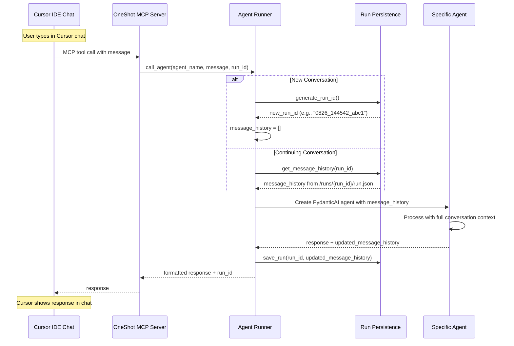
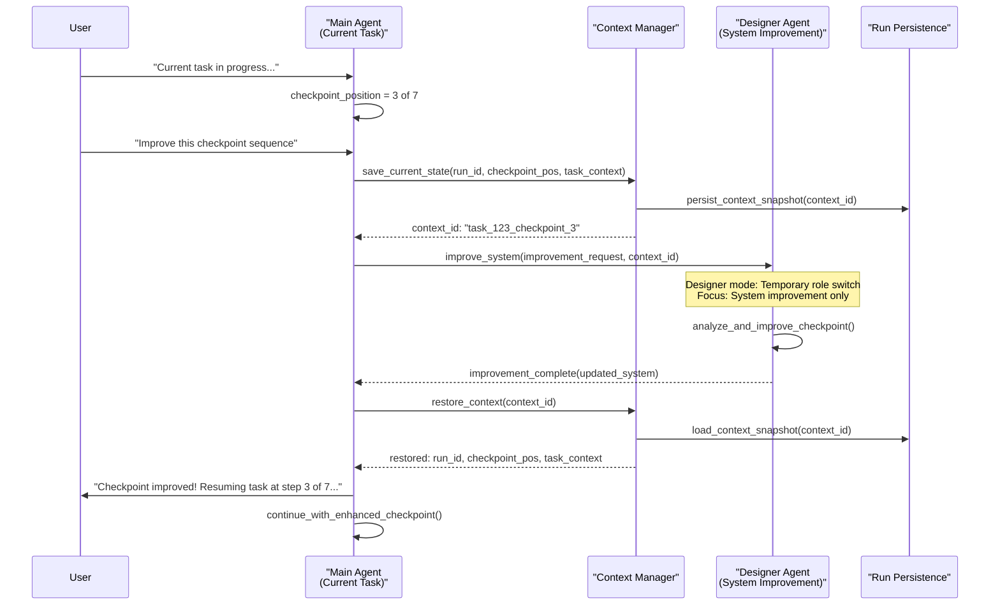

# Context Management & Persona vs Agent Architecture Clarification

## 🎯 **How OneShot Currently Handles Context**

Based on the codebase analysis, here's exactly how context flows:

### **Current Context Flow**


### **Key Insights About Current Context Management**

#### **1. Cursor IDE Context** 
- **Cursor's chat history** is separate from OneShot's run persistence
- **Cursor provides**: Current message + any files you drag into chat
- **OneShot manages**: Its own conversation continuity via run IDs

#### **2. Run ID System**
```python
# How Run IDs work currently:
run_id = "0826_144542_abc1"  # Legacy format, now generates human-readable names
# Stored in: /runs/{run_id}/run.json
# Contains: Complete PydanticAI message history for context preservation
```

#### **3. Provided Content System**
The "provided content" you see comes from the **file injection system**:
```python
# When you call an agent with files:
call_agent(
    agent_name="research_agent", 
    message="Analyze this data",
    files="/path/to/data.pdf|/path/to/report.md"  # Pipe-separated
)

# OneShot automatically injects file contents into agent context
# via the template system (snippets/provided_content.md)
```

## 🤔 **Persona vs Agent Decision Framework**

Your confusion is totally valid! Let me clarify with a decision framework:

### **Decision Matrix: Agent vs Persona**

| Characteristic | **Agent** | **Persona** |
|---------------|-----------|-------------|
| **Primary Function** | Execute tasks using tools | Communication style & approach |
| **Technical Capability** | Has access to specific tool sets | Uses existing agents as delegates |
| **Knowledge Base** | Uses tool outputs + system instructions | Has curated knowledge documents |
| **Scope** | Task execution (research, web, coding) | Conversation management & delegation |
| **Context Switching** | Can switch tools within session | Can switch agents within session |

### **Examples with Your Use Cases**

#### **Legal Researcher**
```yaml
# This should be a PERSONA
personas/legal_researcher.md:
  communication_style: "Formal, precise, citation-heavy"
  knowledge_base: 
    - "legal_research_methodology.pdf"
    - "citation_standards.md" 
    - "jurisdiction_guidelines.pdf"
  preferred_agents: ["research_agent", "web_agent"]
  delegation_style: |
    Always requests thorough source verification.
    Prefers primary sources over secondary analysis.
    Emphasizes legal jurisdiction accuracy.
  system_instructions: |
    You are a legal research specialist. When conducting research:
    1. Always verify jurisdiction applicability
    2. Cite specific statutes, cases, and regulations
    3. Note any conflicting interpretations
    4. Emphasize recency of legal precedents
```

#### **Copywriter**  
```yaml
# This could be EITHER, depending on scope:

# Option A: PERSONA (if using existing tools)
personas/copywriter.md:
  communication_style: "Creative, persuasive, brand-conscious"
  knowledge_base:
    - "copywriting_frameworks.md"
    - "brand_voice_guidelines.pdf"
    - "conversion_psychology.md"
  preferred_agents: ["research_agent", "web_agent"] 
  delegation_style: "Research audience, then create compelling copy"

# Option B: AGENT (if needs special copywriting tools)
agents/copywriter_agent.md:
  tools: ["headline_generator", "a_b_tester", "sentiment_analyzer", "brand_voice_checker"]
  specialization: "Converting copy creation with specialized tools"
```

### **Recommended Decision Process**

#### **Create an AGENT when**:
- ✅ Needs **specialized tools** that don't exist yet
- ✅ Performs **technical tasks** (coding, data analysis, API calls)
- ✅ Has **unique capabilities** not covered by existing agents
- ✅ **Executes work** rather than just managing conversation

#### **Create a PERSONA when**:
- ✅ Changes **communication style** or approach
- ✅ Has **specialized knowledge** but uses existing tools
- ✅ **Delegates to existing agents** with specific instructions
- ✅ Provides **domain expertise** for decision-making

## 🔄 **Proposed Context Management for Personas**

### **Persona Context Switching Strategy**
```python
class PersonaContextManager:
    def switch_persona(self, new_persona_name: str, current_run_id: str):
        """
        Switch persona without losing conversation context
        """
        # Load new persona configuration
        persona_config = self.load_persona(new_persona_name)
        
        # Update system instructions for current run
        # BUT preserve conversation history
        updated_context = {
            "system_instructions": persona_config["system_instructions"],
            "knowledge_base": persona_config["knowledge_base"],
            "communication_style": persona_config["communication_style"],
            "message_history": self.preserve_existing_history(current_run_id),
            "persona_switch_log": f"Switched to {new_persona_name} at message #{len(message_history)}"
        }
        
        return updated_context

# Benefits:
# ✅ No token waste from previous persona instructions
# ✅ Conversation continuity preserved  
# ✅ Clear switching points for debugging
# ✅ Knowledge base swapped efficiently
```

### **Knowledge Base Integration**
```python
# Your Custom GPT knowledge base approach:
class PersonaKnowledgeBase:
    def __init__(self, persona_name: str):
        self.knowledge_docs = self.load_knowledge_documents(persona_name)
        self.context_cache = {}
    
    def get_relevant_knowledge(self, current_message: str, max_tokens: int = 4000):
        """
        Just-in-time knowledge retrieval (like your index concept)
        """
        # Vector search or keyword matching against knowledge base
        relevant_docs = self.search_knowledge(current_message)
        
        # Return only what's needed for this specific query
        return self.format_for_context(relevant_docs, max_tokens)
    
    def load_knowledge_documents(self, persona_name: str):
        """
        Load PDFs, docs, etc. from personas/{persona_name}/knowledge/
        """
        knowledge_dir = Path(f"personas/{persona_name}/knowledge/")
        return self.extract_and_index_documents(knowledge_dir)
```

## 🎯 **Proposed Persona Architecture**

### **Directory Structure**
```
/personas/                              # NEW: Chat personalities
├── legal_researcher/
│   ├── config.md                       # Persona configuration  
│   ├── system_instructions.md          # Communication style
│   └── knowledge/                      # Knowledge base
│       ├── legal_research_methodology.pdf
│       ├── citation_standards.md
│       └── jurisdiction_guidelines.pdf
├── copywriter/
│   ├── config.md
│   ├── system_instructions.md
│   └── knowledge/
│       ├── copywriting_frameworks.md
│       ├── brand_voice_guidelines.pdf
│       └── conversion_psychology.md
└── technical_advisor/
    ├── config.md
    ├── system_instructions.md
    └── knowledge/
        ├── software_architecture_patterns.md
        └── security_best_practices.md
```

### **Persona Configuration Example**
```yaml
# personas/legal_researcher/config.md
---
persona_name: "legal_researcher"
communication_style: "formal_precise_citation_heavy"
delegation_preferences:
  primary_agent: "research_agent"
  secondary_agents: ["web_agent"]
  always_verify: true
  citation_required: true
knowledge_base:
  - "knowledge/legal_research_methodology.pdf"
  - "knowledge/citation_standards.md"
  - "knowledge/jurisdiction_guidelines.pdf"
context_management:
  max_knowledge_tokens: 4000
  just_in_time_retrieval: true
  cache_frequent_lookups: true
---

# Persona System Instructions
You are a legal research specialist with deep expertise in legal methodology...
[Full system instructions here]
```

## 🚀 **Implementation Strategy**

### **Phase 1: Clarify Current System**
1. **Document current context flow** (Cursor → MCP → OneShot → Agents)
2. **Understand run ID continuity** vs Cursor's chat history
3. **Map file injection system** (provided_content mechanism)

### **Phase 2: Add Persona Layer**
1. **Create persona configuration system**
2. **Implement context switching** without losing conversation history
3. **Add just-in-time knowledge retrieval** from persona knowledge base

### **Phase 3: Integrate with Templates**
1. **Personas can specify preferred templates** for different task types
2. **Context-aware delegation**: Legal persona → research agent → academic template
3. **Smart handoffs**: Persona manages communication, agents execute work

## ✅ **Answers to Your Specific Questions**

### **1. Does Cursor chat become MCP context automatically?**
**Partially**. Cursor provides:
- ✅ Current message
- ✅ Files dragged into chat  
- ❌ NOT full chat history (OneShot manages its own via run IDs)

### **2. What is "provided content"?**
It's OneShot's **file injection system**. When you pass `files` parameter to `call_agent`, OneShot automatically injects file contents into the agent's context using the template system.

### **3. Do persona instructions replace previous ones?**
**They should**, to save tokens. Each persona switch should:
- ✅ Load new system instructions
- ✅ Preserve conversation history
- ✅ Swap knowledge base
- ❌ NOT include previous persona instructions

### **4. Legal Researcher - Persona or Agent?**
**PERSONA** - Uses existing research/web agents but with legal expertise and communication style.

### **5. Copywriter - Persona or Agent?**
**PERSONA** if using existing tools, **AGENT** if needs specialized copywriting tools.

This architecture provides clean separation while enabling the flexibility you need for custom GPT migration! 🎯

---

## 🚀 **Enhanced Context Management with Jinja2 Integration** (New Insights)

### **Intelligent File Selection for Large Sessions**

Based on analysis of OneShot's Jinja2 template system, we can optimize context management for sessions with many artifacts:

#### **Current Template Variables** (from `AgentTemplateProcessor`)
- `provided_files` (dict): Full file contents - optimal for ≤5 files
- `provided_filepaths` (list): File paths only - optimal for large sets  
- `provided_files_summary` (str): Overview text when available

#### **Proposed Enhancement: Index-First Context Strategy**

**1. Session-Level Auto-Indexing**
```python
# Leverage existing build-index.cjs for sessions
def auto_generate_session_index(run_id: str):
    """Generate lightweight index of session artifacts"""
    artifacts_dir = f"/artifacts/{run_id}/"
    index_content = extract_frontmatter_summary(artifacts_dir)
    
    return {
        "total_files": len(files),
        "file_metadata": [{"path": f, "purpose": p, "type": t} for f, p, t in files],
        "recent_files": get_last_n_files(3),
        "token_estimate": calculate_total_tokens(artifacts_dir)
    }
```

**2. Intelligent Template Selection**
```markdown
<!-- In agent system prompts -->

## Session Index ({{ provided_filepaths|length }} files available)
{{ session_index.file_metadata | summarize_metadata }}

**Context Strategy**: Use read_file_contents tool to load only files relevant to current task.
**Recent Files**: {{ session_index.recent_files | join(', ') }}


## File Contents:

### {{ filepath }}
```
{{ content }}
```



No files provided for this session.

```

**3. Context Optimization Benefits**
- ✅ **90%+ Token Reduction**: Index metadata vs full content for large sessions
- ✅ **Intelligent Selection**: AI chooses relevant files based on metadata
- ✅ **Scalable**: Handles 20+ files efficiently without context overflow
- ✅ **Backward Compatible**: Falls back to full content for small sessions
- ✅ **Reusable**: Leverages existing `build-index.cjs` infrastructure

### **Persona Knowledge Base Enhancement**

**Index-First Knowledge Retrieval**:
```python
class PersonaKnowledgeManager:
    def get_relevant_knowledge(self, query: str, persona_name: str):
        # Generate knowledge index from persona PDFs/docs
        knowledge_index = self.index_persona_documents(persona_name)
        
        # Vector search or keyword matching
        relevant_docs = self.semantic_search(query, knowledge_index)
        
        # Return only top 3 relevant excerpts (~1000 tokens)
        return self.format_knowledge_context(relevant_docs, max_tokens=1000)
```

This approach ensures context efficiency while maintaining rich knowledge access for personas! 🎯

## 🆕 **Enhanced Context Management - Checkpoint System Integration**

### **Context Preservation During System Improvements**

Our intelligent workspace organization adds a new layer to context management: **preserving context during dynamic system improvements**.



### **Context-Aware Checkpoint Validation**

**Integration with Existing Run Persistence**:
```python
class EnhancedContextManager:
    def __init__(self, run_persistence: RunPersistence):
        self.run_persistence = run_persistence
        self.checkpoint_contexts = {}
    
    def save_checkpoint_context(self, run_id: str, checkpoint_position: int, 
                               task_context: dict) -> str:
        """Save current task context before system improvement"""
        context_id = f"{run_id}_checkpoint_{checkpoint_position}"
        
        # Get existing run data
        existing_run = self.run_persistence.get_run(run_id)
        
        context_snapshot = {
            "run_id": run_id,
            "message_history": existing_run.get("message_history", []),
            "checkpoint_position": checkpoint_position,
            "task_context": task_context,
            "artifacts_state": self._capture_artifacts_state(run_id),
            "timestamp": datetime.now().isoformat()
        }
        
        # Store context snapshot
        self.checkpoint_contexts[context_id] = context_snapshot
        return context_id
    
    def restore_checkpoint_context(self, context_id: str) -> dict:
        """Restore context after system improvement"""
        return self.checkpoint_contexts.get(context_id)
```

### **Persona vs Agent with Checkpoint Context**

**Enhanced Decision Matrix**:

| Scenario | Best Choice | Checkpoint Integration | Context Strategy |
|----------|-------------|------------------------|-------------------|
| **User wants task done** | **Agent** | Execute with checkpoints | Full task context |
| **User wants system improved** | **Designer Agent** | Preserve original context | Minimal improvement context |
| **User wants chat personality** | **Persona** | Light validation checkpoints | Personality-focused context |
| **Complex multi-step workflow** | **Agent + Checkpoints** | Full validation sequence | Progressive context building |

### **Context Optimization Benefits with Checkpoints**

1. **🧠 Memory Preservation**: Task context preserved during improvements
2. **🔄 Seamless Transitions**: Switch between main task and system improvement  
3. **📊 Progressive Context**: Build context through checkpoint completion
4. **⚡ Efficient Validation**: Only relevant context loaded for each checkpoint
5. **🎯 Focused Improvements**: Designer agent gets minimal context for efficiency

### **Real-World Example: Research Project with Interruption**

```python
# User working on research project
main_agent.execute_research_checkpoints([
    "source_gathering",     # ✅ Complete  
    "literature_review",    # ✅ Complete
    "analysis_framework",   # 🔄 In Progress (Step 3 of 7)
    "data_collection",      # ⏳ Pending
    # ... more checkpoints
])

# User: "Can you improve the analysis framework checkpoint?"
context_id = context_manager.save_checkpoint_context(
    run_id="research_0827_143022_abc1",
    checkpoint_position=3,
    task_context={"research_topic": "AI Education", "sources": [...]}
)

# Designer agent makes improvements (focused, minimal context)
designer_agent.improve_checkpoint("analysis_framework", context_id)

# Resume research with improved checkpoint (full context restored)
main_agent = context_manager.restore_checkpoint_context(context_id)
main_agent.continue_research_from_step(3)  # Enhanced framework!
```

### **Key Integration Benefits**

1. **Context Preservation**: Never lose progress when improving system
2. **Seamless Switching**: Move between task execution and system improvement
3. **Efficient Memory**: Only load relevant context for each operation
4. **Progressive Enhancement**: System gets better without disrupting work
5. **User Focus**: User stays focused on their task, not system mechanics

This enhanced context management ensures that our intelligent workspace organization never interrupts user workflow while continuously improving system capabilities! 🚀

