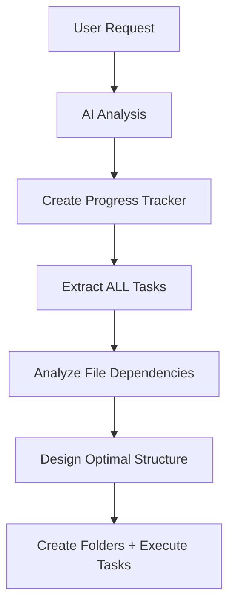

I am.---
title: "OneShot 2.0 Complete File & Folder Structure"
created: "2025-08-27T15:00:00.000Z"
type: "architecture"
purpose: "Comprehensive visualization of the complete OneShot 2.0 file and folder structure showing all integrated modules and components"
task: "Clean_GlobalDocs_Implementation"
status: "Active"
priority: "High"
tags: ["architecture", "file-structure", "organization", "oneshot-2.0", "comprehensive-view"]
---

# OneShot 2.0 Complete File & Folder Structure

## 🎯 **Purpose**
This document provides a **complete visualization** of what OneShot 2.0 will look like when all modules are integrated. It shows:

- ✅ **Current State** (what exists now)
- ✅ **Planned State** (what will exist after integration)
- ✅ **All Modules Integrated** (templates, progress trackers, checkpoints, validation, AI analysis)
- ✅ **Real Examples** (not just theory)
- ✅ **Migration Path** (how to get from current to planned)

## 📍 **Current State (What Exists Now)**

### **Root Level Structure**
```
oneshot/
├── app/                          # Core application
│   ├── tool_services.py         # LLM integration & file operations
│   ├── guides/                  # Documentation system
│   ├── agent_runner.py          # Agent execution
│   ├── mcp_config.py           # MCP configuration
│   └── [other core files]
├── artifacts/                   # LEGACY: Current file storage
│   └── {run_id}/               # Conversation-based organization
├── runs/                        # Conversation history
├── tasks/                       # Task workspaces
├── snippets/                    # ✅ EXISTS: Current snippets
│   ├── progress_tracker.md      # Generic anti-drift template
│   ├── agent_loop.md           # Agent content templates
│   ├── final_message.md        # Messaging templates
│   └── [other existing snippets]
├── templates/                   # ✅ EXISTS: Output templates
│   └── nrl_match_report.html   # HTML generation templates
├── tools/                       # Tool ecosystem
└── [other existing folders]
```

### **Current Snippets Structure**
```
snippets/
├── progress_tracker.md          # Single generic template
├── agent_loop.md               # Agent content patterns
├── final_message.md            # Response templates
├── provided_content.md         # Content handling
├── todo_management.md          # Task management
├── wip_document_management.md  # Work-in-progress docs
└── INDEX.md                    # Snippet index
```

## 🚀 **Planned State: OneShot 2.0 Complete Structure**

### **Root Level Structure (Enhanced)**
```
oneshot-2.0/
├── vault/                       # 🆕 EMBEDDED OBSIDIAN VAULT
│   ├── .obsidian/              # Obsidian configuration
│   ├── sessions/               # Task sessions
│   ├── projects/               # Formal projects
│   └── templates/              # Obsidian note templates
├── app/                         # ENHANCED Core application
│   ├── vault_manager.py        # 🆕 Vault operations
│   ├── session_type_detector.py # 🆕 Intelligent routing
│   ├── template_manager.py     # 🆕 Template system
│   ├── ai_analyzer.py          # 🆕 Novel content analysis
│   └── [enhanced existing files]
├── snippets/                   # 🆕 RESTRUCTURED & ENHANCED
│   ├── session-templates/      # 🆕 Task session structures
│   │   ├── coding_session.md
│   │   ├── research_session.md
│   │   ├── analysis_session.md
│   │   └── general_session.md
│   ├── project-templates/      # 🆕 Project structures
│   │   ├── software_project.md
│   │   ├── research_project.md
│   │   └── documentation_project.md
│   ├── progress-trackers/      # 🆕 Anti-drift library
│   │   ├── base_tracker.md
│   │   ├── coding_tracker.md
│   │   ├── research_tracker.md
│   │   └── analysis_tracker.md
│   ├── checkpoints/            # 🆕 Validation system
│   │   ├── templates/          # Jinja2 checkpoint templates
│   │   ├── instructions/       # Validation guidance
│   │   ├── library/           # Reusable checkpoint catalog
│   │   └── validation/         # Quality standards
│   ├── validation/             # 🆕 Quality assurance
│   │   ├── rules/             # Validation rule patterns
│   │   ├── patterns/          # Common validation patterns
│   │   └── standards/         # Quality check standards
│   └── [existing snippets]     # Preserved
├── templates/                  # ENHANCED Output templates
│   ├── reports/               # 🆕 Report generation
│   ├── exports/               # 🆕 Export formats
│   └── [existing HTML templates]
├── tools/                      # ENHANCED Tool ecosystem
│   ├── ai_integration/        # 🆕 AI-powered tools
│   ├── validation/            # 🆕 Quality tools
│   └── [enhanced existing tools]
├── config/                     # 🆕 Centralized configuration
│   ├── templates.yaml         # Template system config
│   ├── validation.yaml        # Quality standards config
│   └── ai_models.yaml         # AI integration config
└── docs/                       # 🆕 Comprehensive documentation
    ├── architecture/          # System architecture docs
    ├── templates/             # Template authoring guides
    └── examples/              # Real-world examples
```

## 📋 **Detailed Module Integration**

### **Session Templates Structure**
```
snippets/session-templates/
├── coding_session.md           # Development task sessions
│   ├── Folder structure: code/, docs/, tests/, artifacts/
│   ├── Basic development guidelines
│   └── Progress tracker integration point
├── research_session.md         # Research task sessions
│   ├── Folder structure: research/, sources/, data/, analysis/
│   ├── Research methodology guidance
│   └── Progress tracker integration point
├── analysis_session.md         # Analysis task sessions
│   ├── Folder structure: data/, reports/, analysis/, visualizations/
│   ├── Analytical frameworks
│   └── Progress tracker integration point
└── general_session.md          # General task sessions
    ├── Flexible folder structure
    ├── General productivity guidance
    └── Optional progress tracker integration
```

### **Project Templates Structure**
```
snippets/project-templates/
├── software_project.md         # Software development projects
│   ├── docs/ (README, architecture, api, user_guides)
│   ├── artifacts/ (code/, designs/, specifications/)
│   ├── sessions/ (links to contributing sessions)
│   └── resources/ (references/, examples/)
├── research_project.md         # Research projects
│   ├── docs/ (methodology, findings, literature_review)
│   ├── artifacts/ (data/, analysis/, reports/, visualizations/)
│   ├── sessions/ (contributing sessions)
│   └── resources/ (sources/, datasets/)
└── documentation_project.md    # Documentation projects
    ├── docs/ (content/, guides/, references/)
    ├── artifacts/ (diagrams/, examples/, templates/)
    ├── sessions/ (contributing sessions)
    └── resources/ (external references)
```

### **Progress Trackers Library**
```
snippets/progress-trackers/
├── base_tracker.md             # Foundation template (inherited by all)
│   ├── Basic anti-drift structure
│   ├── Core reminder patterns
│   └── Validation protocols
├── coding_tracker.md           # Coding-specific extensions
│   ├── Code quality principles
│   ├── Testing requirements
│   ├── Documentation standards
│   └── Implementation phases
├── research_tracker.md         # Research-specific extensions
│   ├── Methodology rigor
│   ├── Data integrity standards
│   ├── Reproducibility requirements
│   └── Peer review preparation
├── analysis_tracker.md         # Analysis-specific extensions
│   ├── Analytical frameworks
│   ├── Data validation methods
│   └── Insight extraction protocols
└── custom_tracker.md           # Customizable base for novel tasks
    ├── Flexible structure
    ├── Customization guidelines
    └── Extension points
```

### **Checkpoints & Validation System**
```
snippets/checkpoints/
├── templates/                  # Jinja2 Templates
│   ├── base_validation.j2      # Base checkpoint structure
│   ├── dynamic_sequence.j2     # Custom sequence generator
│   ├── quality_gate.j2         # Quality validation template
│   └── milestone_review.j2     # Milestone validation template
├── instructions/               # Validation Guidance
│   ├── content_analysis.md     # Content validation instructions
│   ├── structure_validation.md # Organization validation
│   ├── evolution_triggers.md   # Growth detection guidance
│   └── quality_standards.md    # Quality criteria
├── library/                    # Reusable Checkpoint Catalog
│   ├── coding_checkpoints.md   # Coding-specific validations
│   ├── research_checkpoints.md # Research-specific validations
│   ├── analysis_checkpoints.md # Analysis-specific validations
│   └── general_checkpoints.md  # General-purpose validations
└── validation/                 # Quality Standards
    ├── rules/                  # Validation Rule Patterns
    ├── patterns/               # Common Validation Patterns
    └── standards/              # Quality Check Standards
```

## 🎯 **Real-World Examples**

### **Example 1: Coding Task Session**
```
vault/sessions/
└── implement_user_auth_2025_08_27_143022/
    ├── README.md               # Generated from coding_session.md
    │   ├── Folder structure guidance
    │   ├── Development guidelines
    │   └── Progress tracker integration
    ├── code/                   # Auto-created
    │   ├── auth.py
    │   └── utils.py
    ├── docs/                   # Auto-created
    │   ├── api.md
    │   └── setup.md
    ├── tests/                  # Auto-created
    │   └── test_auth.py
    ├── artifacts/              # Auto-created
    │   └── diagrams/
    └── progress_tracker.md     # Auto-injected from coding_tracker.md
        ├── Primary Mission: Implement secure user authentication
        ├── Key Principles: Security-first, test coverage, documentation
        ├── Implementation phases with checkboxes
        └── Validation protocols
```

### **Example 2: Research Project**
```
vault/projects/
└── ai_ethics_study/
    ├── README.md               # Generated from research_project.md
    │   ├── Project overview
    │   ├── Methodology framework
    │   └── Success criteria
    ├── docs/                   # Auto-created
    │   ├── methodology/
    │   ├── findings/
    │   └── literature_review/
    ├── artifacts/              # Auto-created
    │   ├── data/
    │   ├── analysis/
    │   └── reports/
    ├── sessions/               # Links to contributing sessions
    │   ├── literature_review_2025_08_25_091530/
    │   └── methodology_design_2025_08_26_142045/
    └── resources/              # Auto-created
        ├── sources/
        └── datasets/
```

## 🔄 **Integration Points**

### **With Existing Systems**
```
app/tool_services.py            # ENHANCED with vault awareness
├── File operations now vault-aware
├── Auto-generates frontmatter
└── Integrates with template system

app/agent_runner.py             # ENHANCED with template integration
├── Session type detection
├── Template selection
└── Progress tracker injection

tools/                          # ENHANCED with AI capabilities
├── ai_integration/            # New AI-powered tools
├── validation/                # Quality assurance tools
└── template_processing/       # Template management tools
```

### **Configuration Integration**
```
config/
├── templates.yaml             # Template system configuration
│   ├── Session type mappings
│   ├── Progress tracker assignments
│   ├── Complexity thresholds
│   └── Validation rules
├── validation.yaml            # Quality standards configuration
│   ├── Checkpoint definitions
│   ├── Quality gates
│   └── Validation criteria
└── ai_models.yaml             # AI integration configuration
    ├── Model selection rules
    ├── Context limits
    └── Fallback strategies
```

## 🧠 **The Progress Tracker First Architecture**

### **Why Progress Tracker First?**

You're absolutely right! The progress tracker should be created **first** because it contains the complete context of ALL tasks that need to be done. From this comprehensive task list, we can then design the optimal folder structure.

#### **The Smart Approach: Task-Driven Structure**


### **Real Example: Task-Driven Structure**

#### **User Request:** "Build a user authentication system with JWT tokens, database integration, and API endpoints"

#### **Progress Tracker First (Smart):**
1. **AI Creates Progress Tracker:**
   ```
   ## 📊 **Progress Tracker: User Authentication System**

   ### **Phase 1: Database Design**
   - [ ] Design user schema with fields: id, email, password_hash, created_at
   - [ ] Create migration files
   - [ ] Add validation constraints

   ### **Phase 2: JWT Implementation**
   - [ ] Implement token generation function
   - [ ] Add token verification middleware
   - [ ] Create refresh token logic

   ### **Phase 3: API Endpoints**
   - [ ] POST /auth/register - user registration
   - [ ] POST /auth/login - user login
   - [ ] POST /auth/refresh - token refresh
   - [ ] GET /auth/me - get current user

   ### **Phase 4: Integration Testing**
   - [ ] Write unit tests for auth functions
   - [ ] Write API endpoint tests
   - [ ] Test token validation flow

   ### **Phase 5: Documentation**
   - [ ] API documentation
   - [ ] Setup instructions
   - [ ] Usage examples
   ```

2. **AI Analyzes ALL Tasks → Designs Structure:**
   ```
   vault/sessions/build_auth_system_2025_08_27_143022/
   ├── models/                 # From Phase 1: database schemas
   │   ├── user.py
   │   └── migrations/
   ├── auth/                   # From Phase 2: JWT implementation
   │   ├── jwt_utils.py
   │   ├── middleware.py
   │   └── refresh_tokens.py
   ├── routes/                 # From Phase 3: API endpoints
   │   ├── auth.py
   │   └── __init__.py
   ├── tests/                  # From Phase 4: test files
   │   ├── test_auth.py
   │   ├── test_api.py
   │   └── test_integration.py
   ├── docs/                   # From Phase 5: documentation
   │   ├── api.md
   │   ├── setup.md
   │   └── examples.md
   └── progress_tracker.md     # The source of this structure
   ```

### **Vs. Template-Driven Structure (Less Optimal):**
```
vault/sessions/build_auth_system_2025_08_27_143022/
├── code/                     # Generic folder
├── docs/                     # Generic folder
├── tests/                    # Generic folder
└── progress_tracker.md
```
**Problem:** Generic folders don't match the specific task requirements!

## 📊 **Migration Path**

### **Phase 1: Foundation (Current)**
- ✅ Template architecture clarified
- ✅ Progress tracker system designed
- ✅ Validation framework outlined
- ⏳ Create initial folder structure

### **Phase 2: Progress Tracker First Implementation**
- ⏳ Implement task analysis engine (extracts ALL tasks from user request)
- ⏳ Build file dependency analyzer (determines what folders/files are needed)
- ⏳ Create dynamic structure generator (builds optimal folder structure)
- ⏳ Integrate with vault system

### **Phase 3: Smart Template Integration**
- ⏳ Create progress tracker templates (base + specialized)
- ⏳ Build task-driven folder structure templates
- ⏳ Implement checkpoint system
- ⏳ Add validation rules

### **Phase 4: AI Optimization**
- ⏳ Implement AI complexity analysis
- ⏳ Build smart template matching
- ⏳ Create dynamic tracker selection
- ⏳ Add customization capabilities

### **Phase 5: Production Ready**
- ⏳ End-to-end testing
- ⏳ Performance optimization
- ⏳ Documentation completion
- ⏳ Production deployment

## 🎉 **What This Gives You**

### **Complete System Visibility**
- ✅ **Every folder and file** that will exist in OneShot 2.0
- ✅ **All module integrations** clearly mapped
- ✅ **Real examples** showing how it works in practice
- ✅ **Migration path** from current to planned state

### **Decision-Making Framework**
- ✅ **Template selection logic** clearly defined
- ✅ **AI decision points** identified
- ✅ **Validation integration** mapped out
- ✅ **Customization options** documented

### **Implementation Roadmap**
- ✅ **Clear phases** with specific deliverables
- ✅ **Dependencies** between modules identified
- ✅ **Testing strategies** outlined
- ✅ **Success criteria** defined

---

## 🚀 **Next Steps**

1. **Review this structure** - Does it match your vision?
2. **Identify gaps** - Are there modules missing?
3. **Prioritize implementation** - Which parts should we build first?
4. **Create examples** - Should we build actual template files?

**This comprehensive view shows exactly what OneShot 2.0 will look like when complete!** 🎯

Would you like me to:
1. **Create actual example template files** to demonstrate this structure?
2. **Update any specific parts** of this comprehensive view?
3. **Focus on implementing** a particular module first?
4. **Create a migration guide** showing how to transition from current to planned state?
