# Planned Template Architecture Clarification

## 🎯 **Purpose**
This document clarifies the **planned template system architecture** and answers your specific questions about:
- Where templates are stored
- Relationship between session templates, project templates, and progress trackers
- Complete decision flow from user query to template selection
- How the orchestrator decides what type of task it is

## 📋 **Terminology Clarification**

### **🎯 What We Mean by "Templates"**

You're absolutely right - we need to be **explicit** about what we mean by templates:

#### **Template Types in OneShot 2.0:**
1. **Output Templates** (`/templates/` folder)
   - HTML/PDF generation templates
   - Report formatting templates
   - Export/document templates
   - **Example**: `nrl_match_report.html` → Generates formatted reports

2. **Snippet Templates** (`/snippets/` folder)
   - Reusable content patterns
   - AI guidance templates
   - Task execution frameworks
   - **Example**: `progress_tracker.md` → Anti-drift execution guide

3. **Session/Project Templates** (NEW - to be organized)
   - **Session Templates**: Working session structures + execution guidance
   - **Project Templates**: Long-term project organization + deliverables

### **🔤 Clear Session vs Project Terminology**

#### **Standard Terminology:**
- **Chat Session**: Single conversation/interaction
- **Work Session**: Single focused work period (what we currently call "session")
- **Project**: Multi-session, long-term endeavor with formal deliverables

#### **Proposed Terminology:**
- **Task Session**: Single work session (coding session, research session, etc.)
- **Project**: Multi-session formal endeavor

### **📁 Proposed Clean Folder Structure**

```
📁 OneShot 2.0 Template Organization:
├── snippets/
│   ├── session-templates/           # 🆕 Task Session Templates
│   │   ├── coding_session.md        # Development task session
│   │   ├── research_session.md      # Research task session
│   │   ├── analysis_session.md      # Analysis task session
│   │   └── general_session.md       # General task session
│   ├── project-templates/           # 🆕 Project Templates
│   │   ├── software_project.md      # Software development project
│   │   ├── research_project.md      # Research project
│   │   └── documentation_project.md # Documentation project
│   ├── progress-trackers/           # 🆕 Progress Tracker Library
│   │   ├── anti_drift_base.md       # Base anti-drift template
│   │   ├── coding_tracker.md        # Coding-specific tracker
│   │   ├── research_tracker.md      # Research-specific tracker
│   │   └── custom_tracker.md        # Customizable tracker
│   └── [existing snippets]
├── templates/                       # Output Templates (keep existing)
│   └── nrl_match_report.html       # Report generation templates
└── [existing structure]
```

## 📍 **Current State vs Planned State**

### **Current State (What Exists Now)**
```
📁 Current Structure:
├── snippets/
│   ├── progress_tracker.md          # Single generic anti-drift template
│   └── [other snippets]
├── templates/
│   └── nrl_match_report.html        # Output template (HTML → PDF/Web)
└── [no session/project templates yet]
```

### **Planned State (What Will Exist)**
```
📁 Planned Structure:
├── snippets/
│   ├── session-templates/           # 🆕 Task Session Templates
│   │   ├── coding_session.md        # Development task session
│   │   ├── research_session.md      # Research task session
│   │   └── general_session.md       # General task session
│   ├── project-templates/           # 🆕 Project Templates
│   │   ├── software_project.md      # Software development project
│   │   └── research_project.md      # Research project
│   ├── progress-trackers/           # 🆕 Progress Tracker Library
│   │   ├── anti_drift_base.md       # Base anti-drift template
│   │   ├── coding_tracker.md        # Coding-specific tracker
│   │   └── research_tracker.md      # Research-specific tracker
│   └── [existing snippets]
├── templates/                       # Output Templates (keep existing)
│   └── nrl_match_report.html       # Report generation templates
└── [existing structure]
```

## 🔍 **Your Key Questions Answered**

### **Question 1: Where Are Templates Going to Be Stored?**

**✅ ANSWERED:** Templates are now **logically organized** by purpose:

**Task Session Templates** → `snippets/session-templates/` (working session structures)
**Project Templates** → `snippets/project-templates/` (long-term project organization)
**Progress Trackers** → `snippets/progress-trackers/` (reusable anti-drift templates)
**Output Templates** → `templates/` (HTML/PDF generation - keep existing)

### **Question 2: Does Each Session/Project Type Have Its Own Template File?**

**YES!** Each type gets its own dedicated template file:

```
snippets/session-templates/
├── coding_session.md        # For "development" task sessions
├── research_session.md      # For "research" task sessions
├── analysis_session.md      # For "analysis" task sessions
└── general_session.md       # For "general" task sessions

snippets/project-templates/
├── software_project.md      # For "software_development" projects
├── research_project.md      # For "research_project" projects
└── documentation_project.md # For "documentation_project" projects
```

### **Question 3: How Do Progress Tracker Templates Fit In?**

**✅ ANSWERED:** I've redesigned this with **3 clear integration approaches**:

#### **Option A: Integrated (Recommended)**
```markdown
# snippets/session-templates/coding_session.md
---
title: "Coding Task Session Template"
type: "session_template"
session_type: "development"
progress_tracker: "integrated"  # Progress tracker built into this template
---

# 📁 **Folder Structure for Coding Task Session**
- `code/` - Source code and implementation
- `docs/` - Documentation and specifications
- `tests/` - Test files and validation

# 📊 **Integrated Progress Tracker**

### 🚨 **CRITICAL AI REMINDER - READ BEFORE EVERY ACTION** 🚨
## 📋 **PRIMARY MISSION**
[Auto-filled based on user request]

## 🎯 **KEY PRINCIPLES TO REMEMBER**
1. **Code Quality First** - Ensure clean, maintainable code
2. **Test Everything** - Write tests for all functionality
3. **Document Changes** - Update docs for any API changes
4. **Validate Early** - Test integrations frequently

## ⚠️ **MANDATORY ACTIONS AFTER EACH TASK**
- [ ] Update this progress tracker
- [ ] Run relevant tests
- [ ] Update documentation if needed
- [ ] Cross-reference with related files
```

#### **Option B: Referenced (Modular)**
```markdown
# snippets/session-templates/coding_session.md
---
title: "Coding Task Session Template"
type: "session_template"
session_type: "development"
progress_tracker: "reference"  # Reference external progress tracker
progress_tracker_ref: "snippets/progress-trackers/coding_tracker.md"
---

# 📁 **Folder Structure for Coding Task Session**
- `code/` - Source code and implementation
- `docs/` - Documentation and specifications
- `tests/` - Test files and validation

# 📊 **Progress Tracker**

```

#### **Option C: Jinja Injection (Most Flexible)**
```markdown
# snippets/session-templates/coding_session.md
---
title: "Coding Task Session Template"
type: "session_template"
session_type: "development"
progress_tracker: "jinja_inject"  # Use Jinja to inject progress tracker
---

# 📁 **Folder Structure for Coding Task Session**
- `code/` - Source code and implementation
- `docs/` - Documentation and specifications
- `tests/` - Test files and validation

# 📊 **Progress Tracker**
{{ progress_tracker_content | inject_from("snippets/progress-trackers/coding_tracker.md") }}
```

### **Question 4: Can Progress Trackers Be Reused Across Different Task Types?**

**YES!** This is a **key advantage** of the modular approach:

#### **Cross-Task Progress Tracker Reuse**
```
snippets/progress-trackers/
├── anti_drift_base.md       # Base template used by ALL trackers
├── coding_tracker.md        # Coding-specific (extends base)
├── research_tracker.md      # Research-specific (extends base)
├── testing_tracker.md       # Testing-specific (extends base)
└── custom_tracker.md        # Fully customizable
```

#### **How Reuse Works:**
1. **Base Template** (`anti_drift_base.md`) contains common structure
2. **Specialized Templates** extend base with domain-specific guidance
3. **Jinja Inheritance** allows one tracker to inherit from another
4. **Dynamic Selection** based on task complexity, not just type

#### **Example: Research Tracker Reusing Coding Principles**
```markdown
# snippets/progress-trackers/research_tracker.md
---
title: "Research Progress Tracker"
type: "progress_tracker"
extends: "anti_drift_base.md"  # Inherits from base
specialization: "research"
---

{{ super() }}  # Include base tracker content

## 🎯 **Research-Specific Principles**
1. **Methodology First** - Define research approach clearly
2. **Data Integrity** - Ensure data quality and validity
3. **Reproducibility** - Document methodology completely
4. **Peer Review Ready** - Structure for academic review
```

### **Question 5: How Does Jinja Injection Work for Cross-Template Content?**

**✅ ANSWERED:** Jinja injection allows **dynamic content inclusion**:

#### **Jinja Injection Patterns:**

1. **Simple Include**
```jinja
# In session template
{{ include_file("snippets/progress-trackers/coding_tracker.md") }}
```

2. **Conditional Include**
```jinja
# Dynamic tracker selection

  {{ include_file("snippets/progress-trackers/coding_tracker.md") }}

  {{ include_file("snippets/progress-trackers/research_tracker.md") }}

```

3. **Parameterized Include**
```jinja
# Inject with customization
{{ include_tracker("snippets/progress-trackers/coding_tracker.md",
                   task_name=user_request,
                   complexity=detected_complexity) }}
```

4. **Template Inheritance**
```jinja
# Base tracker (anti_drift_base.md)

## 📋 **PRIMARY MISSION**
{{ mission_statement }}


# Coding tracker (coding_tracker.md)


## 📋 **PRIMARY MISSION**
Develop high-quality, maintainable code that meets requirements

```

## 🧠 **Complete Decision Flow: User Query → Template Selection**

### **Phase 1: Intent Analysis & Role Determination**

```mermaid
graph TD
    A["User submits query:|Create a web app with user auth"] --> B{"Intent Analysis"}
    B --> C{"Simple Task?"}
    B --> D{"Complex Project?"}
    B --> E{"Research/Analysis?"}

    C -->|Yes| F["Orchestrator Role|→ Direct execution"]
    D -->|Yes| G["Orchestrator Role|→ Project template system"]
    E -->|Yes| G

    F --> H["No templates needed|→ Direct agent delegation"]
    G --> I["Template system activated|→ Task Session/Project creation"]
```


### **Phase 2: Task Session vs Project Determination**


### **Phase 3: Template Selection & Progress Tracker Integration**


## 📋 **Template Structure Examples**

### **Task Session Template Example (Combined)**
```markdown
---
title: "Coding Task Session Template"
created: "2025-08-27T15:00:00.000Z"
type: "task_session_template"
task_session_type: "development"
purpose: "Template for development task sessions with progress tracking"
task: "global_template"

# Trigger conditions (frontmatter-driven)
trigger_conditions:
  task_session_types: ["development"]
  keywords: ["code", "implement", "develop", "programming"]
  complexity_threshold: 3

# Template properties
properties:
  folders: ["code/", "docs/", "tests/", "artifacts/"]
  phases: ["analysis", "implementation", "testing", "documentation"]
  progress_tracker: "integrated"
  validation_score: 95

tags: ["template", "task_session", "development", "coding"]
---

# 🏗️ **Development Task Session Structure**

## 📁 **Recommended Folder Structure**
- `code/` - Source code and implementation
- `docs/` - Documentation and specifications
- `tests/` - Test files and validation
- `artifacts/` - Build outputs and deliverables

## 📊 **Progress Tracker Template**

### 🚨 **CRITICAL AI REMINDER - READ BEFORE EVERY ACTION** 🚨

## 📋 **PRIMARY MISSION**
[Auto-filled based on user request]

## 🎯 **KEY PRINCIPLES TO REMEMBER**
1. **Code Quality First** - Ensure clean, maintainable code
2. **Test Everything** - Write tests for all functionality
3. **Document Changes** - Update docs for any API changes
4. **Validate Early** - Test integrations frequently

## ⚠️ **MANDATORY ACTIONS AFTER EACH TASK**
- [ ] Update this progress tracker
- [ ] Run relevant tests
- [ ] Update documentation if needed
- [ ] Cross-reference with related files

---

# [AUTO-FILLED TASK NAME]

## 📊 **Current Status Assessment**

### **Requirements Analysis**
- [ ] Analyze requirements and constraints
- [ ] Identify dependencies and prerequisites
- [ ] Define success criteria

### **Implementation Planning**
- [ ] Design solution architecture
- [ ] Break down into manageable tasks
- [ ] Estimate time and resources needed

### **Core Development**
- [ ] Implement core functionality
- [ ] Add error handling and edge cases
- [ ] Code review and optimization

### **Testing & Validation**
- [ ] Write comprehensive tests
- [ ] Validate against requirements
- [ ] Performance and security testing

### **Documentation & Deployment**
- [ ] Update all documentation
- [ ] Prepare deployment artifacts
- [ ] Final validation and sign-off

## 🔄 **PROGRESS TRACKING PROTOCOL**

### **After Each Completed Task:**
1. ✅ Mark the checkbox above
2. 📝 Add completion notes below
3. 🔍 Run tests to ensure nothing broke
4. 📋 Update documentation if needed

### **Completion Notes Section**
**Requirements Analysis Notes:**
- [Completion notes will be added here]

**Implementation Notes:**
- [Completion notes will be added here]

**Testing Notes:**
- [Completion notes will be added here]

## 🎯 **SUCCESS CRITERIA**

### **Functional Requirements**
- [ ] All features implemented and working
- [ ] No critical bugs or issues
- [ ] Meets all acceptance criteria

### **Quality Standards**
- [ ] Code coverage > 90%
- [ ] All tests passing
- [ ] Documentation updated and accurate

---

# 🚨 **POST-COMPLETION AI REMINDER** 🚨

## ✅ **WHEN ALL TASKS COMPLETE:**
1. **Final Testing** - Run full test suite one final time
2. **Documentation Review** - Ensure all docs are up to date
3. **Code Cleanup** - Remove any temporary code or comments
4. **Final Validation** - Confirm all success criteria met
5. **Mark Session Complete** - Update status and notify stakeholders

## 📋 **BEFORE MARKING COMPLETE:**
- [ ] All checkboxes above are ✅
- [ ] All tests passing
- [ ] Documentation is current
- [ ] No known issues or bugs
- [ ] Ready for production deployment

**Remember: [AUTO-FILLED MISSION REMINDER]**
```

### **Project Template Example**
```markdown
---
title: "Software Development Project Template"
created: "2025-08-27T15:00:00.000Z"
type: "project_template"
project_type: "software_development"
purpose: "Project structure template for software development"
task: "global_template"

# Project properties
properties:
  folders: ["docs/", "artifacts/", "sessions/", "resources/"]
  auto_create_progress_tracker: true
  complexity: "high"

tags: ["template", "project", "software-development"]
---

# 📁 **Software Development Project Structure**

## **docs/**
- README.md (project overview)
- architecture/ (system design docs)
- api/ (API documentation)
- user_guides/ (user documentation)

## **artifacts/**
- code/ (source code)
- designs/ (design files)
- specifications/ (requirements)

## **sessions/**
- Links to contributing sessions

## **resources/**
- references/ (external references)
- examples/ (code examples)
```

## 🔄 **How Templates Are Selected & Used**

### **The Orchestrator's Decision Process**
```python
def process_user_request(user_query: str):
    """
    Complete flow from user query to template selection
    """

    # 1. INTENT ANALYSIS - What type of task is this?
    intent = analyze_intent(user_query)

    if intent.is_simple_task:
        # Simple task - direct execution
        return delegate_to_agent(user_query)

    # 2. COMPLEXITY ANALYSIS - Session or Project?
    complexity = analyze_complexity(user_query)

    if complexity.is_long_term_project:
        # Project path
        project_type = detect_project_type(user_query)  # "software_development", etc.
        return create_project_with_template(project_type, user_query)
    else:
        # Session path
        session_type = detect_session_type(user_query)  # "development", "research", etc.
        return create_session_with_template(session_type, user_query)
```

### **Template Registry System**
```python
class TemplateRegistry:
    def __init__(self):
        self.session_templates = {}  # Maps session_type → template_path
        self.project_templates = {}  # Maps project_type → template_path
        self.progress_trackers = {}  # Maps type → tracker_template

    def load_templates(self):
        """Load all templates from filesystem"""

        # Load session templates
        session_dir = Path("snippets/templates")
        for template_file in session_dir.glob("*.md"):
            frontmatter = extract_frontmatter(template_file)
            if frontmatter.get("type") == "session_template":
                session_type = frontmatter.get("session_type")
                self.session_templates[session_type] = template_file

        # Load project templates
        project_dir = Path("templates")
        for template_file in project_dir.glob("*.md"):
            frontmatter = extract_frontmatter(template_file)
            if frontmatter.get("type") == "project_template":
                project_type = frontmatter.get("project_type")
                self.project_templates[project_type] = template_file

    def get_session_template(self, session_type: str) -> Path:
        """Get template for session type"""
        return self.session_templates.get(session_type)

    def get_project_template(self, project_type: str) -> Path:
        """Get template for project type"""
        return self.project_templates.get(project_type)
```

## 🎯 **Progress Tracker Integration Options**

### **Option 1: Integrated (Recommended)**
- Progress tracker template is **part of** session/project template
- Triggered automatically based on frontmatter conditions
- Consistent structure across similar task types

### **Option 2: Dynamic Selection**
- Progress tracker chosen **separately** based on content analysis
- AI analyzes task complexity and selects most appropriate tracker
- More flexible but potentially less consistent

### **Option 3: Hybrid Approach**
- Base progress tracker from session template
- AI customizes it based on specific user request
- Best of both consistency and flexibility

## 🚀 **Implementation Roadmap**

### **Phase 1: Template Registry Foundation (Week 1)**
1. ✅ Create `snippets/templates/` directory structure
2. ⏳ Implement `TemplateRegistry` class
3. ⏳ Create frontmatter parser for template metadata
4. ⏳ Build template discovery system

### **Phase 2: Session Template Development (Week 2)**
5. ⏳ Create `coding_development.md` session template
6. ⏳ Create `research_methodology.md` session template
7. ⏳ Create `general_task.md` session template
8. ⏳ Integrate progress trackers into session templates

### **Phase 3: Project Template Integration (Week 3)**
9. ⏳ Create project templates in `/templates/`
10. ⏳ Connect project creation to template system
11. ⏳ Implement automatic progress tracker creation
12. ⏳ Test end-to-end project creation flow

### **Phase 4: Dynamic Selection Engine (Week 4)**
13. ⏳ Implement AI-powered template matching
14. ⏳ Build confidence scoring for template selection
15. ⏳ Add template customization capabilities
16. ⏳ Create template effectiveness analytics

## 🔧 **How to Add New Templates**

### **Adding a New Session Type:**
1. **Create template file**: `snippets/templates/new_type.md`
2. **Add frontmatter**:
```yaml
---
type: "session_template"
session_type: "new_type"
trigger_conditions:
  keywords: ["keyword1", "keyword2"]
  complexity_threshold: 2
---
```
3. **Template registry automatically discovers it** - no code changes needed!

### **Adding a New Project Type:**
1. **Create template file**: `templates/new_project_type.md`
2. **Add frontmatter**:
```yaml
---
type: "project_template"
project_type: "new_project_type"
properties:
  folders: ["custom_folder/"]
---
```
3. **Project creation system automatically uses it**

## 🎉 **Benefits of This Architecture**

### **✅ Dynamic & Flexible**
- New templates discovered automatically via frontmatter
- No hard-coding of template types or logic
- Easy to extend without touching system code

### **✅ Clear Separation of Concerns**
- **Session Templates** = Working session structure + progress tracking
- **Project Templates** = Long-term project organization
- **Progress Trackers** = Anti-drift execution guidance

### **✅ Frontmatter-Driven Configuration**
- All trigger conditions in template frontmatter
- Complexity thresholds defined per template
- Validation rules specified per template

### **✅ Maintainable**
- Add new templates by creating markdown files
- Modify behavior by editing frontmatter
- No code changes required for new template types

## 💡 **Your Confusion About Session vs Project Templates - RESOLVED**

### **Session Templates:**
- **Purpose**: Guide AI execution during active work sessions
- **Contains**: Folder structure + progress tracker + execution guidance
- **Triggers**: Based on session_type (development, research, analysis, general)
- **Location**: `snippets/templates/[type].md`

### **Project Templates:**
- **Purpose**: Define long-term project structure after session promotion
- **Contains**: Project folder structure + documentation templates
- **Triggers**: Based on project_type (software_development, research_project, etc.)
- **Location**: `templates/[type].md`

### **Progress Trackers:**
- **Purpose**: Prevent AI drift during execution
- **Integration**: Either integrated into session templates OR dynamically selected
- **Trigger**: Based on complexity analysis + template frontmatter conditions

### **The Flow:**
1. **User Query** → Intent Analysis → **Orchestrator Role**
2. **Complexity Analysis** → Session vs Project decision
3. **Type Detection** → development/research/general OR software_dev/research/etc.
4. **Template Loading** → Load appropriate session/project template
5. **Progress Tracker** → Create if complexity meets threshold
6. **Execution** → AI follows progress tracker systematically

This architecture gives you the **dynamic, frontmatter-driven system** you want while maintaining **clear separation** between working sessions and long-term projects!

## 🎯 **Clear Terminology Summary**

### **What Each Template Type Contains:**

#### **Task Session Templates** (`snippets/session-templates/`)
- **Purpose**: Guide AI execution during a single focused work period
- **Contains**:
  - 📁 Folder structure for the specific task type
  - 📊 Integrated or referenced progress tracker
  - 🎯 Task execution guidance and anti-drift principles
  - ⚠️ Validation checkpoints and quality standards
- **Example**: `coding_session.md` contains folder structure (code/, docs/, tests/) + coding progress tracker

#### **Project Templates** (`snippets/project-templates/`)
- **Purpose**: Define long-term project organization after task session promotion
- **Contains**:
  - 📁 Project-level folder structure
  - 📋 Documentation templates and standards
  - 🎯 Project management frameworks
  - 🔄 Session-to-project transition guidance
- **Example**: `software_project.md` contains project docs/, artifacts/, sessions/ folders

#### **Progress Trackers** (`snippets/progress-trackers/`)
- **Purpose**: Reusable anti-drift execution guidance
- **Contains**:
  - 🚨 AI reminder structures
  - 📋 Mission statements and principles
  - ⚠️ Mandatory actions and validation steps
  - 🔄 Progress tracking protocols
- **Example**: `coding_tracker.md` can be used by both coding sessions AND coding projects

#### **Output Templates** (`templates/`)
- **Purpose**: Generate formatted documents (PDF, HTML, etc.)
- **Contains**: Document formatting templates
- **Example**: `nrl_match_report.html` → Generates formatted match reports

### **Template Relationships:**

1. **Task Session Templates** can **include** Progress Trackers (integrated or referenced)
2. **Project Templates** can **reference** Progress Trackers for ongoing work
3. **Progress Trackers** can be **inherited/extended** across different task types
4. **Output Templates** are **separate** - they consume the output from the above templates

### **Decision Flow Terminology:**
- **Chat Session**: Single conversation/interaction
- **Task Session**: Single focused work period (what we create folders for)
- **Project**: Multi-session formal endeavor with deliverables

### **Template Selection Logic:**
```
User Request → Intent Analysis → Orchestrator Role
    ↓
Task Session vs Project Decision
    ↓
Load Appropriate Template:
- Task Session → snippets/session-templates/
- Project → snippets/project-templates/
    ↓
Apply Progress Tracker:
- Integrated: Built into template
- Referenced: Include from snippets/progress-trackers/
- Jinja: Dynamic injection with customization
```

## 🚀 **Implementation Roadmap**

### **Phase 1: Template Registry Foundation (Week 1)**
1. ✅ Create `snippets/session-templates/`, `snippets/project-templates/`, `snippets/progress-trackers/` directory structure
2. ⏳ Implement `TemplateRegistry` class with frontmatter parsing
3. ⏳ Create template discovery system that reads frontmatter
4. ⏳ Build frontmatter parser for template metadata

### **Phase 2: Task Session Template Development (Week 2)**
5. ⏳ Create `snippets/session-templates/coding_session.md` - Development task session template
6. ⏳ Create `snippets/session-templates/research_session.md` - Research task session template
7. ⏳ Create `snippets/session-templates/general_session.md` - General task session template
8. ⏳ Integrate progress trackers using one of the 3 approaches (integrated/referenced/Jinja)

### **Phase 3: Project Template Integration (Week 3)**
9. ⏳ Create `snippets/project-templates/software_project.md` - Software development project template
10. ⏳ Create `snippets/project-templates/research_project.md` - Research project template
11. ⏳ Connect project creation to template system
12. ⏳ Implement automatic progress tracker creation for project work

### **Phase 4: Dynamic Selection Engine (Week 4)**
13. ⏳ Implement AI-powered template matching based on frontmatter conditions
14. ⏳ Build confidence scoring for template selection
15. ⏳ Add template customization capabilities with Jinja
16. ⏳ Create template effectiveness analytics

## 🎉 **Your Confusion - RESOLVED**

### **The Clean Organization You Requested:**

**`snippets/` folder contains:**
- `session-templates/` - Task Session structures + progress tracking
- `project-templates/` - Project organization frameworks
- `progress-trackers/` - Reusable anti-drift templates
- `progress_tracker.md` - Generic base template (keep existing)

**`templates/` folder contains:**
- `nrl_match_report.html` - Output formatting templates (keep existing)

### **Template Reuse You Asked About:**
- ✅ **Progress Trackers** can be reused across multiple task session types
- ✅ **Jinja injection** allows dynamic content inclusion from other templates
- ✅ **Template inheritance** enables building specialized trackers from base templates
- ✅ **Conditional includes** allow dynamic tracker selection based on context

### **Clear Terminology You Requested:**
- **Task Session**: Single work session (coding session, research session, etc.)
- **Project**: Multi-session formal endeavor
- **Chat Session**: Single conversation (existing terminology)

## 🎯 **UPDATED: Progress Tracker First Architecture**

**MAJOR REVISION**: Based on your excellent insight about the chicken-and-egg problem, we've completely restructured the approach!

### **The Smart Solution: Progress Tracker First**

#### **Why This Approach?**
- ✅ **Complete Context** - Progress tracker contains ALL tasks upfront
- ✅ **Task-Driven Structure** - Folder structure designed from actual tasks
- ✅ **No Catch-22** - No chicken-and-egg problem between structure and tasks
- ✅ **Intelligent Design** - Structure matches real work requirements
- ✅ **Flexible** - AI can still customize based on complexity

#### **The New Flow:**


#### **The New AI Decision Flow**

```python
def process_user_request_progress_first(user_request):
    """
    NEW APPROACH: Progress tracker first, then structure!
    """

    # 1. ALWAYS create progress tracker first (contains complete context)
    progress_tracker = ai_create_comprehensive_tracker(user_request)

    # 2. Extract ALL tasks from the tracker
    all_tasks = extract_all_tasks_from_tracker(progress_tracker)

    # 3. Analyze what folders/files will be needed
    file_dependencies = analyze_file_dependencies(all_tasks)

    # 4. Design optimal folder structure based on tasks
    optimal_structure = design_task_driven_structure(file_dependencies)

    # 5. Create folders and execute tasks
    create_folders_and_execute_tasks(optimal_structure, all_tasks)

    return {
        "progress_tracker": progress_tracker,
        "folder_structure": optimal_structure,
        "execution_plan": all_tasks
    }

def analyze_file_dependencies(tasks):
    """
    Extract what folders/files will be created from tasks
    """
    dependencies = {
        "folders": set(),
        "file_types": set(),
        "relationships": []
    }

    for task in tasks:
        if "create database schema" in task:
            dependencies["folders"].add("models/")
            dependencies["folders"].add("migrations/")
        elif "implement JWT" in task:
            dependencies["folders"].add("auth/")
            dependencies["folders"].add("middleware/")
        elif "create API endpoints" in task:
            dependencies["folders"].add("routes/")
            dependencies["folders"].add("controllers/")
        elif "write tests" in task:
            dependencies["folders"].add("tests/")
        elif "document" in task:
            dependencies["folders"].add("docs/")

    return dependencies
```

## 🚀 **Implementation Recommendation**

### **Phase 1: Progress Tracker First Implementation**

#### **New Core Components:**
- 📊 **Progress Tracker Creator** - Always creates tracker first with ALL tasks
- 🔍 **Task Dependency Analyzer** - Extracts folder/file requirements from tasks
- 🏗️ **Dynamic Structure Generator** - Builds optimal folder structure from task analysis
- 🔄 **Execution Engine** - Creates folders and executes tasks in optimal order

#### **AI Decision Flow (UPDATED):**
```
User Request → AI Analysis → Create Progress Tracker with ALL Tasks
    ↓
Extract File Dependencies from ALL Tasks → Design Optimal Structure
    ↓
Create Folders + Execute Tasks in Optimal Order
    ↓
No More Catch-22! Structure Matches Actual Work Requirements
```

### **Example Implementation: Progress Tracker First**

#### **The New Approach:**
```python
# Instead of session templates, we now have:
# 1. Progress tracker created FIRST with complete context
# 2. Task dependency analysis
# 3. Optimal structure generation
# 4. Folder creation + task execution

def create_progress_tracker_first(user_request):
    """NEW: Progress tracker first, structure second"""

    # 1. Create comprehensive progress tracker
    progress_tracker = ai_generate_complete_tracker(user_request)

    # 2. Extract ALL tasks and analyze dependencies
    tasks = extract_tasks_from_tracker(progress_tracker)
    dependencies = analyze_file_dependencies(tasks)

    # 3. Design optimal folder structure
    structure = generate_optimal_structure(dependencies)

    # 4. Create folders and execute tasks
    workspace = create_workspace_with_structure(structure)
    execute_tasks_in_workspace(tasks, workspace)

    return {
        "progress_tracker": progress_tracker,
        "workspace": workspace,
        "execution_results": results
    }
```

#### **Progress Tracker (Created First - Contains Complete Context):**
```markdown
# vault/sessions/build_auth_system_2025_08_27_143022/progress_tracker.md
---
title: "Progress Tracker: User Authentication System"
created: "2025-08-27T14:30:00.000Z"
type: "progress_tracker"
purpose: "Complete user authentication system with JWT tokens and API endpoints"
---

## 🚨 **CRITICAL AI REMINDER - READ BEFORE EVERY ACTION** 🚨

## 📋 **PRIMARY MISSION**
Build a complete user authentication system with JWT tokens, database integration, and secure API endpoints

## 🎯 **KEY PRINCIPLES TO REMEMBER**
1. Security First - Implement proper authentication and authorization
2. Database Integrity - Design scalable user schema with proper constraints
3. API Design - Follow RESTful conventions with clear documentation
4. Testing Coverage - Comprehensive unit and integration tests
5. Documentation - Complete API docs and setup instructions

## ⚠️ **MANDATORY ACTIONS AFTER EACH TASK**
- [ ] Update this progress tracker with completion notes
- [ ] Cross-reference with related files
- [ ] Run relevant tests
- [ ] Update documentation
- [ ] Validate security implications

---

## 📊 **COMPLETE TASK BREAKDOWN**

### **Phase 1: Database Design**
- [ ] Design user schema with: id, email, password_hash, created_at, updated_at
- [ ] Create database migration files
- [ ] Add validation constraints (unique email, password strength)
- [ ] Set up database connection and configuration

### **Phase 2: JWT Implementation**
- [ ] Implement token generation function with HS256 algorithm
- [ ] Add token verification middleware for protected routes
- [ ] Create refresh token logic with secure storage
- [ ] Implement token expiration and renewal mechanisms

### **Phase 3: API Endpoints**
- [ ] POST /auth/register - user registration with email verification
- [ ] POST /auth/login - user login with JWT token response
- [ ] POST /auth/refresh - token refresh with valid refresh token
- [ ] GET /auth/me - get current user profile
- [ ] POST /auth/logout - invalidate refresh token

### **Phase 4: Security & Validation**
- [ ] Implement password hashing with bcrypt
- [ ] Add input validation and sanitization
- [ ] Implement rate limiting for auth endpoints
- [ ] Add CORS configuration for frontend integration

### **Phase 5: Testing & Documentation**
- [ ] Write unit tests for all auth functions
- [ ] Write integration tests for API endpoints
- [ ] Test token validation and refresh flows
- [ ] Create comprehensive API documentation
- [ ] Write setup and deployment instructions

## 🔄 **EXECUTION PROTOCOL**

### **After Each Completed Task:**
1. ✅ Mark the checkbox above
2. 📝 Add completion notes with specific implementation details
3. 🔍 Cross-reference with related files and dependencies
4. 🧪 Run relevant tests to ensure nothing broke
5. 📋 Update API documentation if endpoints changed
6. 🔐 Validate security implications of changes

### **Completion Notes Section**
**Database Design Notes:**
- [Implementation details will be added here]

**JWT Implementation Notes:**
- [Token generation logic, security considerations]

**API Endpoints Notes:**
- [Endpoint implementations, error handling]

**Security Notes:**
- [Security measures, validation logic]

**Testing Notes:**
- [Test coverage, edge cases covered]

## 🎯 **SUCCESS CRITERIA**

### **Functional Requirements**
- [ ] User can register with email and password
- [ ] User can login and receive JWT token
- [ ] JWT token works for authenticated requests
- [ ] Refresh token mechanism works correctly
- [ ] Passwords are securely hashed
- [ ] API handles invalid tokens gracefully

### **Security Requirements**
- [ ] Passwords hashed with strong algorithm
- [ ] JWT tokens have reasonable expiration
- [ ] Refresh tokens securely stored
- [ ] Input validation prevents injection attacks
- [ ] Rate limiting prevents brute force attacks

### **Quality Standards**
- [ ] All endpoints have comprehensive tests
- [ ] API documentation is complete and accurate
- [ ] Code follows security best practices
- [ ] Error messages don't leak sensitive information
- [ ] CORS properly configured for frontend

---

## 🚨 **POST-COMPLETION AI REMINDER** 🚨

## ✅ **WHEN ALL TASKS COMPLETE:**
1. **Final Security Review** - Conduct comprehensive security audit
2. **Performance Testing** - Test authentication performance under load
3. **Documentation Review** - Ensure API docs are complete and accurate
4. **Deployment Preparation** - Prepare deployment scripts and environment config
5. **Final Validation** - Test complete user journey from registration to logout

## 📋 **BEFORE MARKING COMPLETE:**
- [ ] All checkboxes above are ✅ (100% completion confirmed)
- [ ] All completion notes filled in with implementation details
- [ ] No security vulnerabilities remain
- [ ] API documentation is complete and tested
- [ ] All tests passing including integration tests
- [ ] Ready for production deployment with proper environment config

**Remember: Security is paramount - every decision must prioritize user data protection and system integrity**
```

## 🎉 **Benefits of This Approach**

### **✅ Addresses Your Concerns:**
- **No Hard-coding**: AI analyzes context and decides
- **Flexible**: Can use existing trackers, customize, or skip entirely
- **Modular**: Session templates and progress trackers are separate
- **Maintainable**: Add new trackers without touching session templates
- **Not Overwhelming**: Simple decision tree, clear separation of concerns

### **✅ Practical Implementation:**
- **Session Templates**: Define folder structure + basic guidance
- **Progress Trackers**: Specialized anti-drift guidance (separate library)
- **AI Decision**: Smart analysis of when/how to combine them
- **Jinja Integration**: Dynamic inclusion with conditional logic

### **✅ Real-World Usage:**
```python
# Simple coding task → No progress tracker
# Complex coding project → Use coding_tracker.md
# Novel task type → Use base_tracker.md or create custom
# Research task → Use research_tracker.md
```

---

**This approach gives you the flexibility and modularity you want while keeping complexity contained!**

**Would you like me to:**

1. **Start with this modular approach** and create the first examples?
2. **Show you how the AI decision logic would work** in practice?
3. **Discuss any adjustments** to this recommended approach?

This keeps things **simple, flexible, and maintainable** without the complexity creep you mentioned! 🎯
