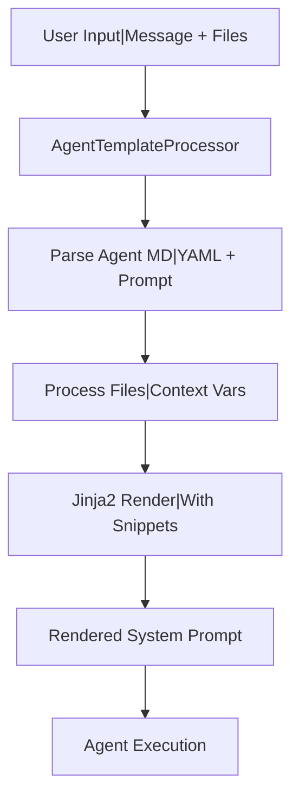
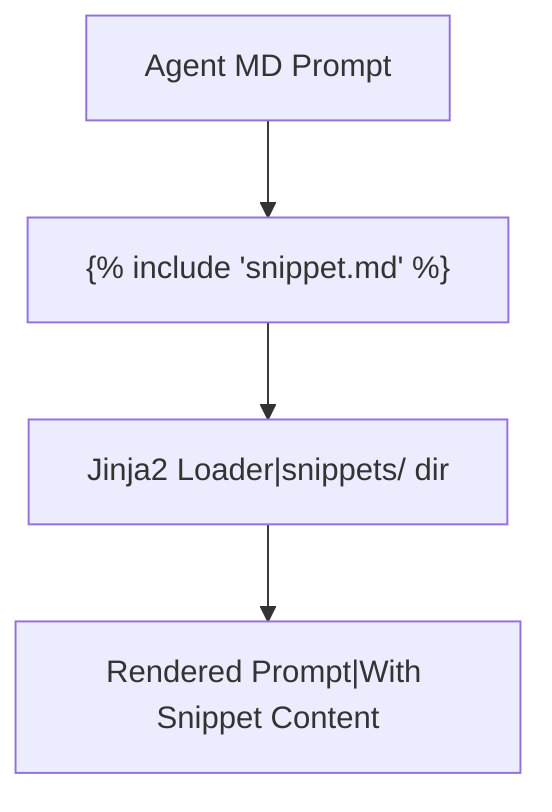

# MASTER Architecture UMLs: Understand Jinja2 Templates and Snippets

## Template Processing Flow

```mermaid
flowchart TD
    A["User Input|Message + Files"] --> B["AgentTemplateProcessor"]
    B --> C["Parse Agent MD|YAML + Prompt"]
    C --> D["Process Files|Context Vars"]
    D --> E["Jinja2 Render|With Snippets"]
    E --> F["Rendered System Prompt"]
    F --> G["Agent Execution"]
```

## Snippet Integration

```mermaid
graph TD
    H["Agent MD Prompt"] --> I["{% include 'snippet.md' %}"]
    I --> J["Jinja2 Loader|snippets/ dir"]
    J --> K["Rendered Prompt|With Snippet Content"]
```
