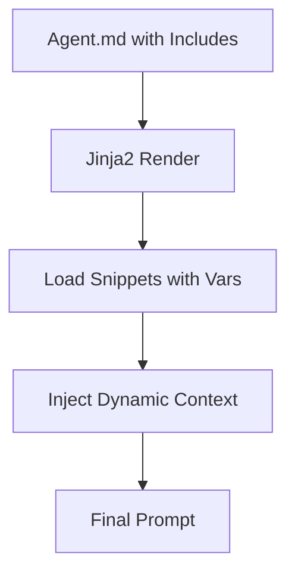

# Comprehensive Guide to Jinja2 Templates and Snippets in Oneshot

## 1. How Jinja2 Works in Oneshot
Jinja2 is a templating engine that dynamically renders agent system prompts at runtime. It's not static; it processes variables, conditionals, and includes (like snippets) to create customized prompts based on context such as user input, files, or run state.

### Key Process
- **Loading**: Agent.md files are parsed; the system prompt section is treated as a Jinja2 template.
- **Context Injection**: Variables like `provided_files` (dict of file paths and contents) are passed in.
- **Rendering**: Jinja2 replaces placeholders (e.g., {{ variable }}) and executes logic (e.g., ).
- **Output**: A final string used as the agent's system prompt.

From the code in `agent_template_processor.py`, the environment is set up to load from `/snippets/`.

## 2. How Snippets Work
Snippets are Markdown files in `/snippets/` that contain reusable prompt fragments. They are included via `` in agent.md or other snippets, making prompts modular.

- **Static vs. Dynamic**: Many seem static (e.g., `agent_loop.md` provides fixed instructions), but they can include Jinja2 syntax for dynamism. For example, `provided_content.md` uses loops and conditionals to handle files dynamically.

### Example: provided_content.md
This snippet dynamically formats file contents:
```

## File Contents:

### File: {{ filepath }}
```
{{ content }}
```


```
- **How it Knows Files**: The `provided_files` variable is populated by `AgentTemplateProcessor` from the `--files` CLI argument or tool inputs. It's a dict created by reading file contents (text files fully, binaries as placeholders). Tied to the current run ID for organization in `/artifacts/run_id/`.

## 3. Conversation History Handling
History is managed via `RunPersistence` in `run_persistence.py`. It's always included by default for continued runs:
- New run: Starts fresh.
- Existing run ID: Loads `message_history` from `/runs/run_id/run.json` and appends to the agent's context.
- Not part of snippets/Jinja2 directly; handled in the execution loop (`agent_executor.py`).

## 4. TODO Management
The `todo_management.md` snippet is primarily a prompt template guiding behavior. There's no built-in "task manager" database; it's prompt-driven:
- Tools like `todo_read` and `todo_write` interact with a simple JSON file per run ID in `/artifacts/run_id/todos.json`.
- Tasks are created/updated via tools, but the snippet provides instructions on when/how to use them. It's "actual" management via files, not just prompts.

## 5. Dynamic Snippets: Injections and Use Cases
Snippets can be fully dynamic with Jinja2 syntax. Even though stored as .md, they support variables, loops, conditionals passed from the rendering context.

### How Dynamic Injections Work
- **Context Passing**: When including a snippet, the parent template's context (variables) is available.
- **Examples**:
  - Conditional: `Admin instructionsUser instructions`
  - Loop: `- {{ item }}`
  - Variable: `Hello {{ username }}`

### Use Case: Dynamic TODO Snippet
Create `/snippets/dynamic_todo.md`:
```

## Tasks for {{ current_user }}:

- {{ task.name }} (Status: {{ task.status }})


No tasks assigned.

```
Include in agent.md: `` with context `{ "tasks": [...], "current_user": "User" }`.

### Advanced: Nested Dynamics
Snippets can include other snippets with passed variables.

This makes the system highly flexible for adaptive agents.

## Diagram: Dynamic Rendering Flow


For more, see the created examples in this task folder.

## 6. Efficient File Handling for Large Sets (Token Optimization and Intelligent Selection)
When dealing with many files (e.g., 20+ artifacts), including all contents via `provided_files` would overload the context and waste tokens. The system doesn't automatically "intelligently" select relevant files—that's handled by the caller's choice of what to pass and the agent's logic.

### How It Works
- **No Auto-Selection**: The orchestrator or caller provides files via --files or tool params. All provided files are processed based on the strategy (full, paths, summary).
- **Token-Efficient Strategy**: Use `provided_filepaths` to list paths without contents. The agent then uses tools (e.g., `read_file_contents`) to selectively read only relevant ones.
- **Intelligent Selection**: Build logic into the agent's prompt to evaluate paths (e.g., by filename, metadata) and decide what to read just-in-time.

### Example Prompt for Intelligent Selection
In agent.md:
```

## Available Artifacts
{{ provided_filepaths | join(', ') }}

Evaluate which files are relevant to the task. Read only necessary ones using read_file_contents. Prioritize by recency or relevance.

```
This lets the agent reason about what to load, keeping context lean.

For 20 files, the agent might: 1) List them, 2) Filter by keywords, 3) Read 2-3 relevant ones.

## 7. Enhanced: Index-Based Intelligent Selection Strategy (Future Implementation)
Your idea about using front-matter for intelligent file selection is excellent and would be very optimal. Here's how it could work:

### Concept
- **Auto-Index Tool**: A script/tool that scans `/artifacts/run_id/` and extracts front-matter from all .md files.
- **Master Index**: Compiles metadata into `index.md` with file paths, purposes, descriptions, and other front-matter fields.
- **Agent Strategy**: Agents read the lightweight index first, evaluate metadata against task requirements, then selectively load only relevant files.

### Benefits
- **Token Efficiency**: Index contains only metadata summaries, not full content.
- **Intelligent Selection**: Agents can reason over purposes/descriptions to choose relevant files.
- **Performance**: Optimal approach—avoids loading unnecessary content.
- **Scalability**: Works well with 20+ files per session.

### Implementation Strategy
1. Create comprehensive front-matter standards (purpose, topic, status, etc.).
2. Build index generation tool.
3. Update agent templates to use index-first approach.
4. Test with large file sets.

This would be a significant improvement over current `provided_filepaths` approach.
